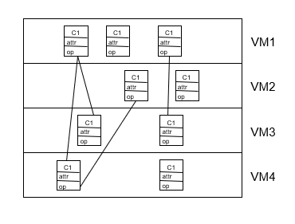

# System Decomposition

<!-----
title: 【Software Engineering】System Decomposition
url: se-system
date: 2020-03-30 10:21:27
tags: 
- Software Engineering

categories: 
- Courses

----->

Week 5 of 2020 Spring

<!--more-->

[toc]

## Overview

## System Design Activities

系统设计阶段, 我们希望产出以下模型

各类模型与系统设计阶段活动的对应关系
Nonfunctional requirements =>
- Activity 1: Design Goals Definition
Functional model =>
- Activity 2: System decomposition (Selection of subsystems based on functional requirements, cohesion, and coupling)
Object model => 
- Activity 3: Hardware/software mapping 
- Activity 4: Persistent data management
Dynamic model =>
- Activity 5: Global resource handling
- Activity 6: Software control
Subsystem Decomposition
- Activity 7: Boundary conditions

## Determine Design Goals
设计目标, 参数表. 
1. 分析现有系统
2. Establish New Design Goals
3. Sharpen the Design Goals
4. List of Design Goals
   - 不是所有要求都要列出(通用的, 如readability...)
   - 列出的可以是需要特殊强调的
   - 不同人看待角度可能不一样
   - 

Typical Design Tradeoffs, 如
- Functionality vs. Usability
- Cost vs. Robustness
- Efficiency vs. Portability
- Rapid development vs. Functionality
- Cost vs. Reusability
- Backward Compatibility vs. Readability

## System Design Concepts

### Subsystems and Classes
- Collection of classes, associations, operations, events and constraints that are interrelated
- Seed for subsystems: UML Objects and Classes

部分可以分成类也可以分成子系统. class是最小的part, 子系统又由许多part构成.

我们可以用package diagram表示子系统, 有两种分解方式.
- logical component
- physical component

### Services and Subsystem Interface

(Subsystem) Service: 
- 子系统之间的交互方式通过service, service是子系统提供的public operation
- Group of operations  provided by the subsystem 
- Seed for services: Subsystem use cases

Service is specified by Subsystem interface:
- Specifies interaction and information flow from/to subsystem boundaries, but not inside the subsystem. 
- Should be well-defined and **small**. 耦合度要少, 因此功能要明确, 使可维护性好 
- Often called API: **Application programmer’s interface**, but this term should be used during implementation,  not during System Design. service是逻辑的概念, API是更细化的, 确定好实现方式了.

如下图是ARENAservice的例子

### Coupling and Cohesion

Goal: Reduction of _**complexity while change occurs**_
_**Cohesion**_(内聚,类与类之间的依赖关系) measures the dependence among classes
- High cohesion: The classes in the subsystem perform similar tasks and are related to each other (via associations)
- Low cohesion: Lots of miscellaneous and auxiliary classes, no associations
- 明确业务
_**Coupling**_(耦合) measures dependencies between subsystems
- High coupling: Changes to one subsystem will have high impact on the other subsystem (change of model, massive recompilation, etc.)
- Low coupling: A change in one subsystem does not affect any other subsystem
Subsystems should have as maximum cohesion and minimum coupling as possible:
How can we achieve high cohesion?
How can we achieve loose coupling? 

### Partitions and Layers

Partitioning and layering are techniques to achieve low coupling.
A large system is usually decomposed into subsystems using both, layers and partitions.
- Partitions vertically divide a system into several independent (or weakly-coupled) subsystems that provide services on the same level of abstraction. 竖着切
- A layer is a subsystem that provides subsystem services to a higher layers (level of abstraction) 横着切 上面的只会被下面的调用
  - A layer can only depend on lower layers
  - A layer has no knowledge of higher layers

一些分割建议
- No more than 7+/-2 subsystems
  - More subsystems increase cohesion but also complexity (more services)
- No more than 4+/-2 layers, use 3 layers (good)

Relationships between Subsystems 切的依据
Layer relationship
- Layer A “Calls” Layer B  (runtime)
- Layer A “Depends on”  Layer B (“make” dependency, compile time)
Partition relationship
- The subsystems have mutual but not deep knowledge about each other
- Partition A “Calls” partition B and partition B “Calls” partition A

有一种特殊的分层, 被称为Virtual Machine. 虚机. 是对操作系统子系统的分解术语. 是对layer-partition的抽象, 有两种架构方式.

| closed (opaque layering)| open (transparent layering) |
| --|--|
|  |  |
| High maintainability, flexibility | Runtime efficiency
|

- Closed architectures are more portable.
- Open architectures are more efficient.
- If a subsystem is a layer, it is often called a virtual machine.

计算机网络中常见的封闭结构closed分层模型

- ISO’s OSI Reference Model 
  - ISO = International Standard Organization
  - OSI = Open System Interconnection
- Reference model defines 7 layers of network protocols and strict methods of communication between the layers.
- Closed software architecture

## Software Architecture Patterns
子系统分解中的套路

### Client/Server

单向服务, client call server, server不需知道client的interface

- One or many servers provides services to instances of subsystems, called clients. 
  - Client calls on the server, which performs some service and returns the result 
  - Client knows the interface of the server (its service)
- Server does not need to know the interface of the client
- Response in general immediately 
- Users interact only with the client

经常用在数据库系统中.

client端: 前端处理, 用户界面
server端: 数据管理, 数据安全, 并发支持

Design Goals:
- Service Portability 服务可移植性
  - Server can be installed on a variety of machines and operating systems and functions in a variety of networking environments
- Transparency, Location-Transparency 扩容
  - The server might itself be distributed (why?), but should provide a single "logical" service to the user
- Performance 性能
  - Client should be customized for interactive display-intensive tasks
  - Server should provide CPU-intensive operations
- Scalability 可扩展性
  - Server should have spare capacity to handle larger number of clients
- Flexibility 灵活性
  - The system should be usable for a variety of user interfaces and end devices (eg. WAP Handy, wearable computer, desktop)
- Reliability 可靠性
  - System should survive node or communication link problems

Problems
- Layered systems do not provide peer-to-peer communication
- Peer-to-peer communication is often needed
- Example: Database receives queries  from application but also sends notifications to application when data have changed

server找不到用户, 改进如下

### Peer-To-Peer

- Generalization of Client/Server Architecture
- Clients can be servers and servers can be clients
- More difficult because of possibility of deadlocks

进一步细化

### Model/View/Controller 
recall 类图中的三类角色
Subsystems are classified into 3 different types
- Model subsystem: Responsible for application domain knowledge
- View subsystem: Responsible for displaying application domain objects to the user
- Controller subsystem:  Responsible for sequence of interactions with the user and notifying views of changes in the model. 

> 一个例子: 文件查看器
> 
> 文件查看器中有多个view
> 
> 首先, view会注册到model对象中.
> 若user改了文件名, 这会通过controller改, 而不是直接作用于model
> controller 负责改model
> model通知viewer, (注册:言下之意接受信息)
> viewer自动update
> 

### Repository
- MVC is a special case of a repository architecture:
  - Model subsystem implements the central data structure, the Controller subsystem explicitly dictates the control flow
是大部分结构的基础. blackboard architecture
但如果做的不好, 方法各异, 造成冲突

Control flow is dictated by central repository (triggers) or by the subsystems (locks, synchronization primitives

> 例子: 编译器
> 
> 编译工具都作用在repository上. 相互之间不交流. 

## Summary

- System Design
  - Reduces the gap between requirements and the (virtual) machine
  - Decomposes the overall system into manageable parts
- Design Goals Definition
  - Describes and prioritizes the qualities that are important for the system 批判性思考
  - Defines the value system against which options are evaluated (tradeoff)
- Subsystem Decomposition
  - Results into a set of loosely dependent parts which make up the system
