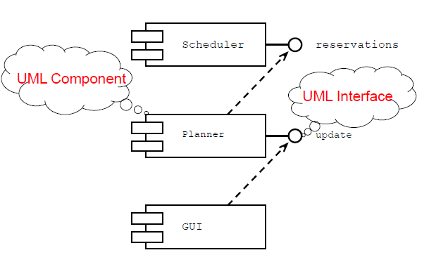
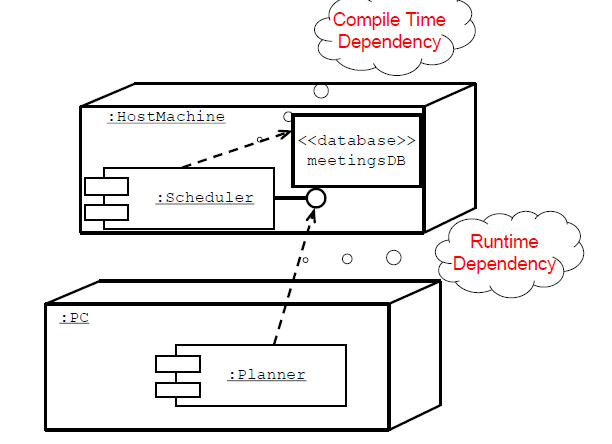
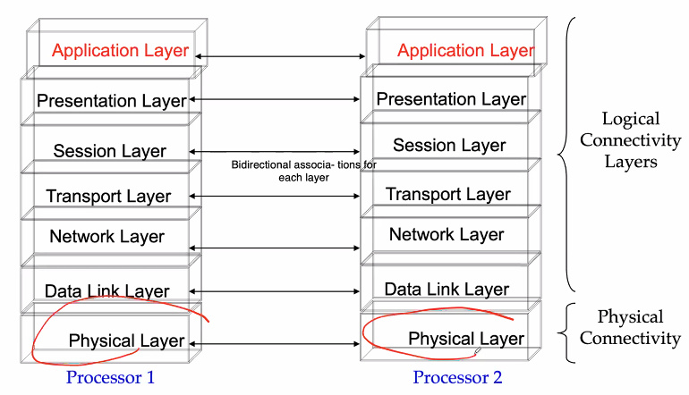
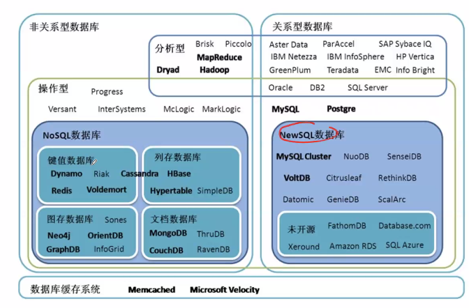
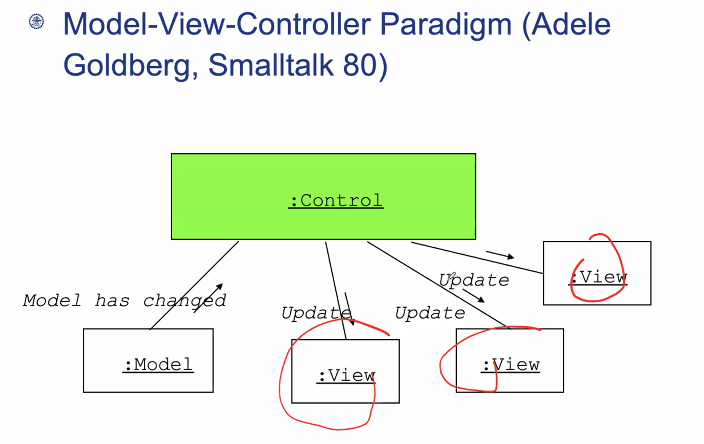
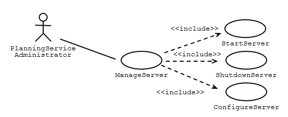

Week 5 of 2020 Spring. Questions to ask yourself when designing a subsystem.

<!-- more -->

## Overview

在确定design goals后, 子系统的设计(Define Subsystems) 有五方面, 几方面相互影响.
- Hardware Software Mapping/Software platform
  - 如数据加密可以通过硬件功能实现, 无需软件实现
- Data Management
- Global Resource Handling and Access Control
- Software Control
- Boundary Conditions

在implementation的过程中, 又会产生一些问题, 迭代.

## UML Component Diagrams & Deployment Diagrams

组件图, 部署图

描述子系统的结构, 包括**静态**和**动态**关系.
- Component Diagrams for static structures
  - show the structure at **design time** or **compilation time**
  - 开发系统过程中定义的文件.
- Deployment Diagram for dynamic structures
  - show the structure of the run-time system
  - 定义应用过程中的场景

在不同软件开发的阶段, 我们有不同的component
- Some exist only at design time: 源代码
- Others exist only until compile time: 编译结果
- Some exist at link or runtime: 运行期产生的对象

### Component Diagram

包含: 组件(源代码,libraries,exes) + 依赖关系(虚线箭头表示, 从client指向supplier)

A component diagram may also be used to show dependencies on a façade(子系统暴露的接口): 
- Use dashed arrow the corresponding UML interface (依赖的一定是具体的接口/方法, 在初步阶段也可以直接指向组件)
- 小圆圈: 接口(与类图中的接口类一致)

### Deployment Diagram

单纯应用在运行时. 描述(通常联网的)系统的分布情况. 能够描述清楚decomposition, concurrency, hard/software mapping

- 节点代表硬件机器
- 连线代表网络连接(communication association)
- 软件会以component instance 的形式存在在node中.

注意区分: compile dependency(需要设计专有接口), 和runtime dependency (仅是逻辑上的接口, 可能由调用socket等方法实现)

## Hardware Software Mapping

一方面, 许多软件可以做的, 正在被越来越多的硬件实现, 我们需要对实现方法进行决策.
另一方面, 在我们的对象系统中, 我们需要确定对象模型在现实中的实现.
- object: processor, memory, i/o
- association: connectivity

### Mapping the Objects
机器选择
- Processor issues:
  - Is the computation rate too demanding for **a single processor**? 
  - Can we get a speedup by distributing tasks across several processors?
  - How many processors are required to maintain **steady state load**?
  - GPU? 多核? 多设备?
- Memory issues: 
  - Is there enough memory to buffer bursts of requests?
- I/O issues:
  - Do you need an extra piece of hardware to  handle the data generation rate?  是否需要硬盘
  - Does the response time  exceed the available communication bandwidth between subsystems or a task and a piece of hardware?

### Mapping the Subsystems Associations: Connectivity
网络连接
- 物理层 Describe the physical connectivity  of the hardware  
  - Often the physical layer in ISO’s OSI Reference Model
    - Which associations in the object model  are mapped to physical connections?
    - Which of the client-supplier relationships in the analysis/design model  correspond to physical connections?
  - e.g. Ethernet 以太网
- Describe the logical connectivity  (subsystem associations)
  - Identify associat ions that do not directly map into physical connections:
    - How should these associations be implemented? 
  - e.g. TCP/IP 协议

画网络结构图时, 不要把逻辑层和物理层混在一起. 要协调, 我们要把他们区分开来. 专门画两张图

需要解决的问题
- 连接方式(tree/star/matrix/ring...)
- 连接协议
- 硬件功能(如设计硬件(专用芯片)针对深度学习:寒武纪)
- specific locations
- performance(如response time)

### Connectivity in Distributed Systems

在分布式系统中还要考虑的其他问题:
1. 异步/同步,阻塞
2. transmission media
3. the Quality of Service (QOS)? 
4. available bandwidth requirements (上行/下行)

## Data Management

三种数据部署方式. A persistent object can be realized with one of the following
- Data structure(内存中)
  - If the data can be volatile
  - 快, 但可以丢
- Files
  - Cheap, simple, permanent storage
  - Low level (Read, Write) 管理方式简单
  - Applications must add code to provide suitable level of abstraction
- Database
  - Powerful, easy to port
  - Supports multiple writers and readers 支持并发

> File or Database
> - When should you  choose a file? 可以保存任何信息
>   - Are the data voluminous (bit maps)? 非结构化
>   - Do you have lots of raw data (core dump, event trace)?
>   - Do you need to keep the data only for a short time?
>   - Is the information density low (archival files, history logs)? 价值不大
> - When should you choose a database? 更细粒度, 更高效, 专业化
>   - Do the data require access at fine levels of details by multiple users?
>   - Must the data be ported across multiple platforms (heterogeneous systems)?
>   - Do multiple application programs access the data?
>   - Does the data management require a lot of infrastructure?

### Issues To Consider When Selecting a Database

- Storage space
  - Database require about **triple** the storage space of actual data 三倍原则
- Response time
  - Morden databases are **I/O or communication bound (distributed databases)**. Response time is also affected by CPU time, locking contention and delays from frequent screen displays
- Locking modes
  - Pessimistic locking: Lock before accessing object and release when object access is complete
  - Optimistic locking: Reads and writes may freely occur (high concurrency!) When activity has been completed, database checks if contention has occurred. If yes, all work has been lost.
- Administration
  - 数据库的性能极大取决于参数的配置, 内部经验.
  - Large databases require specially trained support staff to set up security policies, manage the disk space, prepare backups, monitor performance, adjust tuning. 

不成功的"面向对象"数据库, 缺乏理论, 统一标准, 效率.

通常做法: 面向对象的软件映射到关系型数据库.
- Based on **relational algebra**
- Data is presented as 2-dimensional tables. Tables have a specific number of columns and and arbitrary numbers of rows
  - Primary key: Combination of attributes that uniquely identify a row in a table. Each table should have only one primary key
  - Foreign key: Reference to a primary key in another table 
- SQL is the standard language defining and manipulating tables.(标准查询语言)
- Leading commercial databases support constraints. 
  - Referential integrity, for example,  means that references to entries in other tables actually exist.

> Data Management Questions
> - Should the data be **distributed**?
> - Should the database be **extensible**?
> - How **often** is the database accessed?
> - What is the expected request (query) rate? In the worst case?
> - What is the size of typical and worst case requests?
> - Do the data need to be archived?
> - Does the system design try to hide the location of the databases (location transparency)?
> - Is there a  need for a single interface to access the data?
> - What is the query format? 
> - Should the database be relational or object-oriented?

extension:
- 文档+数据库:mango
- 内存+数据库:redis

## Access Control

安全性控制. access:= who + how + what

如何体现? 在use case图中, 我们已经定义了actor的访问权限, 在系统设计阶段, 我们需要确定对象和actor的关系. 

如何管理细粒度的access?
- We model access on classes with an access matrix.
- 行代表actor, 列代表class, 每个entry表示actor对object的动作.

如何实现?
1. **Global access table**: Represents explicitly every cell in the matrix as a (actor,class, operation) tuple. 
   - Determining if an actor has access to a specific object requires looking up the corresponding tuple. If no such tuple is found, access is denied.
   - 通过查表决定是否具有权限
2. **Access control list** 每个class自身具有一个列表, 决定来访actor是否在自己的Guest List中.
   - Every time an object is accessed, its access list is checked for the corresponding actor and operation. 
   - Example: guest list for a party. 
3. **A capability** associates a (class,operation) pair with an actor. actor自己带一张门票
   - A capability provides an actor to gain control access to an object of the class described in the capability. 
   - Example: An invitation card for a party.
> Global Resource Questions
> - Does the system need authentication?
>   - If yes, what is the authentication scheme?
> - User name and password? Access control list
>   - Tickets? Capability-based
> - What is the user interface for authentication?
>   - Does the system need a network-wide name server?
> - How is a service known to the rest of the system?
>   - At runtime? At compile time?
>   - By port?
>   - By name?

## Decide on Software Control
软件启动的两种方式
- Choose implicit control (non-procedural, declarative languages) 具有特定规律的应用
  - Rule-based systems 
  - Logic programming 
- Choose explicit control (procedural languages): Centralized or decentralized, 较常见, 有发动机

发动机的类型
1. Centralized control: 
   1. Procedure-driven control
      - Control resides within program code.
      - Example: Main program calling procedures of subsystems.
      - Simple, easy to build, hard to maintain (high recompilation costs)
   2. Event-driven control, 常见UI
      - Control resides within a dispatcher calling functions via callbacks.
      - Very flexible, good for the design of graphical user interfaces, easy to extend
      - Example: MVC
      - 
   3. Threads 用于并发
      - A number of threads can be created, each responding to a different event
      - It is the most intuitive of the three mechanisms, supports concurrency
2. Decentralized control, 每一个object都有自己的小发动机
   - Control resides in several independent objects. 
   - Possible speedup by mapping the objects on different processors, increased communication overhead. 
   - Example: Message based system. 

如何确定?
看sequence diagram
- look like a fork (centralized)
- look like a stair (decentralized)

## Boundary Conditions

- Most of the system design effort is concerned with **steady-state behavior.** (正常情况已经由use case, sequence diagram描述清楚了)
- However, the system design phase must also address the **initiation** and **finalization** of the system. This is addressed by a set of new uses cases called administration use cases 还需考虑一下情况
  - Initialization 开始
    - Describes how the system is brought from an non initialized state to steady-state ("startup use cases”).
  - Termination 结束
    - Describes what resources are cleaned up and which systems are notified upon termination ("termination use cases").
  - Failure 错误
    - Many possible causes: Bugs, errors, external problems (power supply). 
    - Good system design foresees fatal failures (“failure use cases”). 

Example: 系统管理者use case

一般在完成全部工作后, 设立initialization & termination use case.

- Actor: often the system administrator
- Interesting use cases: 
  - Start up of a subsystem
  - Start up of the full system
  - Termination of a subsystem
  - Error in a subystem or component, failure of a subsystem or component 

## Summary
In this lecture, we reviewed the activities of system design:
- Hardware/Software mapping
- Persistent data management
- Global resource handling
- Software control selection
- Boundary conditions

Each of these activities revises the subsystem decomposition to address a specific issue. Once these activities are completed, the interface of the subsystems can be defined.
