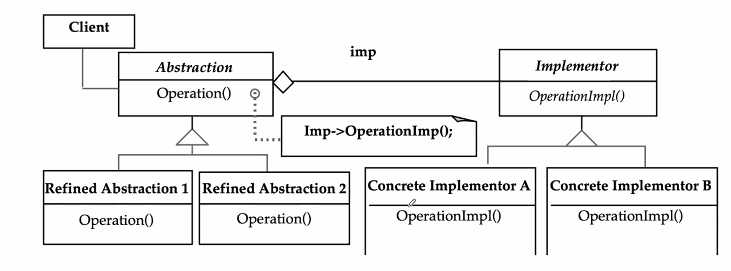

Week 6 of 2020 Spring

<!-- more -->


## An Overview of Object Design

Recall 我们创造了用例模型, 功能模型, 动态模型 (application domain based), 在对象设计阶段, 我们希望从implmentation角度定义object, 在这一阶段:
1. adding details
2. making implementation decisions, 从诸多方案里抉择, with the goal to
   1. 减少执行时间
   2. 内存消耗
   3. 减少成本
   4. ...


Group of Activities:
1. Reuse 基于现成的component完成构造
2. Interface Specification 落实子系统的API, 分别有哪些object提供, 执行代码, 以至于每个类的属性, 对外提供的方法
3. Restructuring 聚类的相似性, 增加软件的可维护性.
4. Optimization 与上一条相似


针对以上四大类活动, 我们如何安排object design的过程, 有很多方式. 将四类活动进行组合, 开展对象设计.
1. 从现成component出发, 定义API, 关联, 类, 选择合适的数据结构和算法实现
2. 从reuse出发, 看需求分析中的类, 优化, 继承关系上调整.
3. ...

以上四点会被分为4个lecture, 本节主要讨论reuse, 3/4两点属于mapping models to code.

## Reuse

### Introduction

主要目的:
1. reuse **functionality** already available
2. reuse **knowledge** from previous experience to current problem

方法:
1. Composition (Black Box Reuse)
   - New functionality is obtained by aggregation
   - The new object with more functionality is an aggregation of existing components
2. Inheritance (White-Box Reuse)
   - New functionality is obtained by inheritance.
3. Three ways to get new functionality: 
   - Implementation inheritance
   - Interface inheritance继承
   - Delegation委派

### Heuristics
- 始终关注class library
  - JSAPI(Java Speech API)
  - JTAPI(Java Telephony API)
- 选择合适的数据结构
- 只有在必要时才定义internal类和方法
  - 提高质量, 进度
  - Complex operations defined in terms of lower-level operations might need new classes and operations

### Concepts

#### Application Domain vs Solution Domain Objects

很有可能, 我们在app dom中识别了一个report, 那么在对象设计层面, 虽然类是对应的(启发产生的), 但我们还需要进一步生成text box, menu, scrollbar...

#### Inheritance

当我们要实现功能时, 我们虽然找到了class library, 但发现功能还不太够.
继承机制的两种用途:
- Description of Taxonomies 刻画分类(需求分析阶段, 形成概念的层次, 使模型更为理解, 建立相同性/特殊性概念)
- Implementation Specification  对象设计阶段, 增加可重用性
Inheritance is found either by specialization or generalization


所谓重用, 分为spec和imple上的重用机制

- Specification inheritance
  - Also called subtyping
  - Inherit from an **abstract class**抽象类 with all operations specified, but not yet implemented
  - 子类的代码还需要自己实现, 所以只是spec(接口,规范)上的重用
- Implementation inheritance
  - Also called class inheritance
  - Goal: Extend an applications’ functionality by **reusing functionality in parent class**
  - Inherit from an existing class with some or all operations already implemented

#### Delegation
as alternative to Implementation Inheritance


这个例子有没有问题?
- 既然stack是list的子类, remove方法会被stack使用. 因此, implementation继承好的继承坏的. 并不是总是优于spec inheritance. 我们只是想重用其中的一部分功能.

In Delegation two objects are involved in handling a request
- A receiving object delegates operations to its delegate. 
- The developer can make sure that the receiving object does not allow the client to misuse the delegate object


比如 只想要 delegate的1功能, 我们设计一个receiver, 将client call的内容真正地委派给delegate.

**Delegation: Catching an operation and sending it to another object.**


如, 我们创建私有对象作为代理(幕后英雄)


pros: 灵活,甚至可以内部切换代理 cons: 过度包装

> design pattern是inheritance和delegation的组合


## Design Patterns

### Finding Objects:
- Requirements Analysis focuses on application domain: Object identification (功能类)
- System Design addresses both,  application and implementation domain: Subsystem Identification (边界)
- Object Design focuses on implementation domain: Additional solution objects (应用中需要调用的接口类)
- 另一种寻找类的方式: Design Patterns

### Taxonomy


- Structural Patterns 回答结构有关的问题
  - Adapters, Bridges, Facades, and  Proxies are variations on a single theme: 
  - They reduce the coupling between two or more classes 
  - They introduce an abstract class to enable future extensions
  - They encapsulate complex structures
- Behavioral Patterns 回答行为有关的问题
  - Here we are concerned with algorithms and the assignment of responsibilities between objects: Who does what?
  - Behavioral patterns allow us to characterize complex control flows that are difficult to follow at runtime. 
- Creational Patterns 回答生成相关的问题
  - Here our goal is to provide a simple abstraction for  a complex instantiation process. 
  - We want to make the system independent from the way its objects are created, composed and represented.

## Structural Pattern

### Composite Pattern
组合模式:动态树: Models tree structures that represent part-whole hierarchies with arbitrary depth and width. 
The Composite Pattern lets client treat individual objects and compositions of these  objects uniformly


| Software System | Software Lifecycle |
| --------------- | ------------------ |
| A software system _consists of_ subsystems _which are either other_ subsystems _or collection of_ classes | The software lifecycle _consists of_ a set of development activities _which are either other_ activities _or collection of_ tasks |
| Composite: Subsystem (A software system consists of subsystems which consists of subsystems , which consists of subsystems, which...) | Composite: Activity (The software lifecycle consists of activities which consist  of  activities, which consist of activities, which....) |
| Leaf node: Class | Leaf node:  Task |
|   |   |


### Adapter

适配器模式


描述
- ClientInterface定义了一些规格，但没有实现方法。（斜体*Request()*）
- 需要一些子类进行实现
- Adapter继承了ClientInterface的一些方法，但Adapter本身也没有提供具体的方法进行实现，而是让已存在的LegacyClass生成的对象干活。
- **委派机制。delegation**
- Adapter实现了接口上的转换，它向外界提供了一个标准的Request结构。**bind an Adapter and an Adaptee**
- **Interface** inheritance is use to specify the interface of the **Adapter** class.
- **Target** and **Adaptee** (usually called legacy system 遗留系统) _pre-exist_ the Adapter.

主要作用：
- 转换接口，使得类一起工作。
- 提供新的接口（interface）。
- also known as wrapper（包装器）
- 实际中还有两种类别：
  - class adapater：
    使用多重继承，adapt one interface to another
  - object adapter：
    单继承+委派机制

例子1：
一个超市营业系统，计算税率可能不是商业软件自身的一个模块，每做一次交易我们需要调用第三方提供的税率计算服务。


对于新来的第三方服务，只要我们的adapter是继承自标准接口interface的，系统内部就不需要对算税功能重写。

例子2：
一个财务管理系统，定义标准接口，针对不同的财务软件，开发adapter，提供标准接口。


比如，我们选择SAP系统（存在一些API），利用Adapter对接。我们可以在类的名称中加上Adapter的名字。


### Bridge
桥接模式。比Adapter更复杂。定义：_decouple an **abstraction** from its **implementation** so that the two can vary independently_

实现图：



描述：
- implementator这边，有一个接口定义（抽象），底下有具体的实现方式A/B。
- Abstraction这边，定义了不同的实现，Refined A/B。
- 他们之间建立了一个**composition**关系的桥梁。即concrete A/B生成的对象都是Abstraction的组成部分，它们是abstrction中operation的**套路**的组成部分。

功能：相同接口上的不同实现。

例子：画图

首先我们有implementation上的实现
```java
/** "Implementor" */
interface DrawingAPI {
    public void drawCircle(double x, double y, double radius); }
 
/** "ConcreteImplementor"  1/2 */
class DrawingAPI1 implements DrawingAPI {
   public void drawCircle(double x, double y, double radius) {
        System.out.printf("API1.circle at %f:%f radius %f\n", x, y, radius);
   }  }
/** "ConcreteImplementor" 2/2 */
class DrawingAPI2 implements DrawingAPI {
   public void drawCircle(double x, double y, double radius) {
        System.out.printf("API2.circle at %f:%f radius %f\n", x, y, radius);
   } }
```

接下来我们定义abstraction

```java
/** "Abstraction" */
abstract class Shape {
   protected DrawingAPI drawingAPI;
   protected Shape(DrawingAPI drawingAPI){
      this.drawingAPI = drawingAPI;  }
   public abstract void draw();                             // low-level
   public abstract void resizeByPercentage(double pct);     // high-level 
}
/** "Refined Abstraction 1/2" */
// 套路1： 画两个同心圆
class TwoCircleShape extends Shape {
   private double x, y, radius;
   public TwoCircleShape(double x, double y, double radius, DrawingAPI drawingAPI) {
      super(drawingAPI);
      this.x = x;  this.y = y;  this.radius = radius;  }
   // low-level i.e. Implementation specific
   public void draw() {
        drawingAPI.drawCircle(x, y, radius);
        drawingAPI.drawCircle(x, y, 2*radius);}
   // high-level i.e. Abstraction specific
   public void resizeByPercentage(double pct) {
        radius *= pct; }}

/** "Refined Abstraction" 2/2*/
class OneCircleShape extends Shape {
   private double x, y, radius;
   public OneCircleShape(double x, double y, double radius, DrawingAPI drawingAPI) {
      super(drawingAPI);
      this.x = x;  this.y = y;  this.radius = radius;  }
   // low-level i.e. Implementation specific
   public void draw() {
        drawingAPI.drawCircle(x, y, radius);
       }
   // high-level i.e. Abstraction specific
   public void resizeByPercentage(double pct) {
        radius *= pct; }}

class BridgePattern {
   public static void main(String[] args) {
       Shape[] shapes = new Shape[] {
           // API1画红色圆，API2画蓝色圆
           new TwoCircleShape(1, 2, 3, new DrawingAPI1()),
           new TwoCircleShape(5, 7, 11, new DrawingAPI2()),
           new OneCircleShape(5, 7, 11, new DrawingAPI1()),
           new OneCircleShape(1, 2, 3, new DrawingAPI2()),
       };
 
       for (Shape shape : shapes) {
           shape.resizeByPercentage(2.5);
           shape.draw();
       }
   }
}
```


### Adapter vs Bridge
Similarities:
- Both are used to hide the details of the underlying implementation.
- 通过抽象类、中间对象，隐藏了功能的实现
Difference:
- The adapter pattern is geared towards making unrelated components work together 原来两个component不能一起工作，通过中间层一起工作
  - Applied to systems after they’re designed (**reengineering, interface engineering**). 
- A bridge, on the other hand, is used up-front in a design to let abstractions and implementations vary independently. 从某种角度来说，它是特意被设计的，我们希望系统未来会非常具有扩展性
  - **Green field engineering** of an “extensible system” 
  - New “beasts” can be added to the “object zoo”, even if these are not known at analysis or system design time.

> A bridge is by design.（故意为之） An adaptor is not.（迫不得已） An adaptor is a patch.（打补丁） A bridge is put in place on purpose.


### Facade

原有系统一团乱麻，我们希望开发的系统要利用已有的系统，但我们不希望把内部系统全部研究透，暴露出来。
我们定义一个Facade（外交部、销售部），专门用于调用内部的类。
Facades allow us to provide  a closed architecture（封闭结构）


“Bad” Example：
- “Ravioli Design” 效率高但可能abuse。不能指望sub1完全了解sub2的工作原理。
- 

Implmentation Example

Our application will have the following classes: _Customer, Bank, AddressVerifier, SalaryVerifer._ 我们希望设计一个系统验证用户信息。

“Ravioli Design” 需要我们详细了解银行已有软件功能。
```java
Customer c = new Customer();
AddressVerifier objAddressVerifier = new AddressVerifier();
// 银行提供的地址验证API
bool isAddressVerified=objAddressVerifier.HasProperAddress(c);
// 调用方法，验证对象
 
// 如法炮制，验证工资
FinanceVerifier objFinanceVerifier = new FinanceVerifier();
bool hasGoodSalary = objFinanceVerifier.HasGoodSalary(c);
// 如法炮制，还有其他的贷款，也一并验证
bool hasAnyOtherLoan = objFinanceVerifier.HaveAnyOtherLoan(c);

if(isAddressVerified && hasGoodSalary && !hasAnyOtherLoan)
{
   Console.WriteLine("Loan Approved");
}
else
{
   Console.WriteLine("Loan Rejected");
} // The Client code has become very complex.
```
能否简化？facade模式。代码不变，但将`doApplicableForLoan`做封装
```java
public class LoanFascade
{
   public bool doApplicableForLoan(Customer c)
   {
     AddressVerifier objAddressVerifier = new AddressVerifier();
     bool isAddressVerified = objAddressVerifier.HasProperAddress(c);
     FinanceVerifier objFinanceVerifier = new FinanceVerifier();
      bool hasGoodSalary = objFinanceVerifier.HasGoodSalary(c);
      bool hasAnyOtherLoan = objFinanceVerifier.HaveAnyOtherLoan(c);
     return (isAddressVerified && hasGoodSalary && !hasAnyOtherLoan);
   }
}// Client Code
Customer c = new Customer();
LoanFascade objLoanFascade=new LoanFascade();
if(objLoanFascade.doApplicableForLoan(c))
{    Console.WriteLine("Loan Approved");  }
else
{   Console.WriteLine("Loan Rejected"); }
```


### Subsystem Design with Façade, Adapter, Bridge
三招联合起来

理想系统：
- **interface** object：代表系统与外界交互
- a set of **application domain objects** (entity objects) modeling real entities or existing systems 用于完成功能的类
- one or more  **control objects**

We can use design patterns to realize this subsystem structure
- Realization of the Interface Object: Facade
  - Provides the interface to  the subsystem
  - 组合功能，对外提供接口
- Interface to existing systems: Adapter or Bridge
  - Provides the interface to  existing system (legacy system)
  - The existing system is not necessarily object-oriented! 


### Proxy
代理模式

Motivation：
- 网速太慢，我们想看新闻文字，视频图片先不下载也没关系。

Problem: EXPENSIVE COMPUTATION
- 最消耗资源的过程一般是object creation, object initialization. 特别是在使用网络传输大量数据的情况下。
- 有时候我们可能并不需要真正的对象出来，就可以完成功能。（请替身Proxy出来先做一些不紧要的事情）。
- real object只有在用户真正需要的时候才出来


功能分类：
- Remote Proxy
  - 真正的信息在网络的另一端，传输需要花费一些时间
  - Local representative for an object in a different address space 在本地设置Proxy
  - Caching of information: Good if information does not change too often，Proxy的功能可以是存有缓存，看看信息够不够，不够再更新。
- Virtual Proxy
  - 一个统称，生成对象的代价比较高
  - Object is too expensive to create or too expensive to download
- Protection Proxy
  - 需要什么功能，先请出proxy，过滤功能
  - 如果是真的需要，再请出真正对象
  - Proxy provides **access control** to the real object
  - Useful when different objects should have different access and viewing rights for the same document. 
  - Example: Grade information for a student shared by administrators, teachers and students.


例子：


- Images are stored and loaded separately from text
- If a RealImage is not loaded a ProxyImage displays a grey rectangle in place of the image
- The client cannot tell that it is dealing with a ProxyImage instead of a RealImage
- A proxy pattern **can be easily combined with a Bridge**


## Behavioral Pattern
行为模式，我们选择了三个代表性的模式

### Strategy
策略模式

Motivation：
- 现实中，针对一个task（如排序，字符串分解，编译等），我们有多种实现方式
- 我们针对不同的实现有trade-off的考量
- 很可能，我们在原型时期写一个算法，未来再调整一个算法


如，去机场这件事，有很多方案可选，依据不同的选择条件，我们选择不同的方式。（不同的实现方式是聚合的关系）


- Strategy定义算法的接口，下面是具体的实现（继承）
- 还有一个Context接口，将Strategy对象进行聚合。
- Policy对象告诉我们在什么样的Context下选用什么样的Strategy

例子：出行


例子：
假设鹅厂推出了3种会员，分别为会员，超级会员以及金牌会员，还有就是普通玩家
针对不同类别的玩家，购买《王者农药》皮肤有不同的打折方式，并且一个顾客每消费10000就增加一个级别，那么我们就可以使用策略模式

我们希望，不管什么级别，算钱归算钱，不要算钱的时候判断你是谁。

首先要有一个计算价格的策略接口
```java
public interface CalPrice { //根据原价返回一个最终的价格 
Double calPrice(Double orgnicPrice);
 }
```
不同级别的算钱实现是不同的，这些都是策略对象，都具有接口
```java
public class Orgnic implements CalPrice {
public Double calPrice(Double orgnicPrice) {
        return orgnicPrice;
    }
}

public class Vip implements CalPrice {
public Double calPrice(Double orgnicPrice) {
        return orgnicPrice * 0.9;
    }
}

public class SuperVip implements CalPrice {
public Double calPrice(Double orgnicPrice) {
        return orgnicPrice * 0.8;
    }
}

public class GoldVip implements CalPrice {
public Double calPrice(Double orgnicPrice) {
        return orgnicPrice * 0.7;
    }
}
```

Context类就是Player
```java
public class Player {
    private Double totalAmount = 0D;//客户在鹅厂消费的总额
    private Double amount = 0D;//客户单次消费金额
    private CalPrice calPrice = new Orgnic();
    //每个客户都有一个计算价格的策略，初始都是普通计算，即原价

    //客户购买皮肤，就会增加它的总额
    public void buy(Double amount) {
        this.amount = amount;
        totalAmount += amount;
        if (totalAmount > 30000) {//30000则改为金牌会员计算方式
            calPrice = new GoldVip();
        } else if (totalAmount > 20000) {//类似
            calPrice = new SuperVip();
        } else if (totalAmount > 10000) {//类似
            calPrice = new Vip();
        }
    }

    //计算客户最终要付的钱
    public Double calLastAmount() {
        return calPrice.calPrice(amount);
    }
}
```

这样Client级别的代码就会轻松很多，选择的事情交给了Player的Context对象。
```java
public class Client {
    public static void main(String[] args) {
        Player player = new Player();
        player.buy(5000D);
        System.out.println("玩家需要付钱：" + player.calLastAmount());
        player.buy(12000D);
        System.out.println("玩家需要付钱：" + player.calLastAmount());
        player.buy(12000D);
        System.out.println("玩家需要付钱：" + player.calLastAmount());
        player.buy(12000D);
        System.out.println("玩家需要付钱：" + player.calLastAmount());
    }
}
```

### Observer
一个对象变了，其他相关的对象都要收到通知，进行更新。
Define a one-to-many dependency between objects so that when one object changes state, all its dependents are notified and updated automatically
**Also called “Publish and Subscribe”**

例子：拍卖


实现例子：发布与订阅


- 具体的Observer对象都具有update操作，用来接收消息。


- aFile是发布者，具有一个订阅者列表，这个列表允许报名者动态加入，且发布者的代码，工作流程不希望任何修改
- anInfo和alistView都是observer，向发布者发送attach加入订阅者名单
- aFile调用notify方法通知自己，
- 接下来开始对所有infoView对象发送update消息。

Concrete Example：股票市场

- The observers are different classes which display the latest stock quotes to the user.
- Let us have classes representing the subject/observer relationship: the StockMarket class being the subject, and we have three different observer classes: GoogleStockGadget, YahooStockGadget, and MSNStockGadget.


首先定义发布者接口、Observer接口
```java
public interface Subject
{
  public void register(Observer o);
  public void unregister(Observer o);
  public void notify();
}

public interface Observer
{
    public void update(int value);
}
```

StockMarket是具体的Subject类。
```java
public class StockMarket : Subject
{  // A Collection to keep track of all Registered Observers
  ArrayList observers = new ArrayList();
  // Stores latest stock quote (example is purposely simplistic)
  int newValue = 0;
  
  public void setValue(int v)
  {  newValue = v;  }
  
  public void register(Observer o)
  { observers.add(o);  }

  public void unregister(Observer o)
  {  int i = observers.indexOf(o);
    observers.remove(i);  }
```

notify就是遍历名单，取出对象，调用对象的update方法
```java
public void notify()
  {
    for (int i=0;i < observers.size();i++)
    {
      Observer ob = (Observer)observers.get(i);
      ob.update(newValue);
    }
  }
}
```

我们有各式各样的Observer，比如对GoogleObserver，我们实现对应的Update方法，在构造函数中，我们要调用注册方法。
```java
public class GoogleStockGadet : Observer
{
   int latestValue = 0;
   Subject stockMarket; // Subject reference variable
 
public GoogleStockGadet(Subject subject)
   { stockMarket = subject;
    stockMarket.register(this); 
// Registering itself to the Subject }

   public void update(int value)
   { latestValue = value;
    display(); }

   public void display()
   {
     System.out.println("Latest Quote=" + latestValue);
   }

   public void unsubscribe()
   {
     stockMarket.unregister(this);
   }
}
```
  
Main函数写作如下：
```java
public class MainProgram
{
  public static void Main(string[] args)
  {
    //Initialize Subject
    StockMarket stockMarket =  new StockMarket();
    int latestQuote = 0;

    // Initialize Gadgets..Note the subject being passed in Constructor
    GoogleStockGadget googleGadget = new GoogleStockGadget(stockMarket);
    MSNStockGadget msnGadget =  new MSNStockGadget(stockMarket);
    YahooStockGadget yahooGadget = new YahooStockGadget(stockMarket);

    // Code for Getting latest stock 
    // ....
    // ....
    stockMarket.setValue(latestQuote);
    // Updating all Registered Observers
    stockMarket.notify();
    //GoogleGadget decides to unregister/unsubscirbe
    googleGadget.unsubscribe();

  }
}
```    
发布订阅模式实现了消息的广泛传播，因为它使得消息的发布方不需要知道消息的接收方类型/具体的实现方式，因为他们都是具有update方法的对象。**实现解耦**


### Command

Motivation：
如Windows的文件菜单中：有打开、保存、另存为等操作，根据软件的不同，相同的menus（button是一样的），**会挂接不同的功能**。
即：to make the **user interface reusable** across many applications。
我们希望把软件的interface做的更加可扩展，用于其他重用。
- 比如：Undo和Redo可以在更加抽象的层面实现，用队列记录功能和参数的track和undo的操作。**把功能对象放进列表里**。
Such a **menu** can easily be implemented with the **Command** Pattern。


通过上文，我们识别出了**功能类**的概念，功能类都有`execute`这个接口。

- **Client** creates a **ConcreteCommand** and binds it with a Receiver.
- **Client** hands the **ConcreteCommand** over to the **Invoker** which stores it.
- The **Invoker** has the responsibility to do the command (“execute” or “undo”).
- **Receiver**类似按钮, 绑定特定的功能类.

Example:
比如,我们需要设置一个控制器, 用On和Off分别控制不同家电的开关.

已有的方法:

**方法1:** 直接用switch case分支判断.
需要改进的地方? 可扩展性?控制多个电器?
**方法2:** 把电器的开关封装成各自的类, 使用强制类型转换, 问题:代码修改,效率低下.
**方法3:**
- 在考虑如何封装之前，我们假设已经有一个类，把它封装起来了，这个类叫做Command
- 因为它要封装各个对象的方法，所以，它应该(只)暴露出一个方法，这个方法既可以代表 `light.TurnOn()`，也可以代表`fan.Start()`，还可以代表`door.Open()`，我们给这个方法起个名字，叫做Execute()。
- 现在我们有了Command类，还有了一个通用的Execute()方法，现在，我们修改PressOn()方法，让它通过这个Command类来控制电器(调用各个类的方法)。


- Command前面加一个I, 特指这是Interface
- 针对不同电器都有不同的功能子类, **(委派模式)** 调用Light和Fan对应功能.
- 工作流程:
  

示例代码:
```java
// 定义Command接口
public interface ICommand {
void Execute();}

public class AirOnCommand : ICommand {
  AirCondition airCondition;
  public AirOnCommand(AirCondition airCondition) {
    this.airCondition = airCondition;
  }
  public void Execute() {  //注意，你可以在Execute()中添加多个方法
    airCondition.Start();
    airCondition.SetTemperature(16);
  }
}
 // 定义关空调命令
public class AirOffCommand : ICommand {
  AirCondition airCondition;
  public AirOffCommand(AirCondition airCondition) {
    this.airCondition = airCondition;
  }
  public void Execute() {
    airCondition.Stop();
  }
}

// 定义遥控器
public class ControlPanel {
  private ICommand onCommand;
  private ICommand offCommand;
  public void PressOn() {
    onCommand.Execute();
  }
  public void PressOff() {
    offCommand.Execute();
  }
  public void SetCommand(ICommand onCommand, ICommand offCommand) {
    this.onCommand = onCommand;
    this.offCommand = offCommand;
  }
}

class Program {
  static void Main(string[] args) {
    ControlPanel panel = new ControlPanel(); // 创建遥控器对象
    AirCondition airCondition = new AirCondition();  //创建空调对象
    // 创建Command对象，传递空调对象
    ICommand onCommand = new AirOnCommand(airCondition);
    ICommand offCommand = new AirOffCommand(airCondition);
    // 设置遥控器的Command
    panel.SetCommand(onCommand, offCommand);
    panel.PressOn();      //按下On按钮，开空调，温度调到16度
    panel.PressOff();     //按下Off按钮，关空调
    }
}
```


Control Panel定义好后,就不需要修改代码, 我们程序只需要定义新的onCommand和offCommand对象即可, 当我们需要修改控制方法时, 我们就把对应的参数传入SetCommand,即可改变onCommand和offCommand操作的对象.

Analysis
- “Encapsulate a request as an object, thereby letting you
  - 一般来说, 面向对象方法中的类一般具有行为和数据.
  - 这里我们创建的类只有行为. 面向对象的方法在适当的时候实现了*面向功能的分解*
  - 尽管一定程度上违背了面向对象的原则, 但有些情况下十分有用
  - parameterize clients with different requests,
  - queue or log requests, and 
  - support undoable operations.” 
- Uses:
  - Undo queues
  - Database transaction buffering: 数据库有许多表构成, 我们可能需要对表做一连串不同的操作, 我们最好需要在执行一系列的操作过程中, 保证操作的连续性(in case of停电等意外), 因此database一般提供了transaction指令, 即保证一个transaction要么全部执行,要么全部不执行. 这样每一个修改都可以看做command对象, 支持undo.


## Creational Pattern
对象从哪里来. 构造函数的生成逻辑?

### Abstract Factory
Recall: Class是Object的工厂. 现在我们加上Abstract后,表明工厂也可以被模板化.

Motivation: 让前端适配不同的用户界面, 与类似的**一群成套**的设备功能连接起来, 与设备本身是独立的.


- 比方说, 我们知道我们的系统包含两部分, ProductA和ProductB
- 而且一般创建时要先有A再有B.
- 这个复杂对象中的组成部分却是可以由不同的厂商提供的.A1通常和B1组合在一起, A2通常和B2组合在一起.
- 这样, 返回的ConcreteFactory就是一个成套的产品
- Client是不需要关心到底是有哪一套系统组成的

应用
- 分离功能与实现
- 生产商的独立性
- 为相关部件加上限制
- 扩展性(快速适应新产品系列)

例子


### Build Pattern
创建者模式

Motivation: 格式转换问题


- Director决定使用哪一个Builder进行转换
- 转换器遵循相同的接口, 因此Director都是一样的转换器.

Example:RTF Builder

- 无论用的是哪一个converter, 转换页码, 文字, 篇章的接口都是一样
- 只需要传入一个converter对象, parser就能工作了.
- 代码就具有普遍的适用性

使用场景:
- 创建过程需要一系列步骤,过程在director中定义, 总过程与各个子部分的完成方式是独立的. (创建子功能的a2,b1,c3对象)
- 每一个步骤可能分多种情形组成, 根据实际需求进行变化


### Abstract Factory vs Builder

前者返回的是一整套套餐, 而Builder Pattern知道是套餐, 但每一部分都是可以定制的.

Work Together? 可以相互嵌套, 不同的策略用不同的模式解决. multiple complex product


## Summary for Design Pattern

- Structural Patterns
  - Focus: How objects are composed to form larger structures
  - Problems solved:  
    - Realize new functionality  from old functionality, 
    - Provide flexibility and extensibility
- Behavioral Patterns
  - Focus: Algorithms and the assignment of responsibilities to objects
  - Problem solved: 
    - Too tight coupling to a particular algorithm 
- Creational Patterns
  - Focus: Creation of complex objects
  - Problems solved: 
    - Hide how complex objects are created and put together

## Frameworks

设计模式是知识层面的reuse, 而framework是可重用的半成品(如代码实现).
A framework is a reusable partial application that can be specialized to produce custom applications. 

适用于特定的application domain.

The key benefits of frameworks are reusability and extensibility.
- Reusability leverages of the application domain knowledge and prior effort of experienced developers 
- Extensibility is provided by **hook methods** (暴露一些接口供用户自行实现, 此后framework会调用用户实现的方法) , which are overwritten by the application to extend the framework.

Example 网页应用.


### 分类

Frameworks can also be classified by the techniques used to extend them.  根据功能
- Whitebox frameworks
  - 主要通过继承和绑定进行重用
  - Extensibility achieved through inheritance and dynamic binding. 
  - Existing functionality is extended by subclassing framework base classes and overriding predefined hook methods
  - Often design patterns such as the template method pattern are used to override the hook methods. 也可以应用一些进阶的设计模式
- Blackbox frameworks
  - 不需要原来framework的代码, 只需要简单插入component进行扩展.
  - Extensibility achieved by defining interfaces for components that can be plugged into the framework. 
  - Existing functionality is reused by defining components that conform to a particular interface 
  - These components  are integrated with the framework via delegation.


根据面向开发者
- **Infrastructure frameworks** aim to simplify the software development process
  - System infrastructure frameworks are used internally within a software project and are usually not delivered to a client. 
- **Middleware frameworks** are used to integrate existing distributed applications and components. 
  - Examples: MFC, DCOM, Java RMI, WebObjects, WebSphere, WebLogic Enterprise Application [BEA].
- **Enterprise application** frameworks are application specific and focus on domains
  - Example domains:  telecommunications, avionics, environmental modeling, manufacturing, financial engineering, enterprise business activities.

### Class libraries and Frameworks
虽然都是重用,但
- Class Libraries: 
  - Less  domain specific 更通用
  - Provide a smaller scope of reuse. 范围更小
  - Class libraries are passive; no constraint on control flow. 只能使用,永远不可能自行运行
- Framework: 
  - Classes cooperate for a family of related applications. 整体功能
  - Frameworks are active; affect the flow of control. 往往本身就可运行
- In practice, developers often use both:
  - Frameworks often use class libraries internally to simplify the development of the framework. 
  - Framework event handlers use class libraries to perform basic tasks (e.g. string processing, file management, numerical analysis…. )

### Components and Frameworks

- Components
  - Self-contained instances of classes
  - Plugged together to form complete applications.
  - **Blackbox** that defines a cohesive set of operations, 
  - Can be used based on the syntax and semantics of the interface. 
  - Components can even be reused **on the binary code level**. (运行时)
  - The advantage is that applications do not always have to be recompiled when components change. 
- Frameworks:
  - Often used to develop components
  - Components are often plugged into blackbox frameworks. 


## Summary
- Object design is the process of **adding details** to the requirements analysis and **making implementation decisions**
- Three ways to get new functionality: 
  - Implementation inheritance
  - Interface inheritance
  - Delegation
- Patterns explicitly capture expert knowledge and design tradeoffs, and make this expertise more widely available.
