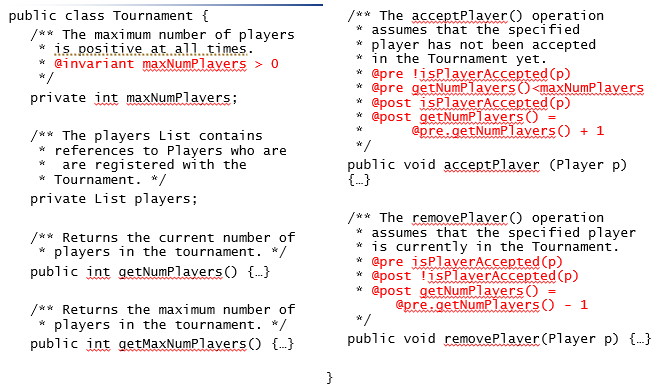
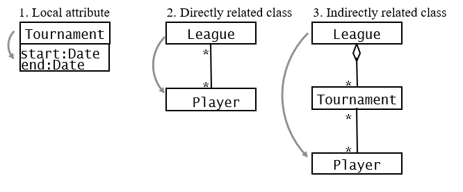
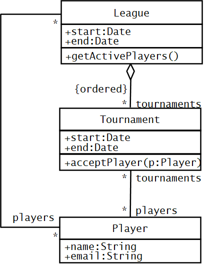
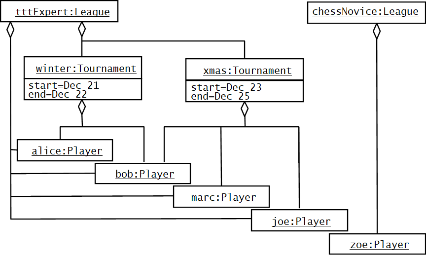
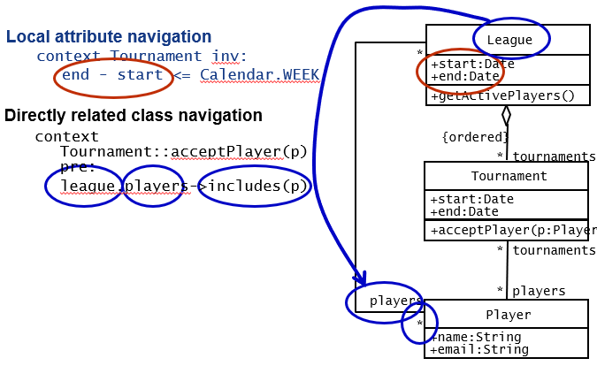
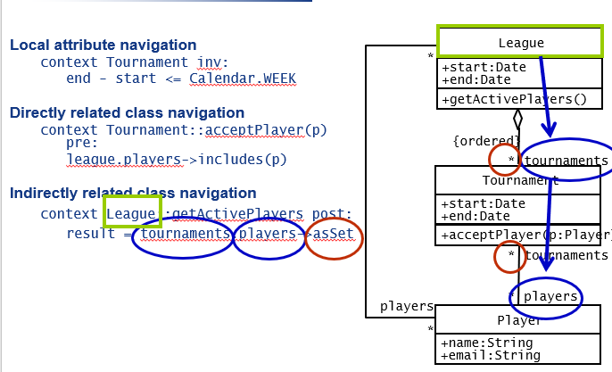
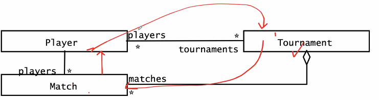

Week 8 of 2020 Spring

<!--more-->


增加细节，决策实现。

## Interface Specification Concepts

### Developer play different Roles during Object Design

使用类的方法，实现类，细化类。user/implementer/extender

### Specifying Interfaces

Roadmap：
- Requirements analysis activities
  - Identifying attributes and operations without specifying their types or their parameters. 
  - 分析阶段：识别属性、方法、类型即可
- Object design: Three activities
  - Add visibility information 
  - Add type signature information
  - Add contracts


1. Add Visibility Information, UML defines three levels of visibility:
   - Private (Class implementor)
   - Protected (Class extender)
   - Public (Class user)
   - 在UML类图中，-表示private，+表示public，#表示protected

> Information Hiding Heuristics
> Carefully define the public interface for classes as well as subsystems 
> Always apply the “Need to know” principle. 减小耦合
> public越少，受到其他change的影响就会小，自身的change也更容易实现。
> 但这也存在一个Trade-off: Information hiding vs efficiency （访问私有属性的操作较慢）

> Information Hiding Design Principles：“完美主义者”的观点
> Only the operations of a class are allowed to manipulate its attributes 理想状态下所有属性private
> Hide external objects at subsystem boundary(façade) 所有对象都受制于子系统内部，对外提供object
> Do not apply an operation to the result of another operation. 多使用组合模式


2. Add Type Signature Information
   分析阶段，消息名称就足够了，设计阶段，我们要为操作加上signature

3. Add Contracts
   Contracts on a class enable caller and callee to share the **same assumptions** about the class
   - Invariant 不变量: A predicate that is always true for all instances of a class. Invariants are constraints associated with classes or interfaces. 对一个类所有对象在所有周期始终成立。
   - Precondition 前条件（作用在特定operation上）: Preconditions are predicates associated with a specific operation and must be true before the operation is invoked. Preconditions are used to specify constraints that a caller must meet before calling an operation.  调用时需要符合的条件，才能产生期望的效果
   - Postcondition: Postconditions are predicates associated with a specific operation and must be true after an operation is invoked. Postconditions are used to specify constraints that the object must ensure after the invocation of the operation. 调用完成后，类自身受到的影响。

> Expressing constraints in UML Models
> - OCL (Object Constraint Language) 对象约束语言
>   - formally specified on single model elements or groups of model elements
>   - 只返回true/false
>   - 并非过程性语言，不能限制control flow 不能描述程序逻辑
> - Example：OCL expressions for Hashtable operation put():
>   ```
>   Invariant: 
>     context Hashtable inv: numElements >= 0
>   Precondition: 
>     context Hashtable::put(key, entry) pre:!containsKey(key)
>   Post-condition: 
>     context Hashtable::put(key, entry) post: containsKey(key) and get(key) = entry
>   ```
> - 在UML图中，可以用note的方式说明constraint


### Example for Contract
Contract for acceptPlayer in Tournament
```
context Tournament::acceptPlayer(p) pre:
	not isPlayerAccepted(p)

context Tournament::acceptPlayer(p) pre:
	getNumPlayers() < getMaxNumPlayers()

context Tournament::acceptPlayer(p) post:
	isPlayerAccepted(p)

context Tournament::acceptPlayer(p) post:
	getNumPlayers() = @pre.getNumPlayers() + 1

context Tournament::removePlayer(p) pre:
	isPlayerAccepted(p)

context Tournament::removePlayer(p) post:
	not isPlayerAccepted(p)

context Tournament::removePlayer(p) post:
	getNumPlayers() = @pre.getNumPlayers() - 1
```



放在代码的注释中，在实现过程中就会注意这一问题，在映射时，可以生成一些用于检测的代码。

> Contract for multiple Class
> 
> Any OCL constraint for any class diagram can be built using only a combination of these three navigation types!

Example: multiple class contract



要求：
1. Tournament时长必须在一周内
2. 必须是Tournament对应联盟的成员才可以注册Tournament
3. active Player的数目是League中至少参加一场Tournament的成员 

为了更好地理解这一约束，我们可以画出一张Instance Diagram/Object Diagram


|直接相关 | 间接相关
| ----    |  ---
|  |
| | League和player通过tournaments联系


- OCL forall quantifier
  ```
  /* All Matches in a Tournament occur within the Tournament’s time frame */
  context Tournament inv:
    matches->forAll(m:Match |
      m.start.after(t.start) and m.end.before(t.end))
  ```
- OCL exists quantifier
  ```
  /* Each Tournament conducts at least one Match on the first day of the Tournament */
  context Tournament inv:
      matches->exists(m:Match| m.start.equals(start))
  ```

## Interface Specification Activities

### Identifying Missing Attributes and Operations

加入更多方法，完成辅助功能的实现，如`isPlayerOverbooked():bool`限制报名数。

### Specifying Type Signatures and Visibility

加上type和visibility

### Specifying Preconditions and Postconditions

实际上，我们定义pre，post之后，无形中会形成调用次序上的约束。即，如果某一个方法的post-condition是另一个方法的pre-condition，那么它应该具有先后顺序。

### Specifying Invariants

复杂条件的例子
All Matches of in a Tournament must occur within the time frame of the Tournament
```
context Tournament inv:
    matches->forAll(m|
        m.start.after(start) and m.start.before(end))
```
No Player can take part in two or more Tournaments that overlap in terms of time
```
context TournamentControl inv:
    tournament.players->forAll(p|
        p.tournaments->forAll(t|
            t <> tournament implies
                not t.overlap(tournament)))
```

A match can only involve players who are accepted in the tournament. 可以利用一些简写。
```
context Match inv:
    players->forAll(p|
        p.tournaments->exists(t|
            t.matches->includes(self)))
context Match inv:
    players.tournaments.matches.includes(self)
```


## Summary

- There are three different  roles for  developers during object design
  - Class user, class implementor and class extender
- During object design - and only during object design - we specify visibility rules
- Constraints are boolean expressions on model elements
- Contracts are constraints on a class enable class users, implementors and extenders to share the same assumption about the class (“Design by contract”)
- OCL is a language that allows us to express constraints on UML models 
- Complicated constraints involving more than one class, attribute or operation can be expressed with 3 basic navigation types. 