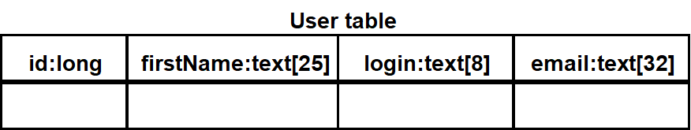

Week 8 of 2020 Spring

**KeyWords**: 

<!--more-->


In this lecture, we describe a selection of transformations to illustrate **a disciplined approach** to implementation to avoid system degradation(避免degradation，降低原有系统的性能表现). 
1. Operations on the object model: 
   - Optimizations to address performance requirements
2. Implementation of class model components: 
   - Realization of associations (基本会映射成对象引用)
   - Realization of operation, contracts (大部分编程语言不支持contract，需要detect/handle violations)
   - revise interface specification
3. Realizing entity objects based on selected storage strategy
   - Mapping the class model to a **storage schema**

虽然不复杂，但是经常容易出错。

## Mapping Concepts

### State of the Art of Model-based Software Engineering

模型是否包含了code的一切信息？不能，模型只提供了框架。需要填充细节。The reality is

- Different developers usually **handle contract violations differently**. 
- **Undocumented** parameters are  often added to the API to address a requirement change. 
- **Additional attributes** are usually added to the object model, but are not handled by the persistent data management system, possibly because of a miscommunication. 
- Many **improvised code changes** and **workarounds** that eventually yield to the degradation of the system.

### Model transformations


在开发过程中，重构代码是非常常见且必要的一个操作，为了维持model和代码的一致，我们需要reverse engineering

### Model Transformation Example


重构：pull-up field/pull-up method


在编码过程中，很多时候我们可以把模型中public的属性转化为private，并创建两个修改方法get/set。


## Mapping Activities

### Optimizing the Object Design Model

The requirements analysis model is semantically correct but often too inefficient if directly implemented.

Optimization activities during object design:
1. Add redundant associations to minimize access cost 用多余关联降低访问成本
   - What are the most frequent operations? ( Sensor data lookup?)
   - How often is the operation called? (30 times a month, every 50 milliseconds)
2. Rearrange computations for greater efficiency 对顺序图设定的“合理”计算进行调整
   - Eliminate dead paths as early as possible (Use knowledge of distributions, frequency of path traversals) 剪枝
   - Narrow search as soon as possible 
   - Check if execution order of loop should be reversed
3. Turn classes into attributes 类降级到属性
> 属性还是类：To collapse or not collapse: Attribute or association?
> - Implement entity as embedded attribute
> - Implement entity as separate class with associations to other classes 
> 
> 原则上，Associations are more flexible than attributes，好。但是，often introduce unnecessary indirection. 
> Collapse a class into an attribute if the only operations defined on the attributes are `Set()` and `Get()`.

4. Store derived attributes to save computation time 存储中间数据
   - Example: Database Cache （数据访问原则：store information locally）
   - 三种方式：Push，Pull，Notification（发布订阅的模式）
   - update带来了成本，需要trade-off

其他方式：
- Delaying Complex Computations （Proxy）
- Increase Inheritance

但优化不要过头，要考虑代码的可读性，要遵循面向对象的思想。


### Mapping Associations

- 1-to-1 directed
  
  单方面保存对方的引用
- 1-to-1 undirected
  
  双方面构造双方的引用。（构造方法上，同时把自己的引用传进去）
  ```java
  public class Advertiser {
    /* The account field is initialized
	 * in the constructor and never
	 * modified. */
    private Account account;

    public Advertiser() {
      account = new Account(this);
    }
    public Account getAccount() {
      return account;
    }
    }

  public class Account {
    /* The owner field is initialized
    * during the constructor and
    * never modified. */
    private Advertiser owner;

    public Account(owner:Advertiser) {
      this.owner = owner;
    }
    public Advertiser getOwner() {
      return owner;
    }
  }
  ```
- bidirectional, 1-to-many
  
  Set = Hash Map
- 多对多关联的实现，变成双方内部的list属性
  
- 多对多关联通过限定符变成0~1关联
  Map：字典型数据结构
  
  
- 关联类，关联本身带有方法
  
  

### Mapping Contracts to Exceptions

运用异常处理机制`try-throw-catch`解决contracts。
- 比如，`acceptPlayer()`要求必须在tournament中
  
  在对象的处理机制中，创建异常对象。
  当我们调用该对象时，把调用包入try中，
  由于我们知道可能存在异常，我们需要把可能返回的异常对象用catch进行处理。

因此，我们需要自己操心：（Recall Interface Specification，理论上所有对象都可以这样处理）
- Check precondition
- Check postcondition
- Check invariant
- Deal with inheritance: 父类定义异常处理机制，子类接替

如果时间成本有限（偷懒方法）：
- post condition和不变量，可以不写
- private、protected方法可以不check，因为它们基本上是自己调用
- 关注longest life component
好的实践：
- reuse constraint checking code：将contracts处理封装成代码

### apping Object Models to Tables

mapping 法则
- 每一个类对应一张表
- 每个属性一个列
- 每个实例是一行
- 关系：
  - 多对多：单独的表表示
  - 一对多：嵌入的外键
- 方法不做map

> A quick guide to database
> - 可以唯一确定一条记录的栏目，primary key（主键）
> - 该属性是另一张表的primary key，primary key


| class | table | 备注 |
| --- | --- | -- |
|   |  | 实践中，login和email都可以做主键 |
|  |  | 每一个league都对应唯一的owner，所以可以找到 |
|  |  | 专门用一张表表示serves关联 |
|  |  | 用另外的表，父类放公共属性，子类放特有属性，父类不影响子类，易修改 |
| |  | 另一种方法，直接用duplicate key。查询速度更快|


