Week 9 of 2020 Spring

<!-- more -->

## Introduction

### Fault Handling Techniques

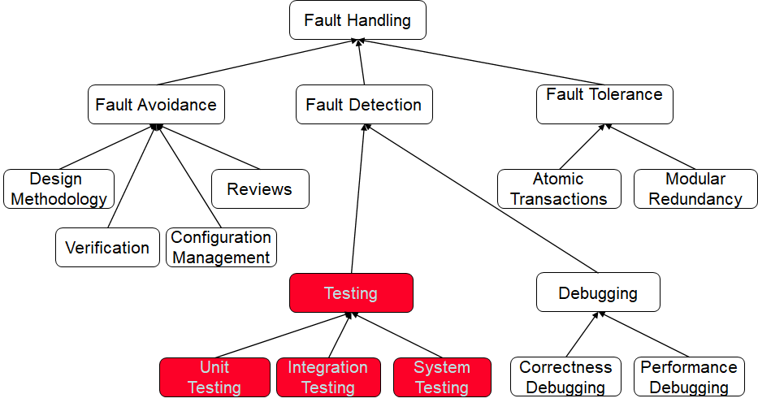

Fault Tolerance
- 单元transaction（保证一串操作的连续执行）
- 冗余模块（用于备份）

### Testing activities and their related work products

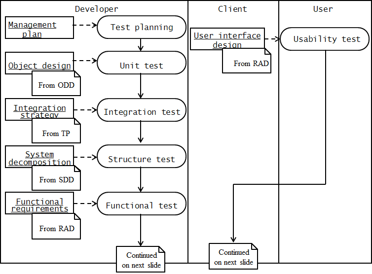

测试是由开发中的各类决策决定的。

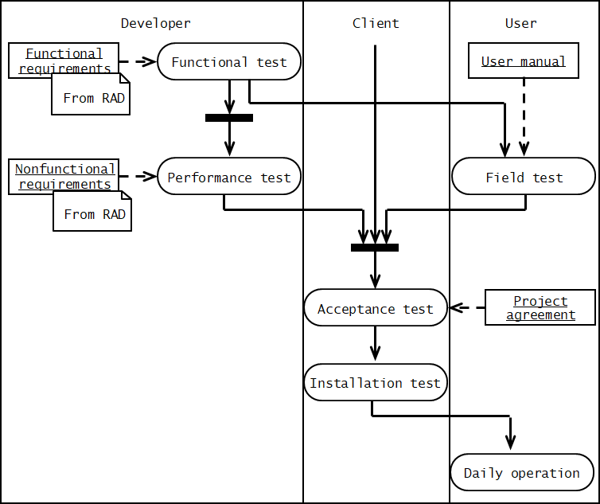

## Testing Concepts

### Failure

- **Reliability**: The measure of success with which the observed behavior of a system confirms to some specification of its behavior. 整体指标
- **Failure**:  Any deviation of the observed behavior from the specified behavior. 外在表现
- **Error**: The system is in a state such that further processing by the system will lead to a failure. 内在状态
- **Fault** (Bug): The mechanical or algorithmic cause of an error. 内部原因

产生原因由下至上，观察方向由上至下。

### Model elements used during testing

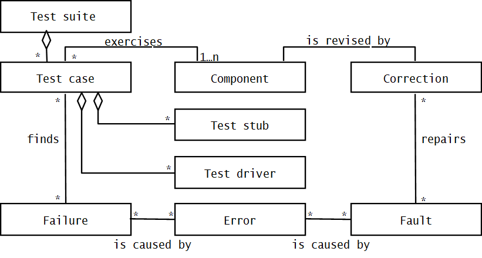

Test Suite: 测试套件，包含若干Test case
Test case： 测试用例，帮助我们寻找failure，作用在component上。a set of input data and expected results that exercises a component with the purpose of causing failures and detecting faults。
- 每一个test case需要具有以下属性：
  - Name，Location，Input，Oracle（预言），Log（日志，执行成功与否，是否执行）
  - case之间还具有先后顺序的关系、组合关系。
  - 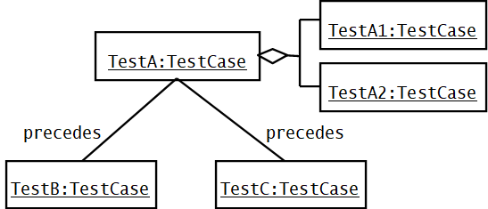
- test stub & test driver
  - 除了interface之外，对象会调用其他component，或者被其他component调用。我们检查public方法是否有问题。
  - 驱动代码：模仿未来系统调用它的方式（预设一些系统上的次序逻辑）。
  - 桩代码：模拟单元被调用的component，保证桩是正确的，检查unit的错误。
  - 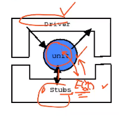
  - 需要我们在构造阶段为test driver和stub做好预算。

改正手段：
- Problem tracking
- Regression testing 回归测试，改完要重新全部过一遍test case
- Rationale maintenance 记录修改的说明，便于维护

我们需要设计不同的集成测试策略。

## Testing Activities

### Types of Testing

- Component Inspection 看代码
  - Component
  - A team of developers 最好让别人看
  - Goal: find faults in the component
- Usability Testing 对interface可用性的测试
  - System, especially on user interface
  - Users 让系统用户测
  - Goal: find the differences between the system and the user’s expectation
- Unit Testing: 单元测试
  - Individual subsystem 可大可小，小到一个方法
  - Carried out by developers 开发者自己做
  - Goal: Confirm that subsystems is correctly coded and carries out the intended functionality
- Integration Testing: 集成测试
  - Groups of subsystems (collection of classes) and eventually the entire system
  - Carried out by developers
  - Goal:  Test the interface among the subsystem
- System Testing: 系统测试（黑盒测试）
  - The entire system
  - Carried out by developers
  - Goal:  Determine if the system meets the requirements (functional and global)
- Acceptance Testing:
  - Evaluates the system delivered by developers
  - Carried out by **the client**.  May involve executing typical transactions on site on a trial basis。一般是到业务现场测试
  - Goal: Demonstrate that the system meets customer requirements and is ready to use

Implementation (Coding) and testing go hand in hand

### Unit Testing

Incremental coding 是一种informal的单元测试方法。
Hand execution：头脑模拟，也是单元测试
自动化工具：偏语法检查、编码规范检察。

Dynamic Analysis:（让代码跑起来）
- Black-box testing (Test the  input/output behavior) 主要测输入输出的行为
- White-box testing (Test the internal logic of the subsystem or object) 看代码逻辑
- Data-structure based testing  (Data types determine test cases) 围绕数据结构进行

#### Black-box Testing 

看输入输出是否符合我们的期待，当然，我们不可能通过test cases产生所有可能的input。Goal: Reduce number of test cases by equivalence partitioning:
- Divide input conditions into equivalence classes 等价类
- Choose test cases for each equivalence class. (Example: If an object is supposed to accept a negative number,  testing one negative number is enough)
- 例子：
  - 连续范围：below，above，within
  - 离散集合：valid， invalid
  - 边界测试+范围之外。可以测试边界附近有意思的值`{-1, 0, 1}, {15, 16, 17}, {17, 18, 19}, {54, 55, 56}, `，另外测一些不合法的值`{-42, 1001, FRED, %$#@} `。

#### White-box Testing

Focus: Thoroughness (Coverage). Every statement in the component is executed at least once. 本质是覆盖性，确保每一条语句至少被执行一次。如果没有跑过，我们不知道有没有问题。如果跑过，那至少可以说没大问题。
Four types of white-box testing
确保以下内容要被测试过。
- Statement Testing
- Path Testing
- Branch Testing
- Loop Testing

一个关于前三者testing的例子。

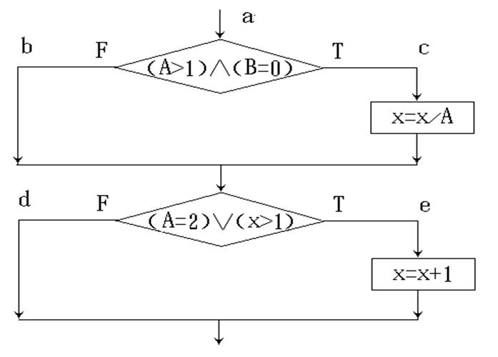

1. 首先分析执行路径。
2. 语句测试，检查`x=x/A`，检查`x=x+1`的statement，看看是不是由path能覆盖，设计对应的测试用例。
3. path testing，对所有可能路径，设置测试用例（4个）
4. branch testing，把各种分支找到（2个）

对loop，我们测试三个case：不执行，执行一次，执行多次。

对OOP，我们测试对象，一般的策略是针对状态图，针对子类的多态进行测试。

例子：卫星手表状态的转移。

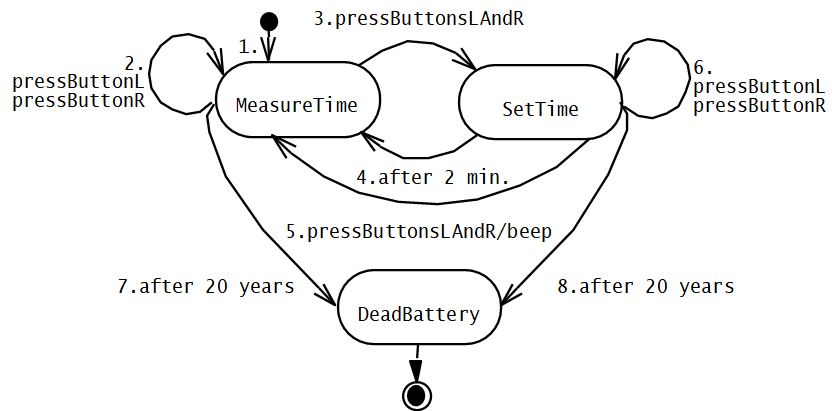

例子：网络协议不同，必须测试所有子对象的行为。

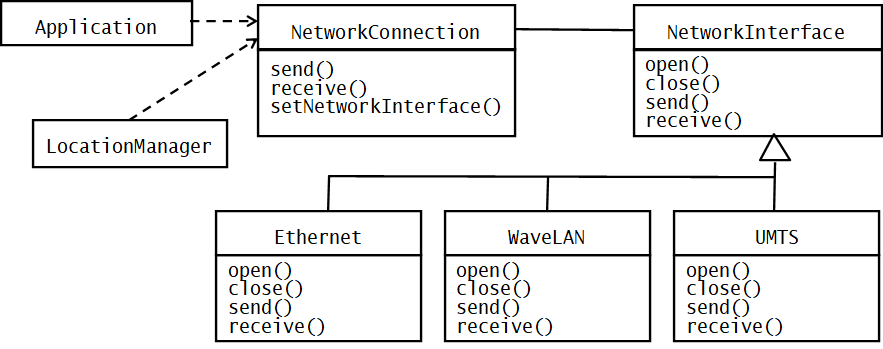

### Integration Testing

我们希望组装时，测试的工作量要少。下面有一些测试的集成测试策略。
- Big bang integration (Nonincremental)
- Bottom up integration
- Top down integration
- Sandwich testing
- Variations of the above

例子：三层子系统

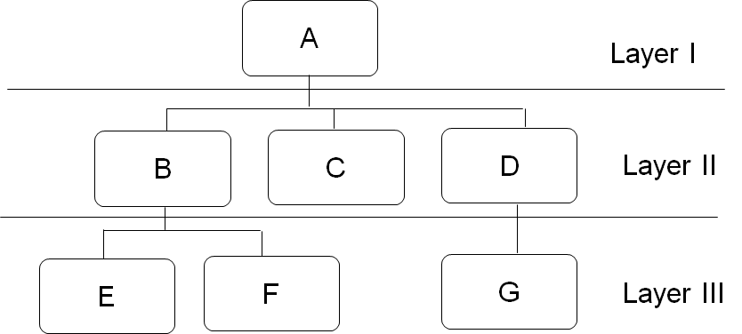

#### BIG-BANG

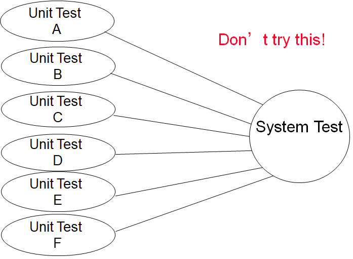
有错不知道去哪找，不好。

#### Bottom-up  Testing Strategy

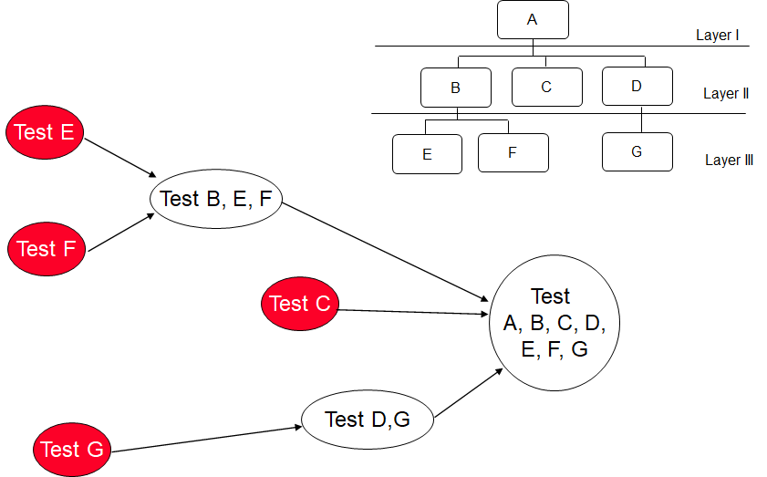

从下至上，首先测底层component。
坏处：最重要的子系统（UI）是最后测的
好处：对**面向对象的系统**、实时系统、关注性能（底层）的系统十分有效。

#### Top-down Testing Strategy

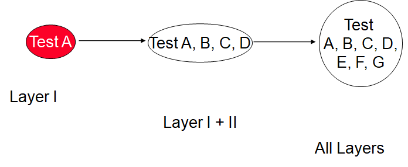

为此我们都要为上层写stub。

> 从下往上写driver数量肯定比从上到下写stub的工作量小。

好处：从UI层出发，可以容易地按照功能定义Test CASE
坏处：工作量大

#### Sandwich Testing Strategy

Combines top-down strategy with bottom-up strategy，因为一般我们主要关注中间层，因为UI会用框架，底层会用部件，比较合适。

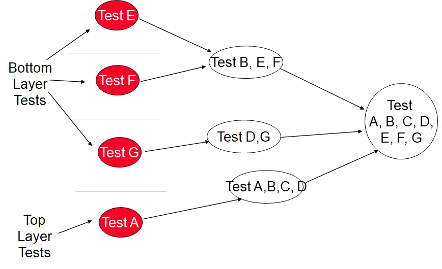

好处：同时开始，并行，加快速度
坏处：没有在集成前好好测试中间系统，可能在集成时出现问题。

改进：
- Middle layer with drivers and stubs
- Top layer with stubs
- Bottom layer with drivers

稍微简化，灵活变通：
- Top layer accessing middle layer (top layer replaces drivers)
- Bottom accessed by  middle layer (bottom layer replaces stubs)

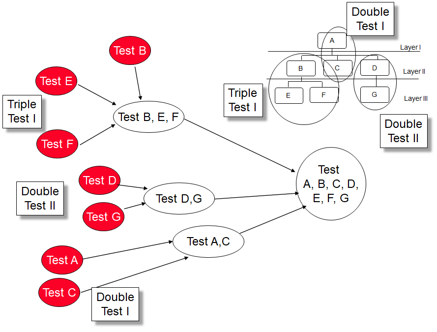
原来B/D/C没有单独测试。

#### System Testing
集成测试是一门学问，如何降低工作量，同时使bug发现效率不降低。

系统测试包括：
- Functional Testing
- Structure Testing
- Performance Testing
- Acceptance Testing
- Installation Testing

最主要的参考是需求（软件需求规约）。

1. Structure Testing
   类似白盒测试，沿着subsystem分支测试，看看路径有没有问题
2. Functional Testing
   类似黑盒测试，最好根据用户手册进行测试。
3. Performance Testing
   各类性能测试，如压力、数据、适配性。。。
4. Acceptance Testing
   和client展示、交流。
   - alpha test：用户在开发者帮助下测试
   - Beta test：用户在开发者不在场情况下使用

## Managing Testing

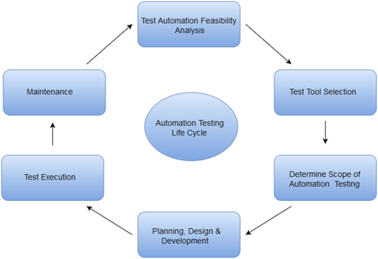

降低测试的工作量，自动化。用户输入test case，将运行目标、登记错误、回归测试的过程进行自动化。

- 开源Selenium：网站自动化功能测试。
- 单元测试工具：junit，引入test case，assert
- 性能测试软件LoadRunner：

