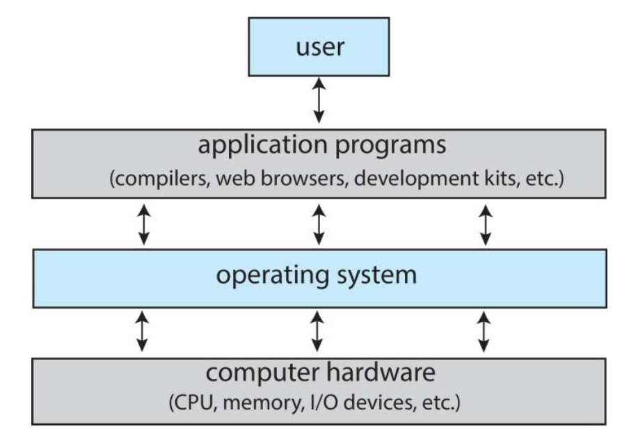
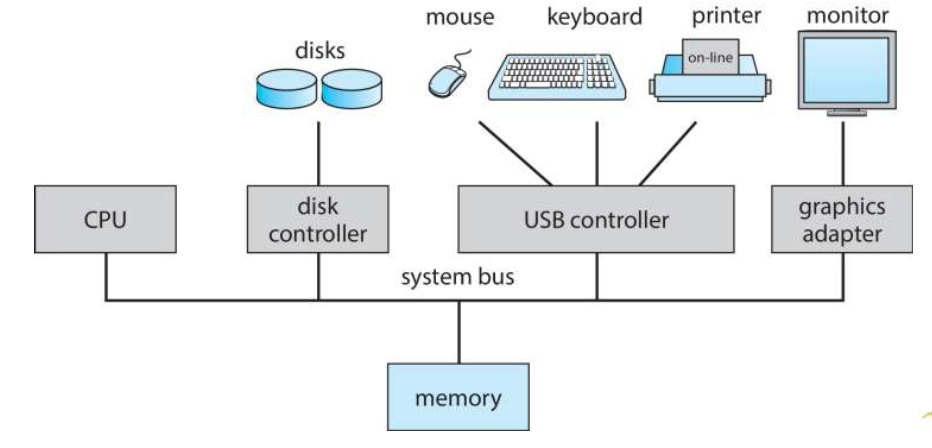
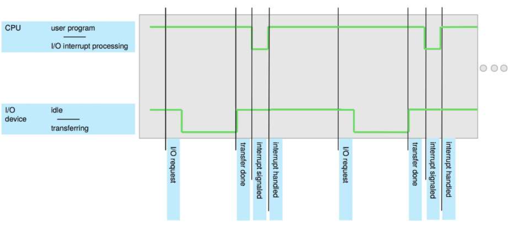
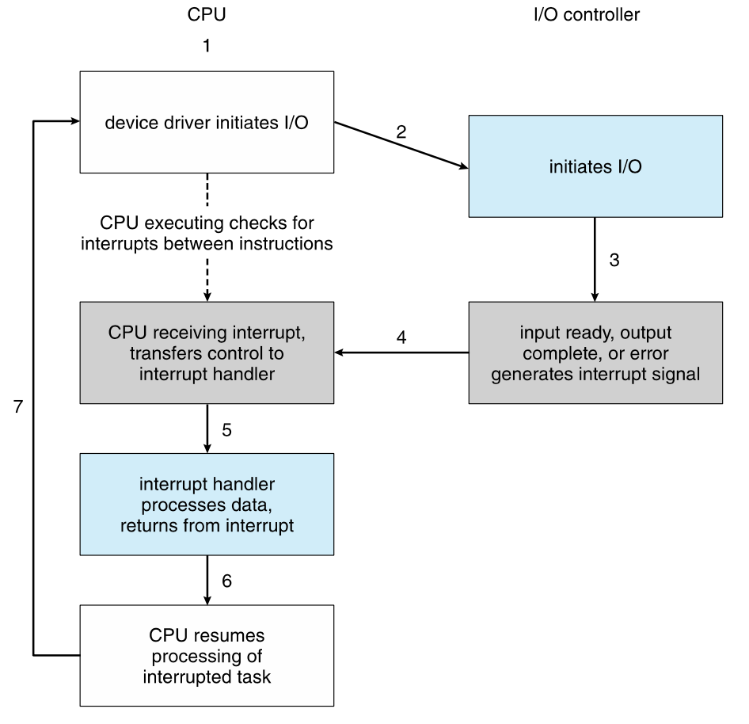
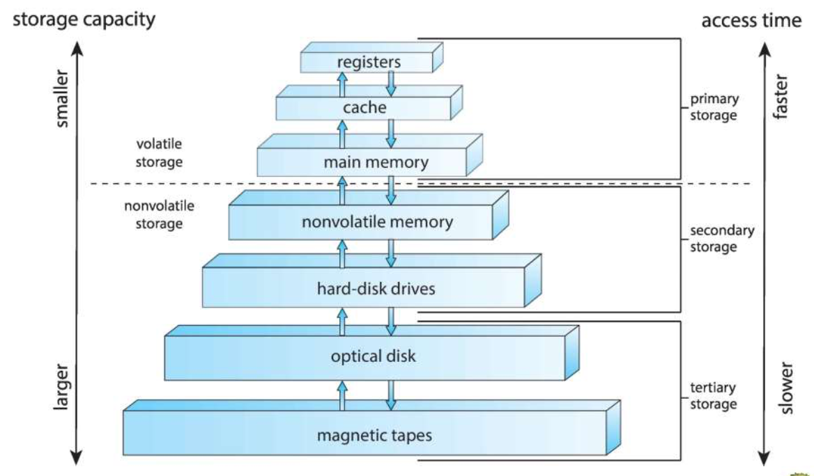
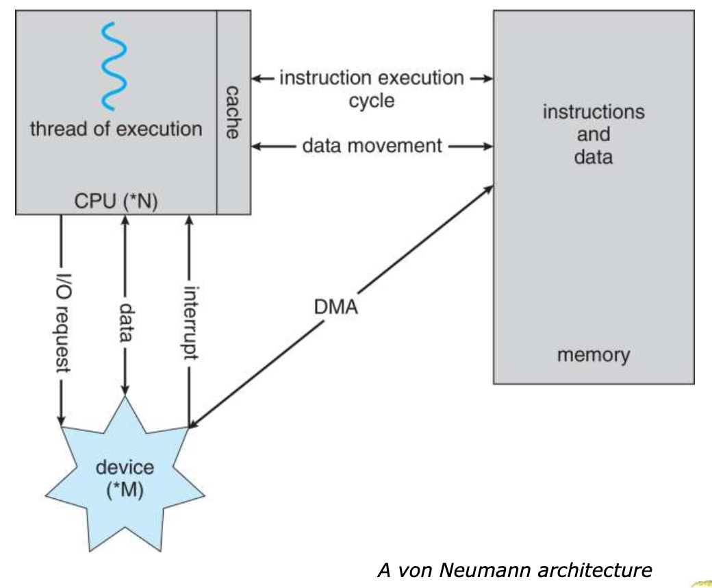
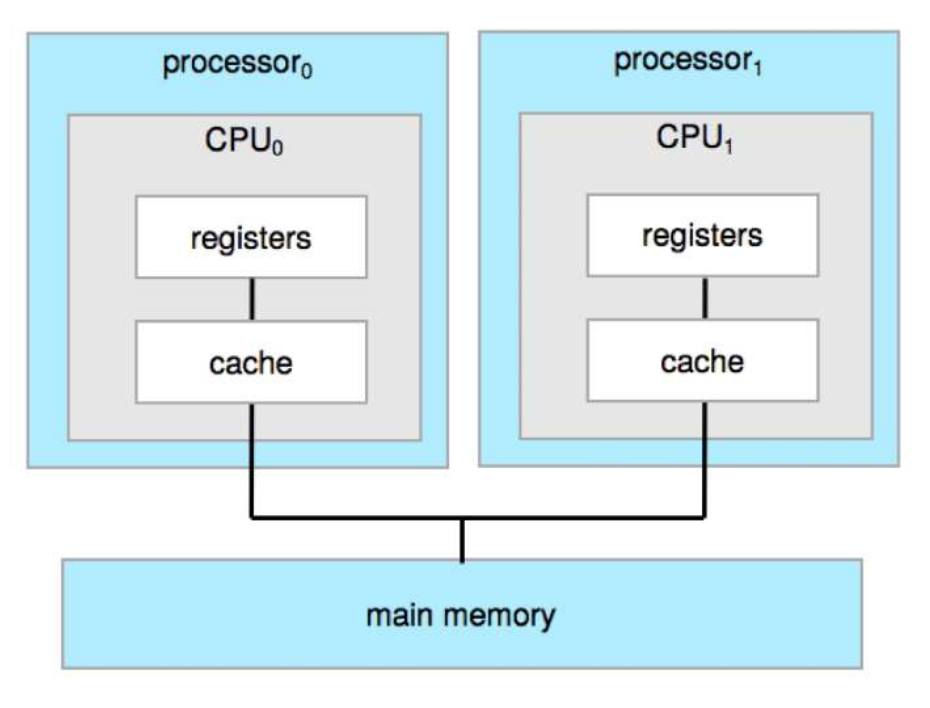
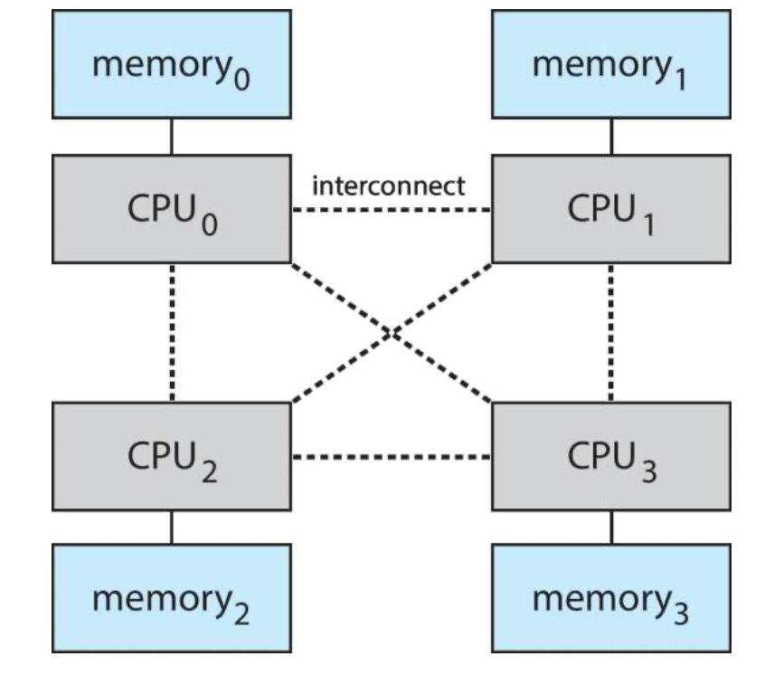

<!--more-->

[toc]

## Objectives

- Describe the general organization of a computer system and the role of interrupts **(event driven)**
- Describe the components in a modern, multiprocessor computer system
- Illustrate the transition from user mode to kernel mode
- Discuss how operating systems are used in various computing environments *Laptop, phones, ...*
- Provide examples of free and open-source operating systems

## Computer System Structure

- Computer system can be divided into four components:
  - Hardware – provides basic computing resources
    - CPU, memory, I/O devices
  - Operating system
    - Controls and coordinates use of hardware among various applications and users
  - Application programs - define the ways in which the *system resources are used* to solve the computing problems of the users
    - Word processors, *compilers*, web browsers, *database systems*, video games
  - Users *not necessary a human being*
    - People, **machines, other computers**
    - participate in using the programs to interface with your system

- sometimes, application programs are allowed to directly control the hardware(backdoor)

## What Operating Systems Do

- Depends on the point of view
  - Users want convenience, **ease of use** *(e.g. run on all devices)* and **good performance**
    - Don’t care about resource utilization
  - But shared computer such as **mainframe** or **minicomputer** *(especially in the old times)* must keep all users happy
    - *i.e. to fully utilize the hardware to satisfy all users*
    - Operating system is a **resource allocator** and **control program** making efficient use of HW and **managing execution** *(to cut multiple processes into pieces and execute them simultaneously)* of user programs
- Users of dedicate systems such as workstations have dedicated resources but frequently use shared resources from servers
- Mobile devices like smartphones and tables are resource poor, optimized for usability and battery life
  - Mobile user **interfaces** such as touch screens, voice recognition
  - *OS Developers care about other things*
- Some computers have little or no user interface, such as embedded computers in devices and automobiles
  - Run primarily without user intervention

## Defining Operating Systems

- Term OS covers many roles
  - Because of myriad designs and uses of OSes *OS may interface many different systems*
  - Present in toasters through ships, spacecraft, game machines, TVs and industrial control systems
  - Born when fixed use computers for military became more general purpose and needed resource management and program control
- No universally accepted definition
- “Everything a vendor ships when you order an operating system” is a good approximation
  - But varies wildly
- _“The one program running at all times on the computer” is the **kernel**, part of the operating system_
- Everything else is either
  - a system program (ships *(comes along, e.g. Web Browser, Email Clients...)* with the operating system, but not part of the kernel) , or
  - an application program, all programs not associated with the operating system
- Today’s OSes for general purpose and mobile computing also include **middleware** – a set of software frameworks that provide addition services to application developers such as databases, multimedia, graphics *(e.g. OpenGL, CUDA, Drivers...)*

## Computer System Organization
- Computer-system operation
  - One or more CPUs, device controllers connect through common **bus** providing access to shared memory (*All devices can run simultaneously*)
  - Concurrent execution of CPUs and devices competing for memory cycles

> How to solve the racing? (when multiple devices access memory)

- I/O devices and the CPU can execute concurrently
- Each device controller is in charge of a particular device type
- Each device controller has a local buffer (*Temporarily store the data, otherwise the CPU will stop the current execution and transfer the data to the device*)
- _Each device controller type has an **operating system** device driver to manage it_ *(to handle racing)* 
  > device driver $\in$ opearting system, it will note an interrupt to the OS
- CPU moves data from/to main memory to/from local buffers
  > Why we need CPU instead of each device to move data?
- I/O is from the device to local buffer of controller
- Device controller informs CPU that it has finished its operation by causing an interrupt

## Common Functions of Interrupts
- **Major Use:** Interrupt _transfers control_ to the interrupt service routine generally, through the **interrupt vector**, which contains the addresses of all the service routines
- Interrupt **architecture** must save the address of the interrupted **instruction**
- A **trap** or **exception** (*whether the data is accessed/overflow occurs/...*) is a software-generated interrupt caused either by an error or a user request
- An operating system is **interrupt driven**

> e.g. when you type a word
> 
> Note: in modern systems, there will be no IDLE, since CPU is multi-cored. and memory access is implemented with DMA

## Computer Startup
what happens before OS?
- **bootstrap program** is loaded at power-up or reboot
  - *bootstrap program will not take up memory,* 
  - Typically stored in ROM or EPROM, generally known as firmware
  - Initializes all aspects of system *it will check the memory every time it runs, (memory is prone to defect)*
  - Loads operating system kernel and starts execution

## Interrupt Handling

- The operating system *preserves the state of the CPU* by storing registers and the program counter
- Determines which type of interrupt has occurred: 
  - polling (*check whether interrupts happen everytime between instructions*)
  - vectored interrupt system
- Separate segments of code determine what action should be taken for each type of interrupt

### Interrupt-drive I/O Cycle

## I/O structure

After I/O starts, control returns to user program only upon I/O completion
- Wait instruction idles the CPU until the next interrupt
- Wait loop (contention for memory access)
- At most one I/O request is outstanding at a time, no simultaneous I/O processing
- *one improvement for the blocking/idle architecture is to let CPU do other works during the blocking period, (CPU utilization)*
  - **multithread**: when one thread is suspended, you can do something else on the other thread
(More Efficient) After I/O starts, control returns to user program without waiting for I/O completion **Non-Blocking IO**
*To achieve that, it is requested that*
- **System call** – request to the OS to allow user to wait for I/O completion
- **Device-status table** contains entry for each I/O device indicating its type, address, and state
- OS indexes into I/O device table to determine device status and to modify table entry to include interrupt

## Storage Structure
- Main memory – only large storage media that the CPU can access directly
  - Random access
  - Typically **volatile** (*vanishes when turned off*)
  - Typically **random-access memory** in the form of **Dynamic Random-access Memory (DRAM)** 
    > DRAM vs SRAM
    > technology: capacitor vs. cmos
    > capacity: 1-1bit,large vs. 8-1bit,smaller
    > speed: slower vs faster
    > for capacitors, electrons will escape overtime, it needs to be refreshed(read and write back) *which is why it is called Dynamic*
    > function: Main Memory vs. Cache
- Secondary storage – extension of main memory that provides large nonvolatile storage capacity
- Hard Disk Drives (HDD) – rigid metal or glass platters covered with magnetic recording material
  - Disk surface is logically divided into tracks, which are subdivided into sectors
  - The disk controller determines the logical interaction between the device and the computer
  - *SSD*
  - *prone to errors, coding algorithms required*
- Non-volatile memory (NVM) devices– faster than hard disks, nonvolatile
  - Various technologies (*resistors, magnets, Flash, ...*)
  - Becoming more popular as capacity and performance increases, price drops
  - *Multiple uses in modern technologies such as AI processors*

## Storage Hierarchy

Reasons
- Different Storage Devices have different speed, cost and volatility
- 芯片中SRAM的容量达到极限，成本、访问速度、出错率
- 程序自带的Locality属性

Solutions
- Caching

### How Modern Computers Work

> 
> Traditional 冯诺伊曼架构，存储与计算分离，解除控制流、数据流的耦合
> challenge：CPU承担了不同设备之间转移数据的责任，不能专注于计算
> Solution：DMA-Direct Memory Access，让Device直接访问内存，由于Device Control不能掌控控制，不清楚全局内存分配情况，因此需要引入新的Controller （DMA）

### Direct Memory Access Structure
- Used for high-speed I/O devices able to transmit information at close to memory speeds
- Device controller transfers blocks of data from buffer storage directly to main memory without CPU intervention
- Only one interrupt is generated per block, rather than the one interrupt per byte

> Extension: AI Chip (Compute and Math Intensive)
> CPU -> GPU -> TPU
> 标量计算/Locality -> 向量计算/流式 -> 张量计算/卷积/无runtime控制流
> Explicit/Hierachial/Invisible Cache -> Mixed Caches/Shared Memory(可操作) -> Shared Buffers
> Data Type: 32+bits -> 16bits -> int8
> AI处理器：精简控制、算力堆叠、数据流优化的微架构创新

## Computer-System Architecture

**Multiprocessors**
- Advantages
  - Increased ThroughPut
  - Economy of scale
    - facilitates multi-thread
    - 降低控制成本->芯片面积
    - 容错率
    - SCALE-UP FRIENDLY
- Types
  - Asymmetric Multiprocessing – each processor is assigned a specie task. 设计更为复杂，e.g. 通讯处理器，不同核的硬件目标不同，可维护性差
  - Symmetric Multiprocessing – each processor performs all tasks，对software有更高要求

### Example: Symmetric Multiprocessing Architecture

usually in servers

### Example: A Dual-Core Design

PC
 
> shared memory: so that both core can execute a shared program

> multiprocessor vs multicore
> single/multiple systems vs single or multiple integrated circuit dies
> expensive vs cheaper
> more traffic vs less traffic
> longer IO
> more complex configuration
> faster on multiple programs vs faster on a single program

### Example： Non-Uniform Memory Access System

- all memories are shared virtually, but are seperated physically
- cause tricks in programming

### Clustered(Distributed) Systems
- processors make less difference
- network, security matters
- high-availablility
  - **Asymmetric clustering** has one machine in hot-standby mode
  - **Symmetric clustering** has multiple nodes running applications, monitoring each other

> Future Trends
> - WareHouse Scale Computing
> - NVM(Non-Volatile Memory) standing out (Merge Storage & Computing)

## Opearting System Operations
- Bootstrap program
- Kernal loads
- Starts **system daemons**
- Kernal **interrupt driven**
  - hardware interrupt
  - software interrupt
    - exception/error
    - system call
    - other problems such as infinite loop...

## Multiprogramming and Multitasking
- Traditional: Multiprogramming: 批处理系统,via **job scheduling**
- Modern: Timesharing/multitasking
  - process
  - CPU scheduling
  - allows **interative computing**
  - swapping/virtual memory
> in some specific domains, some applications are not allowed to be interrupted (e.g. automobile, 5G), which requires kernal mode programming

## Dual-mode and Multimode Operation
- Dual-mode: user mode and kernal mode
  - **mode bit** provided by hardware
  - **Timer** to prevent infinite loop/processing hogging(拱背) resources
    - kernal mode is limited/timed
- increasing CPUs support for multi-core operations
  - Virtual Machine Manager

## Managements

### Process Management
OS allocates and manages resources for processes, which involves
- create & delete
- suspend & resume
- process synchronization (when multiple processes require access to shared hardware)
- process communication
- deadlock handling
  - when two processes are mutually exclusive
  - it has to be determined which data to be unlocked, prevent in advance or restore, ...

### Memory Management
OS will 
- allocate (or at least notify the GC) memory usage

### FS Management
- organize files through directories
- access control
- mapping files onto secondary storage (and ensure dependability)
- Backup files onto (probably multiple) non-volatile storage media

### Cache Management
- **Cache coherency**, especially in shared caches among cores

### I/O Management
- hide peculiarities of hardware devices from the user
  - buffering
  - caching
  - spooling

## Other Topics

- Protection
- Security
- Virtualization
  - initially, emulation - through **interpretation**, slow
  - virtualization - running guest OSes **natively compiled**
- Distributed Systems
  - Network is a communications path, TCP/IP most common
  - Network Operating System provides features between systems across network

