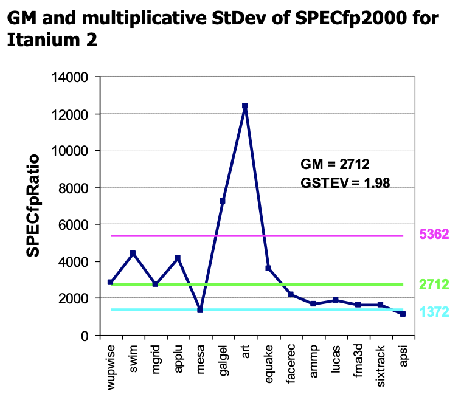

Main Topics
- Computer Architecture
- Trends in technology (bandwidth over latency)
- Two major factors that affect chip growth, **power** and **cost**, and how to measure them
- How to measure performace, benchmarks

<!--more

## Introduction

### Traditional Conventional Wisdom VS Modern CW

- Old: Power is free, transistors expensive
  New: **"Power wall"**, power expensive, transistors free
  (can put more on chip than can afford to turn on)
- Old: Instruction-level parallelism (throught compiler, instruction set)
  New: **"ILP wall"**
- Old: Multiplies slow, memory access is fast
  New: **Memory Wall**
- Old: Uniprocessor 2X/1.5yrs
  New: **Brick Wall**, 2X/5yrs -> multiple "cores"

### Limits to Pipelining

**Hazards** prevent next instruction from executing during its designated clock cycle
- Structural
- Data
- Control

### Principle of Locality
- temporal
- spatial
- cache

## Quantitative Principles of Computer Design

### Amdahl's Law
$$
\text{ExecutionTime}_{\text{new}} = \text{ExecutionTime}_{\text{old}} \times \left[ \left(1 - \text{Fraction}_{\text{enhanced}} \right) + \frac{\text{Fraction}_\text{enhanced}}{\text{SpeedUp}_\text{enhanced}} \right]
$$

> Example
> I/O bound server, CPU 10x faster, only provides 1.6x boost
> $$
> \begin{aligned}
> \text { Speedup }_{\text {overall }} &=\frac{1}{\left(1-\text { Fraction }_{\text {enhanced }}\right)+\frac{\text { Fraction }_{\text {enhanced }}}{\text { Speedup }_{\text {enhanced }}}} \\
> &=\frac{1}{(1-0.4)+\frac{0.4}{10}}=\frac{1}{0.64}=1.56
> \end{aligned}
> $$

### Processor performance equation

$$
\text{CPU Time} = \frac{\text{Seconds}}{\text{Program}} = \frac{\text{Instructions}}{\text{Program}} \times \frac{\text{Cycles}}{\text{Instruction}} \times \frac{\text{Seconds}}{\text{Cycle}}
$$
  Parts | Instr Cnt | CPI | Clock Rate
---------|----------|--------- | ---
 Program | X |  | 
 Compiler | X | (X) |
 Instr Set | X | X | 
 Organization | X | | X
 Technology | | | X

$$
\begin{array}{ll}
\text { CPU time }=\text { CPU clock cycles for a program } \times \text { Clock cycle time } &\\
\text { CPU time }=\frac{\text { CPU clock cycles for a program }}{\text { Clock rate }} &\\
\text { CPI }=\frac{\text { CPU clock cycles for a program }}{\text { Instruction count }} \quad \text{(useful if we only want to compare CPU performace)} &\\
\text { CP time = Instruction count } \times \text { Cycles per instruction } \times \text { Clock cycle time }&
\end{array}
$$

## Computer Architecture

### Parallelism
- Classes of parallelism in applications: 
  - Data-Level Parallelism (DLP)
  - Task-Level Parallelism (TLP)
- Classes of architectural parallelism:
  - Instruction-Level Parallelism (ILP)
  - Vector architectures/Graphic Processor Units (GPUs)
  - Thread-Level Parallelism 
  - Request-Level Parallelism

### Flynn's Taxonomy
focus on the relationship between instruction-strem & data-stream
- SISD: single i-stream, single d-stream
  - ILP
- SIMD
  - GPU
- MISD (no commercial implementation)
- MIMD
  - Tightly-coupled
  - Loosely-coupled

### Instruction Set Architecture
- interface of sw & hw
- difference with OS?
  - OS deals with runtime interface, while ISA deals with design-time interface
  - OS is the manager (cooperation), ISA is the technician (exploit the performance)
- Properties of an ISA
  - portability, as for hardware
  - generality, as for software
  - efficient implementation at lower levels
  - convenient functionality to higher levels

### What to define in ISA
MIPS as example
- data types
- instruction format
  - 
- addressing modes
- programmable storage:
  - $2^{32} x$ bytes
  - 31 32-bit General Purpose Registers (r0=0)
  - 31 32-bit Float-point registers
  - HI LO PC

## Trends in Technology

Compare for Bandwidth vs. Latency improvements in performance overtime
- Bandwidth: number of events per unit time
  - e.g. M bits / second over network, M bytes / second from disk
- Latency: elapsed time for a single event
  - e.g. One-way network delay in microseconds, average disk access time in milliseconds 

Class | Details  | Bandwidth | Latency | bandwidth vs latency
----->-- | -- | -- | -- | --
Disks |  | 2500X | 8X | 
Memory |  | 4000X | 4X |  
LANs | | 1000X | 15X | 
Processor |  | 2250X million instructions per second | 20X for every instruction from issue to execute | 

> **Observation1**: Brandwidth over Latency
> **Observation2**: Memory Wall

Why?
1. Moore’s Law helps BW(transistor density) more than latency(linelength)
2. Distance limits latency
   which explains linear latency vs square brandwidth
3. Bandwidth easier to sell (idea that "bigger the better")
4. Latency helps brandwidth, but not vice versa
5. Bandwidth hurts latency
6. Operating System overhead hurts latency more than bandwidth
   e.g. Long messages amortize overhead, but the overhead becomes a greater burden for short messages

New Trends, *Optical Interconnect* trying to reduce latency

> Two major factors that affect chip growth, **power** and **cost**

## Power in Integrated Circuits

**Concept** Feature size, Minimum size of transistor or wire in x or y dimension
**Trends:** the connecting lines are consuming more and more energy (relative to transistors)
> 90nm Node IBM Microprocessor
> - 50% of active power dissipation is in microprocessor interconnects 
> - 90% interconnect power is consumed by only 10% of the wires

### Power != Energy

Problem: Get Power in 供电 & Get Power out 散热
**Concept:** **Thermal Design Power**, Lower than peak power, higher than average power consumption. to make sure the process function well.
**Techniques:** Dynamically voltage and frequency scaling (DVFS)
- integrated monitor to detect the environment of the chip

### Define and quantify power

**Concept: Dynamic power** 动态功耗, transistor改变产生的功耗
$$
\text{Power}_\text{dynamic} = 0.5 \times \text{{CapacitiveLoad}} \times \text{Voltage}^2 \times \text{FrequencySwitched}
$$

**Concept: Static power** 静态功耗, caused mostly by leakage
$$
\text{Power}_\text{static} = \text{Current}_\text{static} \times \text{Voltage}
$$
- Technique: Very low power systems even gate voltage to inactive modules to control loss due to leakage

### Energy

For mobile devices, energy better metric (整体容量)

$$
\text{Energy}_\text{dynamic} = \text{CapacitiveLoad} \times \text{Voltage}^2
$$

- slowing clock rate reduce power but not energy
- dropping voltage help both
- to save energy & dynamic power, most cpus turn off clock of inactive modules

### Summary: Reducing Power

- Do nothing well
- Dynamic Voltage-Frequency Scaling 
- Low power state for DRAM, disks
- Overclocking, turning off cores

## Trends in Cost

- Cost driven by Yield 良率
  - Learning Curve (to show where faults most likely to occur)
- unlike processor, DRAM: price closely tracks cost
- Microprocessors: price depends on volume (greater volume will split the developing cost, which can take place very soon)

### Integrated Circuit Cost

$$
\begin{array}{l}
\text { Cost of integrated circuit }=\frac{\text { cost of die }+\text { cost of testing die }+\text { cost of packaging and final test }}{\text { Final test yield }} \\
\text {Cost of Die} = \frac{\text{Cost of wafer}}{\text{Dies per wafer}\times \text{Die yield}}
\text { Dies per wafer }=\frac{\pi \times(\text { Wafer diameter/2 })^{2}}{\text { Die area }}-\frac{\pi \times \text { Wafer diameter }}{\sqrt{2 \times \text { Die area }}}
\end{array}
$$

Bose-Einstein formula:
$$
\text { Die yield }=\text { Wafer yield } \times 1 /(1+\text { Defects per unit area } \times \text { Die area })^{N}
$$

> *Generally, smaller die area gives more die yield*
> In addition to dust (modeled by the above formulas), Other models have also been applied to the evaluation of die yield.

## Dependability

Goal: define a metric to evaluate the dependability of a system

- Service Level Agreements **SLA**
  - Service Accomplishment: delivered as SLA specifies
  - Service Interruption: not delivered as SLA specifies
  - Failure: Accomplishment -> interruption
  - Restoration: <-

- Module Reliability
  - Mean Time to Failure **MTTF**
  - Failures in Time **FIT=1/MTTF**
  - Mean Time to Repair **MTTR**
  - Mean Time Between Failures **MTBF = MTTF + MTTR**
  - **Module Availability = MTTF / (MTTF + MTTR)**

> 
> in 100,0000 hours, we count the failure times
> 

## Performance

### Measures
- Typical performance metrics
  - Response time
  - Throughput
- Speedup of X relative to Y
  - Execution timeY / Execution timeX
- Execution time
  - Wall clock time: includes all system overheads 
  - CPU time: only computation time
- Benchmarks
  - Kernels (e.g. matrix multiply)
  - Toy programs (e.g. sorting)
  - Synthetic benchmarks (e.g. Dhrystone) (provided by software developers, which will be equivalent to the read SW product in performance and workload)
  - Benchmark suites (e.g. SPEC06fp, TPC-C)

### How to summarize Suite Performance

**SPECRatio**: Normalize execution times to reference computer, yielding a ratio proportional to performance
$$\frac{\text{time on reference computer}}{\text{time on computer being rated}}$$

$$
\text {GeometricMean}=\sqrt[n]{\prod_{i=1}^{n} S P E C R a t i o_{i}}
$$

To take the error into account... 衡量各类benchmark之间的性能差异
$$
\begin{array}{l}
\text {GeometricMean}=\exp \left(\frac{1}{n} \times \sum_{i=1}^{n} \ln (\text {SPECRatioi})\right) \\
\text {Geometric} \text {StDev}=\exp (\text {StDev}(\ln (\text {SPECRatioi})))
\end{array}
$$

Standard deviation is more informative if know distribution has a standard form
- bell-shaped normal distribution, whose data are symmetric around mean
- lognormal distribution, where logarithms of data-- not data itself--are normally distributed (symmetric) on a logarithmic scale

| Itanium ｜ Athlon |
| --- ｜ ---- |
|  ｜  |

- Standard deviation of 1.98 for Itanium 2 is much higher-- vs. 1.40--so results will differ more widely from the mean, and therefore are likely less predictable
- Falling within one standard deviation: 
  - 10 of 14 benchmarks (71%) for Itanium 2
  - 11 of 14 benchmarks (78%) for Athlon
- Thus, the results are quite compatible with a lognormal distribution (expect 68%)