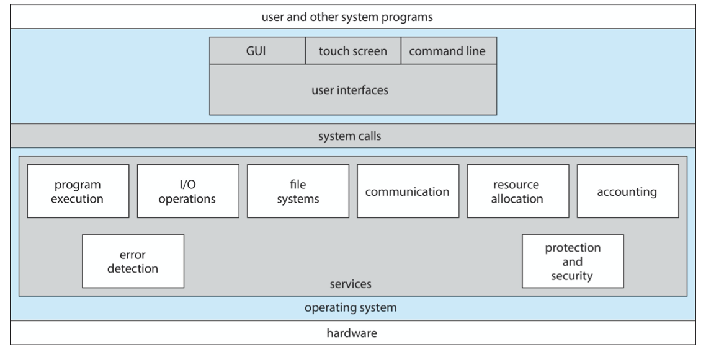
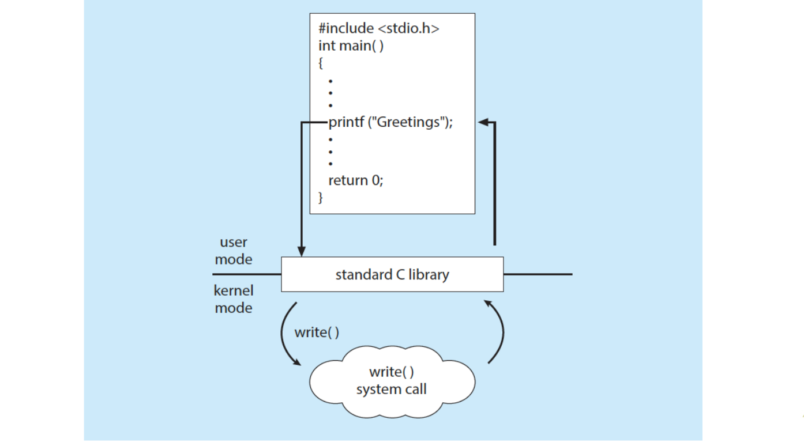
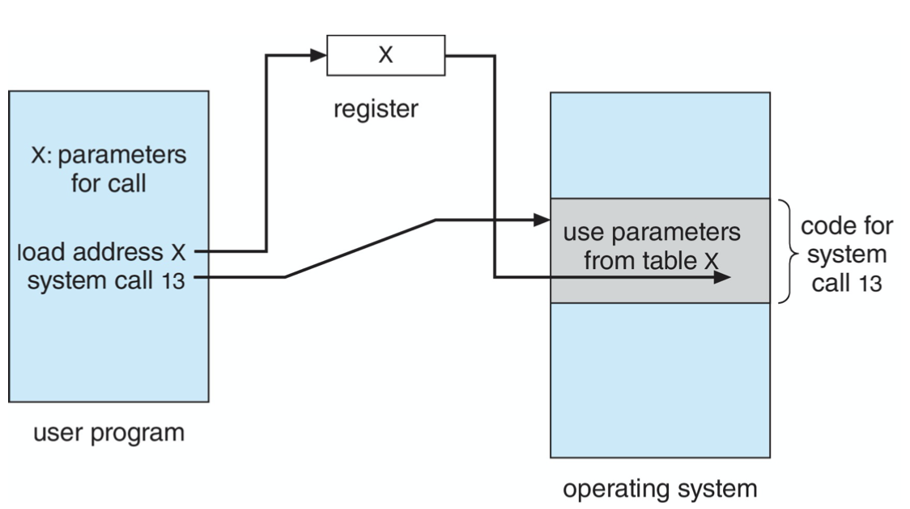

- Identify **services** provided by an operating system
- Illustrate how **system calls** are used to provide operating system services
- Compare and contrast monolithic单体, layered分层, microkernel微内核, modular, and hybrid **strategies for designing operating systems**
- Illustrate the process for **booting** an operating system
- Apply **tools for monitoring** operating system performance
- Design and implement kernel modules for interacting with a Linux kernel
 

<!--more-->


## Operating System Services

Functions that are **helpful to user**
- **User interface** - Almost all operating systems have a user interface (UI).
  - Varies between Command-Line (CLI), Graphics User Interface (GUI), touch-screen, Batch
- **Program execution** - The system must be able to load a program into memory and to run that program, end execution, either normally or abnormally (indicating error)
- **I/O operations** - A running program may require I/O, which may involve a file or an I/O device
- **File System Manipulation**
- **Communications** between users/processes
- **Error Detection**  OS needs to be constantly aware of possible errors
  - May occur **in the CPU and memory hardware** *(especially for memories. 'Assuming every hardware functions 100% well' is A typical pitfall among most programmers)*, in I/O devices, in user program
  - For each type of error, OS should take the appropriate action to ensure correct and consistent computing
  - **Debugging facilities** (*requires OS support*) can greatly enhance the user’s and programmer’s abilities to efficiently use the system
 

Functions that ensure the **efficient operation** of the system iteself via *resource sharing*

- **Resource allocation** - When multiple users or multiple jobs running concurrently, resources must be allocated to each of them
  - Many types of resources - CPU cycles, main memory, file storage, I/O devices.
- **Logging** - To keep track of which users use how much and what kinds of computer resources
- **Protection and security** - The owners of information stored in a _multiuser_ or networked computer system may want to control use of that information, concurrent processes should _not interfere_ with each other
  - Protection involves ensuring that all access to system resources is controlled
  - Security of the system from outsiders requires user authentication, extends to defending external I/O devices from invalid access attempts




## System Calls

- Programming interface to the services provided by the OS
- Typically written in a high-level language (C or C++)
- Mostly accessed by programs via a high-level **Application Programming Interface (API)** rather than direct system call use
  - Win32 API for windows
  - POSIX API for POSIX-based systems (all UNIX/Linux/Mac OS X)
  - Java API for JVM
- Note that the system-call names used throughout this text are generic

### Programmer's Perspective: An Example
`cp` sequence:


#### User Operating System Interface(CLI)

CLI or **command interpreter** allows direct command entry

- Sometimes implemented in kernel, sometimes by systems program
- Sometimes multiple flavors implemented - shells
- Primarily fetches a command from user and executes it
- Sometimes commands built-in, sometimes just names of programs
  - If the latter, adding new features doesn’t require shell modification
  - `rm -f test.tex` works differently in different shell system
  - *For integrated, directly system call, mark invalid*
  - *For application implemented, it will first find the `rm` application (e.g. in `usr/bin` or register file), start a process and execute it*
  - *`strace` in linux*


### Insider's Perspective: Implementation


#### API - System Call Implementation
Typically, a number associated with each system call
- System-call interface maintains **a table indexed** according to these numbers
- Most details of OS interface hidden from programmer by API 
- Managed by run-time support library *(library, loader, compiler/interpreter)* (set of functions built into libraries included with compiler)
- `libc` library in C
  - 

#### Parameter Passing
- simplest: through registers
- stored in memory, address through registers
- through stack


#### Types of System Calls
- Process control (创建、终止、中断、恢复、数据，获取进程属性，等待、内存管理、出错dump，**debugger (single step execution)**，locks)
  > - `end` normal, `abort` abormal
  > - user can start a thread in a program, where to return?
  >   - same memory image if return to the caller
  >   - create a new process(concurrently) `./usrapp & >> output_file` (`&` indicates running in the background), where the following functions are required
  >     - get process attributes
  >     - wait for time
  >     - wait event, signal event
  > - **Debugger**, requires system support, almost all debugger requires `dump memory` (into special file of the disk)
- File Management (读写、属性)
- Device Management （request & release, read and write, attributes）
- Information Maintenance (date, time, system attribute)
  > Especially useful in debug mode
  > OS: **strace** -> system calls
  > CPU: single step -> **trap** -> debugger
  > requires OS + hardware cooperation
- Communications (link & unlink, **shared-memory model**)
  > One application: networking
  > in OS perspectives (unlike computer network), usually messages send from client to server
  > a *Daemon*(user-mode) is typically used to keep listening to the clients
  > Another topic: shared memory, efficient, but managing is compilicated
  > Threads share memory by default
- Protection (access, deny & allow)


### OS Examples

#### Arduino

- Single-tasking
  > Single Process, (debug unsupported on chip/ but simulation on PC)
- No operating system
  > just a bootloader
- Programs (sketch) loaded via USB into flash memory
  > Cross-Compiling involved: you need to compile the program on PC
- Single memory space
- Boot loader loads program
- Program exit -> shell reloaded

#### FreeBSD
- Unix variant
- Multitasking
- User login -> invoke user’s choice of shell
- Shell executes `fork()` system call to create process
  - Executes `exec()` to load program into process
  - Shell waits for process to terminate or continues with user commands
- Process exits with:
  - code = 0-noerror
  - code > 0 - error code

```
low ------------------ high memory
process D / process B / interpreter / process C / free memory / kernal
```

## System Services

> Note: system calls mainly deal with HW
> Another major part of OS **deals with applications - system services**
> A higher level above system call API

System programs provide a convenient environment for program development and execution. They can be divided into:
- File manipulation
- Status information sometimes stored in a file
  > when system crashes, the status file is usually maintained in a hard-disk region *independent of the FS*
  > because when OS boots, the files (related to OS) will be loaded
  > During a crash, if we dump the status information into FS, the OS files might get polluted
  > Closely related to various kinds of model of the OS
  - Some ask the system for info - date, time, amount of available memory, disk space, number of users
  - Others provide detailed performance, logging, and debugging information
  - Typically, these programs format and print the output to the terminal or other output devices
  - Some systems implement a **registry(注册表)** - used to store and retrieve configuration information
- Programming language support
  - Compilers, assemblers, debuggers and interpreters sometimes provided
  > They don't belong to kernal, but are necessary
- Program loading and execution
  - Absolute loaders, relocatable loaders, linkage editors, and overlay-loaders, debugging systems for higher-level and machine language
- Communications
- Background services (*which user is not aware*)
  - Launch at boot time
    - Some for system startup, then terminate
    - Some from system boot to shutdown
  - Facilities like _disk checking, process scheduling, error logging, printing_
  - Known as **services, subsystems, daemons**
  - **Daemons run in user context not kernal context**
- Application programs
  - Don't pertain to system
  - Run by users
  - Not typically considered part of OS
  - Launched by command line, mouse click, finger poke


## Linkers and Loaders
- Source code compiled into object files designed to be loaded into any physical memory location - **relocatable object file**
  > if your system is not compiled locally, when debugging you may find some executions with no related code lines(system call)
- **Linker** combines these into single binary **executable** file 
  - Also brings in libraries
  > drawbacks in packing libraries into compiled executables
  > - memory leaf flipping will reduce efficiency
  > - a waste on space
  > How DLL comes into use
- Program resides on secondary storage as binary executable
- Must be brought into memory by **loader** to be executed
  - **Relocation** assigns final addresses to program parts and adjusts code and data in program to match those addresses
- Modern general purpose systems don’t link libraries into executables
  - Rather, **dynamically-linked-libraries(in Windows,DLLs)** are loaded as needed, shared by all that use the same version of that same library (loaded once)
- Object, executable files have standard formats, so operating system knows how to load and start them
 


## Why Applications are Operating System Specific 

- Apps compiled on one system usually not executable on other operating systems
- Each operating system provides its *own unique system calls*
  > Invoke a process, operand formats & ordering, numbering, meaning, returning
  - Own binary executable file formats, etc
    > Partial solution: ELF
  - Own CPU Instructions
  - *Commercial Reasons*
- Apps can be multi-operating system, to acheive this goal,
  - written in interpreted language like Python, Ruby, and interpreter on multiple OSs 
    > (with its growing popularity, many OS have made optimizations for such interpreters)
  - App written in language that includes a VM containing the running app (like Java)
    > The above two methods will sacrifice _efficiency_ and _features_ for portability
  - Use standard language (like C), compile separately on each OS to run on each
    > Not only are compilers different, libraries can differ
- **Application Binary Interface (ABI)** is architecture-level equivalent of API, defines how different components of binary code can interface for a given operating system on a given architecture, CPU, etc
  > By allowing specifying address width, parameters of sys call, RTE stack, ELF(可执行文件数据格式), Data type, etc.


## Operating-System Design and Implementation 

### Design

- Design and Implementation of OS not “solvable”, but some approaches have proven successful
- Internal structure of different Operating Systems can vary widely
- Start the design by defining goals and specifications
- Affected by choice of hardware, type of system
- User goals and System goals
  > User goals: convenient, easy to use/learn
  > System goals: efficient, easy to implement/maintain/iterate
  > Fast & Efficient, but in different perspective
- Important principle to separate
  > in face of changes
  - **Policy**: **What** will be done?
  - **Mechanism**: **How** to do it?
- Mechanisms determine how to do something; policies decide what will be done
- The separation of policy from mechanism allows maximum flexibility if policy decisions are to be changed later (example - timer)
  - Open sourced OS, Linux
  - Apple/Wintel (closely coupled)
  > an Exception
  - Microkernel-based Harmony OS (extremely separated)
  > Microkernal has a deficiency in efficiency (unable to make deep optimizations), but is readily portable
- Specifying and designing an OS is highly creative task of software engineering


### Implementation

- Much variation
  - from assembly to programming languages
- Actually usually a mix of languages
  - Lowest in assembly
  - main body in C
  - system programs in C, C++, or scripting languages
- More high-level language easier to **port** to other hardware 
  - but slower
- **Emulation** can allow an OS to run on non-native hardware

## Operating System Structure

- General-purpose OS is very large program 
- Various ways to structure ones
  - Simple structure - MS-DOS 
  - More complex - UNIX
  - Layered - an abstraction
  - Microkernel - Mach
> but real OS doesn't truly belong to any single of them

### Monolithic Structure - Original UNIX

> Modern OS are generally monolithic (conceptually)

UNIX - limited by hardware functionality, the original UNIX operating system had **limited structuring**.
The UNIX OS consists of two separable parts
- System programs (AKA services)
- Kernal
  - Consists of everything below the system-call interface and above the physical hardware
  - Provides the file system, CPU scheduling, memory management, and other operating-system functions; a large number of functions for one level

| UNIX : pure monolitic | Linux: Monolithic plus modular design |
| --- | --- |
|  |  |

### Layered Approach

> A theoritical view of OS

- The operating system is divided into a number of layers (levels), each built on top of lower layers. The bottom layer (layer 0), is the hardware; the highest (layer N) is the user interface.
- With modularity, layers are selected such that _each uses functions (operations) and services of only lower- level layers_

> Easy to verify and debug, but poor performance

### Microkernals

> Idea: move kernal functionality into user mode AMAP

- Moves as much from the kernel into user space
  - **Mach** example of **microkernel**
- Mac OS X kernel (Darwin) partly based on Mach
  - Communication takes place between user modules using *message passing*
  > message passing is a completely distinct programming model
- Benefits:
  - easier to extend
  - easier to port to new arch
  - more reliable (less code is run in kernal, and modularized)
  - More secure
- Detriments:
  - **Performance overhead** *(Massive message passing and hard-core switching), frequent switching* of user space to kernal space communication (data movement between different address space, process switching for message exchange)


> WinNT is rarely seen on PC, but on servers, because its microkernal-model is very inefficient
> WinXP couple some of the modules back, hybrid

### Modules

- Many modern operating systems implement l**oadable kernel modules (LKMs)**
  > To make sure the kernal is simple at runtime, but can be easily imported on demand
  - Uses object-oriented approach
  - Each core component is separate
  - Each talks to the others over known interfaces 
  - Each is loadable as needed within the kernel
- Overall, *like layers but with more flexible*
  - Any module can call another module
  - Linux, Solaris, etc
- More efficient than micro-kernel because no need to pass message

### Hybrid Systems
> basically all current OS are hybrid systems, a balance between efficiency and engineering

- Most modern operating systems are actually not one pure model
  - Linux and Solaris = monolithic + modular for dynamic loading of functionality
- Apple Mac OS X hybrid, layered, Aqua UI plus Cocoa programming environment


> Two system call interfaces, MACH + UNIX
> LKM part deals with IO issues, can be seen as kernal extensions

### Android

Java class files compiled to Java bytecode then translated to executable than runs in Dalvik VM


> At present, how to define the interface for AI chips
> MLIR by google


## Building and Booting an Operating System

### Building

- Operating systems generally designed to run on a class of systems with variety of peripherals
- Commonly, operating system already installed on purchased computer
  - But can build and install some other operating systems 
  - If generating an operating system from scratch
    - Write the operating system source code
    - Configure the operating system for the system on which it will run
    - Compile the operating system
    - Install the operating system
    - Boot the computer and its new operating system


### System Boot

> Small piece of code: check memory, bootstrap loader
> load the kernal into memory and starts it
> - Common bootstrap loader, GRUB, allows selection of kernel from multiple disks, versions, kernel options
> - Kernel loads and system is then running
> - Boot loaders frequently allow various boot states, such as single user mode


## Operating System Debugging

- Debugging is finding and fixing errors, or bugs
- Also performance tuning
- OS generate log files containing error information
- Failure of an application can generate core dump file capturing memory of the process
- Operating system failure can generate crash dump file containing kernel memory
- Beyond crashes, performance tuning can **optimize** system performance
  - Sometimes using *trace listings* of activities, recorded for analysis
  > Hardware has error-correcting strategies, applications will not notice, but OS will record them
  - *Profiling* is periodic sampling of instruction pointer to look for statistical trends
  - e.g. Windows Task Manager
  - Tracing
    - `strace` - trace system calls invoked by a process
    - `gdb` - source-level debugger
    - `perf` - collection of Linux performance tools 
    - `tcpdump` - collects network packets


> Kernighan’s Law: “Debugging is twice as hard as writing the code in the first place. Therefore, if you write the code as cleverly as possible, you are, by definition, not smart enough to debug it.”