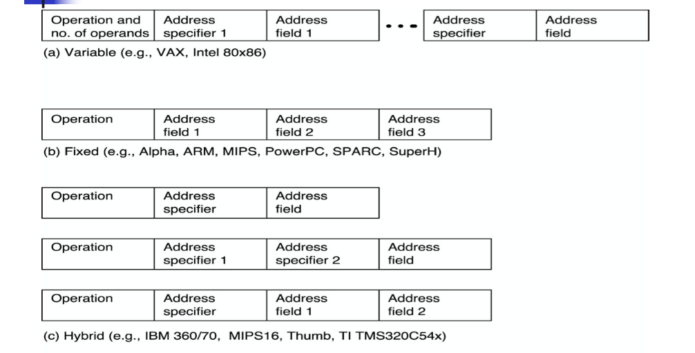

CA Appendix A. Instruction Set Principles

<!--more-->

## Instruction Set Architecture 

> SW Programmer's View
- Instruction set architecture is the structure of a computer that a machine language programmer must understand to write a correct (timing independent) program for that machine.

> HW Programmer's View
- The instruction set architecture is also the machine description that a hardware designer must understand to design a correct implementation of the computer.

### Evolution of Instruction Sets

> Today: CISC VS. RISC

> GPR(Generalize Purposed Register) VS. Stack Architecture

- Design decisions must take into account: 
  - technology
    > A case in point: the memory performance used to exceed computation, which is a major cause for the difference of today's architecture VS past
  - machine organization
  - programming languages 
  - compiler technology
  - operating systems
    > The existing SW ecosystem also affects the ISA (mutually)

### Classifying ISAs

- Data movement instructions
  - Move data from a memory location or register to another memory location or register without changing its form 
  - `Load`—source is memory and destination is register
  - `Store`—source is register and destination is memory
- Arithmetic and logic (ALU) instructions
  - Change the form of one or more operands to produce a result stored in another location 
  - `Add`, `Sub`, `Shift`, etc.
- Branch instructions (control flow instructions)
  - Alter the normal flow of control from executing the next instruction in sequence
  - `Br` `Loc`, `Brz` `Loc2`,—unconditional or conditional branches

#### Stack Architecture

- Instruction Set
  - `add, sub, mult, div,...,  push A, pop A`
- Example: `A*B - (A+C*B)`
  - 

- Benefits:
  - Code density
    > Since the middle result will be stored in a fixed location, doesn't have to be specified in the code
  - Low hardware requirements
  - Easy to write a simpler compiler for stack architectures
- Cons:
  - Stack becomes the bottleneck
  - *Little ability for parallelism or pipelining*
    > The stack will always be the critical hardware
  - Data is not always at the top of stack when need, so additional instructions like `TOP` and `SWAP` are needed
  - Difficult to write an optimizing compiler for stack architectures

#### Accumulator Architecture

- `ALU` + 1 fixed `reg` + memory
- Instruction set:
  - `add A, sub A, mult A, div A, ... load A, store A`
- Example
  

- Pros
  - Very low hardware requirements
  - Easy to design and understand 
- Cons
  - Accumulator becomes the bottleneck
  - Little ability for parallelism or pipelining 
  - High **memory traffic**

#### Memory Memory Architecture

- Pros
  - Requires fewer instructions (especially if 3 operands) 
  - Easy to write compilers for (especially if 3 operands)
- Cons
  - **Very high memory traffic** (especially if 3 operands)
    > incompatible clock cycles (issues like worst case design, ...)
  - Variable number of clocks per instruction (especially if 2 operands)
  - With two operands, more data movements are required

#### Register-Memory Architectures

By limiting memory access to single operand, reduce memory traffic

- Pros
  - Some data can be accessed without loading first 
  - Instruction format _easy to encode_
  - Good code density
- Cons
  - Operands are not equivalent (poor orthogonality)
    > Operand can either be register or memory address
  - **Variable number of clocks per instruction**
    > But better with restriction of single memory operand
  - May limit number of registers
    > in CPU, a register needs about 20~ gates to implement
    > a CPU has a typical number of 30~ registers (according to experience/prevalence/tradition)
    > more, increasing costs
    > if we want more, cache would be an alternative
    > GPU design is an exception

#### Load Store Architectures

No more direct access to memory, (RISC)

- Pros
  - Simple, *fixed length* instruction encoding 
  - Instructions take similar number of cycles 
  - Relatively easy to pipeline
- Cons
  - Higher instruction count
  - Not all instructions need three operands 
  - _Dependent on good compiler_
  > Used to be considered a cons, but now it turns out to be a pros, since compiler can also do optimization

#### Registers: Advantages and Disadvantages
- Advantages
  - Faster than cache (no addressing mode or tags) 
  - Deterministic (no misses)
  - Can *replicate (multiple read ports)*
  - Short identifier (typically 3 to 8 bits)
  - Reduce memory traffic
- Disadvantages
  - Need to save and restore on procedure calls and context switch
    > a great overhead for context switch
    > in GPU architecture, the overhead for context switch is very low
    > since the register files are in great amount
    > when switching, use another block of register files
  - Can’t take the address of a register (for pointers)
  - Fixed size (can’t store strings or structures efficiently)
  - Compiler must manage

###  Real Machines Are Not So Simple
- Most real machines have a mixture of 3, 2, 1, 0, and 1- address instructions
- A distinction can be made on whether arithmetic instructions use data from memory
- If ALU instructions only use registers for operands and result, machine type is load-store
  - Only load and store instructions reference memory
- Other machines have a mix of register- memory and memory-memory instructions

## Types of Addressing Modes (VAX)

> Immediate & Displacement are most common addressing modes

> By statiscally analyzing the frequency of different types of instructions, we can guide our design of instructions & their implementations

## Instruction Set Encoding

## Compilers and ISA

- Compiler Goals
  - All correct programs compile correctly
  - Most compiled programs execute quickly 
  - Most programs compile quickly
    > Growing importance in mobile devices concerning ai applications
    > trade-off between variety and utility
  - Achieve small code size
  - Provide debugging support
- Multiple Source Compilers
  - Same compiler can compiler different languages
- Multiple Target Compilers
  - Same compiler can generate code for different machines

###  Allocation of Variables
- Stack
  - used to allocate local variables
  - grown and shrunk on procedure calls and returns
  - register allocation works best for stack-allocated objects
- Global data area
  - used to allocate global variables and constants
  - many of these objects are arrays or large data structures
  - impossible to allocate to registers if they are aliased 
- Heap
  - used to allocate dynamic objects
  - heap objects are accessed with pointers 
  - never allocated to registers

### Designing ISA to Improve Compilation

- Provide enough general purpose registers to ease register allocation ( more than 16).
- Provide regular instruction sets by keeping the operations, data types, and addressing modes orthogonal.
- Provide primitive constructs rather than trying to map to a high-level language.
- Simplify trade-off among alternatives.
- Allow compilers to help make the common case fast.

## ISA Metrics

- Orthogonality
  - No special registers, few special cases,
  > For compiler purpose
  - all operand modes available with any data type or instruction type
- Completeness
  - Support for a wide range of operations and target applications 
- Regularity
  - No overloading for the meanings of instruction fields
- StreamlinedDesign
  - Resource needs easily determined. Simplify tradeoffs.
- Ease of compilation(programming?),Ease of implementation, Scalability

### Design Space of ISA

Five Primary Dimensions
- Number of explicit operands 
- Operand Storage
- Effective Address
- Type & Size of Operands
  > In AI processors, inference-used variables will not use double floating points
- Operations
Other Aspects
- Successor
- Conditions determined?
- Encodings 
- Parallelism

## Datapath vs Control

> The simplest implementation of a chip

> When we want to support generalization ability, Finite Automata is not enough, we need to introduce **instructions**

## Approaching an ISA

- Instruction Set Architecture
  > We can design domain-specific ISAs, e.g. AI, graphic, mobiles, 5G, ... 算法指令化
  - Defines set of operations, instruction format, hardware supported data types, named storage, addressing modes, sequencing
- Meaning of each instruction is described by RTL(register transfer language) on *architected registers* and memory （硬件前端设计）
> Another parallel path is SW-specific, e.g. writing compilers to exploit the HW you have designed
- Given technology constraints, assemble adequate **datapath**
  - Architected storage mapped to actual storage
  - Function Units (FUs) to do all the required operations
  - Possible additional storage (eg. Internal registers: MAR, MDR, IR, ...{Memory Address Register, Memory Data Register, Instruction Register}
  - Interconnect to move information among registers and function units
- Map each instruction to a sequence of RTL operations
- Collate sequences into symbolic controller state (transition diagram (STD状态机))
- Lower symbolic STD to control points 
- Implement controller