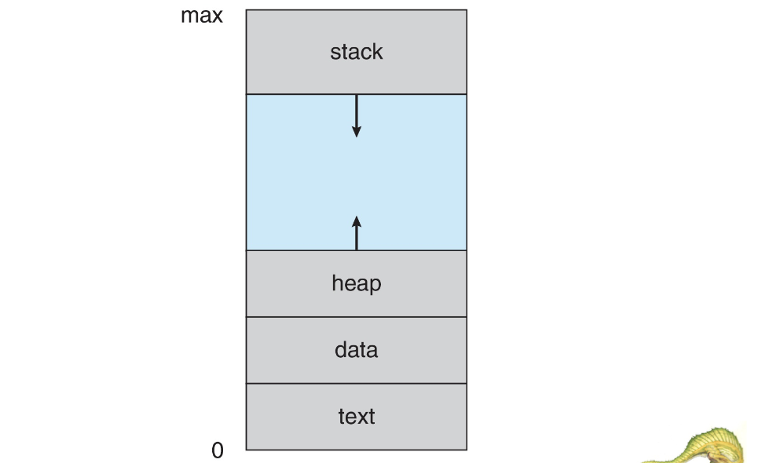
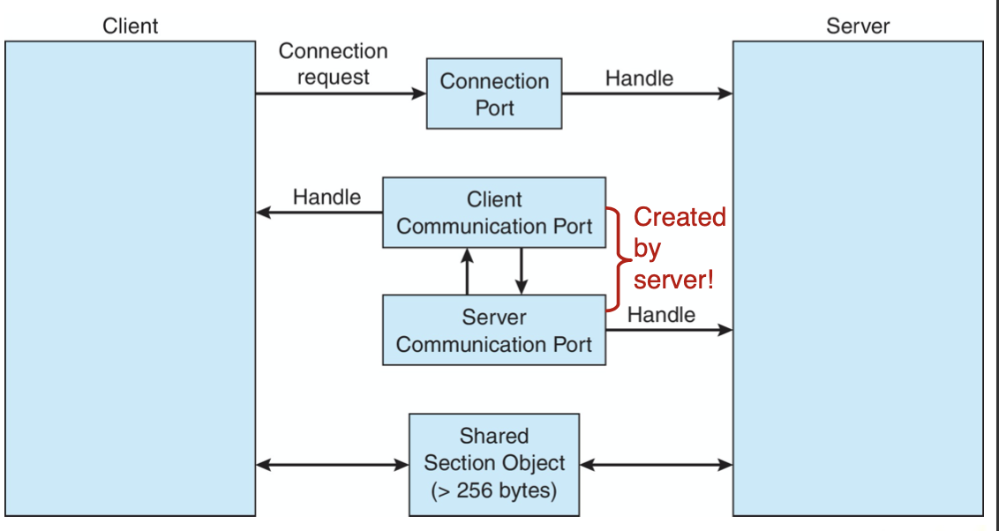

# OS3 - Processes

<!-----
title: 【System Engineering】OS3 - Processes
url: se2-process
date: 2020-10-16 15:09:19
tags: 
- System Engineering

categories: 
- Courses

----->


<!--more-->

[[toc]]


## Process Concept

- **Process** - a program in execution, must progress in sequential fashion
  > A dynamic concept
- Compositions
  - **text section** the program code
  - current activity such as **program counter**, registers
  - **Stack** containing temporary data
    - args, ret add, local vars
  - **Data section** containing global variables
  - **Heap** containing memory dynamically allocated during run time

- Program is passive entity stored on disk **(executable file)**; process is **active**
  - Program becomes process when executable file loaded into memory
- Execution of program started via GUI mouse clicks, command line entry of its name, etc.
- One program can be several processes
  - Consider multiple users executing the same program


### Memory Layout of a process


> The more related to user-defined program, the higher its addresses are.
> Since stack and heap data are determined during runtime, such implementation can avoid overflow AMAP


### Process State
> It is necessary for us to know the status of the process to manage them well

- As a process executes, it changes state
  - New: The process is being created
  - Running: Instructions are being executed
  - Waiting: The process is waiting for some event to occur
    > waiting for I/O, interrupts, ... (to notify that CPU doesn't need to schedule me)
  - Ready: The process is waiting to be assigned to a processor
    > To tell CPU to schedule
  - Terminated: The process has finished execution

> The only entry to running is that CPU schedules the process from ready state

### Process Control Block

Information associated with each process (also called **task control block**)
- Process state – running, waiting, etc
- Program counter – location of instruction to next execute
- CPU registers – contents of all process- centric registers
- CPU scheduling information- priorities, scheduling queue pointers
- Memory-management information – memory allocated to the process
  > No overlap between processes
- Accounting information – CPU used, clock time elapsed since start, time limits
- I/O status information – I/O devices allocated to process, list of open files

> Note the difference between **THREADS** and **PROCESSES**

### Threads
- Consider having _multiple program counters_ per process
- So far, process has a single thread of execution
  - Multiple locations can execute at once
    - Multiple threads of control -> threads
- Must then have storage for thread details, multiple program counters in PCB
- Explore in detail in Chapter 4

### Process Representation in Linux


> `*parent` e.g. `CUI`,`GUI`, etc
> The scheduling algorithm will run based on the information above


## Process Scheduling

- Maximize CPU use, quickly switch processes onto CPU core
- **Process scheduler** selects among available processes for next execution on CPU core
- Maintains **scheduling queues** of processes
  - **Ready queue**– set of all processes residing _in main memory, ready and waiting to execute_
  - **Wait queues** – set of processes waiting for an event (i.e. I/O)
  - Processes migrate among the various queues
> Implemented in Linked-lists of `struct task_struct`

> The algorithm may look through the queue, find the next process to dispatch (e.g. process that has run the least of time)


> Such patterns apply to a variety of strategies, such as parent-child processes, interrupts
> Alternate implementation is that we can maintain multiple types of queues (e.g. IO queue, ...)

### Context Switch


> CPU switch will creates overhead (idling)
> don't abuse switch

- The more complex the OS and the PCB $\implies$ the longer the context switch
> Beacuse the **load/store PCB** information will increase
> Some (microkernel-) OS will reduce the scale of kernel, to improve performance, so that less information can be maintained about the switching context
> May trigger processor idle

- Time dependent on hardware support
  - Some hardware provides multiple sets of registers per CPU $\implies$ multiple contexts loaded at once
    > Essential for multi-x systems

### Multitasking on Mobile Systems

- Some mobile systems (e.g., early version of iOS) allow only one process to run, others suspended
- Due to screen real estate, user interface limits iOS provides for 
  - Single foreground process- controlled via user interface
  - Multiple background processes– in memory, running, but not on the display, and with limits
  - Limits include single, short task, receiving notification of events, specific long-running tasks like audio playback
- Android runs foreground and background, with fewer limits
  - Background process uses a service to perform tasks
  - Service can keep running even if background process is suspended
  - Service has no user interface, small memory use


## Operations on Processes

### Process Creation

- **Parent** process create **children** processes, which, in turn create other processes, forming a **tree** of processes
- Generally, process identified and managed via a **process identifier (pid)**
- Resource sharing options
  > Different OS has different options
  - Parent and children share all resources
  - Children share subset of parent’s resources 
  - Parent and child share no resources
- Execution options
  > Similarly, options
  - Parent and children execute concurrently
  - Parent waits until children terminate


> Linux will handle memory allocation in `fork()`, while windows doesn't
> In the program body between `fork()` and `wait()`, the same program code will be executed in parallel, so **branching**`pid =? 0` is required in order to distinguish between the parent/child process


### Process Termination

- Process executes last statement and then asks the operating system to delete it using the `exit()` system call.
  > In linux, `exit()` will be appended automatically
  - Returns status data from child to parent (via `wait()`)
  - Process’ resources are deallocated by operating system
- Parent may terminate the execution of children processes using the `abort()` system call. Some reasons for doing so:
  - Child has exceeded allocated resources
  - Task assigned to child is no longer required
  - The parent is exiting and the operating systems does not allow a child to continue if its parent terminates
  > Only parent can `abort` its child process, child process can't `abort` other processes

#### Cascading Termination
- Some operating systems do not allow child to exists if its parent has terminated. If a process terminates, then all its children must also be terminated.
  - **cascading termination**. All children, *grandchildren*, etc. are terminated.
  - The termination is initiated by the OS.
  > By default in C run-time library
- The parent process may wait for termination of a child process by using the  `wait()` system call.The call returns status information and the pid of the terminated process
  `pid = wait(&status);`
> What if the parent process doesn't call `wait()`?
> OS will take care
- If no parent waiting (did not invoke` wait()`) process is a **zombie** *(during which time some/all resources of the child may have been deallocated)*
  - Child exists with deallocation of resources, but the state is still in the table.
  - Once parent calls `wait()`, pid and table entry are released
- If parent terminated *(for various reasons)* without invoking wait , process is an **orphan**
  - Init (in Unix) inherits orphan and periodically calls `wait()`
  - Systemd (in Linux) and other process can inherit


### Android Process Importance Hierarchy

- Mobile operating systems often have to terminate processes to reclaim system resources such as memory. From **most** to **least** important:
  - Foreground process 
  - Visible process
  - Service process
  - Background process 
  - Empty process
- Android will begin terminating processes that are least important.

### Multiprocess Architecture – Chrome Browser
- Many web browsers ran as single process (some still do)
  - If one website causes trouble, entire browser can hang or crash
- Google Chrome Browser is **multiprocess** with 3 different types of processes:
  > Unlike traditional IE
  - **Browser** process manages UI,disk and network I/O 
  - **Renderer** process renders web pages, deals with HTML, JS. A new renderer created for *each website opened*
    > Security matters
    - Runs in **sandbox** restricting disk and network I/O, minimizing effect of security exploits
  - **Plug-in** process for each type of plug-in
> Benefit: fast, the failure for one opened website won't affect others


## Interprocess Communication

- Processes within a system may be _***independent***_ or _***cooperating***_
- Cooperating process can affect or be affected by other processes, including sharing data
- Reasons for cooperating processes:
  - Information sharing
  - Computation speedup by parallel execution 
  - Modularity for system structure
  > Especially for microkernel-OS
  - Convenience
- Cooperating processes need **interprocess communication (IPC)**
- Two models of IPC
  - **Shared memory**
  - **Message passing**
  > Different usage/characteristics


## IPC in Shared-Memory Systems

- An area of memory shared among the processes that wish to communicate
- The communication is under the control of the users processes not the operating system.
- Major issues is to provide mechanism that will allow the user processes to synchronize their actions when they access shared memory.
- **Synchronization** is discussed in great details in Chapters 6 & 7.
> i.e. consistency of data, no RAW,WAW,... conflicts

### Producer-Consumer Problem

- Paradigm for cooperating processes, producer process produces information that is consumed by a consumer process
  > interpretation: consumer want the data at exact time, doen't care what it will become after/before demanding
  - **unbounded-buffer** places no practical limit on the size of the buffer
  - **bounded-buffer** assumes that there is a fixed buffer size
  > the data produced is upper bounded by the buffer size

### Bounded Buffer

Shared data:
```C
#define BUFFER_SIZE 10
typedef struct {
  ...
} item;

item buffer[BUFFER_SIZE];
int in = 0; // where to write
int out = 0; // where to read
```

`in == out` implies that the buffer is empty
The implementation of producer process, when `in == out`, an empty loop body is stored
```C
item next_consumed;

while (true) {
    while (in == out)
        ; /* do nothing */
    next_consumed = buffer[out];
    out = (out + 1) % BUFFER_SIZE;
    
    /* consume the item in next consumed */
}
```

The implementation of consumer process
```C
item next_produced;
while (true) {
    /* produce an item in next_produced */
    
    while (((in + 1) % BUFFER_SIZE) == out)
        ; /* do nothing */
    buffer[in] = next_produced;
    in = (in + 1) % BUFFER_SIZE;
}
?
```


## IPC in Message-Passing Systems
- Mechanism for processes to communicate and to synchronize their actions
- Message system – processes communicate with each other without resorting to shared variables
- IPC facility provides two operations:  
  - `send(message)`
  - `receive(message)`
- The message size is either fixed or variable
- If processes P and Q wish to communicate, they need to: 
  - Establish a communication link between them
  - Exchange messages via send/receive
- Implementation issues:
  - How are links established?
  - Can a link be associated with more than two processes?
  - How many links can there be between every pair of communicating processes?
  - What is the capacity of a link?
  - Is the size of a message that the link can accommodate fixed or variable?
  - Is a link unidirectional or bi-directional?
- Implementation of communication link 
  - Physical:
    - Shared memory 
    - Hardware bus 
    - Network
  - Logical:
    - Direct or indirect
    - Synchronous or asynchronous 
    - Automatic or explicit buffering

### Direct Communication
- Processes must name each other explicitly:
  - `send (P, message)` – send a message to process P
  - `receive(Q, message)` – receive a message from process Q
- Properties of communication link
  - Links are established automatically
  - A link is associated with **exactly one pair** of communicating processes
  - Between each pair there exists exactly one link
  - The link may be unidirectional, but is usually bi-directional

### Indirect Communication
- Messages are directed and received from mailboxes (also referred to as ports)
  - Each mailbox has a unique id
  - Processes can communicate only if they share a mailbox 
- Properties of communication link
  - Link established only if processes **share a common mailbox**
  - A link may be associated with many processes
  - Each pair of processes may share several communication links
  - Link may be unidirectional or bi-directional
- Operations
  - create a new mailbox (port)
  - send and receive messages through mailbox 
  - destroy a mailbox
- Primitives are defined as:
  - `send(A, message)` – send a message to mailbox A 
  - `receive(A, message)` – receive a message from mailbox A

### Synchronization
> Two kinds, blocking/synchronous VS non-blocking/asynchronous
- Message passing may be either blocking or non-blocking
- Blocking is considered synchronous
  - Blocking send -- the sender is **blocked until** the message is received
  - Blocking receive -- the receiver is **blocked until** a message is available
- Non-blocking is considered asynchronous
  - Non-blocking send -- the sender sends the message and continue
  - Non-blocking receive -- the receiver receives:
    - A valid message, or
    - Null message
- Different combinations possible
  - If both send and receive are blocking, we have a rendezvous *交会，an easy solution to producer-consumer model*
```Cpp
/** producer */
message next_produced;
while (true) {
    /* produce an item in next_produced */

    send(next_produced)
}

/** consumer */
message next_consumed;
while (true) { 
  receive(next_consumed)
  
  /* consume the item in next_consumed */ }
}
```


### Buffering
- Queue of messages attached to the link. 
- Implemented in one of three ways
  1. Zero capacity – no messages are queued on a link. Sender must wait for receiver (*rendezvous*)
  2. Bounded capacity – finite length of n messages Sender must wait if link full
  3. Unbounded capacity – infinite length Sender never waits


## Examples of IPC Systems

### POSIX

- Process first *creates* shared memory segment
  - `shm_fd = shm_open(name, O CREAT | O RDWR, 0666);`
  - Also used to *open an existing segment*
- Set the size of the object `ftruncate(shm_fd, 4096)`;
- Use `mmap()` to memory-map a file pointer to the shared memory object
  - Reading and writing to shared memory is done by using the pointer returned by `mmap()`.

| Producer | Consumer |
| -------- | ------- |
|  |   |

### MACH

> microkernel, system calls are messages
> Meant for server tasks
> Typical mailbox implementation
- Even system calls are messages
- Each task gets two ports at creation- Kernel and Notify
- Messages are sent and received using the `mach_msg()` function
- Ports needed for communication, created via `mach_port_allocate()`
- Send and receive are flexible, for example four options if mailbox full:
  - Wait indefinitely until there is room in the queue 
  - Wait at most n milliseconds
  - Return immediately
  - Temporarily cache a message 3.51

| Server | Client |
| -------- | ------- |
|  |  |


### Windows
> Message-passing centric via **advanced local procedure call (LPC) facility**
> denote Client-Server as communication participaters
- Only works for processes on the same system
- Uses ports (*AKA handlers,* like mailboxes) to establish and maintain communication channels
- Communication works as follows:
  - The client opens a handle to the subsystem’s connection port object.
  - The client sends a connection request.
  - The server creates two private communication ports and returns the handle to one of them to the client.
  - The client and server use the corresponding port handle to send messages or callbacks and to listen for replies.


> because server has the right to determine whether to build the connection or not


## Communication in Client-Server Systems


### Pipes
> An early form, usually for processes on the same system

- **Ordinary pipes** – cannot be accessed from outside the process that created it. Typically, a parent process creates a pipe and uses it to communicate with a child process that it created.
- **Named pipes** – can be accessed without a parent-child relationship.

#### Ordinary Pipes


- Ordinary Pipes allow communication in standard producer- consumer style
- Producer writes to one end (the write-end of the pipe)
- Consumer reads from the other end (the read-end of the pipe)
- Ordinary pipes are therefore unidirectional
- Require parent-child relationship between communicating processes
  
- In Unix, chine process automatically inherent a pipe created by parent
- Windows calls these anonymous pipes

#### Named Pipes

- Named Pipes are more powerful than ordinary pipes
- Communication is bidirectional
- No parent-child relationship is necessary between the communicating processes
- Several processes can use the named pipe for communication
- Provided on both UNIX and Windows systems
- What if parent needs to communicate child process in Windows?
  > Use name pipe by redirecting child's handle for standard I/O to the read/write handle of the pipe


> What if communication is not performed on the same system?
### Sockets

- A **socket** is defined as an endpoint for communication
- Concatenation of IP address and **port** – a number included at start of message packet to differentiate network services on a host
- The socket 161.25.19.8:1625 refers to port 1625 on host 161.25.19.8
- Communication consists between a pair of sockets
- All ports below 1024 are **well known**, used for standard services
  - e.g. `ssh`, `ftp`
- Special IP address 127.0.0.1 (**loopback**) to refer to system on which process is running


#### Socket Types
- Three types of sockets
  - Connection-oriented (TCP)
    - by creating connection, handshaking, ...
  - Connectionless (UDP)
    - `ping`
  - MulticastSocket class– data can be sent to multiple recipients

#### Socket Usage

| Server | Client |
| -------- | ------- |
|  |  |


### Remote Procedure Calls
- Remote procedure call (RPC) abstracts procedure calls between processes on networked systems
  - Again uses ports for service differentiation
- **Stubs** – client-side proxy for the actual procedure on the server
  > a "proxy" to cover up the different configurations between systems
  - The client-side stub locates the server and **marshalls** the parameters
  - The server-side stub receives this message, unpacks the marshalled parameters, and performs the procedure on the server
- On Windows, stub code compile from specification written in **Microsoft Interface Definition Language (MIDL)**
- Data representation handled via **External Data Representation (XDL)** format to account for different architectures
  - **Big-endian** and **little-endian**
  - Architectures ...
- Remote communication has *more failure scenarios* than local
  - Messages can be delivered 
    - exactly once _*Periodical RPC until ACK*_
    - at most once _*Using Timestamp*_
    > so that correcting instructions can be resent if detected
- Binding: name of procedure call – address of the call. How does client know the port numbers on server?
  - Static: fixed por tnumber
  - Dynamic: Os typically provides a rendezvous or matchmaker service to connect client and server


