<!--more-->

## Introduction
1. Programmers want unlimited amounts of memory with low latency
2. Fast memory technology is more expensive per bit than slower memory
3. Solution: organize memory system into a hierarchy
4. Temporal and spatial locality insures that nearly all references can be found in smaller memories

- Memory Performance Gap
- Memory hierarchy design becomes more crucial with recent multi-core processors
  - 400 GB/s CPU bandwidth VS 25GB/s DRAM bandwidth
- Power and Performance
  - High-end microprocessors have >10 MB on-chip cache
  - Consumes large amount of area and power budget
  > The larger the cache, the more power required

## Memory Hierarchy Basics

- When a word is not found in the cache, a miss occurs:
  - Fetch word from lower level in hierarchy, requiring a higher latency reference
  - Lower level may be another cache or the main memory
  - Also fetch the other words contained within the block
    - Takes advantage of spatial locality
  - Place block into cache in any location within its **set** *(groups of blocks to facilitate indexing)*, determined by address
    - block address MOD number of sets

- Block Organization
  - n sets => n-way set associative
  - Direct-mapped cache => one block per set 
  - Fully associative => one set
  > Typically, within set, fully associative

- Writing to cache: two strategies
  > Cache coherence
  - Write-through
    - Immediately update lower levels of hierarchy
  - Write-back
    - Only update lower levels of hierarchy when an updated block is replaced
  - Both strategies use **write buffer** to make writes asynchronous

- Miss rate
  - Fraction of cache access that result in a miss

- Causes of misses 
  - **Compulsory** First reference to a block 
  - **Capacity** Blocks discarded and later retrieved
  > come with compulsory miss
  - **Conflict** Program makes repeated references to multiple addresses from different blocks that map to the same location in the cache

$$
\frac{Misses}{Instructions} = \frac{MissRate\times TotalMemoryAccessCnt}{InstructionCount} = MissRate\times  \frac{MemoryAccess}{Instruction} (\leftarrow \text{can be statically analyzed})
$$

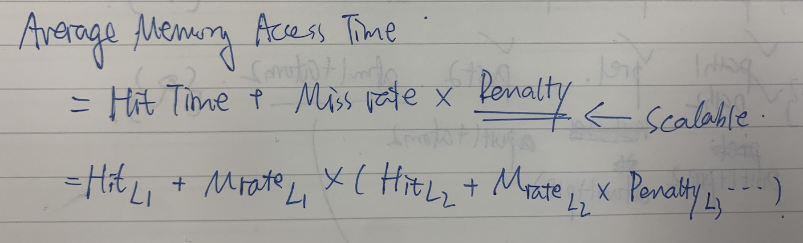

Note that speculative and multithreaded processors may execute other instructions during a miss

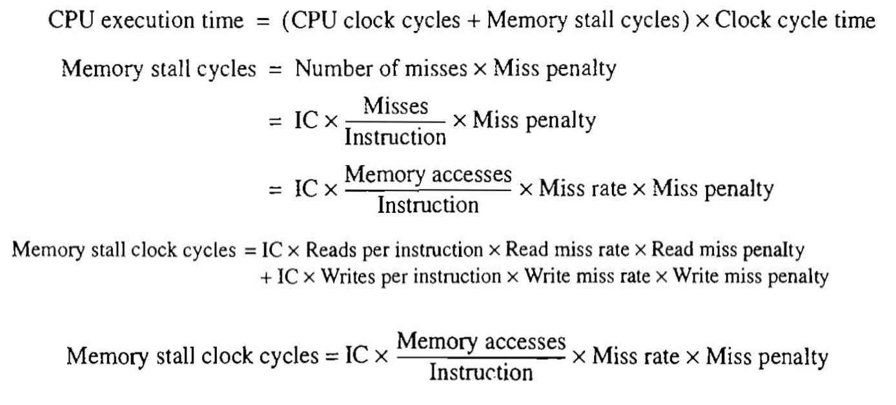

## Block 

> Word is not the basic unit of cache, but block

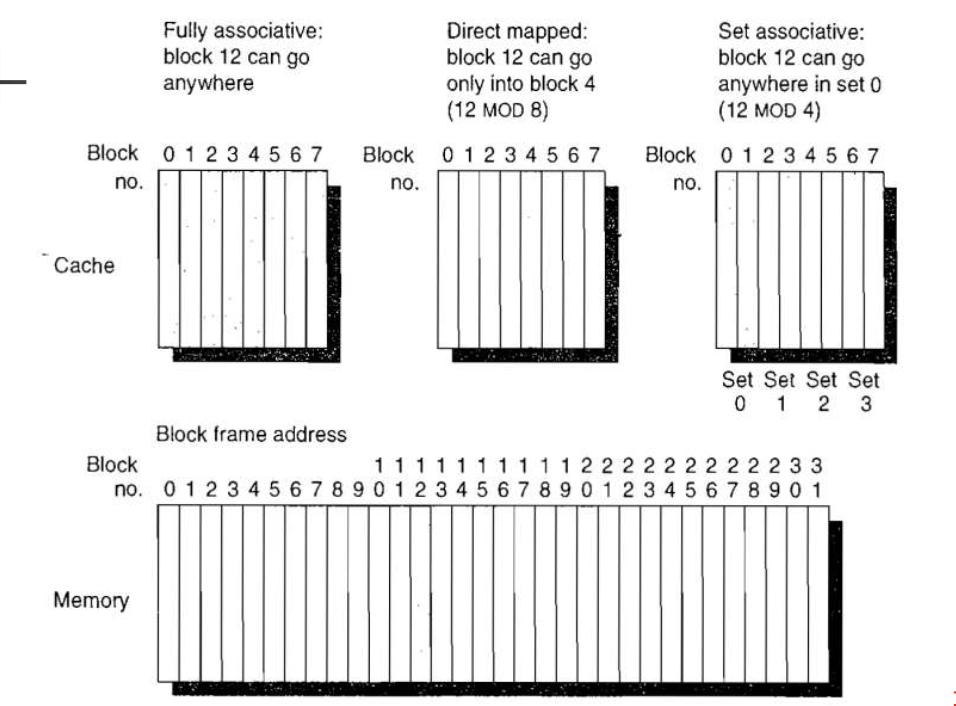

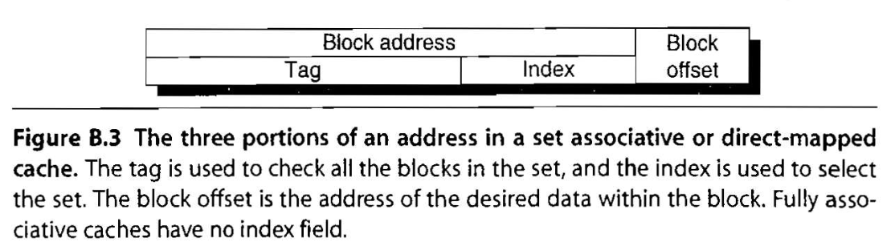

### Cache Miss?
- Random
- Least Recently Used (LRU)
- First In, First Out

### Write?
- Block in cache
  - Write Through
  - Write Back
- Block not in cache
  - Write Allocate (the block is allocated on a write miss)
  - No-Write Allocate

### Miss Latency

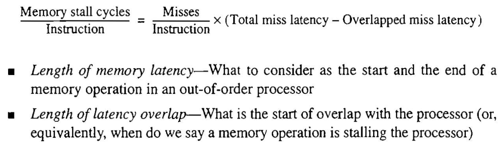

## Six Basic Cache Optimization

$$
\text{Average Memory Access Time} = \text{Hit Time} + \text{Miss Rate} \times \text{Miss Penalty}
$$

### Perspectives

> From the formula
1. Reducing the miss rate
   - Larger Block Size
   - Higher Associativity
   - Larger Cache Size
2. Reducing the miss penalty
   - Multilevel Caches and giving reads priority over writes
3. Reducing the time to hit in the cache
   - Avoid address translation when indexing the cache
> Other Techniques
4. Compulsory
   - The very first access to a block cannot be in the cache, so the block must be brought into the cache. **Cold-start** misses or first reference misses
5. Compulsory
   - Substitutions when the program requirement > cache size
6. Conflict
   - **collision misses:** a block may be discarded and later retreived

### Optimization Strategys

- Larger block size
  - Reduces compulsory misses
  - Increases capacity and conflict misses, increases miss penalty
- Larger total cache capacity to reduce miss rate
  - Increases hit time, increases power consumption
- Higher associativity
  - Reduces conflict misses
  - Increases hit time, increases power consumption
- Higher number of cache levels
  - Reduces overall memory access time
- Giving priority to read misses over writes 
  - Reduces miss penalty
- Avoiding address translation in cache indexing 
  - Reduces hit time

### Advanced Optimizations
1. Small and simple first level caches
   - Critical timing path
     > How long a cycle should be
   - Direct-mapped caches can overlap tag compare and transmission of data
   - lower associativity reduces power because fewer cache lines are accessed
   > Consider **Time** and **Energy**
   > 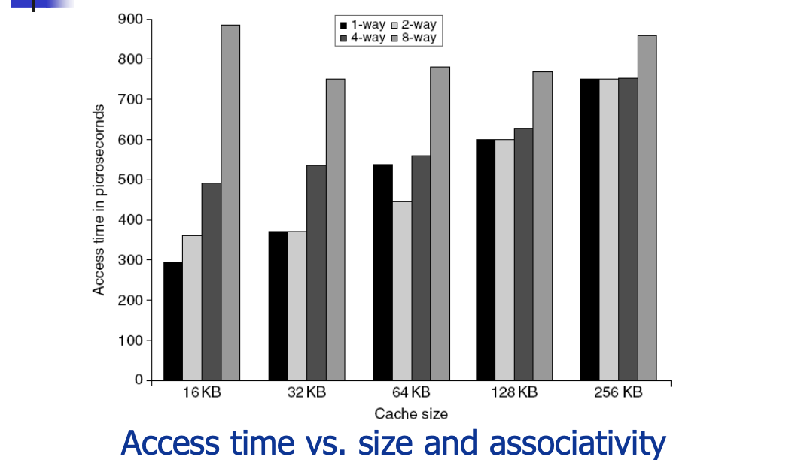 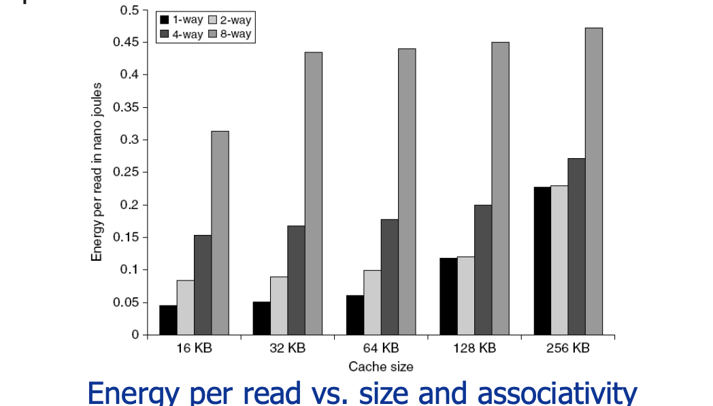
2. Way prediction
   > The cost of comparing tags can be costly
   - To improve hit time, predict the way to pre-set mux
     - Mis-prediction gives longer hit time
     - Prediction accuracy
       - 90% for two-way
       - 80% for four-way
     - **I-cache has better accuracy**(Better Locality) than D-cache
     - First used on MIPS R10000 in mid-90s 
     - Used on ARM Cortex-A8
   - Extend to predict block as well
   > I.e. when finding data in the set
     - “Way selection”
     - Increases mis-prediction penalty
3. Pipelining Cache
   > Don't have to wait until the data has been completely accessed
   - Pipeline cache access to improve bandwidth
   - Examples:
     - Pentium: 1 cycle
     - Pentium Pro – Pentium III: 2 cycles 
     - Pentium 4 – Core i7: 4 cycles
   - Increases branch mis-prediction penalty 
   - Makes it easier to increase associativity
4. Nonblocking Caches
   > Previous misses shouldn't block later hits
   - Allow hits before previous misses complete
     - “Hit under miss”
     - “Hit under multiple miss”
   - L2 **must** support this
   > Since the penalty is costly
   - In general, processors can hide L1 miss penalty but not L2 miss penalty
5. Multibanked Caches
   - Organize cache as independent banks to **support simultaneous access**
   - ARM Cortex-A8 supports 1-4 banks for L2
   - Intel i7 supports 4 banks for L1 and 8 banks for L2
   - Interleave banks according to block address
   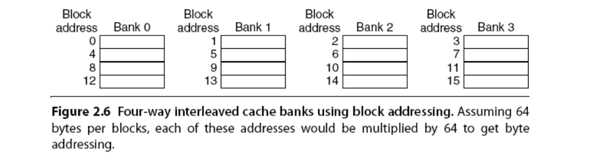
6. Critical Word First, Early Restart
   - Critical word first
     - Request missed word from memory first
     - Send it to the processor as soon as it arrives
     > Let CPU execution and cache replacement run parallel
   - Early restart
     - Request words in normal order
     - Send missed work to the processor as soon as it arrives
   - Effectiveness of these strategies depends on block size and likelihood of another access to the portion of the block that has not yet been fetched
7. Merging Write Buffer
   > Merge consecutive write-back requests, so that the write-back can be done in a single time
   - When storing to a block that is already pending in the write buffer, update write buffer
   - Reduces stalls due to full write buffer 
   - Do not apply to I/O addresses
   - 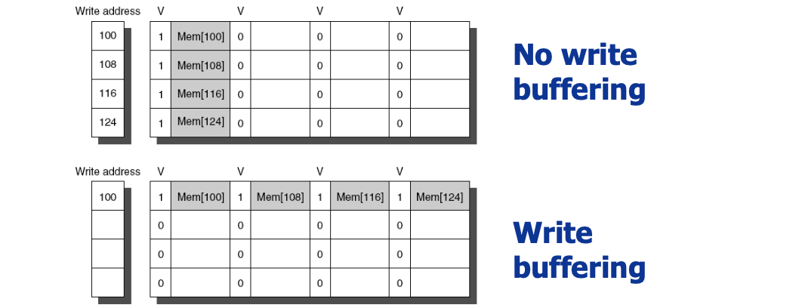
8. Compiler Optimization
   - Loop Interchange
     - Swap nested loops to access memory in sequential order 
   - Blocking *or Tiling*
     - Instead of accessing entire rows or columns, subdivide matrices into blocks
     - Requires more memory accesses but improves locality of accesses
9. Hardware Pre-Fetching
   - Fetch two blocks on miss(include next sequential block)
10. Compiler Pre-Fetching
    - Insert prefetch instructions before data is needed
    - Non-faulting: prefetch doesn’t cause exceptions
    - Register prefetch
      - Loads data into register
    - Cache prefetch
      - Loads data into cache
    - Combine with loop unrolling and **software pipelining**
    > SW pipelining: insert instructions between one memory write and another memory load (when it is likely that the memory will be reloaded and cause stalling)

### Summary

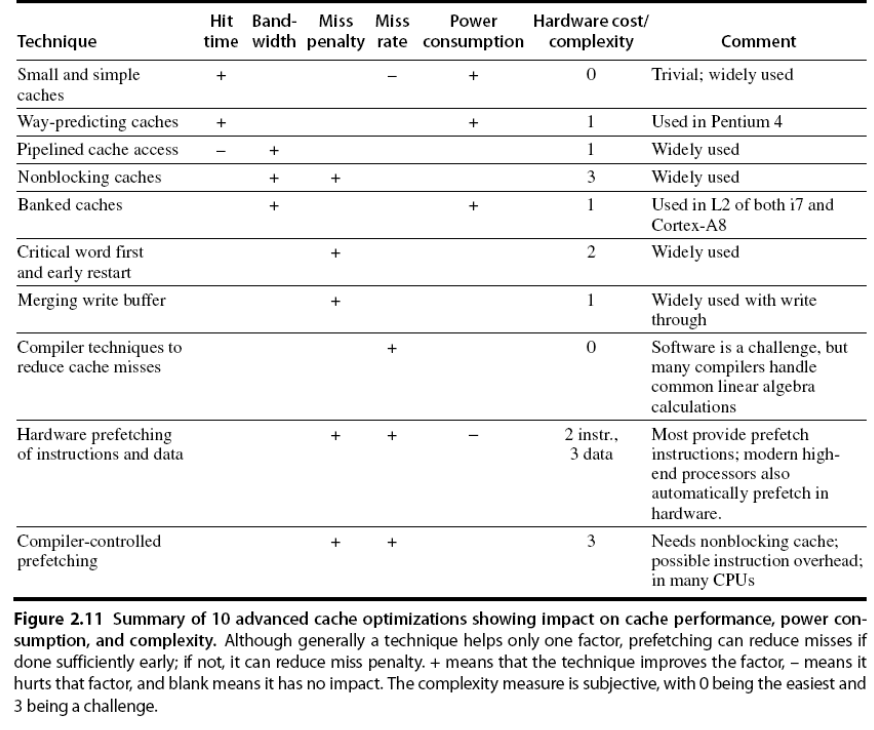

## Memory Technology

- Performance metrics
  - Latency is concern of cache
  - Bandwidth is concern of multiprocessors and I/O
  - Access time
    - Time between read request and when desired word arrives
  - Cycle time
    - Minimum time between unrelated requests to memory
- DRAM used for main memory, SRAM used for cache

### Types: SRAM and DRAM

- SRAM
  - Requires low power to retain bit
  - Requires 6 transistors/bit
- DRAM
  - **Must be re-written after being read**
    > Read is "destructive"
  - Must also be periodically refeshed
    - Every ~8ms
    - Each row can be refreshed simultaneously
  - One transistor/bit
  - Address lines are **multiplexed**:
    - Upper half of address: **row** access strobe (RAS)
    - Lower half of address: **column**(*segment*) access strobe (CAS)

### Optimization

1. Multiple accesses to same row
   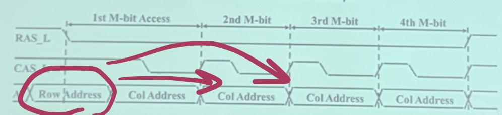
   > A SRAM under DRAM, to facilitate consecutive reading in the same row
   > 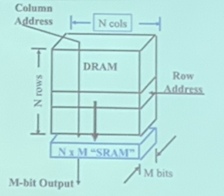
2. Synchronous DRAM
3. Added clock to DRAM interface
   > make the clock of the memory sync with the CPU, so that CPU can handle more
4. Burst mode with critical word first
5. Wider interfaces
   > wider interface
   > 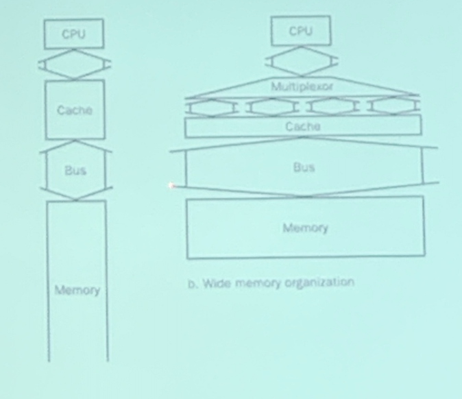
7. Multiple banks on each DRAM device
   > interleave, pipelining the bank, exploit the bandwidth of the bus
   > 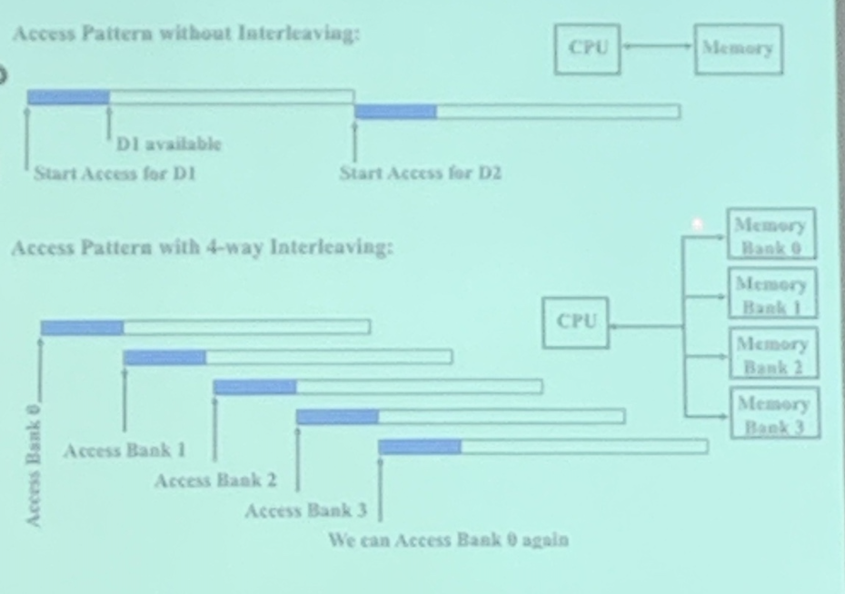
8. Double data rate (DDR)
   > Make use of the rising/downward edge (double edge) of the clock

## Flash Memory

- Type of EEPROM
- Must be erased (in blocks) before being overwritten
- Non volatile
- Limited number of write cycles
- Cheaper than SDRAM, more expensive than disk
- Slower than SRAM, faster than disk

## Memory Dependability

- Memory Dependability
- Memory is susceptible to cosmic rays
- Soft errors: dynamic errors
  - Detected and fixed by _error correcting codes_ (ECC)
  > Implemented in every memory
- Hard errors: permanent errors
  - Use sparse rows to replace defective rows
- Chipkill: a RAID-like error recovery technique

## Virtual Memory

> To facilitate VM, the hardware should provide some support (make sure independence)
- Protection via virtual memory
  - Keeps processes in their own memory space
- Role of architecture:
  - Provide user mode and supervisor mode
  - Protect certain aspects of CPU state
  - Provide mechanisms for switching between user mode and supervisor mode
  - Provide mechanisms to limit memory accesses
  - Provide TLB to translate addresses

Each guest OS maintains its own set of page tables
- VMM adds a level of memory between physical and virtual memory called “real memory”
- VMM maintains shadow page table that maps guest virtual addresses to physical addresses
  - Requires VMM to detect guest’s changes to its own page table
  - Occurs naturally if accessing the page table pointer is a privileged operation