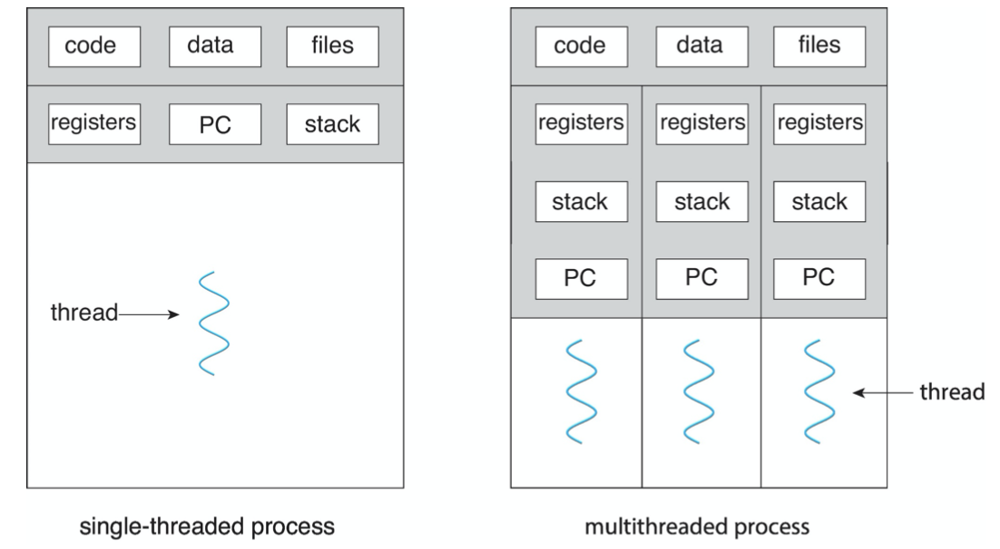
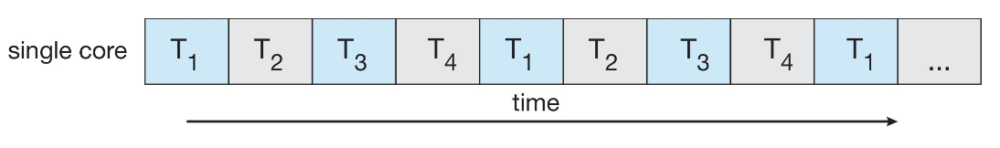
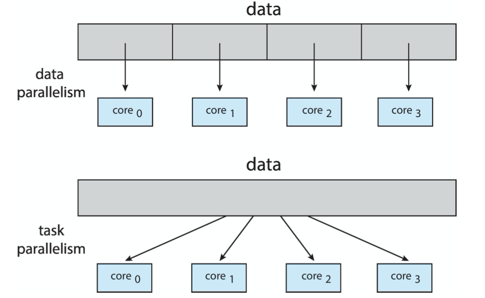

<!--more-->

[toc]

## Overview

### Motivation
- Most modern applications are multithreaded
- Threads run within application
- Multiple tasks with the application can be implemented by separate threads
  - Update display
  - Fetch data
  - Spell checking
  - Answer a network request
- Process creation is heavy-weight while thread creation is light-weight
> Chrome uses process to switch tabs, process is a heavier concept than thread
> Thousands of threads are OK, but not for process
- Can simplify code, increase efficiency
> To program processes, a lot more will need to be dealt with
- Kernels are generally multithreaded


> One major reason why thread is lighter than process is that more things are shared
> e.g. code, data, files.
> Recall: shared memory model VS message passing

For web servers, multi-threading is a must


### Benefits

- Responsiveness – may allow continued execution if part of process is blocked, especially important for user interfaces
  > e.g. for a multi-thread process, it will not easily get stuck
- Resource Sharing – threads share resources of process, easier than shared memory or message passing
- Economy – cheaper than process creation, thread switching lower overhead than context switching
- Scalability – process can take advantage of multicore architectures

## Multicore Programming

- **Multicore** or **multiprocessor** systems putting pressure on programmers, challenges include:
  - Dividing activities
  - Balance
  - Data splitting
  - Data dependency
  - Testing and debugging


### Concurrency VS Parallelism
- **Parallelism** implies a system can perform more than one task simultaneously
- **Concurrency** supports more than one task making progress 描述多个任务同时演进的现象，物理上可能不是同时执行
  - Single processor / core, scheduler providing concurrency
- Concurrent execution on single-core system
  
- Parallelism on a multi-core system
  


### Types of Parallelism
> Remember, the instructions should be similar in parallelism
- Data parallelism – distributes subsets of the same data across multiple cores, same operation on each
- Task parallelism – distributing threads across cores, each thread performing unique operation


### Amdahl's Law

- Identifies performance gains from adding additional cores to an application that has both serial and parallel components
- $S$ is serial portion
- $N$ processing cores
  $$
  speedup \le \frac{1}{S+\frac{1-S}{N}}
  $$
- That is, if application is $75\%$ parallel / $25\%$ serial, moving from 1 to 2 cores results in speedup of $1.6$ times
- As $N$ approaches infinity, speedup approaches $\frac{1}{S}$
  > A promising search area, use DNN(highly-parallelized) to reduce the serial portion(especially with random or probabilistic outputs) of an application
> Serial portion of an application has disproportionate effect on performance gained by adding additional cores
- But does the law take into account contemporary multicore systems?
   
### User Threads and Kernel Threads
- **User threads** - management done by user-level threads library
- Three primary thread libraries:
  - POSIX Pthreads
  - Windows threads
  - Java threads
- **Kernel threads** - Supported by the Kernel
- Examples – virtually all general purpose operating systems, including:
  - Windows 
  - Linux
  - MacOSX 
  - iOS
  - Android

## Multithreading Models
> User and kernel threads run in separate spaces, but **how they interact with each other**?


### Many-to-One 

- Many user-level threads mapped to single kernel thread
- One thread blocking **causes all to block**
- Multiple threads may not run in parallel on muticore system because only one may be in kernel at a time
- **Few** systems currently use this mode
> Despite simplicity in implementation, it fails to make use of the parallelisim provided by the OS
- Examples:
  - Solaris Green Threads 
  - GNU Portable Threads


### One-to-One

- Each user-level thread maps to kernel thread
- Creating a user-level thread creates a kernel thread
- More concurrency than many-to-one
- Number of threads per process sometimes restricted due to overhead
- Examples
  - Windows 
  - Linux
> Risk: user can create as many threads as they want, which may become an overhead to system


### Many-to-Many
- Allows many user level threads to be mapped to many kernel threads
  > Thread Pool
- Allows the operating system to create a sufficient number of kernel threads
  > OS create kernel threads as it demands, restrict the total number of use by user threads
- Windows with the *ThreadFiber* package
- Otherwise not very common


### Two Level Model

Similar to M:M, except that it allows a user thread to be bound to kernel thread


## Thread Libraries


- **Thread library** provides programmer with API for creating and managing threads
- Two primary ways of implementing
  - Library entirely in user space
  - Kernel-level library supported by the OS

### PThreads

- May be provided **either as user-level or kernel-level**
- A POSIX standard (IEEE 1003.1c) API for thread creation and synchronization
- **Specification, not implementation**
- API specifies behavior of the thread library, implementation is up to development of the library
- Common in UNIX operating systems (Linux & Mac OS X)


#### Generate multiple threads


### Java Threads

- Java threads are managed by the JVM
- Typically implemented using the threads model provided by underlying OS
- Java threads may be created by:
  - Extending Thread class
  - Implementing the Runnable interface
    ```Java
    public interface Runnable
    {
        public abstract void run()
    }
    ```
  - Standard practice is to implement Runnable interface


### Java Executor Framework
> Implicit multi-thread programming
- Rather than explicitly creating threads, Java also allows thread creation around the Executor interface:
  ```Java
  public interface Executor
  {
      void execute (Runnable command)l
  }
  ```
- The Executor is used as follows:
  ```Java
  Executor service = new Executor;
  service.execute(new Task());
  ```


## Implicit Threading

> To ensure safety, many libraries have been created to pack multi-threading, instead of programming with `pthread` from scratch, several libraries are provided as follows

- Growing in popularity as numbers of threads increase, program correctness more difficult with explicit threads
- Creation and management of threads done by compilers and run-time libraries rather than programmers
- Five methods explored 
  - Thread Pools
  - Fork-Join
  - OpenMP
  - Grand Central Dispatch
  - Intel Threading Building Blocks

### Thread Pools
> Correspond to many-to-many model, when users need a new thread, fetch them from the pool, instread of generating a new thread on call.
> In early versions of CUDA, multithreading (especially for multi kernel) can be costly (since all kernels will be rebooted), however, in modern architecture, multiple kernel can be retained on the processor (like thread pool), which improves the performance
- Create a number of threads in a pool where they **await** work
  > threads are precreated, might get better performance
- Advantages:
  - Usually **slightly faster** to a service a request with anexisting thread than creating a new thread
  - Allows the number of threads to be **bound** by the size of the pool
  - separating task to be performed from mechanics of creating task allows **different strategies** for running task
    - i.e.Tasks could be scheduled to run periodically
- Example:
  - Windows API
    
    > windows and linux typically provides one-to-one mapping of threads, however, you can use special techniques to write many-to-many models
  - Java Thread Pools
    
    

### Fork-Join Parallelism

- Multiple threads (tasks) are **forked**, and then **joined**.

  > Libraries like openMP can hinder the explicit fork and join instruction, but the underlying programming model is still fork-join
- General algorithm for fork-join strategy:
  > Serve as a basic template, the language may differ on different languages

- Sub threads can also fork, as a tree
  
  > (L->R fork)(R -> L join)Remember to join them back!
- A java example for summing array
  
  > The benefit of recursive thread implementation is that the divided taske can be executed parallelly (as long as there is multi-core)
  - The `ForkJoinTask` is an abstract base class
  - `RecursiveTask` and `RecursiveAction` classes extend `ForkJoinTask`
  - `RecursiveTask` returns a result (via the return value from the `compute()` method)
  - `RecursiveAction` does not return a result

### OpenMP
> Support Parallelism on compiler(detect parallelism statically) level (in addition to runtime library)
- Set of **compiler** directives and an API for C, C++, FORTRAN
- Provides support for parallel programming in shared- memory environments
- Identifies parallel regions – blocks of code that can run in parallel `#pragma omp parallel`
- Create as many threads as there are cores
- Run the for loop in parallel
  
  > Programmer should be aware how to exploit the parallelism potential of the code, e.g. within a for loop

### Grand Central Dispatch
> Unlike typical Linux and windows, use many-to-many
- Apple technology for macOS and iOS operating systems
- Extensions to C, C++ and Objective-C languages, API, and run-time library
- Allows identification of parallel sections
- Manages most of the details of threading
- Blockisin`“^{}”`:
  `ˆ{ printf("I am a block"); }`
- Blocks placed in dispatch queue
  - Assigned to available thread in **thread pool** when removed from queue
> Pool issues? request >  available pools?
- Two types of dispatch queues:
  - **serial** – blocks removed in FIFO order, queue is per process, called **main queue**
    - Programmers can create additional serial queues within program
  - **concurrent** – removed in FIFO order but _several may be removed_ at a time
  - Four system wide queues divided by quality of service: 
    - `QOS_CLASS_USER_INTERACTIVE` most timely
    - `QOS_CLASS_USER_INITIATED` long-term interaction with users
    - `QOS_CLASS_USER_UTILITY` less interactive
    - `QOS_CLASS_USER_BACKGROUND` least responsive
- For the Swift language a task is defined as a closure – similar to a block, minus the caret
- Closures are submitted to the queue using the `dispatch_async()` function:

```Swift
let queue = dispatch_get_global_queue
  (QOS_CLASS_USER_INITIATED,0)

dispatch_async(queue,{print("I am a closure")})
```

### Intel Threading Building Blocks (TBB)
> 库模板
- Template library for designing parallel C++ programs 
- A serial version of a simple for loop
  ```C
  for(int i=0; i<n;i++){
    apply(v[i]);
  }
  ```
- The same for loop written using TBB with `parallel_for` statement:
  ```
  parallel_for (size_t(0), n, [=](size_t i){apply (v[i]);});
  ```


## Threading Issues
- Semantics of fork() and exec() system calls 
  > Related discussion and controversy
- Signal handling
  - Synchronous and asynchronous 
- Thread cancellation of target thread
  - Asynchronous or deferred 
- Thread-local storage
- Scheduler Activations

### Semantics of fork() and exec()
- Does `fork()` duplicate only the calling thread or all threads?
  - Some UNIXes have two versions of fork
    - Duplicate all threads
    - Only duplicate the threads call the `fork()` sys call
- `exec()` usually works as normal – replace the running process including all threads
  - If call `exec()` immediately after `fork()`, then no necessary to duplication all threads in `fork()`


### Signal Handling

- **Signals** are used in UNIX systems to notify a process that a particular event has occurred.
- A **signal handler** is used to process signals 
  1. Signal is generated by particular event
  2. Signal is delivered to a process
  3. Signal is handled by one of two signal handlers:
     1. default
     2. user-defined
- Every signal has **default handler** that kernel runs when handling signal
  - **User-defined signal handler** can override default
  - For single-threaded, signal delivered to process
- Where should a signal be delivered for multi-threaded?
  - Deliver the signal to the thread to which the signal applies
  - Deliver the signal to every thread in the process
  - Deliver the signal to certain threads in the process
  - Assign a specific thread to receive all signals for the process

### Thread Cancellation

- Terminating a thread before it has finished
- Thread to be canceled is **target thread**
- Two general approaches:
  - 异步 **Asynchronous cancellation** terminates the target thread immediately
    > e.g. 多个线程寻找最优解，有一个先找到了，可以停下了
  - 延迟**Deferred Cancellation** allows the target thread to periodically check if it should be cancelled
    > 通常需要同步时（在同步点自检）
- Pthread code to create and cancel a thread:
```C
pthread_t tid;
/* create the thread */
pthread_create(&tid,0,worker,NULL);
...
/* cancel the thread */
pthread_cancel(tid);

/* wait for the thread to terminate */
pthread_join(tid,NULL);
```
- Invoking thread cancellation requests cancellation, but actual cancellation depends on **thread state**
  
  > The state is private to every thread
- If thread has cancellation disabled, cancellation remains pending until thread enables it
- Default type is **deferred**
  > since we need to maintain "Law and order" in complex systems
  - Cancellation only occurs when thread reaches **calcellation point** 
    - I.e. `pthread_testcancel()`
    - Then cleanup handler is invoked
- On Linux systems, thread cancellation is handled through **signals**
  > e.g. `testCancel()`: check whether a thread should be cancelled
  > send the **signal** to the threads in question
  > 
   
#### Thread Cancellation in Java

- Deferred cancellation uses the `interrupt()` method,which sets the interrupted status of a thread.
```Java
Thread  worker;
...
/* set the interruption status of the thread */
worker.interrupt();
```
- A thread can then check to see if it has been interrupted
```Java
while (!Thread.currentThread().isInterrupted()){
  ...
}
```
> Work like `testCancel()` mentioned above

### Thread Local Storage
> Middle results, index, ...
> There must be some data differing in every threads
- **Thread-local storage (TLS)** allows each thread to have its own copy of data
- Useful when you do not have control over the thread creation process (i.e., when using a thread pool)
- Different from local variables
  - Local variables visible only during single function invocation
  - TLS visible across function invocations
  > local variables are defined in stack, which is closely binded to function
  > but a thread can have multiple functions for execution
  > like the "global variable" for every unique thread
- Similar to `static` data
  - TLS is unique to each thread

### Scheduler Activations
- Both M:M and Two-level models require communication to maintain the appropriate number of kernel threads allocated to the application
  > Scheduling problem
- Typically use an **intermediate data structure** between user and kernel threads – **lightweight process (LWP)**
  - Apperas to be _a virtual processor_ on which process can schedule user thread to run
  > Works like the scheduler on a processor, provides functions like "process context-switch"
  - **Each** LWP attached to kernel thread
  - How many LWPs to create?
> Communication strategy? kernel notify application through upcall 回调
- Scheduler activations provide **upcalls** - a communication mechanism from the kernel to the **upcall handler** in the thread library
- This communication allows an application to maintain the correct number kernel threads


## Operating System Examples


### Windows Threads

- Windows API – primary API for Windows applications
- Implements the one-to-one mapping, kernel-level
- Each thread contains
  - A thread id
  - Register set representing state of processor
  - **Separate user and kernel stacks** for when thread runs in user mode or kernel mode
  - Private data storage area used by run-time libraries and dynamic link libraries (DLLs)
- The register set, stacks, and private storage area are known as the **context** of the thread

- The primary data structures of a thread include:
  - ETHREAD (executive thread block) – includes pointer to process to which thread belongs and to KTHREAD, in kernel space
  - KTHREAD (kernel thread block) – scheduling and synchronization info, kernel-mode stack, pointer to TEB, in kernel space
    > sync data, e.g. lock, shared files ...
  - TEB (thread environment block) – thread id, user-mode stack, thread-local storage, in user space


> Information for every thread, three blocks in two separated spaces

### Linux Threads
- Linux refers to them as **tasks** rather than **threads**
- Thread creation is done through `clone()` system call
- `clone()` allows a child task to _share the address space of the parent task (process)_
  - Flags control behavior
  - 
- struct `task_struct` points to process data structures (shared or unique)
