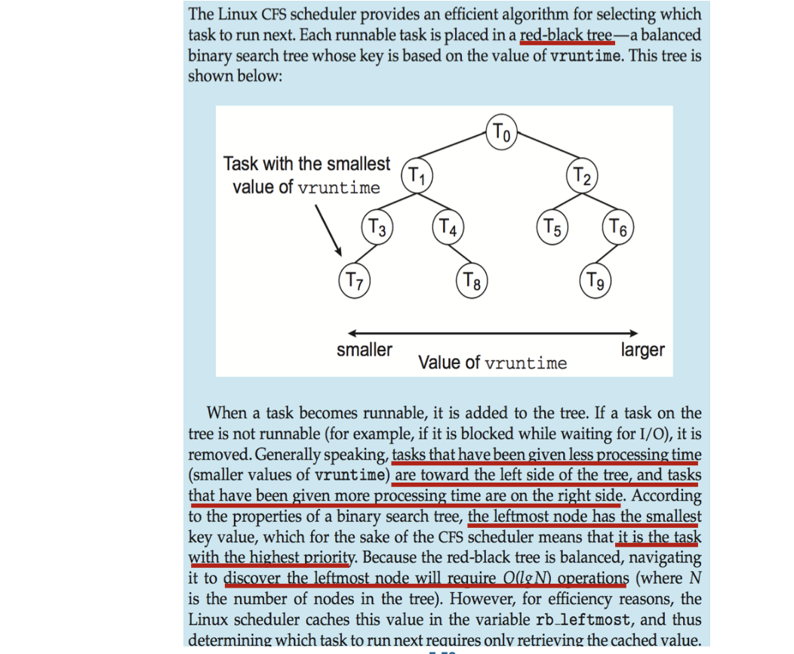

<!--more

## Basic Concepts

- Maximum CPU utilization obtained with multiprogramming
- CPU-I/O Burst Cycle - Process execution consists of a **cycle** of CPU execution and I/O wait
- **CPU burst** followed by **I/O burst**
- CPU burst distribution is of main concern

Histogram of CPU-burst Times(连续使用的时间)
- **Large** number of **short** bursts 
- Small number of longer bursts

### CPU Scheduler
- The CPU scheduler selects from among _the processes in ready queue,_ and allocates the a CPU core to one of them
  - Queue may be ordered in various ways
- CPU scheduling _decisions may take place_ when a process:
  1. Switches from running to waiting state 
  2. Switches from running to ready state 
  3. Switches from waiting to ready
  4. Terminates
- Scheduling under 1 and 4 is **nonpreemptive** (非抢占式)
- All other scheduling is **preemptive** (抢占式)
  - Consider access to shared data
  > update to a half, and is scheduled away
  > we should consider the cosistency of the data shared (for other processes, the data may be reached incomplete)
  - Consider preemption while in kernel mode
  > interrupting critical processes may cause risks
  - Consider interrupts occuring during crucial OS activities
> We will discuss preemptive techniques in the next chapter

### Dispatcher

- Dispatcher module gives control of the CPU to the process selected by the short- term scheduler; this involves:
  - Switching Context
  - Switching to User Mode
  - jumping to proper location in the user program to restart that program
- **Dispatch latency** - time it takes for the dispatcher to stop one process and start another running
  > During which period, the CPU is not doing any job

## Scheduling Criteria

> Globally, maximize ...
- **CPU utilization** - keep the CPU as busy as possible
  > By checking CPU profile
- **Throughput** - # of processes that complete their execution per time unit
  > In OS scenerio, particular def here

> The following criteria are w.r.t. Process, to minimize....
- **Turnaround time** - amount of time to execute a particular process
  > At least the program time, may be larger due to other reasons
- **Waiting time** - amount of time a process has been waiting **in the ready queue**
  > The waiting time for IO is NOT counted
- **Response time** - amount of time it takes from when a request was submitted until the first response is produced, not output (for time-sharing environment)
> Turnarount time and response time are usually counted in time chips 时间片

### Scheduling Algorithm Optimization Criteria
- Max CPU utilization 
- Max throughput
- Min turnaround time 
- Min waiting time
- Min response time (variance > avarage)

## Scheduling Algorithms

### First-Come, First-Served (FCFS) Scheduling

Process | Burst Time
----- | ------
$P_1$ | 24
$P_2$ | 3
$P_3$ | 3

Suppose that the processes arrive in the order: $P_1 , P_2 , P_3$
- Waiting time for $P_1 =0;P_2 =24;P_3=27$
- Average waiting time: $(0 + 24 + 27)/3 = 17$

Suppose that the processes arrive in the order: $P_2 ,P_3 ,P_1$
- Waitingtime for $P_1=6;P_2 =0;P_3=3$
- Average waiting time: $(6 + 0 + 3)/3 = 3$
- Much better than previous case
- **Convoy effect** - short process behind long process
  - Consider one CPU-bound and many I/O-bound processes
  - Troublesome for interactive system
  > In interactive systems, it is usually composed with a very long CPU burst and many short IO bursts.

### Shortest-Job-First (SJF) Scheduling

> Unlike CS222, the optimization goal here is ... the average waiting time, and can be solved in a greedy way.

- Associate with each process the length of its next CPU burst 
  - Use these lengths to schedule the process with the shortest time
- SJF is optimal - gives minimum average waiting time for a given set of processes
  - The difficulty is knowing the length of the next CPU request
  - Could ask the user

Process | Arrival Time | Burst Time 
----- | ------ | -----
$P_1$ | 0 | 6
$P_2$ | 2 | 8
$P_3$ | 4 | 7
$P_4$ | 5 | 3

- Schedule: 1, 4, 3, 2
- Average Waiting Time: $(0 + 1 + 5 + 14) / 4 = 5$

> In practice, challenges are that we don't know the coming time of the next request, or even know the length of the request

### Shortest Remaining Time First

#### Determining Length of Next CPU Burst

- Can only estimate the length - should be similar to the previous one
  - Then pick process with shortest predicted next CPU burst
  > Which is rather inaccurate
- Can be done by using the length of previous CPU bursts, using **exponential averaging**
  > To eliminate sawtooth
  1. $t_{n}=$ actual length of $n^{t h}$ CPU burst
  2. $\tau_{n+1}=$ predicted value for the next CPU burst
  3. $\alpha, 0 \leq \alpha \leq 1$
  4. Define: $\tau_{n+1}=\alpha t_{n}+(1-\alpha) \tau_{n}$
- Commonly, $\alpha$ set to $1 / 2$
- Preemptive version called shortest-remaining-time-first

- $\alpha=0$
  - $\tau_{\mathrm{n}+1}=\tau_{\mathrm{n}}$
  - Recent history does not count
- $\alpha=1$
  - $\tau_{\mathrm{n}+1}=\alpha t_{\mathrm{n}}$
  - Only the actual last CPU burst counts
- If we expand the formula, by substituting $\tau_{i},$ we get:
    $$
    \begin{aligned}
    \tau_{n+1}=\alpha & \mathrm{t}_{n}+(1-\alpha) \alpha t_{n-1}+\ldots \\
    &+(1-\alpha)^{j} \alpha t_{n-j}+\ldots \\
    &+(1-\alpha)^{n+1} \tau_{0}
    \end{aligned}
    $$
- since both $\alpha$ and $(1-\alpha)$ are less than or equal to $1,$ each successive term has *less weight than its predecessor*

####  Example of Shortest-remaining-time-first

Now we add the concepts of **varying** arrival times and **preemption** to the analysis

Process | Arrival Time | Burst Time 
----- | ------ | -----
$P_1$ | 0 | 8
$P_2$ | 1 | 4
$P_3$ | 2 | 9
$P_4$ | 3 | 5

- Average waiting time=$[(10-1)+(1-1)+(17-2)+5-3)]/4=26/4= 6.5$ msec

### Round Robin (RR)
> 依次来
- Each process gets a small unit of CPU time (**time quantum q**), usually 10-100 milliseconds. After this time has elapsed, the process is **preempted** and added to the end of the ready queue.
- If there are n processes in the ready queue and the time quantum is q, then each process gets 1/n of the CPU time in chunks of at most q time units at once. _No process waits more than (n-1)q time units._
- Timer interrupts every quantum to schedule next process
  > Implemented in HW, to notify CPU when to make the schedule
- Performance
  - q large $\Rightarrow$ FIFO
  > q is so large that all processes can be completed in a quantum
  - q small $\Rightarrow$ q must be large with respect to context switch, otherwise overhead is too high
  > q is the same level as to context switch
> 

#### Example with q=4

Process | Burst Time 
----->-- |  -----
$P_1$ | 24 
$P_2$ | 3
$P_3$ | 3 

- Typically, **higher average turnaround** than SJF, but **better response**
  > in SJF, the job will be executed until end
  > long burst will be incrementally proceeded and short job can be quickly responded
- q should be large compared to context switch time 
- q usually 10ms to 100ms, context switch < 10 usec

#### Relation of Turnaround Time and Time Quantum

> 
> 3->4->5, 4/5 units of $P_4$ time is inserted into $P_3$ :(
> 6->7, since 1,2,3 are executed at last, no more burst will be inserted into 4

> The main issue here is that longer quantum means that more other jobs may be counted on the turnaround time of the job in case
> Less switch =dom=> less overlapping overhead w.r.t turnaround time
>             -less dom=> switch overhead

**80% of CPU bursts should be shorter than q**

### Priority Scheduling

- A priority number (integer) is associated with each process
- The CPU is allocated to the process with the highest priority (smallest integer o highest priority) 
  - Preemptive
  - Nonpreemptive
- SJF is priority scheduling where priority is the inverse of predicted next CPU burst time
  > The shorter the job, the higher the priority
- Problem $\equiv$ **Starvation** - low priority processes may never execute
- Solution $\equiv$ **Aging** - as time progresses increase the priority of the process

#### Example of Priority Scheduling

Average waiting time = 8.2 msec

#### Example of Priority Scheduling w/ RR
> Use RR to deal with jobs that have same priority

- Run the process with the highest priority. Processes with the same priority run round-robin

#### Multilevel Queue
- With priority scheduling, have separate queues for each priority.
- Schedule the process in the highest-priority queue!

- Prioritization based upon process type

- real-time process:
  - Media
  - w/ Deadline (realtime driving)
- System
- Interactive
- Batch (background process)

#### Multilevel Feedback Queue

- A process can move between the various queues; **aging** can be implemented this way
- Multilevel-feedback-queue scheduler defined by the following parameters:
  - number of queues
  - scheduling algorithms for each queue
  - method used to determine when to upgrade a process
  - method used to determine when to demote a process
  - method used to determine which queue a process will enter when that process needs service
> Application
> e.g. large-scale batch process, or small quantums to achieve full utilization of CPU

#### Putting Together: Example of Multilevel Feedback Queue
- Three queues:
  - $Q_{0}-$ RR with time quantum 8 milliseconds
  - $Q_{1}-$ RR time quantum 16 milliseconds
  - $Q_{2}-\mathrm{FCFS}$
- Scheduling
  - A new job enters queue $Q_{0}$ which is served FCFS
    - When it gains CPU, job receives 8 milliseconds
    - If it does not finish in 8 milliseconds, job is moved to queue $Q_{1}$
- At $Q_{1}$ job is again served FCFS and receives 16 additional milliseconds
- If it still does not complete, it is preempted and moved to queue $Q_{2}$
  > Where quantum may not work, just follow first in first serve

## Thread Scheduling

- Distinction between user-level and kernel-level threads
  > So we need to schedule them separately
- When threads supported, threads scheduled, not processes
- Many-to-one and many-to-many models, thread library schedules user-level threads to run on LWP(*light weight process*)
  > LWP separates the scheduling space of user mode and kernel mode
  - Known as **process-contention scope (PCS)** since scheduling competition is within the process
  - Typically done via priority set by programmer
    > but kernel mode can't be set priority by programmer
  - Typically preempt the thread currently running in fabor of a higher-priority thread, but no guarantee of time slicing
- Kernel thread scheduled onto available CPU is **system-contention scope (SCS)** - competition among all threads in system
> Two separate spaces: PCS & SCS

### Pthread Scheduling

- API allows specifying either PCS or SCS during thread creation
  - `PTHREAD_SCOPE_PROCESS` schedules threads using PCS scheduling
  - `PTHREAD_SCOPE_SYSTEM` schedules threads using SCS scheduling
- Can be limited by OS - Linux and macOS only allow PTHREAD_SCOPE_SYSTEM

## Multi-Processor Scheduling

> In single processor systems, synchronization is not a critical issue

- CPU scheduling more complex when multiple CPUs are available
- Multiprocess may be any one of the following architectures:
  - Multicore CPUs
  - Multithreaded cores
    > hardware support for multi-threading
    > easy to switch (reg/PC), though some HW resources are not individual (cache)
  - NUMA systems
  - Heterogeneous multiprocessing

### SMP symmetric multiprocessing

- Symmetric multiprocessing (SMP) is where each processor is self scheduling.
- All threads may be in a common ready queue (a)
- Each processor may have its own private queue of threads (b)

### Multicore Processors
- **Recent** **trend** to place multiple processor cores on same physical chip
- Faster and consumes less power
- Multiple threads per core also growing
  - Takes advantage of memory stall to make progress on another thread while memory retrieve happens
  - Coarse-grained, switching when long latency occurs

> within a core
> 
> If the cost of switching within a core is low ...
> 
> Each core has > 1 hardware threads.
> If one thread has a memory stall, switch to another thread! 
> Fine-grained, light-cost switching

### Multithread Multicore System
> Not only is the core muti, the core itself also supports multithread
> OS simply regards it as 8 "logic" cores when scheduling
> flattening
> 

- **Chip-multithreading (CMT)** assigns each core multiple hardware threads. (Intel refers to this as **hyperthreading**.)
- On a quad-core system with 2 hardware threads per core, _the operating system sees 8 logical processors_.

> A similar idea is applied here, use a Light Weight Processor to determine the mapping from SW thread to **"logical"** core, and Architecture/HW will decide how to assign logical core to actual core.
> 
> Sometimes OS can be aware of the second layer

- Two levels of scheduling:
  1. The operating system deciding which software thread to run on a logical CPU
  2. How each core decides which hardware thread to run on the physical core.

#### Load Balancing

- If SMP, need to keep all CPUs loaded for efficiency 
  - **Load balancing** attempts to keep workload evenly distributed
  1. **Push migration (AKA. Task Migration)** - periodic task checks load on each processor, and if found pushes task from overloaded CPU to other CPUs
  > OS can tell in advance how long the task will execute, or during execution, it found some cores are busy/idle, we can migrate one task to another
  > issues like memory conflicts may be taken into account
  > address dependency of task graph
  2. **Pull migration** - idle processors pulls waiting task from busy processor

#### Processor Affinity
> But for performance, though considered logically equivalent, the performance may differ on different assignment strategies

> > A natural setback for load balancing method:
> A task must leave some TRACE when it runs
> e.g. cache

- When a thread has been running on one processor, the cache contents of that processor stores the memory accesses by that thread.
- We refer to this as a thread having affinity for a processor (i.e. “processor affinity”)
- Load balancing may affect processor affinity as a thread may be moved from one processor to another to balance loads, yet that thread loses the contents of what it had in the cache of the processor it was moved off of.
> Trade off, no load balancing VS load balancing cost
> on OS level, there are some methods, e.g. constrain a process to a processor/set of processors

- **Soft affinity** - the operating system attempts to keep a thread running on the same processor, but no guarantees.
- **Hard affinity** - allows a process to specify a set of processors it may run on.

> A basic strategy to select affinity set, depend on the structure of the processor (L1 cache may be aborted, but L2 cache should be shared)
> 

### NUMA and CPU scheduling

> NUMA = non uniform memory access

If the operating system is NUMA-aware, it will assign memory closes to the CPU the thread is running on.

> There is a tension between the load balancing and minimizing memory access! 天然的trade-off
> ACA: Smart Compute-Cache for Huawei wireless network chips!
> - make decisions on L2/... cache instead of CPU
 
> The OS should sense a non-uniform memory access and make special desicison s for NUMA architecture

## Real-Time CPU Scheduling 
> Every task comes with a critical **deadline**
> e.g. in a car system, detect a crash!
Can present obvious challenges
- Soft real-time systems - Critical real-time tasks have the highest priority, but no guarantee as to when tasks will be scheduled
- Hard real-time systems - task must be serviced by its deadline

> critical criteria: latency - time between the request arrive and finish

- Event latency - the amount of time that elapses from when an event occurs to when it is serviced.
- Two types of latencies affect performance
  1. **Interrupt latency** - time from arrival of interrupt to start of routine that services interrupt
  > 
  > Not necessarily is a minimized latency a good real time system (just a **soft** object)
  > The object should be **meet the deadline**
  2. **Dispatch latency** - time for schedule to take current process off CPU and switch to another
     two phases
     1. Preemption of any process running in kernel mode
     2. Release by low- priority process of resources needed by high-priority processes
  > 

### Priority-based Scheduling
- For real-time scheduling, scheduler must support preemptive, priority-based scheduling
  - But **only guarantees soft real-time**
- For **hard real-time** must also provide ability to meet deadlines
- Processes have new characteristics: **periodic** ones require CPU at constant intervals
  - Has processing time t, deadline d, period p
  - 0≤t≤d≤p
  - Rate of periodic task is 1/p

- When scheduling, every process should:
  - Announcing deadline for a process!
- Then the scheduler will notice
  - Admission control for a scheduler: yes or no guarantee of meeting the deadline! (Then the user program should do more things)

### Rate Montonic Scheduling

- A priority is assigned based on the inverse of its period
- Shorter periods = higher priority;
- Longer periods = lower priority
- P1 is assigned a higher priority than P2.

But this may cause Process P2 misses finishing its deadline at time 80

### Earliest Deadline First Scheduling (EDF)

- Priorities are assigned according to deadlines: 
  - the earlier the deadline, the higher the priority;
  - the later the deadline, the lower the priority

### Proportional Share Scheduling
> A "fair" algorithm
- T shares are allocated among all processes in the system
- An application receives N shares where $N<T$
- This ensures each application will receive N / T of the total processor time
- MUST work in conjunction with **admission-control policy** for the guarantee the share

### POSIX Real-Time Scheduling

- The POSIX.1b standard
- API provides functions for managing real-time threads
- Defines two scheduling classes for real-time threads:
  1. `SCHED_FIFO`- threads are scheduled using a FCFS strategy with a FIFO queue. There is no time-slicing for threads of equal priority
  2. `SCHED_RR` - similar to `SCHED_FIFO` except **time-slicing** occursfor threads of equal priority
- Defines two functions for getting and setting scheduling policy:
  1. `pthread_attr_getsched_policy(pthread_attr_t *attr,int *policy)`
  2. `pthread_attr_setsched_policy(pthread_attr_t *attr, int policy)`
> Not very powerful for Real-Time

## Operating Systems Examples 

### Linux Scheduling Through V2.5

- Prior to kernel version 2.5, ran variation of standard UNIX scheduling algorithm
- Version 2.5 moved to constant order O(1) scheduling time
  - Preemptive, priority based
  - Two priority ranges: time-sharing and real-time
  - **Real-time range** from 0 to 99 and **nice** value from 100 to 140
  > Nice programs will give way to real-time ranges
  > Only differ in value in priority, as a distinction
  - Map into global priority with numerically lower values indicating higher priority
  - Higher priority gets larger q
  - Task run-able as long as time left in time slice (active)
  - If no time left (expired), not run-able until all other tasks use their slices
  - All run-able tasks tracked in per-CPU runqueue data structure 
    - Two priority arrays (active, expired)
    - Tasks indexed by priority
    - **When no more active, arrays are exchanged**
    > An efficient trick
  - Worked well,but poorr esponse times for interactive processes

> Real time only shows in priority value, still not very powerful

### Linux Scheduling in Version 2.6.23 +
> Two classes of works
> and fairness is considered

- Completely Fair Scheduler (CFS)
- Scheduling classes
  - Each has specific priority
  - Scheduler picks highest priority task in highest scheduling class
  - Rather than quantum based on fixed time allotments, based on proportion of CPU time
  - Two scheduling classes included, others can be added 
    - 1. Default 2. real-time
- Quantum calculated based on nice value from -20 to +19
  - Lower value is higher priority
  - Calculates target latency - interval of time during which task should run at least once
  - Target latency can increase if say number of active tasks increases
- CFS scheduler maintains per task virtual run time in variable vruntime
  - Associated with **decay factor based on priority of task** - lower priority is higher decay rate
  - Normal default priority yields virtual run time = actual run time
- To decide next task to run, scheduler picks task with **lowest virtual run time** and **give it a target latency portion** of CPU

> nice value: the effect of this task on others, the larger the smaller the effect
> virtual time: calculated / scaled by nice value, which to run
> target latency: associated with the number of active tasks
> - If active tasks increase, the efficiency of scheduling will be low (more time wasted in scheduling), so that assign more time to the task, to avoid over-scheduling/slicing

#### Implementation

as a red-black tree $O(lgN)$

#### Compatibility with POSIX.1b

- Real-time scheduling according to POSIX.1b 
  - Real-time tasks have static priorities
- Real-time plus normal map into global priority scheme 
- Nice value of -20 maps to global priority 100
- Nice value of +19 maps to priority 139

#### Load Balancing of Linux

- Linux supports load balancing but is also NUMA-aware.
- **Scheduling domain** is a set of CPU cores that can be balanced against one another.
  > Separation from HW architecture
- Domains are organized by what they share (i.e. cache memory.) Goal is to keep threads from migrating between domains.

### Windows Scheduling

- Windows uses priority-based preemptive scheduling
- Highest-priority thread runs next
- **Dispatcher** is scheduler
- Thread runs until (1) blocks, (2) uses time slice, (3) preempted by higher-priority thread
- _Real-time threads can preempt non-real-time_
- 32-level priority scheme
- **Variable class** is 1-15, **real-time** class is 16-31
- Priority 0 is memory-management thread
- Queue for each priority
- If no run-able thread, runs **idle thread**

#### Windows Priority Class

- Win32 API identifies several priority classes to which a process can belong
  - `REALTIME_PRIORITY_CLASS`,`HIGH_PRIORITY_CLASS`, `ABOVE_NORMAL_PRIORITY_CLASS`,`NORMAL_PRIORITY_CLASS`, `BELOW_NORMAL_PRIORITY_CLASS`, `IDLE_PRIORITY_CLASS`
  - All are variable except `REALTIME`
  > Why? as the chips are used, the priority will degrade, but a lower bound is required (as Priority Class specified)
- A thread within a given priority class has a relative priority
  - `TIME_CRITICAL`,`HIGHEST`,`ABOVE_NORMAL`,`NORMAL`, `BELOW_NORMAL`, `LOWEST`, `IDLE`
- Priority class and relative priority combine to give numeric priority
- Base priority is `NORMAL` within the class
- If quantum expires, priority lowered, but never below base

- If wait occurs, priority boosted depending on what was waited for
- Foreground window given 3x priority boost
- Windows 7 added **user-mode scheduling** (UMS)
  - Applications create and manage threads independent of kernel
  - For large number of threads, much more efficient
  - UMS schedulers come from programming language libraries like **C++ Concurrent Runtime (ConcRT) framework**

#### Solaris
> Priority-based, non-preemptive, different scheduling algorithm for different class

- Priority-based scheduling 
- Six classes available
  - Time sharing (default) (TS) 
  - Interactive (IA)
  - Real time (RT)
  - System (SYS)
  - Fair Share (FSS)
  - Fixed priority (FP)
- Given thread can be in one class at a time 
- Each class has its own scheduling algorithm 
- Time sharing is multi-level feedback queue
  - Loadable table configurable by sysadmin

## Algorithm Evaluation

- How to select CPU-scheduling algorithm for an OS? 
- Determine criteria, then evaluate algorithms

### Deterministic Evaluation
- **Deterministic modeling**
> Theoritical analysis, a little far from , given some benchmark, and calculate the criteria on paper
  - Type of **analytic evaluation**
  - Takes a particular predetermined workload and defines the performance of each algorithm for that workload
- Example
  - Consider 5 processes arriving at time 0:
  
  - For each algorithm, calculate minimum average waiting time
  - Simple and fast, but requires exact numbers for input, applies only to those inputs
  - 

### Queueing Models 排队论
> Deterministic Evaluation is too idealistic, ignoring CPU/IO,
- Describes the arrival of processes, and CPU and I/O bursts probabilistically
  - Commonly exponential, and described by mean
  - Computes average throughput, utilization, waiting time, etc
- Computer system described as network of servers, each with queue of waiting processes
  - Knowing arrival rates and service rates
  - Computes utilization, average queue length, average wait time, etc

#### Little’s Formula

- n = average queue length
- W = average waiting time in queue
- λ = average arrival rate into queue
- Little’s law - in steady state, processes leaving queue must equal processes arriving, thus: $n=\lambda \times W$
  - Valid for any scheduling algorithm and arrival distribution
- For example, if on average 7 processes arrive per second, and normally 14 processes in queue, then average wait time per process = 2 seconds

### Simulations

- Queueing models limited
- **Simulations** more accurate
  - Programmed model of computer system
  - Clock is a variable
  - Gather statistics indicating algorithm performance ● Data to drive simulation gathered via
    - Random number generator according to probabilities
    - Distributions defined mathematically or empirically
    - Trace tapes record sequences of real events in real systems
> Popular simulator: GM5, a full system simulator (CPU+Linux/Windows/...OS)
> Accurate to clock cycle (1000x slow)
> Though simulating time can be slow, the results should be accurate

#### Evaluation of CPU Schedulers by Simulation

> To trace load balance accurately
> trace file: when CPU is scheduled/ IO / memory access is executed

### Implementation
> Simulations will make assumptions, only simulate factors that matter
> Building a simulartor is also a lot of effort
- Even simulations have limited accuracy
- Just implement new scheduler and test in real systems
  - High cost, high risk
  - Environments vary
- Most flexible schedulers can be modified per-site or per-system
- Or APIs to modify priorities
- But again environments vary