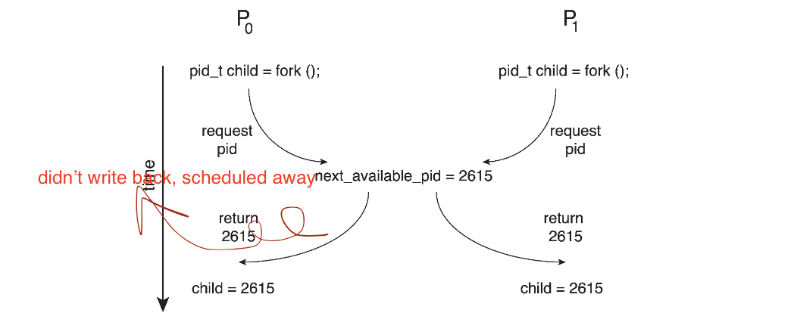
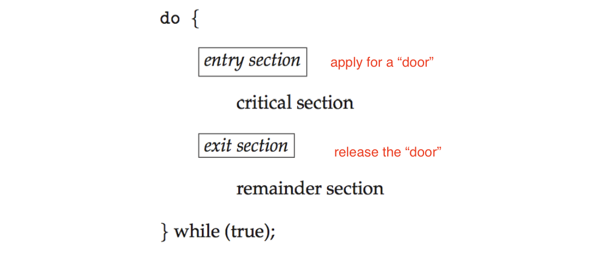

<!-- more -->


## Background

> Process Perspective: concurrency and interrupt
- Processes can execute concurrently
  - May be interrupted at any time, partially completing execution
> Data Perspective: consistency
- Concurrent access to shared data may result in data inconsistency
- Maintaining data consistency requires mechanisms to ensure the orderly execution of cooperating processes
- Illustration of the problem:
  Suppose that we wanted to provide a solution to the *consumer- producer* problem that fills all the buffers. We can do so by having an integer **counter** that keeps track of the number of full buffers. Initially, **counter** is set to 0. It is incremented by the producer after it produces a new buffer and is decremented by the consumer after it consumes a buffer.

### Producer
```cpp
while (true) {
      /* produce an item in next produced */
      while (counter == BUFFER_SIZE)
            ; /* do nothing, wait until the buffer is available */
      buffer[in] = next_produced;
      in = (in + 1) % BUFFER_SIZE;
      counter++;
}
```

### Consumer
```cpp
while (true) {
      while (counter == 0)
            ; /* do nothing, wait until the buffer has something */
      next_consumed = buffer[out];
      out = (out + 1) % BUFFER_SIZE;
        counter--;
      /* consume the item in next consumed */
}
```

> Recall, in multi-threading, we can make sure that the counter modification won't happen in both clients
> But in CPU implementation, since scheduling is involved, we will have a race

### Race Condition : client and server

- `counter++` could be implemented as
```
register1 = counter
register1 = register1 + 1
counter = register1
```
- `counter--` could be implemented as
```
register2 = counter
register2 = register2 - 1
counter = register2
```
- Consider this execution interleaving with “count = 5” initially:
  > An undeterministic issue 
```
S0: producer execute register1 = counter            {register1 = 5}
S1: producer execute register1 = register1 + 1      
{register1 = 6, but does not write back to counter cache} 
S2: consumer execute register2 = counter            {register2 = 5}
S3: consumer execute register2 = register2 - 1      {register2 = 4}
S4: producer execute counter = register1            {counter = 6 }
S5: consumer execute counter = register2            {counter = 4}
```
- inconsistency happens!

### Race Condition Example : fork

- Processes P0 and P1 are creating child processes using the `fork()` system call
- Race condition on _kernel variable_ `next_available_pid` which represents the next available process identifier (pid)
- Unless there is **mutual exclusion**, the same pid could be assigned to two different processes!


> Actually, in OS, a lot sync work is required
> We should always ensure **mutual exclusion**


## The Critical-Section Problem

- Consider system of n processes $\{p_0, p_1, ... p_{n-1}\}$
- Each process has **critical section** segment of code
  - Process may be changing common variables, updating table, writing file, etc
  > e.g. pid allocation, write files, update table ...
  - When one process in critical section, no other may be in its critical section
- **Critical section problem** is to design **protocol** to solve this
- Each process must ask permission to enter critical section in **entry section**, may follow critical section with **exit section**, then **remainder section**
- General structure of process Pi


> Why remainder section?
> See progress section

### Solution to Critical Section Problem

1. Mutual Exclusion - If process Pi is executing in its critical section, then no other processes can be executing in their critical sections
2. Progress - If no process is executing in its critical section and there exist some processes that wish to enter their critical section, then _only those processes that are not executing in their remainder sections can enter the critical section next_, this selection cannot be postponed indefinitely
   - 不可以一直出于critical section中，需要执行remainder，确保其他等待中的进程有机会进入
3. Bounded Waiting - A bound must exist on the number of times that other processes are allowed to enter their critical sections after a process has made a request to enter its critical section and before that request is granted
   - 当前critical section，持续使用的事件是受限的，不能拒绝其他请求无限多次，防止队列无限增长
   - Assume that each process executes at a nonzero speed
   - No assumption concerning relative speed of the n processes

### Critical-Section Handling in OS
- Two approaches depending on if kernel is preemptive or non- preemptive
  - Preemptive - allows preemption of process when running in kernel mode
  - Non-preemptive - runs until exits kernel mode, blocks, or voluntarily yields CPU
    - Essentially free of race conditions in kernel mode
    > Though simple, modern OS won't take this approach

> With preemptive, what if I am scheduled away while I am running the critical section?


## Peterson’s Solution
> A mathematical/theoritical solution, but won't be actually adopted by modern OS

- Not guaranteed to work on modern architectures! (But good algorithmic description of solving the problem)
- Two process solution
- Assume that the `load` and `store` machine-language instructions are **atomic**; that is, cannot be interrupted
  > but in fact, leads to low performance
- The two processes share two variables:
  - `int turn`; (轮到谁了)
  - `boolean flag[2]` （准备好了吗？）
- The variable `turn` indicates whose turn it is to enter the critical section
- The `flag` array is used to indicate if a process is ready to enter the critical section. flag[i] = true implies that process Pi is ready!
- Algorithm for Process Pi
```cpp
while (true){
      flag[i] = true;
      turn = j;
      while (flag[j] && turn = = j); /* waiting for j to execute, j is executing critical */
      /* ... critical section ....*/
      flag[i] = false;
      /* ... remainder section ....*/
}
```

> 看谁先执行到`turn=对方`，谁先等
> when `i` is executing, it gives the turn to `j`, we can make sure that `i` won't run twice, because after running, it will give turn to `j`
> If no turn, only flag, condition 2 won't be satisfied.

- Provable that the three CS requirement are met:
1. Mutual exclusion is preserved Pi enters CS only if: either `flag[j] = false or turn = i`
2. Progress requirement is satisfied
3. Bounded-waiting requirement is met *(the bound is 1)*


### Remark

- Although useful for demonstrating an algorithm, Peterson’s Solution is not guaranteed to work on modern architectures.
- Understanding why it will not work is also useful for better understanding race conditions.
- To improve performance, processors and/or **compilers may reorder operations that have no dependencies**
  > But for Peterson's implementation, it is likely that `flag = true` and `turn=j` will be reordered
- For single-threaded this is ok as the result will always be the same.
- For multithreaded the reordering may produce inconsistent or unexpected results!


### Example
> An exmaple for compiler reodrdering
Two threads share the data
```
boolean flag = false;
int x = 0;
```

Thread 1 performs
```
while (!flag)
     ;
print x
```
Thread 2 performs 
```
x = 100;
flag = true
```
What is the expected output?
- `100`
However, the operations for Thread 2 may be reordered:
```
  flag = true;
  x = 100;
```
The effects of instruction reordering in Pterson's Solution


This allows **both processes to be in their critical section** at the same time!


## Hardware Support for Synchronization 

- Many systems provide hardware support for implementing the critical section code.
- Uniprocessors - could disable interrupts
  - Currently running code would execute without preemption
  - **Generally too inefficient** :( on multiprocessor systems
    - Operating systems using this not broadly scalable
- We will look at three forms of hardware support:
  1. Memory barriers
  2. Hardware instructions 
  3. Atomic variables

### Memory Barriers

- **Memory model** are the memory guarantees a computer architecture makes to application programs.
- Memory models may be either:
  - **Strongly ordered** - where a memory modification of one processor is immediately visible to all other processors.
  > 改了立刻知道
  - **Weakly ordered** - where a memory modification of one processor may not be immediately visible to all other processors.
  > 改了不立刻知道
- A **memory barrier** is an instruction that **forces** any change in memory to be propagated (made visible) to all other processors.
> The performance is surely to be affected

#### Example

 We could add a memory barrier to the following instructions to ensure Thread 1 outputs 100:

Thread 1 now performs

    while (!flag)
      memory_barrier();
    print x

Thread 2 now performs

    x = 100;
    memory_barrier();
    flag = true

> Since flag matters a lot to sync, any change to flag should be made as a barrier

### Hardware Instructions
- Special hardware instructions that allow us to either test-and- modify the content of a word, or two swap the contents of two words atomically (uninterruptibly.)
  - **Test-and-Set** instruction
  - **Compare-and-Swap** instruction

### Test_and_set Instruction

Definition:

      boolean test_and_set (boolean *target)
      {
              boolean rv = *target;
              *target = true;
              return rv:
      }

1. Executed **atomically**
   > Gurananteed by HW support
2. Returns the original value of passed parameter 
3. Set the new value of passed parameter to true
   > The boolean is used to determine whether to enter the critical section

#### Example Solution
- Shared boolean variable lock, initialized to false 
- Assume all threads run same code, we want to make sure critical section no dups
- Solution:
  
        do {
              while (test_and_set(&lock)) /* change lock and set to false, atomically*/
                ; /* do nothing */
                    /* critical section */
            lock = false;
                    /* remainder section */
          } while (true);

#### Remark
> `True` and `False` Reduce the flexibility of test_and_set(), which is why comp_and_swap is proposed

### compare_and_swap Instruction
Definition:

    int compare _and_swap(int *value, int expected, int new_value) {
            int temp = *value;
            if (*value == expected)
              *value = new_value;
        return temp;
    }
  
1. Executed atomically
2. Returns the original value of passed parameter `value`
3. Set the variable `value` the value of the passed parameter `new_value` but only if `*value == expected` is true. That is, the swap takes place only under this condition.


#### Solution using compare_and_swap
- Shared integer `lock` initialized to 0; 
- Solution:


      while (true){
        while (compare_and_swap(&lock, 0, 1) != 0)
          ; /* do nothing */
          /* critical section */
        lock = 0; 
        /* remainder section */
      }

#### Bounded-waiting Mutual Exclusion with compare_and_swap
> Recall principle 3, it can be implemented with cmp and swap
- `key` is the lock, `i` is the thread number, `waiting[i] = true` if `i` gets the access to critical section 

      while (true) {
        waiting[i] = true;
        key = 1;
        while (waiting[i] && key == 1)
            key = compare_and_swap(&lock,0,1); waiting[i] = false;
        /* critical section */
        j = (i + 1) % n; /* bounded waiting, querying for the next  */
                        /* item if it is in the  waiting list */
        while ((j != i) && !waiting[j])
            j = (j + 1) % n;
        if (j == i)
            lock = 0;
        else
            waiting[j] = false;
        /* remainder section */
      }

> The above two functions are the basic building blocks for critical section exclusion implementation, but more requirements are needed


### Atomic Variables
- Typically, instructions such as compare-and-swap are used as building blocks for other synchronization tools.
- One tool is an **atomic variable** that provides atomic (uninterruptible) updates on basic data types such as integers and booleans.
- For example,the `increment()` operation on the atomic variable `sequence` ensures `sequence` is incremented without interruption:

    increment(&sequence);


#### Atomic Variables Implementations

The `increment()` function can be implemented as follows:

      void increment(atomic_int *v)
      {
        int temp;
        do {
          temp = *v;
        }
        while (temp != (compare_and_swap(v,temp,temp+1));
      }

> Some higher order tools are provided


## Mutex Locks

- Previous solutions are complicated and generally inaccessible to application programmers
- OS designers build software tools to solve critical section problem
- Simplest is mutex lock
- Protect a critical section by first `acquire()` a lock then `release()` the lock
  - Boolean variable indicating if lock is available or not
- Calls to `acquire()` and `release()` must be atomic
  - Usually implemented via hardware atomic instructions such as `compare-and-swap`.
- But this solution requires **busy waiting** in definition
  > Usually leads to idling when waiting, detriment to efficiency 
  - This lock therefore called a `spinlock`

        while (true) {
            acquire lock
            /* critical section */
            release lock
            /* remainder section */
        }

### Definitions

    acquire() {
      while (!available)
          ; /* busy wait */
      available = false;;
    }
    
      release() {
          available = true;
    }

These two functions must be implemented atomically. Both test-and-set and compare-and-swap can be used to implement these functions.


## Semaphores
> We define a `s`, note if `s=1`, it is very likely to mutex
> note, we may allow multiple threads to enter a critical section
> such access need is very common is OS, e.g. multiple copies of resources and can be distributed to multiple devices, but with an upper bound.
> E.g. In producer/consumer, the buffer size is "equivalent" to `s`

- Synchronization tool that provides more sophisticated ways (than Mutex locks) for process to synchronize their activities.
- Semaphore S - integer variable
- Can only be accessed via two indivisible (atomic) operations
  - `wait()` and `signal()`
    - (Originally called `P()` and `V()`)
- Definition of the `wait()` operation


        wait(S) {
            while (S <= 0)
              ; // busy wait
            S--;
        }


- Definition of the `signal()` operation


        signal(S) {
            S++;
        }

### Usage


- **Counting semaphore** - integer value can range over an unrestricted domain
- **Binary semaphore** - integer value can range only between 0 and 1 
  -  Same as a mutex lock
- Can solve various synchronization problems
- Consider `P1` and `P2` that require `S1` to happen before `S2`
  - Create a semaphore `“synch”` initialized to 0
  
          P1:
            S1;
            signal(synch);
          P2:
            wait(synch);
            S2;


- Can implement a counting semaphore S as a binary semaphore

### Implementation

- Must guarantee that no two processes can execute the `wait()` and `signal()` on the same semaphore at the same time-
- Thus, the implementation becomes the critical section problem where the wait and signal code are placed in the critical section
  - Could now have `busy waiting` in critical section implementation
    - But implementation code is short
    - *Little* busy waiting if critical section rarely occupied
- Note that applications may spend lots of time in critical sections and therefore this is not a good solution
  > Inefficiency when the critical section is rather long
- **Suspend** rather than busy waiting
> How to block a thread without letting it busy waiting
  
### Implementation with no Busy Waiting
> Has to deal with stuff like waiting queue in the scheduling system
- With each semaphore there is an associated waiting queue
- Each entry in a waiting queue has two data items:
  - value (of type integer)
  - pointer to next record in the list
- Two operations:
  - **block** - place the process invoking the operation on the appropriate waiting queue
  - **wakeup** - remove one of processes in the waiting queue and place it in the ready queue

        typedef struct {
            int value;
            struct process *list;
        } semaphore;  

> Stored in semaphore, knowing which processes are in the system waiting queue

    wait(semaphore *S) {
      S->value--;
      if (S->value < 0) {
          add this process to S->list;
          block(); 
      }
    }
    signal(semaphore *S) {
      S->value++;
      if (S->value <= 0) {
          remove a process P from S->list;
          wakeup(P); 
      }
    }

> Note `S->value--;` is updated before context switch, otherwise this instruction won't be executed (since it is switched away)


### Problems with Semaphores
- Correct use
  - `wait ... signal`
- Incorrect use of semaphore operations:
  - `signal (mutex) .... wait (mutex)`
  - `wait (mutex) ... wait (mutex)`
  - Omitting of `wait (mutex)` and/or `signal (mutex)`
- These - and others - are examples of what can occur when sempahores and other synchronization tools are used incorrectly.

> Users are easy to write bugs! especially when control flow is complex

## Monitors
> Manage them altogether
- A high-level abstraction that provides a convenient and effective mechanism for process synchronization
- Abstract data type, internal variables only accessible by code within the procedure
- Only one process may be active within the monitor at a time
- Pseudocode syntax of a monitor:
```
monitor monitor-name
{
  // shared variable declarations
  function P1 (...) { .... }
  function P2 (...) { .... }
  function Pn (...) {......}
  initialization code (...) { ... }
}
```
### Schematic view of a Monitor


### Condition Variables

- condition x, y;
- Two operations are allowed on a condition variable:
  - `x.wait()` - a process that invokes the operation is suspended until `x.signal()`
  - `x.signal()` - resumes one of processes (if any) that invoked x.wait()
    - If no `x.wait()` on the variable, then it has no effect on the variable
> For every variable(condition), we maintain them separately, and the linked list will be adjusted dynamically


### Alternatives to implementing condition variables

- If process P invokes `x.signal()`, and process Q is suspended in `x.wait()`, what should happen next?
  - Both Q and P cannot execute in paralel. If Q is resumed,then P must wait
- Options include
  - Signal and wait - P waits until Q either leaves the monitor or it waits for another condition
  - Signal and continue - Q waits until P either leaves the monitor or it waits for another condition
  - Both have pros and cons - languaga implementer can decider
  - Monitors implemented in Concurrent Pascal compromise
    - P executing signal immediately leaves the monitor, Q is resumed
  - Implemented in other languages including Mesa C# Java


### Monitor Implementation Using Semaphores
> Signal and Wait Version, so `signal(next)` in `x.wait()` or call `F`
> `next_count` how many processes sending request are being suspended by `next` semaphore
> after `wait(next)`, when other processes wake it up it will execute `next_count--`, so that itself is reduced from the suspend count
> all process that want to suspend themselves will do `next_count++`, so that it will be counted into `next_count` after `signal(x_sem)`

Variables

```
semaphore mutex;  // (initially  = 1)
semaphore next;   // (initially  = 0)
int next_count = 0;
```

Each function F will be replaced by
```
wait(mutex);
  ...
  body of F; 
  ...
if (next_count > 0)
  signal(next)
else
  signal(mutex);
```

Mutual exclusion within a monitor is ensured

For each condition variable x, we have:
```
semaphore x_sem; // (initially = 0)
int x_count = 0;
```

The operation `x.wait()` can be implemented as:
```
x_count++;
if (next_count > 0)
  signal(next);
else
  signal(mutex);
wait(x_sem);
x_count--;
```

The operation `x.signal()` can be implemented as:

    if (x_count > 0) {
      next_count++;
      signal(x_sem);  // ---> out suspended
      wait(next);     // <-- be waked up by others
      next_count--;
    }

### Usage: Resuming Processes within a Monitor

- If several processes queued on condition variable `x`, and `x.signal()` is executed, which process should be resumed?
- FCFS frequently not adequate
- **conditional-wait** construct of the form `x.wait(c)`
  - Where c is **priority number**
  - Process with lowest number (highest priority) is scheduled next


### Application: Single Resource allocation


- Allocate a single resource among competing processes using priority numbers that specify the maximum time a process plans to use the resource
```
R.acquire(t); 
  ...
  access the resurce;
  ...
R.release;
```
- Where R is an instance of type `ResourceAllocator`

#### A Monitor to Allocate Single Resource
> Use condition variable x to manage the single resource
> More than 1 process trying to access x will be put into the suspended list
```
monitor ResourceAllocator
{
  boolean busy;
  condition x;
  void acquire(int time) {
    if (busy)
        x.wait(time);
    busy = true;
  }
  void release() {
        busy = FALSE;
        x.signal();
  }
  initialization code() {
  busy = false;
  }
}
```


## Liveness

- Processes may have to wait indefinitely while trying to acquire a synchronization tool such as a mutex lock or semaphore.
- Waiting indefinitely violates the progress and bounded-waiting criteria discussed at the beginning of this chapter.
- **Liveness** refers to _a set of properties that a system must satisfy to ensure processes make progress_.
  > Make sure that the process will be proceeded instead of waiting forever
- Indefinite waiting is an example of a liveness failure.

### DeadLock

- Deadlock - two or more processes are waiting indefinitely for an event that can be caused by only one of the waiting processes
- Let S and Q be two semaphores initialized to 1

- Consider if `P0` executes `wait(S)` and `P1` `wait(Q)`. When `P0` executes `wait(Q)`, it must wait until `P1` executes `signal(Q)`
- However, `P1` is waiting until `P0` execute `signal(S)`.
- Since these `signal()` operations will never be executed, `P0` and `P1` are **deadlocked**.

> Later we will discuss some special strategies to escape deadlock

### Other forms of deadlock:
- **Starvation** - indefinite blocking
  - A process may never be removed from the semaphore queue which it is suspended
- **Priority Inversion** - Scheduling problem when lower- priority process holds a lock needed by higher-priority process
  > 调度上的优先级和同步机制（锁的存在）不协调，实际的优先级降低了
  - Solved via **priority-inheritance protocol**

### Priority Inheritance Protocol

- An example for priority inversino
  - Consider the scenario with three processes P1, P2, and P3. P1 has the highest priority, P2 the next highest, and P3 the lowest. Assume a resource P3 is assigned a resource R that P1 wants. Thus, P1 must wait for P3 to finish using the resource. However, P2 becomes runnable and preempts P3. What has happened is that P2 - a process with a lower priority than P1 - has indirectly prevented P3 from gaining access to the resource.
- To prevent this from occurring, a **priority inheritance protocol** is used. This simply allows **the priority of the highest thread waiting to access a shared resource to be assigned to the thread currently using the resource**. Thus, the current owner of the resource is assigned the priority of the highest priority thread wishing to acquire the resource.

