# OS8 - Deadlocks

<!-----
title: 【System Engineering】OS8 - Deadlocks
url: se2-deadlocks
date: 2020-12-04 15:26:45
tags: 
- System Engineering

categories: 
- Courses

----->

- Illustrate how deadlock can occur when mutex locks are used
- Define the **four necessary conditions** that characterize deadlock
- Identify a deadlock situation in a **resource allocation graph**
- Evaluate the **four different approaches** for preventing deadlocks
  > Corresponding to 4 necessary conditions
- Apply the banker’s algorithm for deadlock avoidance
- Apply the deadlock detection algorithm
- Evaluate approaches for recovering from deadlock

<!--more-->

[toc]


## System Model


- System consists of resources 
- Resource types `R1, R2, . . ., Rm`
    CPU cycles, memory space, I/O devices 
- Each resource type `Ri` has `Wi` instances.
- Each process utilizes a resource as follows:
  - **request** 
  - **use**
  - **release**

> REQUEST resource vs. ACQUIRE lock
> release resource vs. release lock

## Deadlock in Multithreaded Applications 

Two mutex locks are created an initialized:
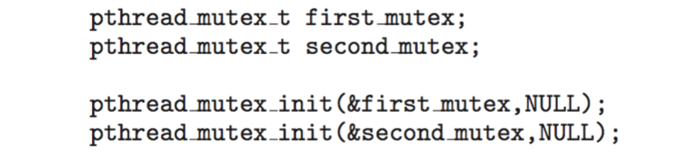
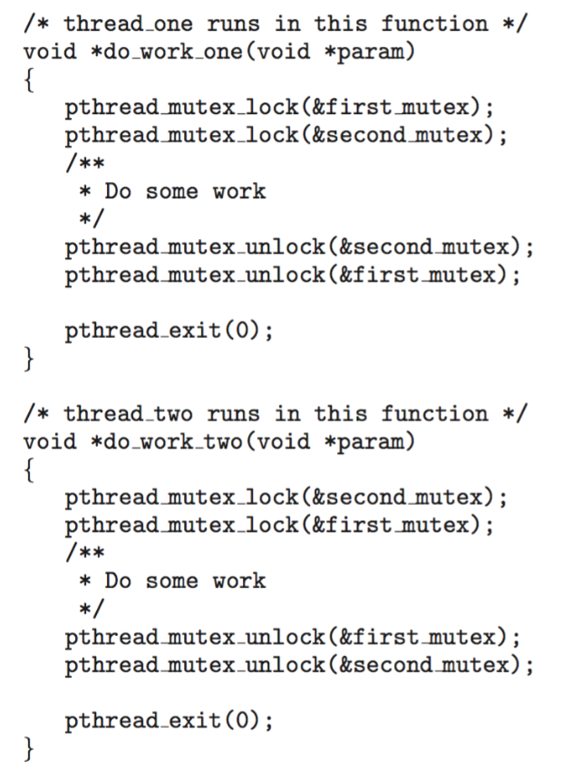

- Deadlock is possible if thread1 acquires first_mutex and thread 2 acquires second_mutex. Thread 1 then waits for second_mutex and thread 2 waits for first_mutex.
- Can be illustrated with a resource allocation graph:
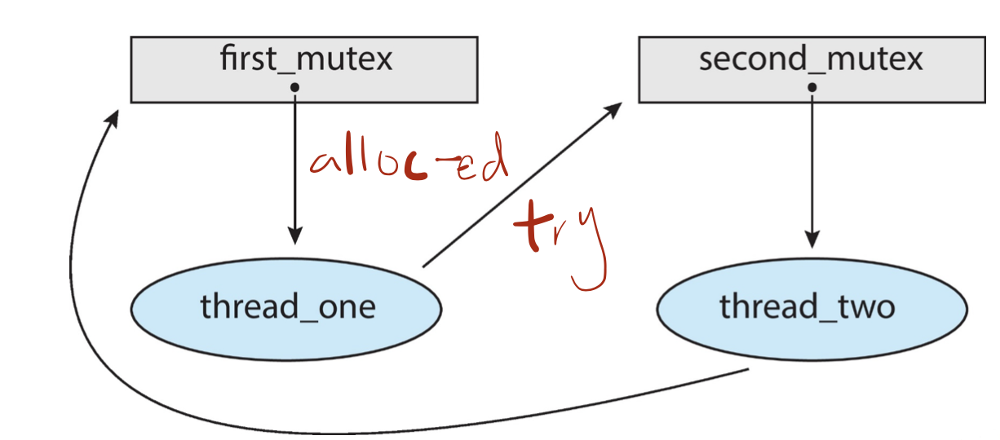


## Deadlock Characterization

Deadlock can arise if four conditions hold **simultaneously**.
- **Mutual exclusion**: only one process at a time can use a resource
- **Hold and wait**: a process holding at least one resource is waiting to acquire additional resources held by other processes
  > 请求的资源可能被其他process hold住
- **No preemption**: a resource can be released only voluntarily by the process holding it, after that process has completed its task
  > The resource should be released based on the process's will
- **Circular wait**: there exists a set {P0, P1, ..., Pn} of waiting processes such that P0 is waiting for a resource that is held by P1, P1 is waiting for a resource that is held by P2, ..., Pn–1 is waiting for a resource that is held by Pn, and Pn is waiting for a resource that is held by P0.

### Resource-Allocation Graph

A set of vertices $V$ and a set of edges $E$.
- $\mathrm{V}$ is partitioned into two types:
  - $P=\left\{P_{1}, P_{2}, \ldots, P_{n}\right\},$ the set consisting of all the processes in the system
  - $R=\left\{R_{1}, R_{2}, \ldots, R_{m}\right\},$ the set consisting of all resource types in the system
- **request edge** - directed edge $P_{i} \rightarrow R_{j}$
- **assignment edge** - directed edge $R_{j} \rightarrow P_{i}$

Example 1: No deadlock, the locks will be released in a backward-DFS order. From $T_3$

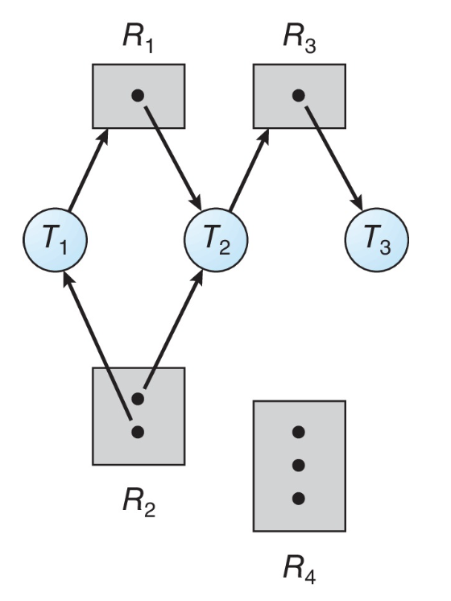

Example 2: Deadlock, $T_3$ requires $R_2$, because $R_2$'s instances are all allocated,
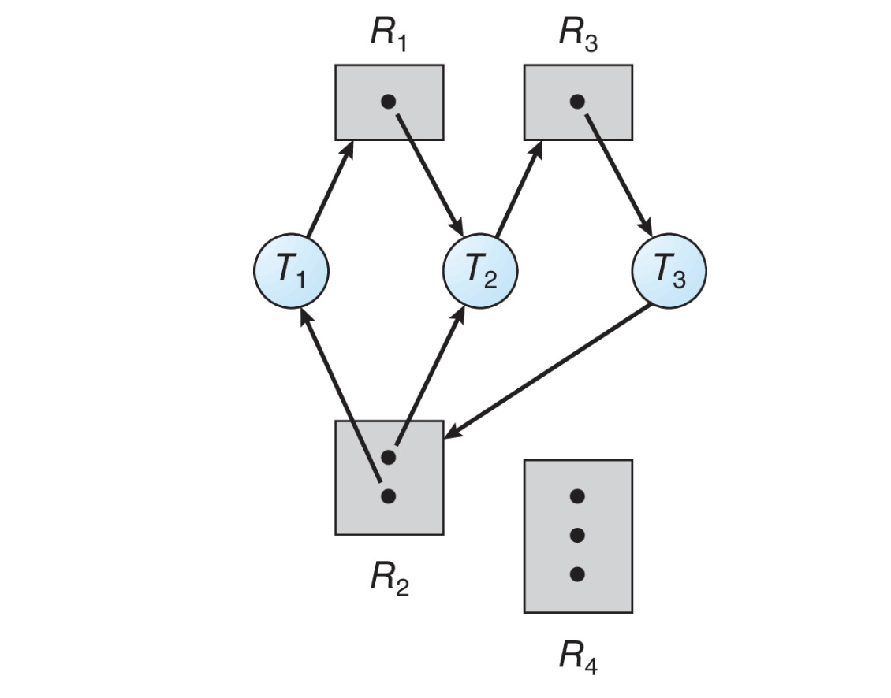

> Not simple loop, we should also check whether the loop can be unknotted, we should revisit all the paths in the graph

Example 3: Graph With A Cycle But No Deadlock

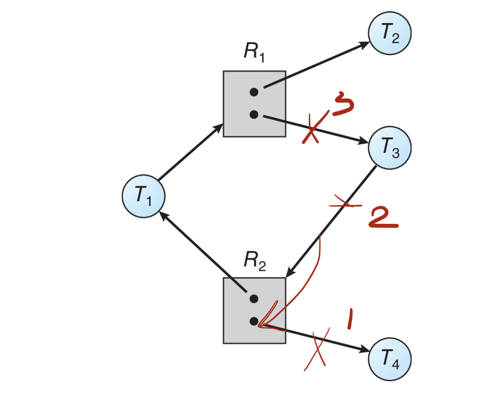

### Basic Facts

- If graph contains no cycles $\Rightarrow$ no deadlock
- If graph contains a cycle $\Rightarrow$
  - if only one instance per resource type, then deadlock
  - if several instances per resource type, possibility of deadlock
> In real system, the problem is more complicated because the graph is *dynamic*


## Methods for Handling Deadlocks
- Ensure that the system will never enter a deadlock state:
  - Deadlock prevention
  - Deadlock avoidance
    > Avoidance is an advanced version of deadlock prevention
- Allow the system to enter a deadlock state and then recover
  > The previous two totally eliminate the possibility of entering deadlock state, here it provides a policy to exit deadlock
- Ignore the problem and pretend that deadlocks never occur in the system.


## Deadlock Prevention

Invalidate one of the four necessary conditions for deadlock:
- **Mutual Exclusion** – not required for sharable resources (e.g., read-only files); must hold for non-sharable resources
  > In fact very **difficult** to erase all. But can be done for some special cases
  > Only **partially** resolve the issue
  > Not very practical
- **Hold and Wait** – must guarantee that whenever a process requests a resource, it does not hold any other resources
  > 任何一个进程请求资源时，必须保证它不能hold住其他资源
  > Two methods: ... or ...
  - Require process to request and be allocated all its resources before it begins execution, or allow process to request resources only when the process has none allocated to it.
  > deficiency:
  - Low resource utilization; starvation possible

- **No Preemption –**
  - If a process that is holding some resources requests another resource that cannot be immediately allocated to it, then all resources _currently being held are released_
  - Preempted resources are added to the list of resources for which the process is waiting
  - Process will be restarted only when it can regain its old resources, as well as the new ones that it is requesting
- **Circular Wait** – _impose a total ordering_ of all resource types, and require that each process requests resources in an increasing order of enumeration
  > Which is fully exploited in later research
  > Since it makes the least effects to scheduling issue


### Circular Wait
- Invalidating the circular wait condition is most common.
- Simply assign each resource (i.e. mutex locks) a unique number.
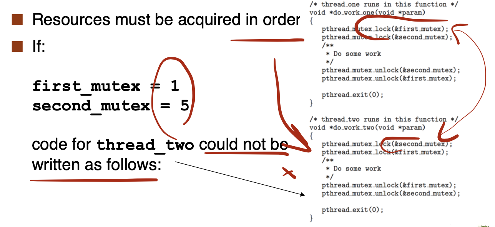

> However, it is rather difficult for programmers to fit such constraint.
> 缺乏生态


## Deadlock Avoidance

> developed from circular wait
Requires that the system has some additional **a priori** information available
- Simplest and most useful model requires that each process declare the ***maximum number*** of resources of each type that it may need
- The deadlock-avoidance algorithm dynamically examines the resource-allocation state to ensure that there can **never be a circular-wait condition**
  > decide, whether when allocating a resource to a process, it will cause a deadlock
- Resource-allocation ***state*** is defined by the number of available and allocated resources, and the maximum demands of the processes

### Safe State
- When a process requests an available resource, system must decide if immediate allocation leaves the system in a safe state
- System is in **safe state** if there exists a sequence $\left\langle P_{1}, P_{2}, \ldots\right.$ $P_{n}>$ of $\mathrm{ALL}$ the processes in the systems such that for each $\mathrm{P}_{\mathrm{i}},$ the resources that $\mathrm{P}_{\mathrm{i}}$ can still request can be satisfied by currently available resources + **resources held by all the $P_{j}$, with $j<i$**
  > so that we can schedule the processes according to the certificate order
  > 分配资源时的决定依据，是否系统还会处于一个安全状态
- That is:
  - If $\mathrm{P}_{\mathrm{i}}$ resource needs are not immediately available, then $P_{i}$ can wait until all $P_{j}$ have finished
  - When $P_{j}$ is finished, $P_{i}$ can obtain needed resources, execute, return allocated resources, and terminate
  - When $P_{i}$ terminates, $P_{i+1}$ can obtain its needed resources, and so on


### Basic Facts

- If a system is in safe state $\Rightarrow$ no deadlocks
- If a system is in unsafe state $\Rightarrow$ possibility of deadlock
- Avoidance $\Rightarrow$ ensure that a system will never enter an unsafe state.

```
+------------------------------------------+
|       unsafe         |                   |
|      +------------+  |     safe          |
|      |            |  |                   |
|      | deadlock   |  |                   |
|      |            |  |                   |
|      +------------+  |                   |
|                      |                   |
+------------------------------------------+
```

### Avoidance Algorithms


- Single instance of a resource type 
  - Use a resource-allocation graph
- Multiple instances of a resource type 
  - Use the Banker’s Algorithm

### Resource-Allocation Graph Scheme

- ***Claim edge*** $P_{i} \rightarrow R_{j}$ indicated that process $P_{i}$ may request resource $R_{j}$; represented by a dashed line
- Claim edge converts to **request edge** when a process requests a resource
- Request edge converted to an **assignment edge** when the resource is allocated to the process
- When a resource is released by a process, assignment edge reconverts to a **claim edge**
- Resources must be claimed a priori in the system

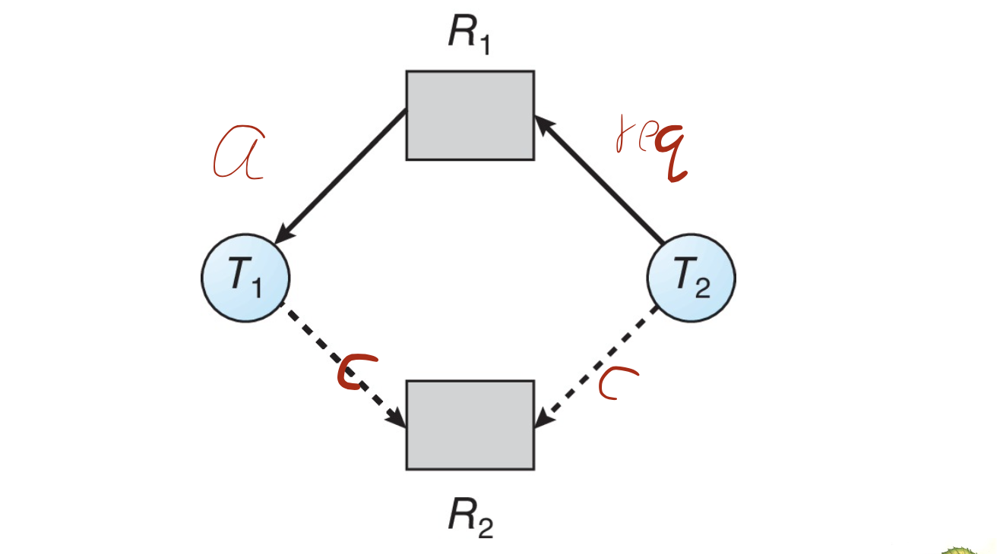
> Which process should $R_2$ be allocated to
> $T_2$ - leads to unsafe, because $T_1$ can request at any time
> 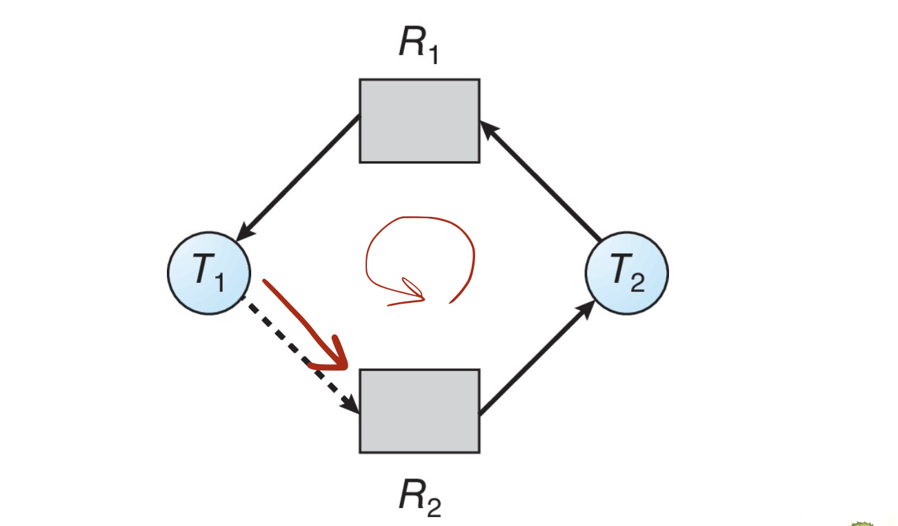


- Suppose that process $P_i$ requests a resource $R_j$
- The request can be granted only if converting the request edge to an assignment edge does not result in the formation of a cycle in the resource allocation graph


### Banker's Algorithm
> Count like a banker
- **Multiple** instances of resources
- Each process must a priori claim **maximum use**
- When a process requests a resource it may have to wait
- When a process gets all its resources it must **return them in a finite amount of time**

#### Data Structures for the Banker’s Algorithm

Let $n=$ number of processes, and $m=$ number of resources types.
- **Available**: Vector of length $m$. If $available [j]=k,$ there are $k$ instances of resource type $R_{j}$ available
- **Max**: $n \times m$ matrix. If $\operatorname{Max}[i, j]=k,$ then process $P_{i}$ may request at most $k$ instances of resource type $R_{j}$
- **Allocation**: $n \times m$ matrix. If $Allocation [i, j]=k$ then $P_{i}$ is currently allocated $k$ instances of $R_{j}$
- **Need**: $n \times m$ matrix. If $\operatorname{Need}[i, j]=k,$ then $P_{i}$ may need $k$ more instances of $R_{j}$ to complete its task
$$
\text { Need }[i, j]=\operatorname{Max}[i,]]-\text { Allocation }[i, j]
$$

> Two parts: safety algorithm + resource-request algorithm

#### Safety Algorithm
> Keep checking whether the assignment is safe, by using two temporal vectors (work~resource, finish~process) 
1. Let Work and Finish be vectors of length $m$ and $n$, respectively. Initialize:
   - `Work = Available` (no resources are allocated)
   - `Finish [i] = false `for $i=0,1, \ldots, n-1$ (no jobs are finished)
2. Find an $i$ such that both:
   - `Finish [i] = false`
   - `Need[i]` $\leq$ `Work`
     > Note, we are comparing two vectors, the $\leq$ should hold element-wise
   - If no such $i$ exists, go to step 4
3. `Work = Work` **+ Allocation\[i\]** `Finish[i] = true`, go to step 2
   > Since we can find such i, we can satisfy its need and it will terminate and release the allocated resource soon
   > That's why we need an add back.
   > Note that `Allocation` means the current holding resources by the process. It will be released for later usage
4. If `Finish [i] = true` for all $i$, then the system is in a safe state

#### Resource-Request Algorithm for Process Pi

**Request**$_i$ = request vector for process $P_i$. If $Request_i [j] = k$ then process $P_i$ wants k instances of resource type $R_j$
1. If $Request_i$ $\le$ $Need_i$ go to step 2. Otherwise, raise error condition, since process has exceeded its maximum claim
   > A simple condition check
2. If $Request_i$ $\le$ $Available$, go to step 3. Otherwise $P_i$ must wait, since resources are not available
   > Wait if not feasible
3. **Pretend** to allocate requested resources to Pi by modifying the state as follows:
   > So that we can check availability
    ```
    Available = Available – Request[i];
    Allocation[i] = Allocation[i] + Request[i];
    Need[i] = Need[i] – Request[i];
    ```
   - If safe $\Rightarrow$ the resources are allocated to $P_i$
   - If unsafe $\Rightarrow$ $P_i$ must wait, and the old resource-allocation state is restored

#### Example

- 5 processes $P_0$ through $P_4$; 
- 3 resource types:
  - A (10 instances), B (5 instances), and C (7 instances) 
- Snapshot at time $T_0$:

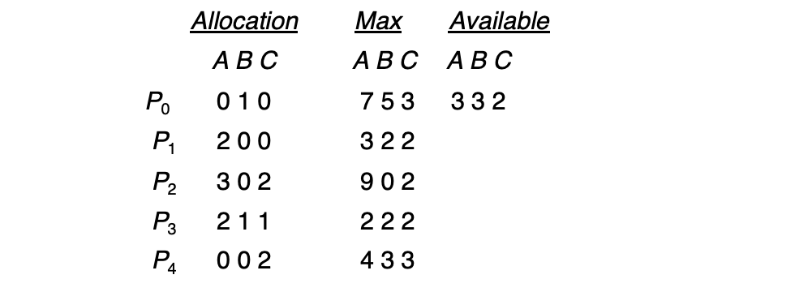

- Assume The content of the matrix Need is defined to be Max – Allocation
  

- The system is in a safe state since the sequence < P1, P3, P4, P2, P0> satisfies safety criteria
  > Checked on paper

- Assume $P_1$ has requested (1,0,2)
  - check $\le$ max, OK
  - Check that Request $\le$ Available (that is, (1,0,2) $\le$ (3,3,2) $\Rightarrow$ true
- After the "pretend" assignment, we will check whether safe
  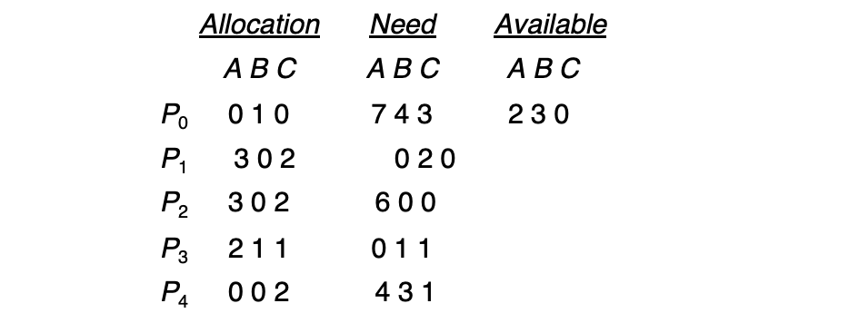
  - Executing safety algorithm shows that sequence < P1, P3, P4, P0, P2> satisfies safety requirement
  - Note, at this time, $need[1] = (0,2,0)$

- Can request for (3,3,0) by $P_4$ at $T_0$ be granted?
  > No, after assignment, $Available = (3,3,2)-(3,3,0)=(0,0,2)$. Not enough for any safety check
- Can request for (0,2,0) by $P_0$ be granted?
  > After assignment, $Available = (3,3,2)-(0,2,0)=(3,1,2)$. 
  > - Check current need, $need_3 = (0,1,1)$ OK, $(5,2,3)$, 
  > - then check $need_1 = (1,2,2)$ Ok, $(7,2,3)$
  > - ... OK safety
  > Yes

## Deadlock Detection

- Allow system to enter deadlock state 
- Detection algorithm
- Recovery scheme


### Single Instance of Each Resource Type
- Maintain wait-for graph
  - Nodes are processes
  > instead of process+resource
  - $P_i \rightarrow P_j$ if $P_i$ is waiting for $P_j$
- Periodically invoke an algorithm that searches for a cycle in the graph. If there is a cycle, there exists a deadlock
- An algorithm to detect a cycle in a graph requires an order of $n^2$ operations, where n is the number of vertices in the graph
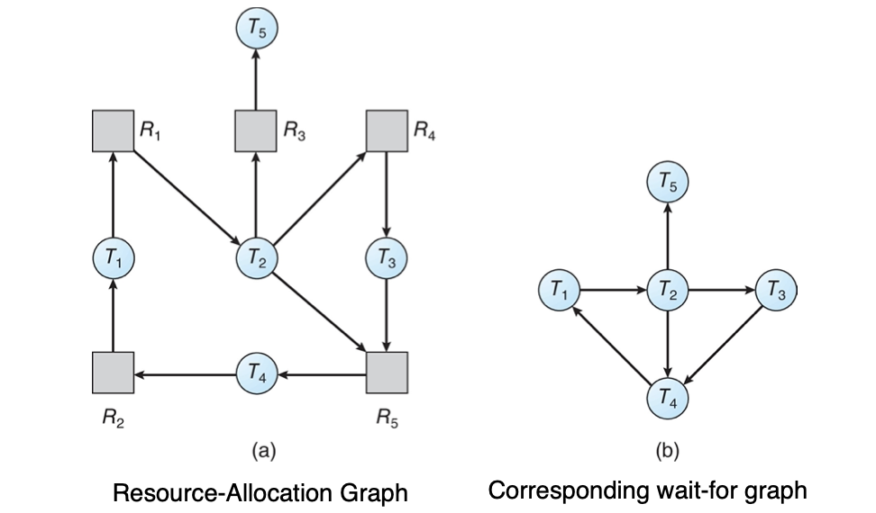

> wait-for graph will not work for multi-instances
> Moreover, when running, the period matters
> - if too long, no practical use
> - if too short, though fast detect, computation costly

### Several Instances of a Resource Type

- **Available**: A vector of length $m$ indicates the number of available resources of each type
- **Allocation**: An $n \times m$ matrix defines the number of resources of each type currently allocated to each process
- **Request**: An $n \times m$ matrix indicates the current request of each process. If Request $[\mathrm{i}][\mathrm{j}]=\boldsymbol{k},$ then process $\boldsymbol{P}_{i}$ is requesting $\boldsymbol{k}$ more instances of resource type $\boldsymbol{R}_{\boldsymbol{j}}$


#### Detection Algorithm

1. Let `Work` and `Finish` be vectors of length $\boldsymbol{m}$ and $\boldsymbol{n}$, respectively Initialize:
   - `Work = Available`
   - For $i=1,2, \ldots, n,$ if **Allocation**$_{i} \neq 0,$ then `Finish[i] = false`; otherwise, `Finish[i] = true`
2. Find an index $i$ such that both:
   - `Finish[i] = false`
   - **Request**$_{i} \leq$ `Work`
   - If no such $i$ exists, go to step 4
3. `Work = Work + Allocation[i]`
   `Finish[i] = true`
   `go to step 2`
4. If `Finish[i] == false`, for some `i`, then the system is in deadlock state. Moreover, if `Finish[i] == false`, then `P[i]` is deadlocked

> Algorithm requires an order of $O(m \times n^2)$ operations to detect whether the system is in deadlocked state


#### Example

Five processes $P_0$ through $P_4$; three resource types A (7 instances), B (2 instances), and C (6 instances)

Snapshot at time $T_0$:
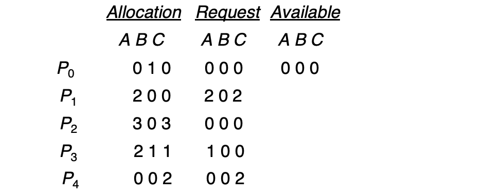

Sequence $<P0, P2, P3, P1, P4>$ will result in `Finish[i] = true` for all i


P2 requests an additional instance of type C


State of system?
- Can reclaim resources held by process $P_{0},$ but insufficient resources to fulfill other processes; requests
- Deadlock exists, consisting of processes $P_{1}, P_{2}, P_{3},$ and $P_{4}$

### Detection-Algorithm Usage
> How to use? Implementation issues:

- When, and how often, to invoke depends on:
  - How often a deadlock is likely to occur?
  - How many processes will need to be rolled back?
    - one for each disjoint cycle
- If detection algorithm is invoked every time a resource cannot be granted immediately, we can detect the cause of the deadlock, but the frequent invocation incurs large overhead
- If detection algorithm is invoked arbitrarily, there may be many cycles in the resource graph and so we _would not be able to tell which of the many deadlocked processes “caused” the deadlock._


## Recovery from Deadlock

- Abort all deadlocked processes
- Abort one process at a time until the deadlock cycle is eliminated
- In which order should we choose to abort?
  1. Priority of the process
  2. How long process has computed, and how much longer to completion
  3. Resources the process has used
  4. Resources process needs to complete
  5. How many processes will need to be terminated
  6. Is process interactive or batch?
> Rollback (to a safe state!) can be a problem

### Resource Preemption
- **Selecting a victim** – minimize cost
- **Rollback** – return to some safe state, restart process for that state
- **Starvation** – same process may always be picked as victim, include number of rollback in cost factor

