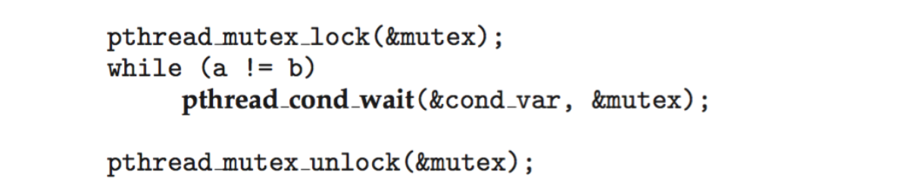

- Explain the _bounded-buffer_, _readers-writers_, and _dining philosophers synchronization_ problems.
- Describe the tools used by Linux and Windows to solve synchronization problems.
- Illustrate how POSIX and Java can be used to solve process synchronization problems.
<!--more-->


## Bounded-Buffer Problem

- n buffers, each can hold one item
- Semaphore mutex initialized to the value 1 
  > mutual exclusion for producer VS comsumer
- Semaphore full initialized to the value 0
  > buffer can't be fulfilled
- Semaphore empty initialized to the value n
  > buffer can't be empty

> When producer is filling, it has to be assured that customer can't access


### Producer Process

The structure of the producer process 
```
while (true) {
    ...
    /* produce an item in next_produced */
    ...
    wait(empty); /* initial n backspace, n--, if empty, suspend */
    wait(mutex); /* mutual exclusion, it won't be disturbed by consumer */
    ...
    /* add next produced to the buffer */
    ...
    signal(mutex);
    signal(full); /* initial 0 accessible items, if the items are full, this instruction won't execute, because producer process will be blocked at wait(empty) */
}
```

The structure of the consumer process
```
while (true) {
    wait(full);
    wait(mutex);
    ...
    /* remove an item from buffer to
        next_consumed */
    ...
    signal(mutex);
    signal(empty);
    ...
    /* consume the item in next consumed */
    ... 
}
```


## Readers-Write Problem

- A data set is shared among a number of concurrent processes
  - **Readers** - only read the dataset; they do not perform any updates
    > Reader is read only, they won't cause conflicts, needn't be blocked
  - Writers - can both read and write
    > Only one writer is accessible to shared data, when a writer is in use, no more other writers or readers can access
- Problem - allow multiple readers to read at the same time 
  - Only one single writer can access the shared data at the same time.
- Several variations of how readers and writers are considered - all involve some form of priorities
- Shared Data 
  - Dataset
  - Semaphore `rw_mutex` initialized to 1
    > Mutual Exclusion
  - Semaphore `mutex` initialized to 1
  - Integer `read_count` initialized to 0
    > How many readers are reading

### Solution

The structure of a writer process 

    while (true) {
        wait(rw_mutex);  /* other writers in access */
            ...
        /* writing is performed */
            ...
        signal(rw_mutex);
    }

The structure of a reader process
```
while (true){
    wait(mutex);
    read_count++;
    /* if multiple readers are simultaneously reading, writer can't access, guaranteed by read_count > 1 */
    if (read_count == 1)
        wait(rw_mutex); /* prevent the case that reader try to access when writer is writing*/
    signal(mutex);
        ...
        /* reading is performed */
        ...
    wait(mutex);
        read count--;
        if (read_count == 0)
            signal(rw_mutex);
    signal(mutex);
}
```
> **Idea**: `mutex` is actually protecting the `read_count` maintainence
> Priority


## Dining-Philosophers Problem

- Philosophers spend their lives alternating thinking and eating
- Don’t interact with their neighbors, occasionally try to pick up 2 chopsticks (one at a time) to eat from bowl
  - Need both to eat,then release both when done
- In the case of 5 philosophers 
  - Shareddata
    - Bowl of rice (data set)
    - Semaphore chopstick [5] initialized to 1

### First Attempt : Semaphore Solution

- Semaphore Solution
- The structure of Philosopher i:
  ```
  while (true){
       wait (chopstick[i] );
       wait (chopStick[ (i + 1) % 5] );
        /* eat for awhile */
       signal (chopstick[i] );
       signal (chopstick[ (i + 1) % 5] );
       /* think for awhile */
  }
  ```
- What is the problem with this algorithm?
  > Deadlock! if every one has picked one chopstick and waiting for another, ...

### Monitor Solution

```java
monitor DiningPhilosophers
{
    enum { THINKING; HUNGRY, EATING) state [5] ; 
    condition self [5];
    /* model the philosophers, instead of chopsticks, because we are checking both sides */


    void pickup (int i) {
        state[i] = HUNGRY;
        test(i);
        if (state[i] != EATING) self[i].wait;
    }

    void putdown (int i) {
        state[i] = THINKING;
        // test left and right neighbors
        test((i + 4) % 5);
        test((i + 1) % 5);
    }

    void test (int i) {
        if ((state[(i + 4) % 5] != EATING) &&
            (state[i] == HUNGRY) &&
            (state[(i + 1) % 5] != EATING) ) {
        /* the neighbors indicate that chopsticks are available */
            state[i] = EATING ;
            self[i].signal () ;
        } 
    }

    initialization_code() {
        for (int i = 0; i < 5; i++)
        state[i] = THINKING;
    } 
}
```

- Each philosopher `i` invokes the operations `pickup()` and `putdown()` in the following sequence:
```
DiningPhilosophers.pickup(i); 
/** EAT **/
DiningPhilosophers.putdown(i);
```
- No deadlock, but **starvation is possible**


## Kernel Synchronization - Windows


- Uses interrupt masks to protect access to global resources on uniprocessor systems
- Uses **spinlocks** on multiprocessor systems
  - Spinlocking-thread will never be preempted
- Also provides **dispatcher objects** user-land which may act mutexes, semaphores, events, and timers
  - **Events**
    > Like condition variables
    - An event acts much like a condition variable
  - **Timers** notify one or more thread when time expired
  - **Dispatcher** objects either **signaled-state** (object available) or **non-signaled** state (thread will block)
  > signaled-state: unlocked
  > non-signaled-state: blocked
Mutex dispatcher object


## Linux Synchronization

- Linux:
  - Prior to kernel Version 2.6, **disables interrupts** to implement short critical sections
  - Version 2.6 and later, fully preemptive
  > Recall CPU scheduling, a similar revolution takes place at 2.6
- Linux provides:
  - Semaphores
  - atomic integers
  - spinlocks
  - reader-writer versions of both
- On single-CPU system, spinlocks replaced by enabling and disabling kernel preemption

- Atomic variables - `atomic_t` is the type for atomic integer
- Consider the variables
  ```
  atomic_t counter;
  int value;
  ```


## POSIX Synchronization

- POSIX API provides 
  - mutex locks
  - semaphores
  - condition variable
- Widely used on UNIX, Linux, and macOS

### POSIX Mutex Locks

Creating and initializing the lock

Creating and initializing the lock


### POSIX Semaphores
- POSIX provides two versions - named and unnamed. 
- Named semaphores can be used by unrelated processes, unnamed cannot.

Named Semaphores
- Creating an initializing the semaphore:

- Another process can access the semaphore by referring to its name SEM.
- Acquiring and releasing the semaphore:


Unnamed Semaphores
- Creating an initializing the semaphore:

- Acquiring and releasing the semaphore:


### Condition Variables

Thread waiting for the condition a == b to become true:


Thread signaling another thread waiting on the condition variable:


> POSIX doesn't support monitor, while java does


## Java Synchronization

- Java provides rich set of synchronization features: 
  - Java monitors
  - Reentrant locks
  - Semaphores
  - Condition variables

### Java Monitors


- Every Java object has associated with it a single lock.
- If a method is declared as `synchronized`, a calling thread must own the lock for the object.
- If the lock is owned by another thread, the calling thread must wait for the lock until it is released.
- Locks are released when the owning thread exits the `synchronized` method.


### Entry Set and Wait Set

A thread that tries to acquire an unavailable lock is placed in the object’s entry set:


- Similarly, each object also has a wait set.
- When a thread calls `wait()`:
  1. It releases the lock for the object
  2. The state of the thread is set to blocked
  3. The thread is placed in the wait set for the object


> Why wait sets?
> - Those who acquired the locks and enter the critical set, may need other locks to finish the task.
> - For theses jobs, they are actually still waiting, Java's strategy is that their locks will be released, but put into the **wait set**
> - The jobs in the wait set are those jobs that already acquired the locks, so when their new locks are acquired, they should finish their jobs
> - The wait set is thus used to distinguish these jobs with the other jobs.

> How to implenet signal? (in Java, `notify()`)

- A thread typically calls wait() when it is waiting for a condition to become true.
- How does a thread get notified?
- When a thread calls `notify()`:
  1. An arbitrary thread T is _selected from the wait set_
  2. T is moved from the wait set to the entry set
  3. Set the state of T from blocked to runnable.
- T can now compete for the lock to check if the condition it was waiting for is now true.


> Exception system is typically used in sync solutions

### Java Reentrant Locks

- Similar to mutex locks
- The finally clause ensures the lock will be released in case an exception occurs in the try block.

> Any Exception (which will disturb the control flow) will be handled through `key.unlock()` in finally clause

### Java Semaphores
Constructor: `Semaphore(int value);`
Usage: 


### Java Condition Variables

Omitted


## Alternative Approaches

### Transactional Memory

Consider a function `update()` that must be called **atomically**. One option is to use mutex locks:


**A memory transaction** is a sequence of read-write operations to memory that are performed atomically. A transaction can be completed by adding `atomic{S}` which ensure statements in S are executed atomically:


### OpenMP

OpenMP is a set of compiler directives and API that support parallel progamming.


The code contained within the `#pragma omp critical` directive is
treated **as a critical section and performed atomically**.


### Functional Programming Lanaguages

- Functional programming languages offer a different paradigm than procedural languages in that they do not maintain state.
- Variables are treated as immutable and cannot change state once they have been assigned a value.
- There is increasing interest in functional languages such as Erlang and Scala for their approach in handling data races.