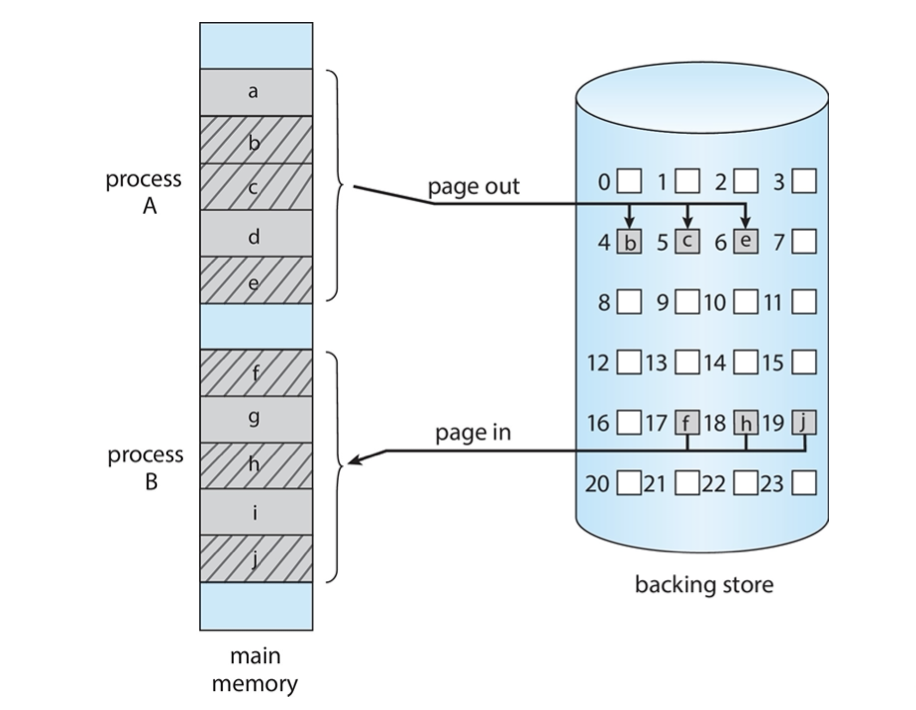

- To provide a detailed description of various ways of organizing memory hardware
- To discuss various memory-management techniques,
- To provide a detailed description of the Intel Pentium, which supports both pure segmentation and segmentation with paging

<!-- more -->


## Background


- Program must be brought (from disk) into memory and placed within a process for it to be run
- Main memory and registers are only storage CPU can access directly
- Memory unit only sees a stream of: 
  - addresses + read requests, or
  - address + data and write requests
- Register access is done in one CPU clock (or less)
- Main memory can take many cycles, causing a **stall**
- **Cache** sits between main memory and CPU registers
- Protection of memory required to ensure correct operation

### Protection

- Need to censure that a process can only access those addresses in its address space.
- We can provide this protection by using a pair of **base** and **limit registers** define the logical address space of a process


### Hardware Address Protection

- CPU must check every memory access generated in user mode to be sure it is between base and limit for that user


- the instructions to loading the base and limit registers are privileged

### Address Binding

- Programs on disk, ready to be brought into memory to execute form an **input queue**
  - Without support, must be loaded into address 0000
- Inconvenient to have first user process physical address always at 0000
  - How can it not be?
- Addresses represented in different ways at different stages of a program's life
  - Source code addresses usually symbolic
  - Compiled code addresses **bind** to relocatable addresses
    - i.e. "14 bytes from beginning of this module"
  - **Linker or loader will bind** _relocatable addresses_ to _absolute addresses_
    - i.e. 74014
  - Each binding maps one address space to another


### Binding of Instructions and Data to Memory

- Address binding of instructions and data to memory addresses can happen at three different stages
  -  Compile time: If memory location known a priori, _absolute code_ can be generated; must _recompile_ code if starting location changes
  - Load time: Must generate _relocatable code_ if memory location is not known at compile time
  - Execution time: **Binding delayed until run time** if the process _can be moved during its execution_ from one memory segment to another
    - Need hardware support for address maps (e.g., base and limit registers)

### Multistep Processing of a User Program


### Logical vs. Physical Address Space
> physical address space may be limited, but a program may need more than that
- The concept of a logical address space that is bound to a separate **physical address space** is central to proper memory management
  - **Logical address** - _generated by the CPU_; also referred to as virtual address
  - **Physical address** - address seen by the memory unit
- Logical and physical addresses are the same in compile-time and load-time address-binding schemes; logical (virtual) and physical addresses differ in execution-time address-binding scheme
- **Logical address space** is the set of all logical addresses generated by a program
- **Physical address space** is the set of all physical addresses generated by a program


### Memory-Management Unit (MMU)
> To accelerate translation of address, it is implemented by HW

- Hardware device that at run time maps virtual to physical address


- Many methods possible, covered in the rest of this chapter
- Consider simple scheme. which is a generalization of the base-register scheme.
- The base register now called **relocation register**
- The value in the relocation register is added to every address generated by a user process at the time it is sent to memory
- The user program deals with *logical* addresses; it never sees the real *physical* addresses
  - Execution-time binding occurs when reference is made to location in memory
  - Logical address bound to physical addresses

#### Example of MMU

> 14000 (base) + 346 (relocatable address) = 14356


### Dynamic Loading

- The entire program does need to be in memory to execute 
  - Sizes of process may be limit by the size of memory?
- Routine is _not loaded until it is called_
  > One is that it conforms to programming intuition, the other is that it saves memory space
  - Better memory-space utilization; unused routine is never loaded
  - All routines kept on disk in relocatable load format
- Useful when large amounts of code are needed to handle infrequently occurring cases
- No special support from the operating system is required
  - Implemented through program design
  - OS can help by providing libraries to implement dynamic loading

### Dynamic Linking
> Load is after linking, what if we put backward the dynamic phase? (for better performance)

- **Static linking** - system libraries and program code combined by the loader into the binary program image
- Dynamic linking -_linking postponed until execution time_
  - Small piece of code, **stub**, used to locate the appropriate memory-resident library routine
  - Stub replaces itself with the address of the routine, and executes the routine
- Operating system _checks if routine is in_ processes’ memory address 
  - If not in address space, add to address space
- Dynamic linking is particularly useful for libraries
- System also known as **shared libraries**, by need _OS’s help_
- Consider applicability to patching system libraries
  - **Versioning** may be needed
  > Most cases where 'segment error' occurs


## Contiguous Memory Allocation
> Early convention for allocating address

- Main memory must support both OS and user processes 
- Limited resource, must allocate efficiently
- Contiguous allocation is one early method
- Main memory usually into two **partitions**:
  - Resident operating system, usually held in low memory with interrupt vector
  - User processes then held in **high memory** 
  - Each process contained in single contiguous section of memory
> User process high->low, system low->high address
> every process has contiguous space

- Relocation registers used to protect user processes from each other, and from changing operating-system code and data
  - Base register contains value of smallest physical address
  - Limit register contains range of logical addresses - each logical address must be less than the limit register
  - MMU maps logical address dynamically
> Basic Principles as described above

### Hardware Support for Relocation and Limit Registers
within MMU, ...


### Variable Partition
> If contiguous, some may require more while others don't need such large space
> It is necessary to support variable address segment

- Multiple-partition allocation
  - Degree of multiprogramming limited by number of partitions
  - **Variable-partition** sizes for efficiency (sized to a given process’ needs)
  - **Hole** - block of available memory; holes of various size are scattered throughout memory
  - When a process arrives, it is allocated memory from a hole large enough to accommodate it
  - Process exiting frees its partition, adjacent free partitions combined
  - Operating system maintains information about:
    a) allocated partitions b) free partitions (hole)

> As time grows, many fragments in memory space will be small

### Solution for Dynamic Storage-Allocation Problem
> One solution, when allocating, make as few fragments as possible
How to satisfy a request of size n from a list of free holes? 
- **First-fit**: Allocate the ***first*** hole that is big enough
  > does not resolve fragmentation at all
- **Best-fit**: Allocate the ***smallest*** hole that is big enough; must search entire list, unless ordered by size
  - Produces the smallest leftover hole
  > needs to scan the memory space
  > but a table can be maintained!
- **Worst-fit**: Allocate the ***largest*** hole; must also search entire list
  - Produces the largest leftover hole
> First-fit and best-fit better than worst-fit in terms of speed and storage utilization
> needs experiments to decide which better
### Fragmentation


- **External Fragmentation** - total memory space exists to satisfy a request, but it is not contiguous
  > Not contiguous
- **Internal Fragmentation** - allocated memory may be slightly larger than requested memory; this size difference is memory internal to a partition, but not being used
  > Redudant space for a particular process
- First fit analysis reveals that given N blocks allocated, 0.5 N blocks lost to fragmentation
  - 1/3 may be unusable -> **50-percent rule**
- Reduce **external** fragmentation by **compaction**
  - Shuffle memory contents to place all free memory together in one large block
  - Compaction is possible _**only if relocation is dynamic**_ ,and is done at execution time


## Paging
> The limitation of contiguous memory for early OS is such that we introduce paging
- Physical address space of a process can be noncontiguous; process is allocated physical memory whenever the latter is available
  - Avoids external fragmentation
  - Avoids problem of varying sized memory chunks
- Divide **physical memory** into fixed-sized blocks called **frames**
  - Size is power of 2,between 512 bytes and 16 Mbytes
- Divide **logical memory** into blocks of _same size_ called **pages**
- Keep track of all free frames
- To run a program of size N pages, need to find N free frames and load program
- Set up a **page table** to translate logical to physical addresses
- Still have *Internal* fragmentation

> Still far from modern OS practice

### Address Translation Scheme

- Address generated by CPU is divided into:
- Page number $(p)$ - used as an index into a page table which contains base address of each page in physical memory
- Page offset (d) - combined with base address to define the physical memory address that is sent to the memory unit
```
   page number             +         page offset
                           |
+------------------------------------------------------+
|         p                |             d             |
+------------------------------------------------------+
       m-n length          |         n length
                           +

```
- For given logical address space $2^m$ and page size $2^n$


### Paging Hardware


> Page table establishes a 1-to-1 correspondence from logical mem to physical mem
> 
> Logical address: $\mathrm{n}=2$ and $\mathrm{m}=4 .$ Using a page size of 4 bytes and a physical memory of 32 bytes ( 8 pages)
> 


### Paging - Calculating Internal Fragmentation
- Page size $=2,048$ bytes
- Process size $=72,766$ bytes
- 35 pages +1,086 bytes
- Internal fragmentation of $2,048-1,086=962$ bytes
- Worst case fragmentation $=1$ frame -1 byte
- On average fragmentation $=1 / 2$ frame size
- So small frame sizes desirable?
- But each page table entry takes memory to track
- Page sizes growing over time
  - Solaris supports two page sizes - 8 KB and 4 MB
  > In the Middle Age of OS, two page sizes are adopted


## Implementation of Page Table

- Page table is kept in main memory
  - **Page-table base register (PTBR)** points to the page table
  - **Page-table length register (PTLR)** indicates size of the page table
  > because we need to know whether an address is inside of a page
- In this scheme every data/instruction access requires **two** memory accesses
  - One for the page table and one for the data / instruction
  > 1. check table for add, 2. for real data
  > Solution: Hardware cache (like cache)
- The two memory access problem can be solved by the use of a special fast-lookup hardware cache called **translation look-aside buffers (TLBs)** (also called **associative memory**).

### Translation Look-Aside Buffer

- Some TLBs store address-space identifiers (ASIDs) in each TLB entry - uniquely identifies each process to provide address-space protection for that process
  - Otherwise need to flush at every context switch
- TLBs typically small (64 to 1,024 entries)
- On a TLB **miss**, value is loaded into the TLB for faster access next time
  - Replacement policies must be considered
  - Some entries can be **wired down**(断电) for permanent fast access


### Paging Hardware with TLB
> Basically same as memory cache
- Associative memory - **parallel** search
    
- Address translation (p, d)
  - If p is in associative register, get frame # out
  - Otherwise get frame # from page table in memory


### Effective Access Time
- Hit ratio - percentage of times that a page number is found in the TLB
- An $80 \%$ hit ratio means that we find the desired page number in the TLB $80 \%$ of the time.
- Suppose that 10 nanoseconds to access memory.
  - If we find the desired page in TLB then a mapped-memory access take 10 ns
  - Otherwise we need two memory access so it is 20 ns
> Failure to find the address in TLB means a double access of memory
- **Effective Access Time (EAT)**
    $$
    \mathrm{EAT}=0.80 \times 10+0.20 \times 20=12 \text { nanoseconds }
    $$
  implying $20 \%$ slowdown in access time
- Consider amore realistic hit ratio of $99 \%$
    $$
    \mathrm{EAT}=0.99 \times 10+0.01 \times 20=10.1 \mathrm{nS}
    $$
  implying only $1 \%$ slowdown in access time.

> Since the locality of program instructions are fairly good, the hit ratio can be very high w.r.t. EAT of TLB

### Memory Protection
> Another usage of TLB is Memory Protection
- Memory protection implemented by associating protection bit with each frame to indicate if read-only or read-write access is allowed
  - Can also add more bits to indicate page executy-only,and so on
- **Valid-invalid** bit attached to each entry in the page table:
  - “valid” indicates that the associated page is in the process’ logical address space, and is thus a legal page
  - “invalid” indicates that the page is not in the process’ logical address space
  - Or use **page-table length register (PLTR)**
  > So that the kernel can notice such invalid requests
- Any violations result in a trap to the kernel


> The valid space that should be alotted to every process will be discussed in the next chapter

### Shared Pages
> The shared resources in OS can also be extended to the page level


- **Shared code**
  - One copy of read-only (**reentrant**) code shared among processes (i.e., text editors, compilers, window systems)
  > Resources that won't need sync
  - Similar to multiple threads sharing the same process space
  - Also useful for interprocess communication if sharing of read-write pages is allowed
- **Private code and data**
  - Each process keeps a separate copy of the code and data
  - The pages for the private code and data can appear anywhere in the logical address space

> The features above can be implemented in the page table through a signal bit.
> 


## Structure of the Page Table

- Memory structures for paging can _get huge using straight-forward methods_
- Consider a 32-bit logical address space as on modern computers
- Page size of 4KB ($2^12$)
- Page table would have 1 million entries ($2^32 / 2^12$)
- If each entry is 4 bytes $\Rightarrow$ each process **4 MB** of physical address space for the page table alone
  - Don’t want to allocate that contiguously in main memory
- One simple solution is to divide the page table into smaller units
  - Hierarchical Paging 
  - Hashed Page Tables 
  - Inverted Page Tables

### Hierarchical Page Tables

- Break up the logical address space into multiple page tables
- A simple technique is a two-level page table
- We then page the page table


> Shrink M-level to K-level page tables

#### Two-Level Paging Example

- A logical address (on 32-bit machine with 1K page size) is divided into: 
- a page number of 20 bits
- a page offset of 12 bits
- Since the page table is paged, the page number is further divided into: 
- a 10-bit page number
- a 10-bit page offset
- Thus, a logical address is as follows:
  
- where p1 is an index into the outer page table, and p2 is the displacement within the page of the inner page table
- Known as **forward-mapped page** table

> Pros: Shrinking size
> Cons: Extra access time
> 
> Time trade-off space


#### 64-bit Logical Address Space
> Even two-level paging scheme not sufficient
- If page size is 4 KB (212)
  - Then page table has $2^{52}$ entries
  - If two level scheme, inner page tables could be $2^{10}$ 4-byte entries
  - Address would look like
    
  - Outer page table has $2^{42}$ entries or $2^{42}$ bytes
  - One solution is to add a 2nd outer page table
  - But in the following example the 2nd outer page table is still $2^{34}$ bytes in size
    - And possibly 4 memory access to get to one physical memory location
- Three-level Paging Scheme
  - 
  - 

### Hashed Page Tables
> Most programs will not use such a large memory space. The page table is very sparse
> ----> Hashed page tables

- Common in address spaces > 32 bits
- The virtual page number is hashed into a page table
  - This page table contains a chain of elements hashing to the same location
- Each element contains (1) the virtual page number (2) the value of the mapped page frame (3) a pointer to the next element
- Virtual page numbers are compared in this chain searching for a match
  - If a match is found, the corresponding physical frame is extracted
- Variation for 64-bit addresses is clustered page tables
  - Similar to hashed but each entry refers to several pages (such as 16) rather than 1
  - Especially useful for **sparse** address spaces (where memory references are non-contiguous and scattered)


### Inverted Page Table
> Since page cnts >> frame cnts, since the frame cnts are determined, we can create an inverted page table
- Rather than each process having a page table and keeping track of all possible logical pages, track all physical pages
- One entry for each real page of memory
- Entry consists of _the virtual address of the page stored in that real memory location_, with _information about the process that owns that page_
> How to search?
- Decreases memory needed to store each page table, but increases time needed to **search** the table when a page reference occurs
- Use hashtable to limit the search to one — or at most a few— page-table entries
  - TLB can accelerate access
- But how to implement shared memory?
  - One mapping of virtual address to the shared physical address
 

> HW support: e.g. Content Addressable Memory
> originates in router/...
> Traditional Memory: input index, activate the memory unit according to its index(row num/col num), read its content
> CAM: input content, activate the unit that match the content (together with its affilitaed information), output.
> Modern Processors typically have implemented  Content Addressable Memory into TLB to support searching in inverted page table
> CAM is getting growing importance **(useful for search and match problems!)**


## Swapping
> When memory is not enough?
- A process can be **swapped** temporarily out of memory to a backing store, and then brought back into memory for continued execution
  - Total physical memory space of processes can exceed physical memory
> Sometimes corresponding to the context switch in processor
> Because both the memory space & the processes on CPU are limited in HW, but available in SW(OS) notions.
- **Backing store** - fast disk large enough to accommodate copies of all memory images for all users; must provide direct access to these memory images
- **Roll out, roll in** - swapping variant used for priority-based scheduling algorithms; lower-priority process is swapped out so higher-priority process can be loaded and executed
- Major part of swap time is transfer time; total transfer time is directly proportional to the amount of memory swapped
- System maintains a **ready queue** of ready-to-run processes which have memory images on disk


- Does the swapped out process need to swap back _in to same physical_ addresses?
  - **Depends** on address binding method
    - E.g. shared(yes) or individual(not necessarily)
    - Plus consider pending I/O to / from process memory space
- Modified versions of swapping are found on many systems (i.e., UNIX, Linux, and Windows)
  - Swapping **normally disabled**
  - Started if more than threshold amount of memory allocated
  - Disabled again once memory demand reduced below threshold


### Context Switch Time including Swapping
> In early stages, swapping always come with context switch (for those switched away will always be more likely to be swapped out)
> However, finer grain is better

- If next processes to be put on CPU is not in memory, need to swap out a process and swap in target process
> Recall, in previous lectures we didn't consider the cost of swapping
- Context switch time can then be very high
- 100MB process swapping to hard disk with transfer rate of 50MB/sec
  - Swap out time of 2000 ms
  - Plus swap in of same sized process
  - Total context switch swapping component time of 4000ms (4 seconds)
- Can reduce if reduce size of memory swapped - by knowing how much memory really being used
  - System calls to inform OS of memory use via `request_memory()` and `release_memory()`
 

> Context Switch Time mainly caused by Swapping

- **Other constraints** as well on swapping
  - Pending I/O - can’t swap out as I/O would occur to wrong process
  > external interrupt waiting for IO to return, may be written into an invalid address swapped out
  > One solution, put returned data into kernel space (which will never be swapped out) (double buffering) (extra overhead)
  - Or always transfer I/O to kernel space, then to I/O device
    - Known as double buffering, adds overhead
- *Standard swapping not used in modern operating systems*
  - But modified version common
    - Swap only when free memory extremely low
    - or finer-grained swapping

### Swapping on Mobile Systems
> Interaction is more important (than steadiness/performance, no disk)
> Endurance issue: frequent swipe/write will reduce endurance
> How to deal with full memory? (/wo swapping)
- Not typically supported 
  - Flash memory based (non-volatile)
    - Small amount of space
    - Limited number of write cycles
    - Poor throughput between flash memory and CPU on mobile platform
- Instead use other methods to free memory if low
  - iOS ***asks*** apps to voluntarily relinquish allocated memory
    - Read-only data thrown out and reloaded from flash if needed
    - Failure to free can result in termination
  - Android terminates apps if low free memory, but first writes **application state** to flash for fast restart
  - Both OSes support paging as discussed below


### Swapping with Paging
> An improvement, when a process is switched out, we don't swap all of its memory, only substitute a few pages. The throughput of main memory and disc is less
> A difference in terminologies: page out/ page in



## Example: The Intel 32 and 64-bit Architectures 
- Dominant industry chips
- Pentium CPUs are 32-bit and called IA-32 architecture
- Current Intel CPUs are 64-bit and called IA-64 architecture
- Many variations in the chips, cover the main ideas here

- Supports both segmentation and segmentation with paging
  - Each segment can be 4 GB
  - Up to 16 K segments per process 
  - Divided into two partitions
    - First partition of up to 8 K segments are private to process (kept in **local descriptor table (LDT)**)
    - Second partition of up to 8K segments shared among all processes (kept in **global descriptor table (GDT)**)


- CPU generates logical address
  - Selector given to segmentation unit
    - Which produces linear addresses
    - 
  - Linear address given to paging unit
    - Which generates physical address in main memory
    - Paging units form equivalent of MMU 
    - Pages sizes can be 4 KB or 4 MB

### Page Address Translation


### IA-32 Page Address Extensions

- 32-bit address limits led Intel to create **page address extension (PAE)**, allowing 32-bit apps _access to more than 4GB of memory space_
  - Paging went to a _3-level scheme_
  - Top two bits refer to a **page directory pointer table**
  - Page-directory and page-table entries moved to 64-bits in size
  - Net effect is increasing address space to 36 bits - 64GB of physical memory


### Intel x86-64

- Current generation Intel x86 architecture
- 64 bits is ginormous (> 16 exabytes)
- In practice _only implement 48 bit addressing_
  - Page sizes of 4KB, 2MB, **1GB**
  - **Four** levels of paging hierarchy
- Can also use PAE so virtual addresses are 48 bits and physical addresses are 52 bits

> For 1G page size, can only access 1 level of page table


## Example: ARMv8 Architecture
> ~~~~~Omitted~~~~~
- Dominant mobile platform chip (Apple iOS and Google Android devices for example)
- Modern, energy efficient, 32-bit CPU
- 4KBand16KBpages
- 1 MB and 16 MB pages (termed sections)
- One-level paging for sections, two- level for smaller pages
- Two levels of TLBs
  - Outer level has two micro TLBs (one data, one instruction)
  - Inner is single main TLB
  - First inner is checked, on miss outers are checked, and on miss page table walk performed by CPU

