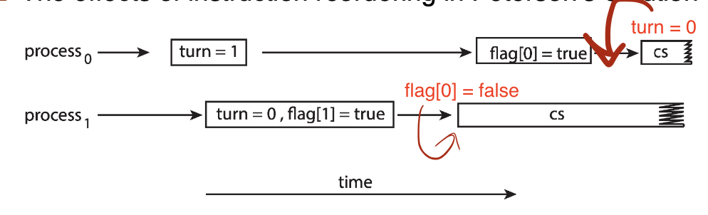

# Test Yourself (Part 2)

<!-----
title: 【System Engineering】Test Yourself (Part 2)
url: se2-test
date: 2020-12-26 18:00:47
tags: 
- System Engineering

categories: 
- Courses

----->


Last Updated Dec 26, 10:00 PM

[toc]


<!--more-->

## Sync Tools

### Describe the Critial Section problem

- Consider system of n processes $\{p_0, p_1, ... p_{n-1}\}$
- Each process has **critical section** segment of code
  - Process may be changing common variables, updating table, writing file, etc
  > e.g. pid allocation, write files, update table ...
  - _When one process in critical section, no other may be in its critical section_
- **Critical section problem** is to _design **protocol** to solve this_
- Each process must ask permission to enter critical section in **entry section**, may follow critical section with **exit section**, then **remainder section**
- General structure of process Pi


### What is the requirement to Critical Section Problem (3')

1. **Mutual Exclusion** - If process Pi is executing in its critical section, then no other processes can be executing in their critical sections
2. **Progress** - If no process is executing in its critical section and there exist some processes that wish to enter their critical section, then _only those processes that are not executing in their remainder sections can enter the critical section next_, this selection cannot be postponed indefinitely
   - 不可以一直出于critical section中，需要执行remainder，确保其他等待中的进程有机会进入
3. **Bounded Waiting** - A bound must exist on the number of times that other processes are allowed to enter their critical sections after a process has made a request to enter its critical section and before that request is granted
   - 当前critical section，持续使用的时间是受限的，
   - 发出请求的进程，不能让步给其他进程无限多次，防止队列无限增长
   - Assume that each process executes at a nonzero speed
   - No assumption concerning relative speed of the n processes

### Illustrate a race condition using Client and Server

```cpp
while (true) {
      /* produce an item in next produced */
      while (counter == BUFFER_SIZE)
            ; /* do nothing, wait until the buffer is available */
      buffer[in] = next_produced;
      in = (in + 1) % BUFFER_SIZE;
      counter++;
}
```

```cpp
while (true) {
      while (counter == 0)
            ; /* do nothing, wait until the buffer has something */
      next_consumed = buffer[out];
      out = (out + 1) % BUFFER_SIZE;
      counter--;
      /* consume the item in next consumed */
}
```

- `counter++` could be implemented as
```
register1 = counter
register1 = register1 + 1
counter = register1
```
- `counter--` could be implemented as
```
register2 = counter
register2 = register2 - 1
counter = register2
```
- Consider this execution interleaving with “count = 5” initially:
  > An undeterministic issue 
```
S0: producer execute register1 = counter            {register1 = 5}
S1: producer execute register1 = register1 + 1      
{register1 = 6, but does not write back to counter cache} 
S2: consumer execute register2 = counter            {register2 = 5}
S3: consumer execute register2 = register2 – 1      {register2 = 4}
S4: producer execute counter = register1            {counter = 6 }
S5: consumer execute counter = register2            {counter = 4}
```
- inconsistency happens!
  - one not write back, the other read


### Illustrate a race condition using Fork


- Processes P0 and P1 are creating child processes using the `fork()` system call
- Race condition on _kernel variable_ `next_available_pid` which represents the next available process identifier (pid)
- Unless there is **mutual exclusion**, the same pid could be assigned to two different processes!


> Actually, in OS, a lot sync work is required
> We should always ensure **mutual exclusion**


> Generally, one not write back, but scheduled away


### The General Critical-Section Handling Types in OS (2')

- Two approaches depending on if kernel is preemptive or non- preemptive
  - Preemptive – allows preemption of process when running in kernel mode
  - Non-preemptive – runs until exits kernel mode, blocks, or voluntarily yields CPU
    - Essentially free of race conditions in kernel mode
    > Though simple, modern OS won't take this approach


### What is Peterson's Solution

准备好了就让给对方，自己hold，直到对方没准备好，或者对方让给自己了
Keypoint: First `flag[self]=true` Then `turn=other`
Holding if `flag[other] && turn==other`
> A mathematical/theoritical solution, but won't be actually adopted by modern OS

- Not guaranteed to work on modern architectures! (But good algorithmic description of solving the problem)
- Two process solution
- Assume that the `load` and `store` machine-language instructions are **atomic**; that is, cannot be interrupted
  > but in fact, leads to low performance
- The two processes share two variables:
  - `int turn`; (轮到谁了)
  - `boolean flag[2]` （准备好了吗？）
- The variable `turn` indicates whose turn it is to enter the critical section
- The `flag` array is used to indicate if a process is ready to enter the critical section. flag[i] = true implies that process Pi is ready!
- Algorithm for Process Pi
```cpp
while (true){
      flag[i] = true;
      turn = j;
      while (flag[j] && turn == j); /* waiting for j to execute, j is executing critical */
      /* ... critical section ....*/
      flag[i] = false;
      /* ... remainder section ....*/
}
```

> 看谁先执行到`turn=对方`，谁先等
> when `i` is executing, it gives the turn to `j`, we can make sure that `i` won't run twice, because after running, it will give turn to `j`
> If no turn, only flag, condition 2 won't be satisfied.

- Provable that the three CS requirement are met:
1. Mutual exclusion is preserved Pi enters CS only if: either `flag[j] = false or turn = i`
2. Progress requirement is satisfied
3. Bounded-waiting requirement is met *(the bound is 1)*


### Why is Peterson's Solution impractical, example

- Although useful for demonstrating an algorithm, Peterson’s Solution is not guaranteed to work on modern architectures.
- To improve performance, processors and/or **compilers may reorder operations that have no dependencies**
 > But for Peterson's implementation, it is likely that `flag = true` and `turn=j` will be reordered
- For single-threaded this is ok as the result will always be the same.
- For multithreaded the reordering may produce inconsistent or unexpected results!
- Example
  
  This allows **both processes to be in their critical section** at the same time!


### How to use Mutex Locks

- Definitions (atomically defined)
  ```
  acquire() {
    while (!available)
        ; /* busy wait */
    available = false;;
  }
  
    release() {
        available = true;
  }
  ```
- But requires busy waiting
- Usage
  ```
  while (true) {
      acquire lock /* critical section */
      release lock
      /* remainder section */
  }
  ```

### How to use semaphores S
> E.g. in producer/consumer, buffer size is equivalent to s
> when s = 1, equivalent to mutex
- Definitions (atomically defined)
  ```
  wait(S) {
      while (S <= 0)
        ; // busy wait
      S--;
  }
  signal(S) {
      S++;
  }
  ```


### What is the problem with semaphores or mutex locks

- Correct Use:
  - `acquire(mutex) + critical section + release(mutex)`
  - `wait(semaphore) + critical section + signal(mutex)`
- Users are easy to write bugs if incorrect use of operations


### How monitor function

- Only one process may be active within the monitor at a time
- condition x, y;
- Two operations are allowed on a condition variable:
  - `x.wait()` – a process that invokes the operation is suspended until `x.signal()`
    i.e. enter the waiting queue of x
  - `x.signal()` – resumes one of processes (if any) that invoked x.wait()
    - If no `x.wait()` on the variable, then it has no effect on the variable


## Sync Examples

### What is Bounded-Buffer Problem and How to solve

n buffers, each can hold one item, consumer consumes items, procuder produces items

Solution
- semaphore `mutex(1)`
- semaphore `full(0)`
- semaphore `empty(n)`

> Note: what consumer and procuder should wait and signal !!


Producer
```
while (true) {
  /* producer process */
  wait(empty);
  wait(mutex);
  /* add next produced to buffer */
  signal(mutex);
  signal(full);
}
```
Consumer
```
while (true) {
    wait(full);
    wait(mutex);
    ...
    /* remove an item from buffer to next_consumed */
    ...
    signal(mutex);
    signal(empty);
    ...
    /* consume the item in next consumed */
    ... 
}
```

### What is Readers-Write Problem and How to solve

- Readers: read only, shouldn't be blocked
- Writers: both read and write, only one is online
- Solution
  - semaphore `rw_mutex(1)`
  - semaphore `mutex(1)`
  - `int read_count = 0` 

Writer
```
while (true) {
    wait(rw_mutex);  /* other writers in access */
        ...
    /* writing is performed */
        ...
    signal(rw_mutex);
}
```

Reader
```
while (true){
    wait(mutex);
    read_count++;
    /* if multiple readers are simultaneously reading, writer can't access, guaranteed by read_count > 1 */
    if (read_count == 1)
        wait(rw_mutex); /* prevent the case that reader try to access when writer is writing, because at this time the original read_count is 0 */
    signal(mutex);
        ...
        /* reading is performed */
        ...
    wait(mutex);
        read_count--;
        if (read_count == 0)
            signal(rw_mutex);
    signal(mutex);
}
```

> Important, use mutex to protect `read_count` critical


### What is Dining-Philosophers Problem

Philosophers spend their lives alternating thinking and eating
Don’t interact with their neighbors, occasionally try to pick up 2 chopsticks (one at a time) to eat from bowl
Need both to eat,then release both when done

### Why Semaphore on Dining-Philosophers Problem fails
- shared data: `semaphore[5]` initialized to 1
```
while (true){
     wait (chopstick[i] );
     wait (chopStick[ (i + 1) % 5] );
      /* eat for awhile */
     signal (chopstick[i] );
     signal (chopstick[ (i + 1) % 5] );
     /* think for awhile */
}
```
problem: deadlock!


### What is the monitor solution to Dining-Philosophers Problem


```java
monitor DiningPhilosophers
{
    enum { THINKING; HUNGRY, EATING } state [5] ; 
    condition self [5];
    /* model the philosophers, instead of chopsticks, because we are checking both sides */


    void pickup (int i) {
        state[i] = HUNGRY;
        test(i);
        if (state[i] != EATING) self[i].wait;
    }

    void putdown (int i) {
        state[i] = THINKING;
        // test left and right neighbors
        test((i + 4) % 5);
        test((i + 1) % 5);
    }

    void test (int i) {
        if ((state[(i + 4) % 5] != EATING) &&
            (state[i] == HUNGRY) &&
            (state[(i + 1) % 5] != EATING) ) {
        /* the neighbors indicate that chopsticks are available */
            state[i] = EATING ;
            self[i].signal () ;
        } 
    }

    initialization_code() {
        for (int i = 0; i < 5; i++)
        state[i] = THINKING;
    } 
}
```

- Each philosopher `i` invokes the operations `pickup()` and `putdown()` in the following sequence:
```
DiningPhilosophers.pickup(i); 
/** EAT **/
DiningPhilosophers.putdown(i);
```
- No deadlock, but **starvation is possible**


## Deadlocks


### Illustrate how deadlock can occur when mutex locks are used

- Deadlock is possible if thread1 acquires first_mutex and thread 2 acquires second_mutex. Thread 1 then waits for second_mutex and thread 2 waits for first_mutex.
- Can be illustrated with a resource allocation graph:


### Define the four necessary conditions that characterize deadlock

- **Mutual exclusion**: only one process at a time can use a resource
- **Hold and wait**: a process holding at least one resource is waiting to acquire additional resources held by other processes
  > 请求的资源可能被其他process hold住
- **No preemption**: a resource can be released only voluntarily by the process holding it, after that process has completed its task
  > The resource should be released based on the process's will
- **Circular wait**: there exists a set {P0, P1, ..., Pn} of waiting processes such that P0 is waiting for a resource that is held by P1, P1 is waiting for a resource that is held by P2, ..., Pn–1 is waiting for a resource that is held by Pn, and Pn is waiting for a resource that is held by P0.


### Identify a deadlock situation in a resource allocation graph

check whether the loop can be unknotted, we should revisit all the paths in the graph


- If graph contains no cycles $\Rightarrow$ no deadlock
- If graph contains a cycle $\Rightarrow$
  - if only one instance per resource type, then deadlock
  - if several instances per resource type, possibility of deadlock


### Evaluate the four different approaches for preventing deadlocks

Invalidate one of the four necessary conditions for deadlock:
- **Mutual Exclusion** – not required for sharable resources (e.g., read-only files); must hold for non-sharable resources
  > In fact very **difficult** to erase all. But can be done for some special cases
  > Only **partially** resolve the issue
  > Not very practical
- **Hold and Wait** – must guarantee that whenever a process requests a resource, it does not hold any other resources
  > 任何一个进程请求资源时，必须保证它不能hold住其他资源
  > Two methods: ... or ...
  - Require process to request and be allocated all its resources before it begins execution, or allow process to request resources only when the process has none allocated to it.
  > deficiency:
  - Low resource utilization; starvation possible
- **No Preemption**
  - If a process that is holding some resources requests another resource that cannot be immediately allocated to it, then all resources _currently being held are released_
  - Preempted resources are added to the list of resources for which the process is waiting
  - Process will be restarted only when it can regain its old resources, as well as the new ones that it is requesting
- **Circular Wait** – _impose a total ordering_ of all resource types, and require that each process requests resources in an increasing order of enumeration
  > Which is fully exploited in later research
  > Since it makes the least effects to scheduling issue
  > A simple implementation: enforce a wait_order on different mutex
  > However, difficult for programmers to fit


### What are prioris for deadlock avoidance algorithms

- Simplest and most useful model requires that each process declare the ***maximum number*** of resources of each type that it may need
- The deadlock-avoidance algorithm dynamically examines the resource-allocation state to ensure that there can **never be a circular-wait condition**
  > decide, whether when allocating a resource to a process, it will cause a deadlock
- Resource-allocation ***state*** is defined by the number of available and allocated resources, and the maximum demands of the processes


### What is safe state

System is in **safe state** if there exists a sequence $\left\langle P_{1}, P_{2}, \ldots\right.$ $P_{n}>$ of $\mathrm{ALL}$ the processes in the systems such that for each $\mathrm{P}_{\mathrm{i}},$ the resources that $\mathrm{P}_{\mathrm{i}}$ can still request can be satisfied by currently available resources + **resources held by all the $P_{j}$, with $j<i$**

### What is the safety Algorithm
> Keep checking whether the assignment is safe, by using two temporal vectors (work~resource, finish~process) 
1. Let Work and Finish be vectors of length $m$ and $n$, respectively. Initialize:
   - `Work = Available` (no resources are allocated)
   - `Finish [i] = false `for $i=0,1, \ldots, n-1$ (no jobs are finished)
2. Find an $i$ such that both:
   - `Finish [i] = false`
   - `Need[i]` $\leq$ `Work`
     > Note, we are comparing two vectors, the $\leq$ should hold element-wise
   - If no such $i$ exists, go to step 4
3. `Work = Work` **+ Allocation\[i\]** `Finish[i] = true`, go to step 2
   > Since we can find such i, we can satisfy its need and it will terminate and release the allocated resource soon
   > That's why we need an add back.
   > Note that `Allocation` means the current holding resources by the process. It will be released for later usage
4. If `Finish [i] = true` for all $i$, then the system is in a safe state


### Apply the banker’s algorithm for deadlock avoidance


**Request**$_i$ = request vector for process $P_i$. If $Request_i [j] = k$ then process $P_i$ wants k instances of resource type $R_j$
1. If $Request_i$ $\le$ $Need_i$ go to step 2. Otherwise, raise error condition, since process has exceeded its maximum claim
   > A simple condition check
2. If $Request_i$ $\le$ $Available$, go to step 3. Otherwise $P_i$ must wait, since resources are not available
   > Wait if not feasible
3. **Pretend** to allocate requested resources to Pi by modifying the state as follows:
   > So that we can check availability
    ```
    Available = Available – Request[i];
    Allocation[i] = Allocation[i] + Request[i];
    Need[i] = Need[i] – Request[i];
    ```
   - If safe $\Rightarrow$ the resources are allocated to $P_i$
   - If unsafe $\Rightarrow$ $P_i$ must wait, and the old resource-allocation state is restored


## Memory Management

> Various ways of organizing memory hardware


### Various memory-management techniques


### What is logical address (space) and physical address? 

- The concept of a logical address space that is bound to a separate physical address space is central to proper memory management
  - Logical address – generated by the CPU; also referred to as virtual address
  - Physical address – address seen by the memory unit
- Logical and physical addresses are the same in compile-time and load-time address-binding schemes; logical (virtual) and physical addresses _differ in execution-time address-binding scheme_
- Logical address space is the set of all logical addresses _generated by a program_
- Physical address space is the set of all physical addresses _generated by a program_

### What is MMU?
To accelerate translation of address, it is implemented by HW

- **Hardware** device that at run time maps virtual to physical address
- The simplest MMU, a relocation register that add extra base to the relocatable address.
- The user program deals with logical addresses; it never sees the real physical addresses
  - Execution-time binding occurs when reference is made to location in memory
  - Logical address bound to physical addresses


### Explain the strategy for traditonal contiguous memory allocation

- Main memory must support both OS and user processes
- Limited resource, must allocate efficiently
- Contiguous allocation is one early method
- Main memory usually into two partitions:
  - Resident operating system, usually held in low memory with interrupt vector
  - User processes then held in high memory
  - Each process contained in single contiguous section of memory
  > User process high->low, system low->high address
  > every process has contiguous space
- Relocation registers used to protect user processes from each other, and from changing operating-system code and data
  - Base register contains value of smallest physical address
  - Limit register contains range of logical addresses – each logical address must be less than the limit register
  - MMU maps logical address dynamically


### What is the MMU for traditional contiguous memory allocation?


### What is Variable Partition?

- Since Degree of multiprogramming limited by number of partitions
- We want Variable-partition sizes for efficiency (sized to a given process’ needs)
- Hole – block of available memory; holes of various size are scattered throughout memory
- When a process arrives, it is allocated memory from a hole large enough to accommodate it
- Process exiting frees its partition, adjacent free partitions combined
- Operating system maintains information about:
  a) allocated partitions b) free partitions (hole)

### Solution for Dynamic Storage-Allocation Problem (3')

How to satisfy a request of size n from a list of free holes? 
- **First-fit**: Allocate the ***first*** hole that is big enough
  - does not resolve fragmentation at all
- **Best-fit**: Allocate the ***smallest*** hole that is big enough; must search entire list, unless ordered by size
  - Produces the smallest leftover hole
  - needs to scan the memory space
  - but a table can be maintained!
- **Worst-fit**: Allocate the ***largest*** hole; must also search entire list
  - Produces the largest leftover hole
  
- Remark
  - First-fit and best-fit better than worst-fit in terms of speed and storage utilization
  - needs experiments to decide which better


### Exaplain the address translation scheme in Paging

Address generated by CPU is divided into:
- Page number (p) – used as an index into a page table which contains base address of each page in physical memory
- Page offset (d) – combined with base address to define the physical memory address that is sent to the memory unit

### Paging Hardware Model


### The implementation of page table on HW?

- Page table is kept in main memory
- Page-table base register (PTBR) points to the page table
- Page-table length register (PTLR) indicates size of the page table
  - also used in protection, So that the kernel can notice such invalid requests
- In this scheme every data/instruction access requires two memory accesses

### What is TLB?

a special fast-lookup hardware cache called translation look-aside buffers (TLBs) (also called associative memory).

datails:
- Some TLBs store address-space identifiers (ASIDs) in each TLB entry – uniquely identifies each process to provide address-space protection for that process
  - Otherwise need to flush at every context switch
- TLBs typically small (64 to 1,024 entries)
- On a TLB miss, value is loaded into the TLB for faster access next time
  - Replacement policies must be considered
  - Some entries can be wired down(断电) for permanent fast access


### TLB Model


### Using straight forward page table can lead to huge page table in memory. List solutions (3')


- Hierarchical Paging
  - Example Two-level table, AKA forward-mapped page table. First check outer table, then check page of page table
- Hashed Page Tables
- Inverted Page Tables
  - HW support: content-addressable memory


## Virtual Memory

### Definition of Virtual Memory? 

- separation of user logical memory from physical memory

### Benefits of Virtual Memory? 6'

- Only _part_ of the program needs to be in memory for execution
- More _programs running concurrently_
  - Beacuse each program no longer constrained by physical memory, takes less memory(part of) while running
  - Increased CPU utilization and throughput with no increase in response time or turnaround time
- Logical address space can therefore be _much larger_ than physical address space
- Allows address spaces to be _shared_ by several _processes_
- Allows for more efficient _process creation_
- Less I/O needed to _load or swap processes_

### What is Virtual Address Space?

- logical view of how process is stored in memory
- Usually start at address 0, contiguous addresses until end of space
- MMU must map logical to physical

### Virtual Memory can be implemented via ?

- Demand paging
- Demand segmentation (not covered in lecture)


### Definition of Demand Paging, benefits?, Comparision with paging system with swapping

- bring a page into memory only when it is needed
  - Less I/O needed, no unnecessary I/O
  - Less memory needed
  - Faster response
  - More users


- Similar to paging system with swapping
  - Same w.r.t. grain & basic idea
  - the difference is that loading(swap) only when the page is required (lazy)
  - instead of swapping out only when the global free space is small

### What is a page fault

When visiting an invalid entry in the page table, a page fault will occur, indicating that the page should be loaded from backing store

- will trap to operating system
  - Trap means entering the kernel mode
  - To load the memory from backing store into physical memory

### What happens when page fault occurs?

- Service the interrupt – careful coding means just several hundred instructions needed
- Read the page – lots of time
- Restart the process – again just a small amout of time

More details, fault -> determine fault type -> save -> wait schedule -> go


### EAT = ?

- Effective Access Time 
- Page fault Rate $0\le p \le 1$
- $EAT = (1-p)memoryAccess + p (pageFaultOverHead + swapOut + swapIn)$


### How to optimize demand paging, reduce page fault rate? difference w.r.t. cache?

- HW support: Swap space I/O faster than file system I/O even if on the same device
- At Load time: Copy entire process image to swap space
- Demand page in from program binary on disk, but discard rather than paging out when freeing frame
  - dirty bit
  - for clean data, discrad, so that save swap out time
- Mobile systems
  - Typically don’t support swapping
  - Instead, demand page from file system and reclaim read-only pages (such as code)


- many optimizations work like cache, but managed by OS, instead of HW architecture


### What is copy on write? benefits
- allows both parent and child processes to initially share the same pages in memory
- If either process modifies a shared page, only then is the page copied
- COW allows more efficient process creation as only modified pages are copied instead of all pages


### List the Page and Frame Replacement Algorithms & Implementation

- First-In-First-Out (FIFO) Algorithm
  - FIFO queue
- the optimal alogrihm: discard FARTHEST IN FUTURE
  - Inpractical, offline
- Least Recently Used (LRU) Algorithm
  - Use past knowledge rather than future
  - Implementation:
    - Counter implementation, associate counter with each entry, search through table is needed, expensive
    - Stack Implementation, when page referenced, move to the top (many pointer operations), expensive
- LRU Approximation Algorithms
  Second Chance Algorithm (with reference bit)
  - Clock replacement
  - initial 0, 
  - if referenced, set to 1
  - if request replace,
    - if 0, replace
    - if 1, set 0, replace next page
  - Reference bit needs hw support

### What is Belady's Anomaly?


In FIFO Algorithm,
Adding more frames can cause more page faults!

