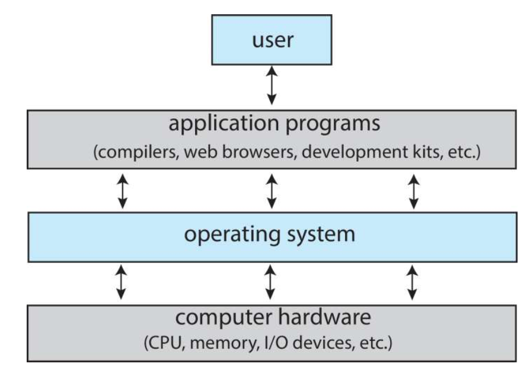
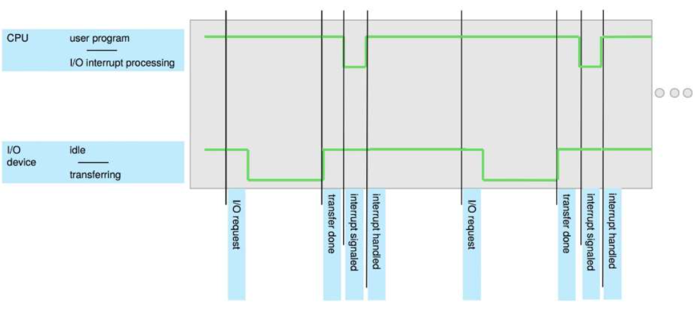
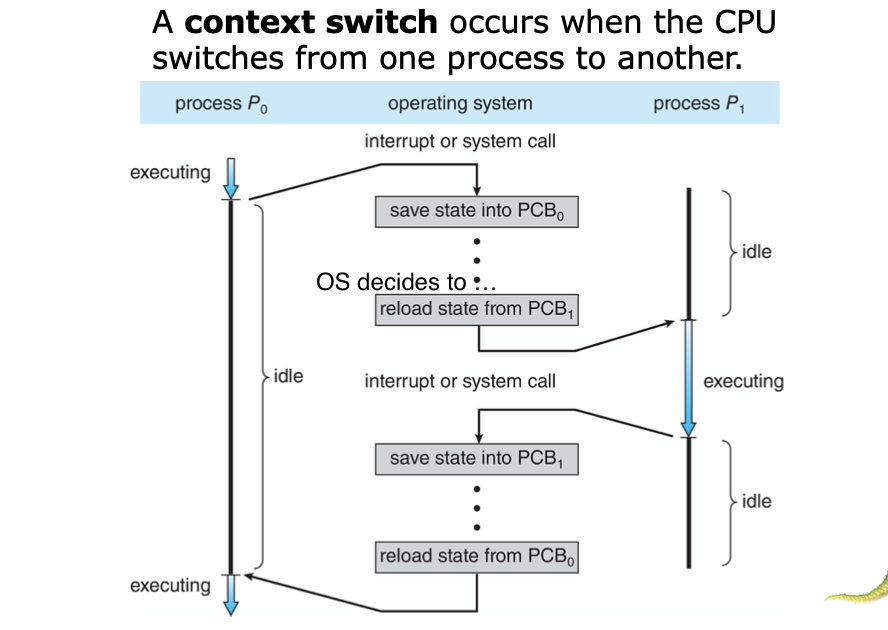
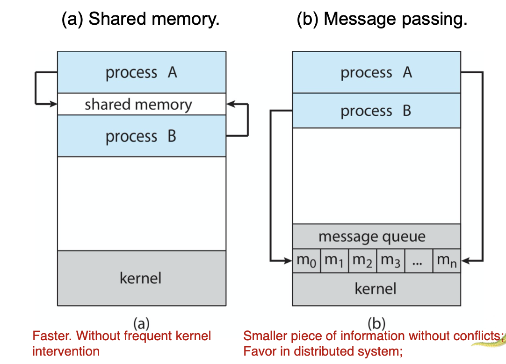

<!--more-->

## Introduction

### Describe the general organization of a computer system 

- Computer system can be divided into four components:
  - Hardware – provides basic computing resources
    - CPU, memory, I/O devices
  - Operating system
    - Controls and coordinates use of hardware among various applications and users
  - Application programs - define the ways in which the *system resources are used* to solve the computing problems of the users
    - Word processors, *compilers*, web browsers, *database systems*, video games
  - Users *not necessary a human being*
    - People, **machines, other computers**
    - participate in using the programs to interface with your system

- sometimes, application programs are allowed to directly control the hardware(backdoor)

### Describe the role of interrupts

- **Major Use:** Interrupt _transfers control_ to the interrupt service routine generally, through the **interrupt vector**, which contains the addresses of all the service routines
- Interrupt **architecture** must save the address of the interrupted **instruction**
- A **trap** or **exception** (*whether the data is accessed/overflow occurs/...*) is a software-generated interrupt caused either by an error or a user request
- An operating system is **interrupt driven**

> e.g. when you type a word
> 
> Note: in modern systems, there will be no IDLE, since CPU is multi-cored. and memory access is implemented with DMA

## Structures

- Operating System Services, 操作系统服务
- System Services/System Utilites, 系统程序

### Identify services provided by an operating system

Functions that are **helpful to user**
- **User interface** - Almost all operating systems have a user interface (UI).
  - Varies between Command-Line (CLI), Graphics User Interface (GUI), touch-screen, Batch
- **Program execution** - The system must be able to load a program into memory and to run that program, end execution, either normally or abnormally (indicating error)
- **I/O operations** - A running program may require I/O, which may involve a file or an I/O device
- **File System Manipulation**
- **Communications** between users/processes
- **Error Detection**  OS needs to be constantly aware of possible errors
  - May occur **in the CPU and memory hardware** *(especially for memories. 'Assuming every hardware functions 100% well' is A typical pitfall among most programmers)*, in I/O devices, in user program
  - For each type of error, OS should take the appropriate action to ensure correct and consistent computing
  - **Debugging facilities** (*requires OS support*) can greatly enhance the user’s and programmer’s abilities to efficiently use the system
 

Functions that ensure the **efficient operation** of the system iteself via *resource sharing*

- **Resource allocation** - When multiple users or multiple jobs running concurrently, resources must be allocated to each of them
  - Many types of resources - CPU cycles, main memory, file storage, I/O devices.
- **Logging** - To keep track of which users use how much and what kinds of computer resources
- **Protection and security** - The owners of information stored in a _multiuser_ or networked computer system may want to control use of that information, concurrent processes should _not interfere_ with each other
  - Protection involves ensuring that all access to system resources is controlled
  - Security of the system from outsiders requires user authentication, extends to defending external I/O devices from invalid access attempts

### Illustrate how system calls are used to provide operating system services

1. Typically written in a high-level language (C or C++)
   - Mostly accessed by programs via a high-level **Application Programming Interface (API)** rather than direct system call use
     - Win32 API for windows
     - POSIX API for POSIX-based systems (all UNIX/Linux/Mac OS X)
     - Java API for JVM

2. API - System Call Implementation
    Typically, a number associated with each system call
    - System-call interface maintains **a table indexed** according to these numbers
    - Most details of OS interface hidden from programmer by API 
    - Managed by run-time support library *(library, loader, compiler/interpreter)* (set of functions built into libraries included with compiler)
    - `libc` library in C
    - 

3. Parameter Passing
   - simplest: through registers
   - stored in memory, address through registers
   - through stack
   

### List The Types of System Calls
- Process control (创建、终止、中断、恢复、数据，获取进程属性，等待、内存管理、出错dump，**debugger (single step execution)**，locks)
  > - `end` normal, `abort` abormal
  > - user can start a thread in a program, where to return?
  >   - same memory image if return to the caller
  >   - create a new process(concurrently) `./usrapp & >> output_file` (`&` indicates running in the background), where the following functions are required
  >     - get process attributes
  >     - wait for time
  >     - wait event, signal event
  > - **Debugger**, requires system support, almost all debugger requires `dump memory` (into special file of the disk)
- File Management (读写、属性)
- Device Management （request & release, read and write, attributes）
- Information Maintenance (date, time, system attribute)
  > Especially useful in debug mode
  > OS: **strace** -> system calls
  > CPU: single step -> **trap** -> debugger
  > requires OS + hardware cooperation
- Communications (link & unlink, **shared-memory model**)
  > One application: networking
  > in OS perspectives (unlike computer network), usually messages send from client to server
  > a *Daemon*(user-mode) is typically used to keep listening to the clients
  > Another topic: shared memory, efficient, but managing is compilicated
  > Threads share memory by default
- Protection (access, deny & allow)

## Processes

### What is process? difference with program?

Process – a program in execution, must progress in sequential fashion

Program is passive entity stored on disk (executable file); process is active

Program becomes process when executable file loaded into memory

One program can be several processes

### Identify the separate components of a process, what is the memory layout

- **text section** the program code
- current activity such as **program counter, registers**
- **Stack** containing temporary data
  - args, ret add, local vars
- **Data section** containing global variables
- **Heap** containing memory dynamically allocated during run time

### Illustrate the states of a process

### Illustrate how processes are represented 
- Represented by **PCB**(Process Control Block / Task Control Block)
  - Process state – running, waiting, etc
  - Program counter – location of instruction to next execute
  - CPU registers – contents of all process- centric registers
  - CPU scheduling information- priorities, scheduling queue pointers
  - Memory-management information – memory allocated to the process
    > No overlap between processes
  - Accounting information – CPU used, clock time elapsed since start, time limits
  - I/O status information – I/O devices allocated to process, list of open files

### How processes are scheduled in an operating system

- **Process scheduler** selects among available processes for next execution on CPU core
- Maintains **scheduling queues** of processes
  - **Ready queue**– set of all processes residing _in main memory, ready and waiting to execute_
  - **Wait queues** – set of processes waiting for an event (i.e. I/O)
  - Processes migrate among the various queues
> Implemented in Linked-lists of `struct task_struct`

> The algorithm may look through the queue, find the next process to dispatch (e.g. process that has run the least of time)

### Explain what is context switch

### How process scheduling strategy differ on mobile systems

- Some mobile systems (e.g., early version of iOS) allow only one process to run, others suspended
- Due to screen real estate, user interface limits iOS provides for 
  - Single foreground process- controlled via user interface
  - Multiple background processes– in memory, running, but not on the display, and with limits
  - Limits include single, short task, receiving notification of events, specific long-running tasks like audio playback
- Android runs foreground and background, with fewer limits
  - Background process uses a service to perform tasks
  - Service can keep running even if background process is suspended
  - Service has no user interface, small memory use

### Describe how processes are created

- **Parent** process create **children** processes, which, in turn create other processes, forming a **tree** of processes
- Generally, process identified and managed via a **process identifier (pid)**
- Resource sharing options
  > Different OS has different options
  - Parent and children share all resources
  - Children share subset of parent’s resources 
  - Parent and child share no resources
- Execution options
  > Similarly, options
  - Parent and children execute concurrently
  - Parent waits until children terminate

### Write a UNIX Example for creating processes, what is the system call

- `fork()`, creates new process
  - `vfork()` will not copy the image of the parent because it assumes that `exec()` will be immediately used
- `exec()`, used after a `fork()` to replace the process' memory space with a new program
- parent call `wait()` for the child to terminate

### Describe how processes are terminated in an operating system

- Process executes last statement and then asks the operating system to delete it using the `exit()` system call.
  > In linux, `exit()` will be appended automatically
  - Returns status data from child to parent (via `wait()`)
  - Process’ resources are deallocated by operating system
- Parent may terminate the execution of children processes using the `abort()` system call. Some reasons for doing so:
  - Child has exceeded allocated resources
  - Task assigned to child is no longer required
  - The parent is exiting and the operating systems does not allow a child to continue if its parent terminates
  > Only parent can `abort` its child process, child process can't `abort` other processes
- Some operating systems do not allow child to exists if its parent has terminated. If a process terminates, then all its children must also be terminated.
  - **cascading termination**. All children, *grandchildren*, etc. are terminated.
  - The termination is initiated by the OS.
  > By default in C run-time library
- The parent process may wait for termination of a child process by using the  `wait()` system call.The call returns status information and the pid of the terminated process
  `pid = wait(&status);`
> What if the parent process doesn't call `wait()`?
> OS will take care

### What do we mean by saying a process is Zombie and Orphan

- If no parent waiting (did not invoke` wait()`) process is a **zombie** *(during which time some/all resources of the child may have been deallocated)*
  - Child exists with deallocation of resources, but the state is still in the table.
  - Once parent calls `wait()`, pid and table entry are released
- If parent terminated *(for various reasons)* without invoking wait , process is an **orphan**
  - Init (in Unix) inherits orphan and periodically calls `wait()`
  - Systemd (in Linux) and other process can inherit

### Describe and contrast interprocess communication using shared memory and message passing.

- Definition
  - Shared Memory: An area of memory shared among the processes that wish to communicate
  - Message Passing: Message system – processes communicate with each other without resorting to shared variables
    - If processes P and Q wish to communicate, they need to: 
    - Establish a communication link between them
    - Exchange messages via `send`/`receive`
- Controler
  - Shared Memory: The communication is under the control of the users processes not the operating system.
  - Message Passing: Depends on implementation:
    - physical: memory, bus, network, ...
- Major Issue:
  - Shared Memory: Major issues is to provide mechanism that will allow the user processes to synchronize their actions when they access shared memory.
  - Message Passing:
    - Processes must name each other explicitly
    - A link is associated with **exactly one pair** of communicating processes
    - Between each pair there exists exactly one link

## Threads

### What is the motivation of thread

- Most modern applications are multithreaded
- Threads run within application
- Multiple tasks with the application can be implemented by separate threads
  - Update display
  - Fetch data
  - Spell checking
  - Answer a network request
- Process creation is heavy-weight while thread creation is light-weight
> Chrome uses process to switch tabs, process is a heavier concept than thread
> Thousands of threads are OK, but not for process
- Can simplify code, increase efficiency
> To program processes, a lot more will need to be dealt with
- Kernels are generally multithreaded

### Identify the basic components of a thread, and contrast threads and processes

> One major reason why thread is lighter than process is that more things are shared
> e.g. code, data, files.
> Recall: shared memory model VS message passing

### Describe the benefits and challenges of designing multithreaded applications

Benefits
- Responsiveness – may allow continued execution if part of process is blocked, especially important for user interfaces
  > e.g. for a multi-thread process, it will not easily get stuck
- Resource Sharing – threads share resources of process, easier than shared memory or message passing
- Economy – cheaper than process creation, thread switching lower overhead than context switching
- Scalability – process can take advantage of multicore architectures

challenges include:
- Dividing activities
- Balance
- Data splitting
- Data dependency
- Testing and debugging

### What's the difference of concurrency and parallelism

- **Parallelism** implies a system can perform more than one task simultaneously
- **Concurrency** supports more than one task making progress 描述多个任务同时演进的现象，物理上可能不是同时执行
  - Single processor / core, scheduler providing concurrency
- Concurrent execution on single-core system
  
- Parallelism on a multi-core system
  

### Classify parallelism into two parts
> W.r.t. data + task

- Data parallelism – distributes subsets of the same data across multiple cores, same operation on each
- Task parallelism – distributing threads across cores, each thread performing unique operation

### list some Mutltithreading models

- Many-to-one
  - may not run in parallel because only one may be in kernel
  - few adopted
- One-to-one
  - more concurrency
  - but number of threads become restricted due to overhead
- Many-to-many
  - usually |user| > |kernel|
  - reduce overhead of kernel threads in one-to-one
  - but too complicated
- Two levels
  - comb. of one-to-one and m-to-m

## CPU Scheduling

### What is the goal of CPU scheduling

- Maximum CPU utilization obtained with multiprogramming

### What is Burst Cycle
- CPU–I/O Burst Cycle – Process execution consists of a **cycle** of CPU execution and I/O **wait**
- **CPU burst** followed by **I/O burst**

### What is the relationship between CPU-burst Time and Frequency

Histogram of CPU-burst Times(连续使用的时间)
- **Large** number of **short** bursts 
- Small number of longer bursts

### What is CPU Scheduler

- The CPU scheduler selects from among _the processes in ready queue,_ and allocates the a CPU core to one of them
  - Queue may be ordered in various ways

### Where do scheduling decisions happen

- CPU scheduling _decisions may take place_ when a process:
  1. Switches from running to waiting state 
  2. Switches from running to ready state 
  3. Switches from waiting to ready
  4. Terminates
- Scheduling under 1 and 4 is **nonpreemptive** (非抢占式)
- All other scheduling is **preemptive** (抢占式)
  - Consider access to shared data
  > update to a half, and is scheduled away
  > we should consider the cosistency of the data shared (for other processes, the data may be reached incomplete)
  - Consider preemption while in kernel mode
  > interrupting critical processes may cause risks
  - Consider interrupts occuring during crucial OS activities
> We will discuss preemptive techniques in the next chapter

### What are scheduling optimization criterias

- Max CPU utilization 
- Max throughput: # of processes that complete their execution per time unit
- Min turnaround time: amount of time to execute a particular process
- Min waiting time: amount of time a process has been waiting **in the ready queue**
- Min response time (variance > avarage): amount of time it takes from when a request was submitted until the first response is produced, not output (for time-sharing environment)

> Turnaround = waiting + burst time

### Describe Various CPU scheduling Algorithms

- FCFS
- SJF
  - needs exponential averaging to estimate the length (assume should be similar to the previous one)
  $\hat{t_{n+1}} = \alpha t_{n} + (1-\alpha) \hat{t_n}$
- Shortest Remaining Time First + Preemptive
- Round Robin
  - Time Quantum
  > turnaround time improves if most processes finish their next CPU burst in a **single** time quantum

    > 
    > 3->4->5, 4/5 units of $P_4$ time is inserted into $P_3$ :(
    > 6->7, since 1,2,3 are executed at last, no more burst will be inserted into 4

- Priority Scheduling

### What is starvation and solution

- Problem $\equiv$ **Starvation** – low priority processes may never execute
- Solution $\equiv$ **Aging** – as time progresses increase the priority of the process

### What is Convoy Effect

In FCFS, short process behind long process
- Consider one CPU-bound and many I/O-bound processes
- Troublesome for interactive system
> In interactive systems, it is usually composed with a very long CPU burst and many short IO bursts.