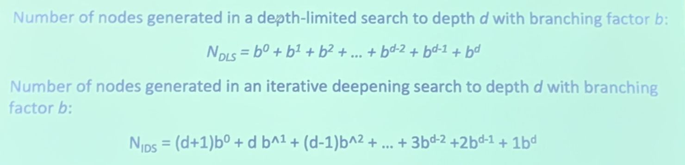
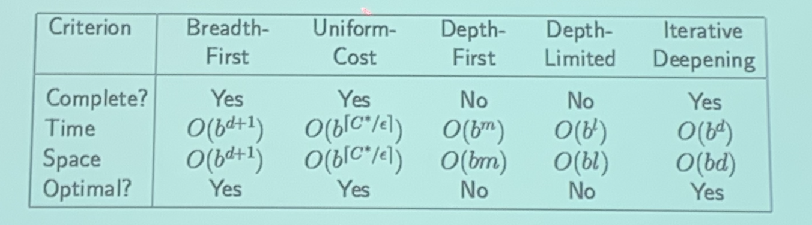
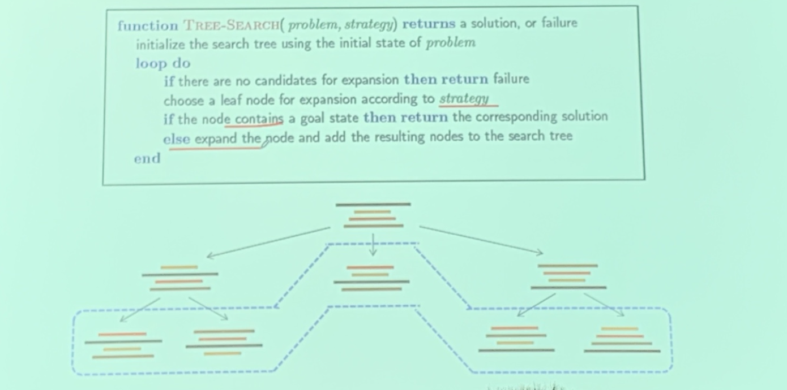
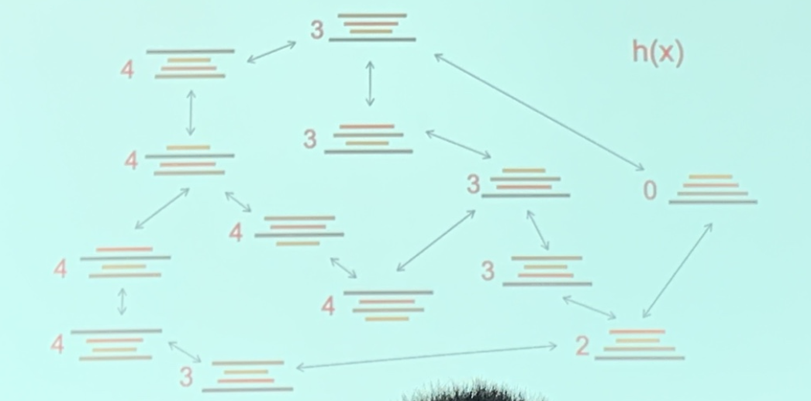
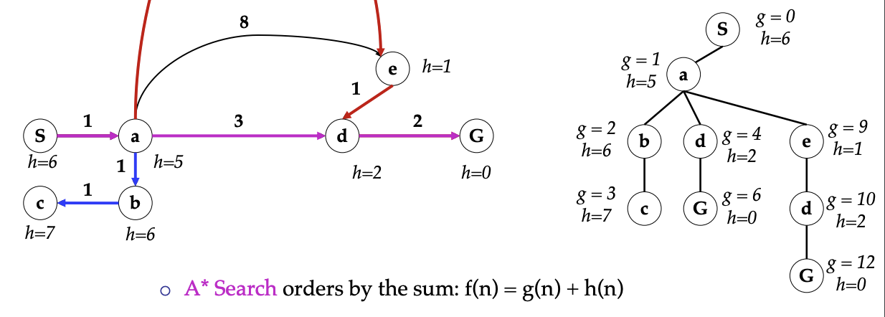
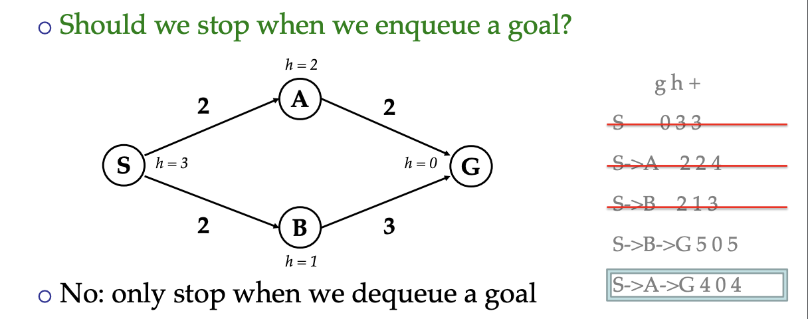
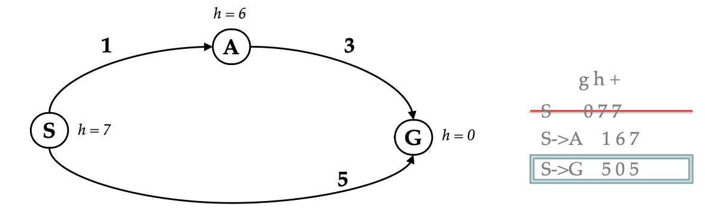
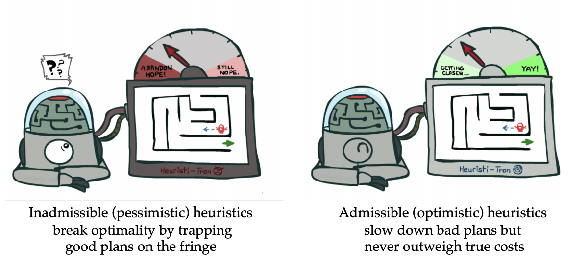

<!--more-->

A further discussion on Search Algorithms, (depth-limited/iterative depth first/uniform cost) and search summary.

## Uninformed Search Problems (cont'd)

### Depth-Limited Search

Depth-First Search with depth limit `l`
- Time Complexity: $O(b^l)$

### Iterative Deepening
- **Idea:** get DFS's space advantage with BFS's time/shallow-solution advantages
    - Run a DFS with depth limit 1. If no solution ...
    - Run a DFS with depth limit 2. If no solution ...
    - Run a DFS with depth limit 3. If no solution ...
- **Wastefully redundant?**
  - Generally most work happens in the lowest level searched, so not so bad!
  - 
- **Complete:** yes, since we won't fall into loops
- **Optimal?** Yes, if step cost = 1
- **Space** $O(bd)$
- **Time** $O(b^s)$

### Uniform Cost Search
> For BFS, if step cost are not 1, we can't make sure the solution is optimal
- Strategy: expand a cheapest node first:
- Fringe is a **priority queue** (priority: cumulative cost)
> Recall, in BFS fringe is a FIFO queue, DFS has a FILO queue

- What nodes does UCS expand?
  - Processes all nodes with cost less than cheapest solution!
  - If that solution costs $C^*$ and arcs cost at least $\epsilon$ , then the “effective depth” is roughly $\frac{C^*}{\epsilon}$
  - Takes time $O(b^{\frac{C^*}{\epsilon}})$ (exponential in effective depth)
- How much space does the fringe take?
  - Has roughly the last tier, so $O(b^{\frac{C^*}{\epsilon}})$
- Is it complete?
  - Assuming best solution has a finite cost and minimum arc cost is positive, yes!
- Is it optimal?
  - Yes

- Merits:
  - complete and optimal
- Deficiency:
  - Explores options in every “direction” **(blindly)**
  - No information about goal location

## Search Summary

### The One Queue

All these search algorithms are the same except for fringe strategies
- **Conceptually**, all fringes are priority queues (i.e. collections of nodes with attached priorities)
- Practically, for DFS and BFS, you can avoid the $\log(n)$ **overhead** from an actual priority queue, by using stacks and queues
- Can even code one implementation that takes a variable queuing object

### Search and Models

Search operates over models of the world
- The agent doesn’t actually try all the plans out in the real world!
- Planning is all “in simulation”
- Your search is only as good as your models...

### Key Concepts
- Search Problem
  - States
  - Action and costs
  - Successor function
  - Start State & Goal Test
- Search Tree
  - Nodes (represent plans for reaching states)
  - Plans have costs (sum of actions)
- Search algorithm
  - Systematically builds a search tree
  - Chooses an ordering of the fringe (unexplored nodes)
  - Find the Least-cost plans

## Example: Pancake Problem
- states: pancake
- action: `flip(n)`:flip the top `n` pancakes upside down, costs=`n`
- goal: in ascd order
- start state: given

- General Tree Search
  - 
  - differences lie in strategy and expanding method

## Informed Search

> How to judge the quality of the elements in the fringe?
> e.g. Pacman

### Best-first Search
**Idea:** Use an evaluation function for each note
- estimate of **desirability**
- 启发式
- expand most desirable unexpanded node
- **Implementation:** order the nodes in fringe in decreasing order of desirability
- **Special Cases:**
  - greedy best first search
  - A* search

### Heuristics

- A function that estimates how close a state is to a goal
- Designed for a particular search problem
- Examples:
  - Pathing: Manhattan distance, Euclidean distance for pathing
  - Pancake: 
    - **the number of the largest pancake that is still out of place**
    - 
    - the offset of one particular pan
> Note: the complexity of the heuristic should be small

## Greedy Search
- Evaluation function
  $$f(n)=h(n)$$
- 完全根据启发式决定explore strategy
- a more common case is that best-first takes you straight to the wrong goal.
- worst case: like a badly-guided DFS
- **Complete:** No, one can get stuck in loops
- **Time:** $O(b^m)$, but a good heuristic can give dramatic improvement
- **Space:** $O(bm)$
- **Optimal**: not!

## A* Search

> Idea: Combining UCS and Greedy

- Uniform-cost orders by path cost, or backward cost $g(n)$ 已发生的
- Greedy orders by goal proximity, or forward cost  $h(n)$ 未发生的

- $f(n)$ = estimated total cost of path through n to the goal

### When to terminate

### Is A* Optimal?

- Problem: A给出了过于悲观的启发式
- Actual bad goal cost < estimated good goal cost
- We need estimates to be less than actual costs!

$$h(A)\le g(A)$$

## Admissible（可采纳性）

### Admissible Heuristics

A heuristic $h$ is admissible (optimistic) if:
$$
0 \leq h(n) \leq h^{*}(n)
$$
where $h^{*}(n)$ is the true cost to a nearest goal

> An admissible heuristic **never** **overestimates** the cost to reach the goal, i.e. it is **optimistic**
> Examples: 
> Coming up with admissible heuristics is most of what’s involved in using A* in practice

**Proof.** 
- assume A is optimal and B is suboptimal, $g(A)<g(B)$
- assume h is admissible, $h(n)\le g(n) \le g(A) < g(B)$
- **Claim:** A will exit the fringe before B
1. Imagine B is on the fringe, we want to prove the ancestor `n` of A on the fringe will be expanded before B
    $$
    \begin{aligned}
    f(n) &= g(n) + \mathbf{h(n)} \le g(n) + \mathbf{h^{*}(n)} \\
    &= g(n) + \mathbf{(g(A) - g(n)})\\
    &= g(A) = h(A) < g(B) = h(B)
    \end{aligned}
    $$
2. All ancestors of A expand before B
3. A expands before B
4.  A* search is optimal

