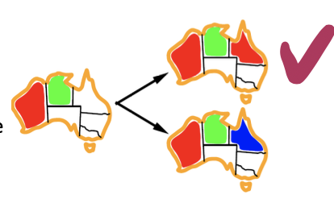
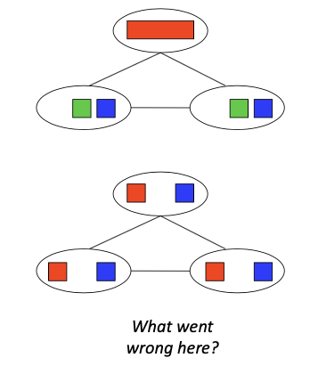

# 3-1 Constraint Satisfaction Problems

<!-----
title: 【Artificial Intelligence】3-1 Constraint Satisfaction Problems
url: ai-csp
date: 2020-09-22 14:01:08
tags: 
- Artificial Intelligence

categories: 
- Courses

----->

Constraint Satisfaction Problems, improve backtracking search with structural ideas (e.g. cutset conditioning, tree decomposition, etc). Another efficient (but not complete) solution to CSP is iterative algorithm. Similar ideas are applied to genetic algorithms and simulated annealing. 

<!--more-->

[toc]

## Reminder: CSPs

### CSPs:
- Variables
- Domains
- Constraints
  - Implicit (provide code to compute)
  - Explicit (provide a list of the legal tuples)
    - Unary (*domain*)
    - Binary (*combination problem, NP hard*)
    - > NP problems $O(d^n)$ for n variables
    - N-ary
Goals:
- Here: find any solution
- Also: find all, find best, etc.

### Backtracking Search

idea: 分层赋值，深度优先explore，检测不符则回溯
remark: still NP-hard

improving methods:
- Filtering: Can we detect inevitable failure early? *(discussed last lecture)*
  - still runs inside a backtracking search, still NP-hard
- Ordering:
  - Which variable should be assigned next? (MRV)
  - in what order should its values be tried? (LCV)
- Structure: Can we exploit the problem structure?

## Improving Backtracking

### Ordering: Minimum Remaining Values

Variable Ordering: Minimum remaining values (MRV, 最小剩余值): 
- Choose the variable with the fewest legal left values in its domain
- *So that we can detect failures ASAP*

### Ordering: Most Constraining Variable

- Tie-breaker among most constrained variables
- Most constraining variable (*AKA Degree Heuristic, 度启发式):*
  - choose the variable with the most constraints on remaining variables
- *will be revisited when introduing graph search*

### Ordering: Least Constraining Value

Value Ordering: Least Constraining Value (最少约束值)
- Given a choice of variable, choose the least constraining value
- I.e., the one that rules out the fewest values in the remaining variables
- Note that it may take some computation to determine this! (E.g., rerunning filtering)
> *So that we can left less constraints for future assignments*

## K-Consistency

> Arc Consistency only checks the compatibility between two nodes.
> After enforcing arc consistency, can have no solutions left but don't know it
> 

- Increasing degrees of consistency
  - 1-Consistency (Node Consistency): Each single node’s domain has a value which meets that node’s unary constraints
  - 2-Consistency (Arc Consistency): For each pair of nodes, any consistent assignment to one can be extended to the other
  - K-Consistency: For each k nodes, any consistent assignment to k-1 can be extended to the kth node.
  - *e.g. 2 consistency won't detect conflicts like `A>B,B>C,A<C`*
- Higher k more expensive to compute
- 3-Consistency is called *path consistency*

**Definition.** Strong K-Connectivity, also k-1, k-2, ... 1 consistent
**Claim**: strong n-consistency means we can solve without backtracking!
- Why?
  - Choose any assignment to any variable
  - Choose a new variable
  - By 2-consistency, _there is a choice_(*because the domain is not empty*) consistent with the first
  - Choose a new variable
  - By 3-consistency, there is a choice consistent with the first 2 
  - ...
- Lots of middle ground between arc consistency and n-consistency! (e.g. k=3, called path consistency)

## Structure

> 
> In the example above, we can exploit the central nodes (like degree-heuristic), since it affects the solution most

### Extreme Case: Independent Subproblems

Suppose a graph of n variables can be broken into subproblems of only c variables:
- Worst-case solution cost is $O((\frac{n}{c})(d^c))$, linear in n 
- E.g., n = 80, d = 2, c =20
- 280 = 4 billion years at 10 million nodes/sec
- (4)(220) = 0.4 seconds at 10 million nodes/sec

### Tree-Structured CSPs

**Theorem**: if the constraint graph has no loops, the CSP can be solved in $O(n d^2)$ time 
- taking any node out, we can form a tree
- Compare to general CSPs, where worst-case time is $O(d^n)$
- This property also applies to probabilistic reasoning (later): an example of the relation between syntactic restrictions and the complexity of reasoning

#### Algorithm
- Order: Choose a root variable, order variables so that parents precede children
  We assume the domain is given as the graph shows
  
- Remove backward: For i = n : 2, apply RemoveInconsistent(Parent(Xi),Xi) 
  
- Assign forward: For i = 1 : n, assign Xi consistently with Parent(Xi)

#### Proof

**Claim 1**: After backward pass, all root-to-leaf arcs are consistent
- Proof: Each $X\rightarrowY$ was made consistent at one point and Y’s domain could not have been reduced thereafter (because Y’s children were processed before Y)
**Claim 2**: If root-to-leaf arcs are consistent, forward assignment will not backtrack
- Proof: Induction on position
- Why doesn’t this algorithm work with cycles in the constraint graph?
  Note: we’ll see this basic idea again with Bayes’ nets

### Nearly Tree-Structured CSPs
> After deleting some vertex, we may get a tree.

- Conditioning: instantiate a variable, prune its neighbors' domains
- Cutset conditioning *割集调整*: instantiate (in all ways) a set of variables such that the remaining constraint graph is a tree
  
- Cutset size c gives runtime $O( (d^c) (n-c) d^2 )$, very fast for small c

### Tree Decomposition

> Idea: create a tree-structured graph of **mega-variables** (巨型变量，e.g. triple)
- Each mega-variable encodes part of the original CSP
- Subproblems overlap to ensure consistent solutions

- In the coloring problem, the mega-variable focuses on the compatibility of three variables.
- But the decomposition brings about extra cost

## Iterative Improvement Algorithm

the first random algorithm we would see.

### Iterative Algorithms for CSPs

> Idea: Local search methods typically work with “complete” states, i.e., all variables assigned
> All variables are pre-assigned, iterate all the pseudo-states until complete
- To apply to CSPs:
  - Take an assignment with unsatisfied constraints 
  - Operators reassign variable values
  - No fringe! Live on the edge.
- Algorithm: While not solved,
  - Variable selection: randomly select any conflicted variable
  - Value selection: **min-conflicts heuristic:** *(Another improvement)*
    - Choose a value that violates the fewest constraints
    - I.e., hill climb with h(n) = total number of violated constraints

#### Performance of Min Conflicts

- Given random initial state, can solve n-queens in almost constant time for arbitrary n with high probability (e.g., n = 10,000,000)!
- The same appears to be true for any randomly-generated CSP except in a narrow range of the ratio
$$
R = \frac{\text{number of constraints}}{\text{number of variables}}
$$

- If the constraints are strict, then degree-heuristic can work fairly well
- if the numbers of variables are great but with few constraints, then it should also be easy to find one solution
- some time, it may be hard to use degree-heuristic to find a right assignment, the solution will be found through trial and error *(trapped in local optimal)*

## Summary for CSP

- CSPs are a special kind of search problem: 
  - States are partial assignments
  - Goal test defined by constraints
- Basic solution: backtracking search (DFS+partial assignment+conflict detect)
- Speed-ups: 
  - Filtering: *propagate constraints*
  - Ordering *degree heuristic, etc*
  - Structure *tree or nearly-tree structure*
- Iterative min-conflicts is **often effective in practice**

## Local Search
A higher perspective on iterative algorithm, and its difference to tree search

- Tree search keeps unexplored alternatives on the fringe (ensures completeness)
- Local search: improve a single option until you can’t make it better (no fringe!)
- New successor function: local changes
- Generally much faster and more memory efficient (but incomplete and suboptimal)

### Simulated Annealing
Idea: Escape local maxima by allowing downhill moves 
- But make them rarer as time goes on
- 

### Genetic Algorithms

- Genetic algorithms use a natural selection metaphor
  - Keep best N hypotheses at each step (selection) based on a fitness function
  - Also have pairwise crossover operators, with optional mutation to give variety
- Possibly the most misunderstood, misapplied (and even maligned) technique around