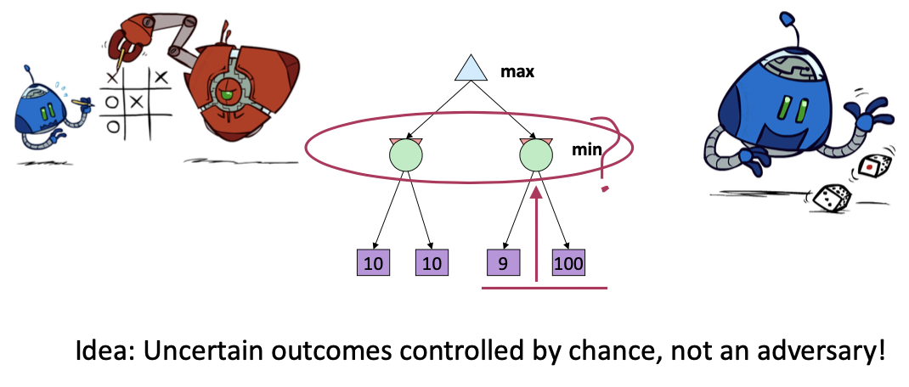
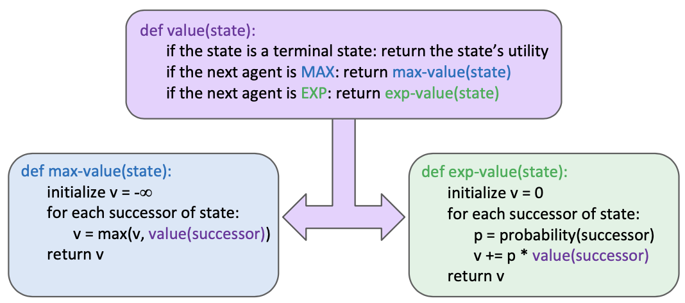
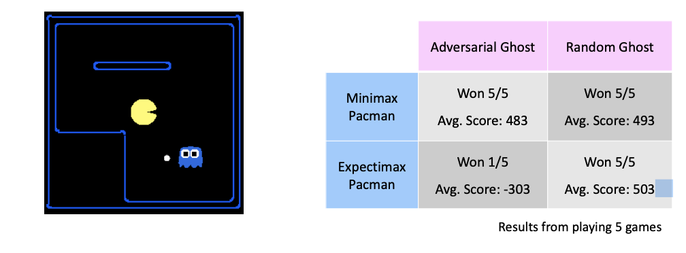
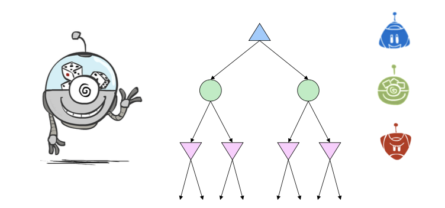
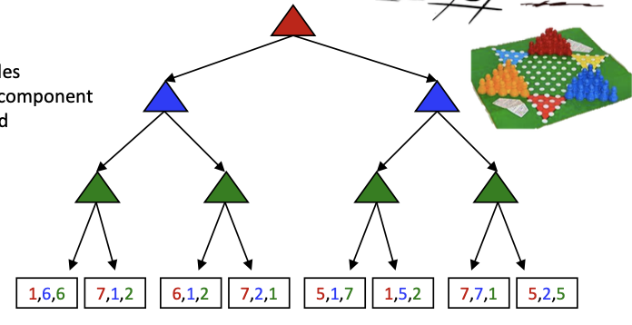
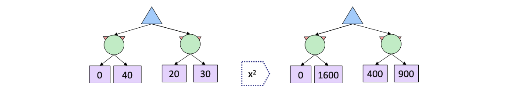
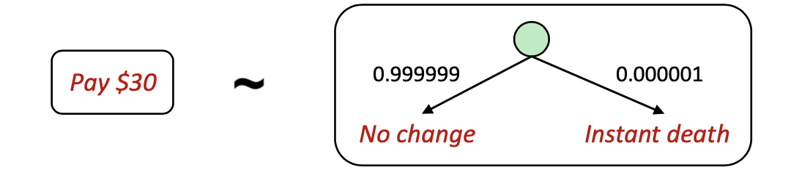
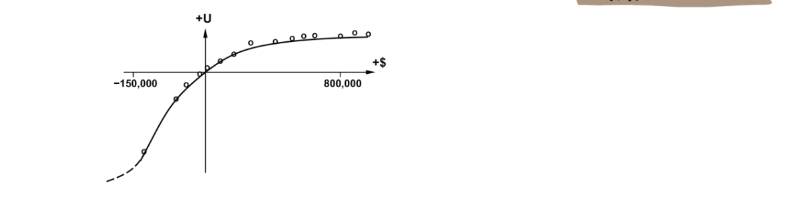
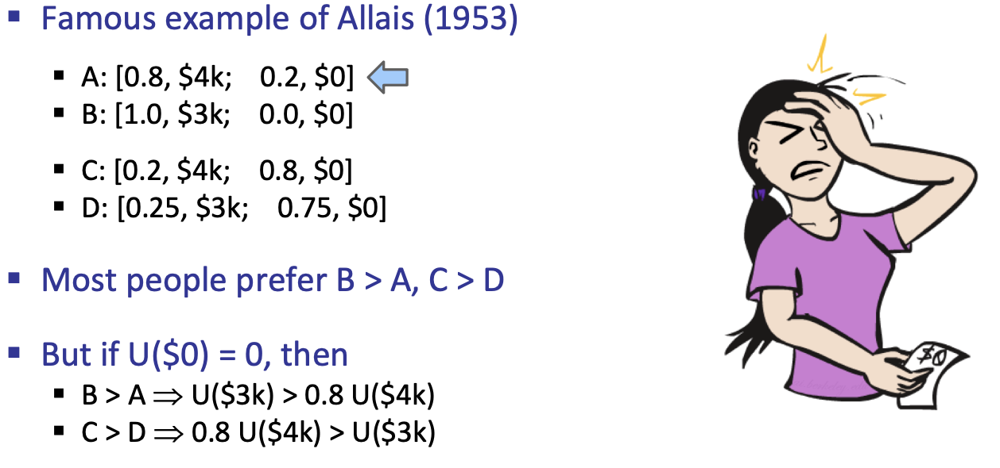

Worst-Case vs. Average Case

<!--more-->

[[toc]]

## Expectimax Search

Uncertainty may come from...
- Explicit randomness: rolling dice
- Unpredictable opponents: the ghosts respond randomly
- Actions can fail: when moving a robot, wheels might slip

> Values should now reflect average-case (expectimax) outcomes, not worst-case (minimax) outcomes

**Expectimax search**: compute the average score under optimal play
- Max nodes as in minimax search
- Chance nodes are like min nodes but the outcome is uncertain 
- Calculate their **expected utilities**
- I.e. take weighted average (expectation) of children

Later, we’ll learn how to formalize the underlying uncertain- result problems as **Markov Decision Processes**

> pruning is impossible

### Variants
- different probabilities
- Dynamic Probability (opponent with 80% minimax + 20% random = 90% min node + 10 % the other) AKA  Mixture Model

## Modeling Assumptions
- Dangerous Optimism: assuming chance when the world is adversarial
- Dangerous Pessimism: assuming the worst case when it's not likely

## Mixed Layer Types

> Every stage has different strategy?

e.g. Backgammon
Expectiminimax
- Environment is an extra “random agent” player that moves after each min/max agent
- Each node computes the appropriate combination of its children

## Multi-Agent Utilities

> What if the game is not zero-sum, or has multiple players?

Generalization of minimax:
- Terminals have utility tuples
- Node values are also utility tuples
- Each player maximizes its own component 
- Can give rise to cooperation and competition dynamically...

> 效用理论 proposed by Bernouli $\log$: many human feelings are counted expoentially
> What utilities to use in EI339?
> Maximum Expected Utility

## Maximum Expected Utility

- Why should we average utilities? Why not minimax?
  - Uncertainty
- Principle of maximum expected utility:
  - A rational agent should chose the action that **maximizes its expected utility, given its knowledge**
- Questions:
  - Where do utilities come from?
  - How do we know such utilities even exist?
  - How do we know that averaging even makes sense?
  - What if our behavior (preferences) can’t be described by utilities?

### What utilities to use

> Recall: in minimax search, monotone scaling the function will not affect the result/search path, e,g, `x^2` the node value
> 
> But becomes a problem in case of average utilities.

- Theorem: any “rational” preferences can be summarized as a utility function
- Furthermore, we hard-wire utilities and let behaviors emerge
  - Why don’t we let agents pick utilities? 
  - Why don’t we prescribe behaviors?
- Here are a few concepts involved

### Preferences

An agent must have preferences among: 
- Prizes: A, B, etc.
- Lotteries: situations with uncertain prizes
- `L = [p, A ; (1 - p), B]` (how to bind the probability with prize)

Notation:
- Preference: $A \succ B$
- Indifference: $A \sim B$

### Rational Preferences

- Orderability $(A \succ B) \vee(B \succ A) \vee(A \sim B)$
- Transitivity ${(A \succ B) \wedge(B \succ C) \Rightarrow(A \succ C)}$
  - Otherwise, by specifying/swapping certain actions, the agent will generate regretable actions.
- Continuity $A \succ B \succ C \Rightarrow \exists p[p, A ; 1-p, C] \sim B$, where $\sim$ can be manually designed
- Substitutability ${A \sim B \Rightarrow[p, A ; \quad 1-p, C] \sim[p, B ; 1-p, C]}$
- Monotonicity ${A \succ B \Rightarrow} (p \geq q \Leftrightarrow[p, A ; 1-p, B] \succeq[q, A ; 1-q, B])$

### MEU Principle

> _Based on the notion of rational preferences_, we can formally find a Utility function

**Theorem** [Ramsey, 1931; von Neumann \& Morgenstern, 1944]
Given any preferences satisfying these constraints, there exists a real-valued function U such that:
$$
\begin{array}{l}
U(A) \geq U(B) \Leftrightarrow A \succeq B \\
U\left(\left[p_{1}, S_{1} ; \ldots ; p_{n}, S_{n}\right]\right)=\sum_{i} p_{i} U\left(S_{i}\right)
\end{array}
$$
i.e. values assigned by U preserve preferences of both prizes and lotteries!

It is left for human to design the $\sim$ relation.

#### Money

Money does not behave as a utility function, but we can talk about the utility of having money (or being in debt)

- Given a lottery L = [p, \$X; (1-p), \$Y]
- The expected monetary value EMV(L) is p\*X + (1-p)\*Y 
- U(L) = p\*U(\$X) + (1-p)\*U(\$Y)
- Typically, U(L) < U( EMV(L) )
- In this sense, people are risk-averse
- When deep in debt, people are risk-prone
- 

Money doesn't necessarily reflect utility, which typically reflects preference (the satisfaction of user)

If everyone were risk-neutral, no insurance needed!

#### Allais Paradox

For the first case, we would prefer a deterministic B, and a rather higer expectation C, which causes a paradox when we calculate the utilities.

We might as well add ppl's reluctance to risk into consideration, which is not included in the scope of utility/preference