# 5-1 Markov Decision Process

<!-----
title: 【Artificial Intelligence】5-1 Markov Decision Process
url: ai-mdp
date: 2020-10-13 14:03:10
tags: 
- Artificial Intelligence

categories: 
- Courses

----->

Problem: the effect of an action exists uncertainty. (i.e. the agent may not function as we command)

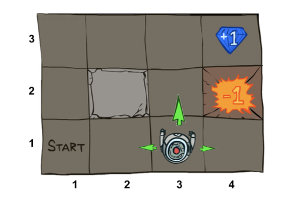

<!--more-->

[[toc]]

## Introduction and Definition

### Example of Non-Deterministic Search

- The agent receives rewards each time step
- Small “living” reward each step (can be negative) 
- Big rewards come at the end (good or bad)
> Goal: maximize sum of rewards
> How to formalize the problem?

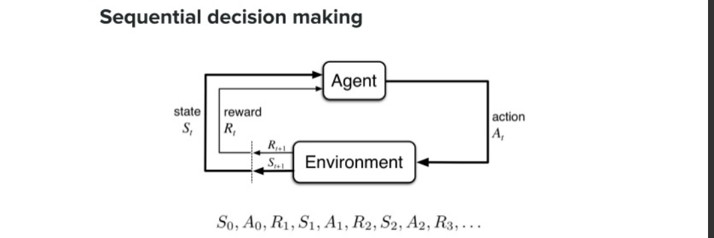

### Markov Decision Process
- State definition
  - A set of states $s \in S$，状态集
  - A set of actions $a \in A$，一组动作
    > MDP requires labeling the actions, since every action can happen, while in Search Tree Model, all actions are treated equally
  - A transition function $T(s, a, \mathbf{s'})$，状态转移函数
    - Probability that a from s leads to s’, i.e., $P(s'| s, a)$
    > Uncertainty exists, $s'$ will also be a function argument, the function indicates the probability of transition
    - Also called the model or the dynamics 
  - A reward function R(s, a, $s'$) ，回报函数
    - Sometimes just $R(s)$ or $R(s')$ 
  - A start state
  - Maybe a terminal state

- MDPs are non-deterministic search problems 
  - One way to solve them is with expectimax search 
  - We’ll have a new tool soon

- “Markov” generally means that given the present state, the future and the past are independent
> just like search, only depend on the current state

### Policies
> Difference from Search problems is that we need a policy rather than a sequence of actions/states
- In deterministic single-agent search problems, we wanted an optimal plan, or sequence of actions, from start to a goal
- For MDPs, we want an optimal policy $\pi^*:S\rightarrow A$
  - A policy p gives an action for each state
  - An optimal policy is one that maximizes expected utility if followed
  - An explicit policy defines a reflex agent
- Expectimax didn’t compute entire policies 
> We should not confuse policy with Expectimax
  - It computed the action for a single state only

> Reward strategy (accumlating) results in a great dependecy of policy on reward function
> 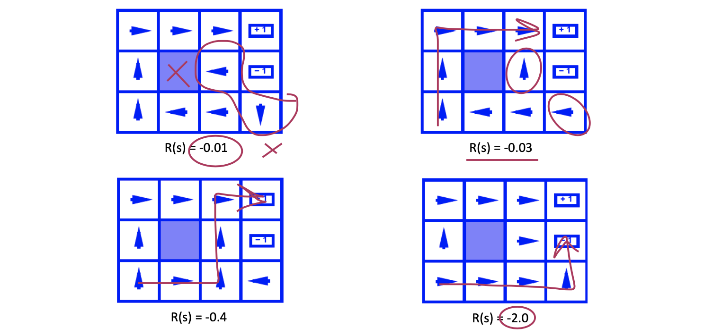

## MDP Quantities

### Example: Racing

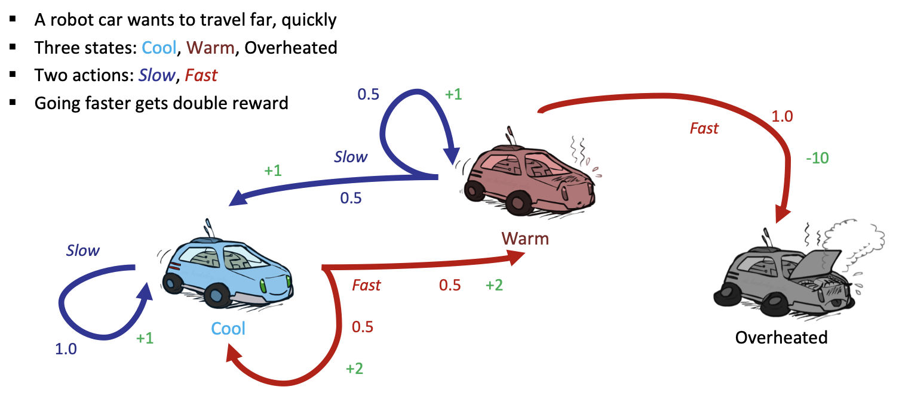

Can be described as a expectimax search tree

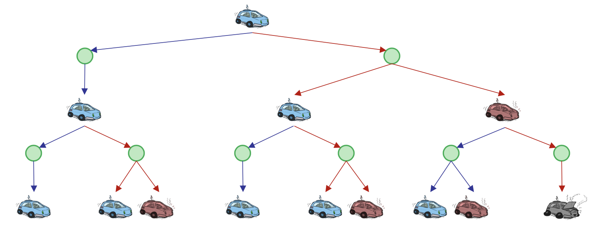
> will cause the problem to be too complex to solve

### Markov Submodels

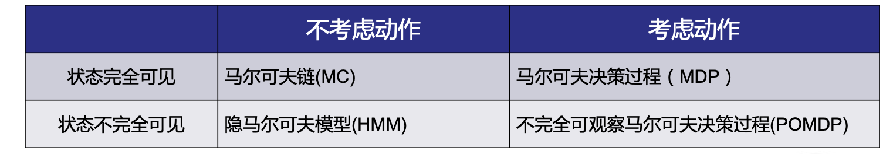
> Examples:
> POMDP: voice recognization

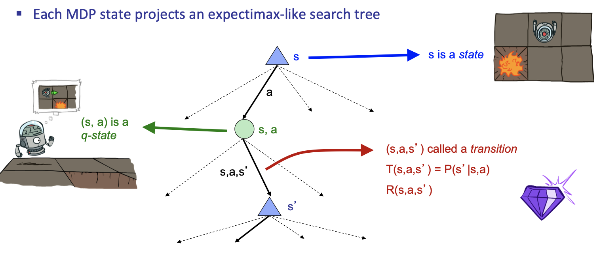
> Two kinds of nodes:
> - Action node (max node)
> - Chance node (expectimax node)

### Utilities

> Agents should make preferences over **reward sequences**

- What preferences should an agent have over reward sequences? 
- More or less? [1, 2, 2] or [2, 3, 4]
- Now or later? [0, 0, 1] or [1, 0, 0]
 

#### Discounting
> Basic idea: the earlier the money, the more valuable it is
- It’s reasonable to maximize the sum of rewards
- It’s also reasonable to prefer rewards now to rewards later 
- One solution: *values of rewards decay exponentially*
  > Each time we descend a level, we multiply in the discount once
  > 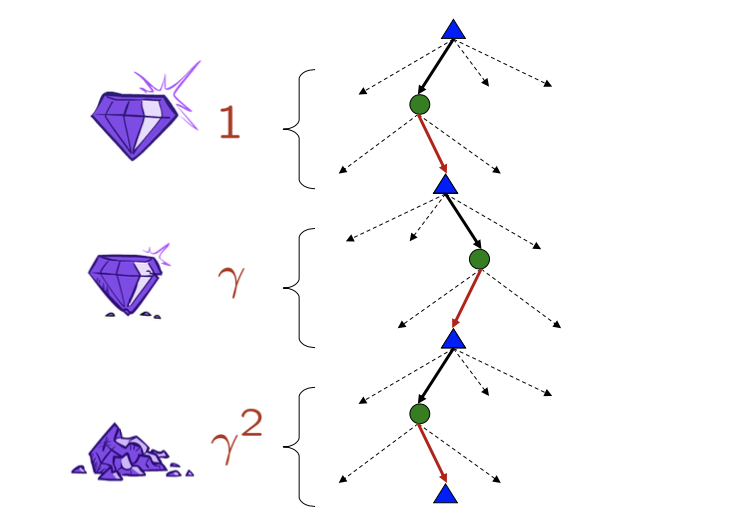
  > E.g. on the above graph, we multipluy $\gamma$ on red branches
- Example: discount of 0.5
  - $U([1,2,3]) = 1*1 + 0.5*2 + 0.25*3$
  - $U([1,2,3]) < U([3,2,1])$
- Also helps out algorithms converge

#### Stationary Preferences

> Recall: 平稳：统计规律（均值/方差）不随时间变化
> 如果结果a的序列偏好大于b的偏好，那么额外加上相同的初始奖励，平移序列，偏好不改变。
> Discounting 服从平稳性 （if and only if）
**Theorem.** if we assume stationary preferences:
$$
\begin{aligned}
[a_1, a_2, \ldots] & \prec [b_1, b_2, \ldots] \\
&\Updownarrow \\
& [r, a_1, a_2, \ldots] & \prec [r, b_1, b_2, \ldots] 
\end{aligned}
$$
then there are only two ways to define utilities
- Additive Utility: $U([r_0,r_1,\ldots]) = r_0 + r_1 + \ldots$
- Discounted Utility: $U([r_0,r_1,\ldots]) = r_0 + \gamma r_1 + \ldots$

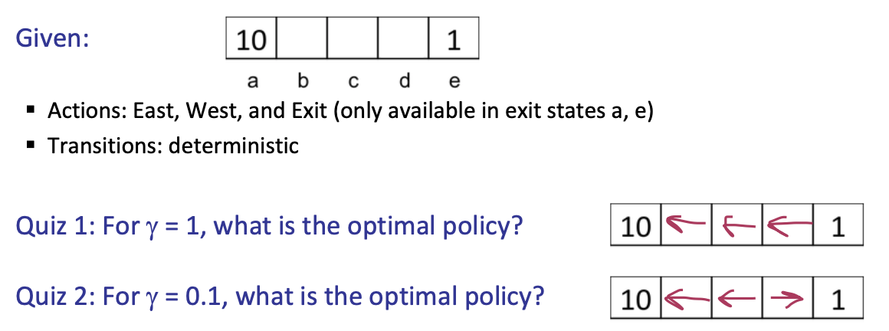

#### Infinite Utilities?

What if the game lasts forever? Do we get infinite rewards?
- Solution 1: Finite horizon
  - Terminate episodes after a fixed T steps (e.g. life)
  - Gives nonstationary policies (p depends on time left)
- Solution 2: Upper bound on step utility + $0 < \gamma < 1$
  - $U\left(\left[r_{0}, \ldots r_{\infty}\right]\right)=\sum_{t=0}^{\infty} \gamma^{t} r_{t} \leq R_{\max } /(1-\gamma)$
  - Smaller $\gamma$ means smaller “horizon” – shorter term focus
- Solution 3: Absort state: guarantee that for every policy, terminal state will be reached

## Solving MDPs

### Optimal Quantities

1. The value (utility) of a state s:
   $V^* (s)$ = expected utility starting in s and acting optimally
   > 指：当前状态**下一步**的极大化action
2. The value (utility) of a q-state (s,a): 
   $Q^* (s,a)$ = expected utility starting out having taken action a from state s and (thereafter) acting optimally
   > 指：**后续节点都选用最优**路径后，效用的加权期望值
   > 2 guarantees the choice of 1 is reasonable
3. The optimal policy:
   $\pi^* (s)$ = optimal action from state s

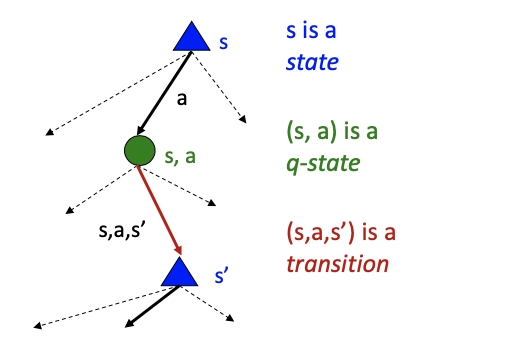

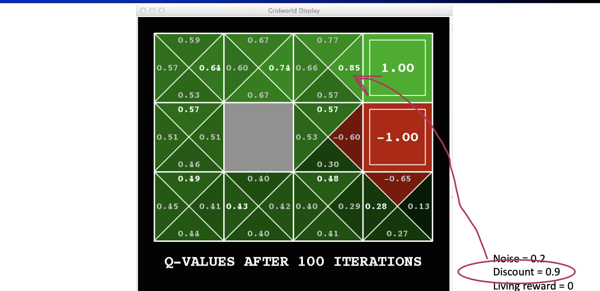

Recursive definition of value:
$$
\begin{array}{l}
V^{*}(s)=\max _{a} Q^{*}(s, a) \\
Q^{*}(s, a)=\sum_{s^{\prime}} T\left(s, a, s^{\prime}\right)\left[R\left(s, a, s^{\prime}\right)+\gamma V^{*}\left(s^{\prime}\right)\right] \\
V^{*}(s)=\max _{a} \sum_{s^{\prime}} T\left(s, a, s^{\prime}\right)\left[R\left(s, a, s^{\prime}\right)+\gamma V^{*}\left(s^{\prime}\right)\right] \\
V^{*}(s) = \max_{a} \sum_{s'} P(s'|s,a) \left[ R(s,a,s') + \gamma V^{*} (s') \right]
\end{array}
$$

> All of the following algorithm/implementations are based on the above equation

### Time-Limited Values

- We’re doing way too much work with expectimax!
- Problem: States are repeated 
  - Idea: Only compute needed quantities **once**
  > Foundations: Markov, Stationary
- Problem: Tree goes on forever
  - Idea: Do a depth-limited computation, but with increasing depths _until change is small_
  - Note: deep parts of the tree eventually don’t matter if γ < 1

**Definition.** Define $V_k (s)$ to be the optimal value of s if the game ends in k more time steps
- Equivalently, it’s what a depth-k expectimax would give from s
> Claim. the k-iteration will approach the optimal policy

## Value Iteration

> 1. Start with $V_0 (s) = 0$: no time steps left means an expected reward sum of zero 
> 2. Given vector of $V_k(s)$ values, do one ply of expectimax from each state:
>    $$
>    V_{k+1}(s) \leftarrow \max_{a} \sum_{s'} T(s,a,s') \left[R(s,a,s')+\gamma V_k(s')\right]
>    $$
> 3. Repeat until convergence

Complexity $O(S^2 A)$

**Theorem**: will converge to unique optimal values
- Basic idea: approximations get refined towards optimal values 
> Since the policy is completely dependent on values, it is equivalent that the policy is approximating optimality
- A further view: Policy may converge long before values do

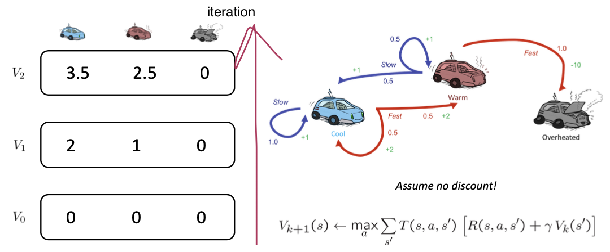

### Convergence

How do we know the $V_k$ vectors are going to converge? 
- Case 1: If the tree has maximum depth M, then $V_M$ holds the actual untruncated values
- Case 2: If the discount is less than 1
  - Sketch: For any state $V_k$ and $V_{k+1}$ can be viewed as depth $k+1$ expectimax results in nearly identical search trees
  - The difference is that on the bottom layer, $V_{k+1}$ has actual rewards while $V_k$ has zeros
  - That last layer is at best all $R_{MAX}$
  - It is at worst $R_{MIN}$
  - But everything is discounted by $\gamma^k$ that far out
  - So $V_k$ and $V_{k+1}$ are at most $\gamma^k \max |R|$ different
  - So as k increases, the values converge

> With the bounded reward and $\gamma <1$, we can make sure that the iteration will converge