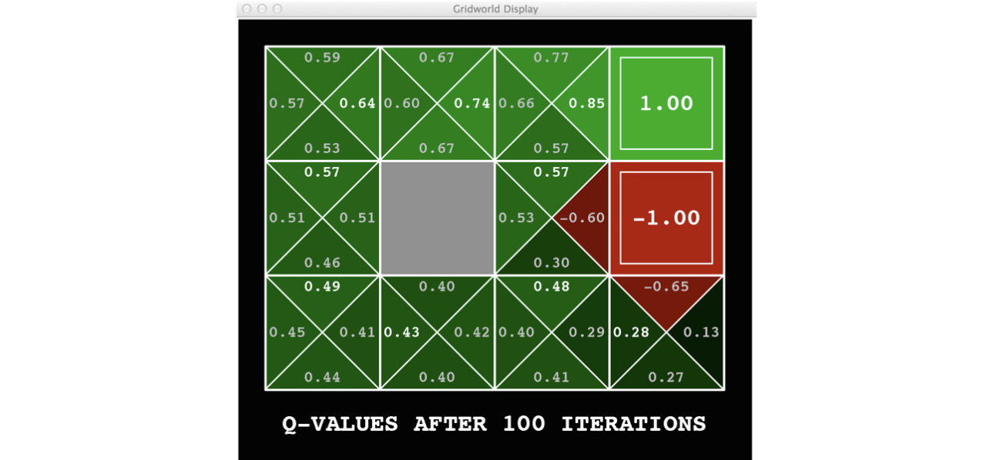

Strategy-iteration policy

<!--more-->

## Recap

### MDPs
- Markov decision processes: 
  - States S
  - Actions A
  - Transitions $P(s’|s,a)$ (or $T(s,a,s’)$) 
  - Rewards $R(s,a,s’)$ (and discount g) 
  - Start state $s_0$
- Quantities:
  - Policy(策略) = map of states to actions
  - Utility(效用) = sum of discounted rewards
  - Values(价值) = expected future utility from a state (max node)
    - 
  - Q-Values(Q值) = expected future utility from a q-state (chance node)
    - 

### Bellman Equations

> If bellman equation holds for every state, then the system utility is optimal

$$
\begin{array}{l}
V^{*}(s)=\max _{a} Q^{*}(s, a) \\
Q^{*}(s, a)=\sum_{s^{\prime}} T\left(s, a, s^{\prime}\right)\left[R\left(s, a, s^{\prime}\right)+\gamma V^{*}\left(s^{\prime}\right)\right] \\
V^{*}(s)=\max _{a} \sum_{s^{\prime}} T\left(s, a, s^{\prime}\right)\left[R\left(s, a, s^{\prime}\right)+\gamma V^{*}\left(s^{\prime}\right)\right] \\
V^{*}(s) = \max_{a} \sum_{s'} P(s'|s,a) \left[ R(s,a,s') + \gamma V^{*} (s') \right]
\end{array}
$$

Value iteration **computes** them (AKA 一步前瞻方程)

$$
V_{k+1}(s) \leftarrow \max_{a} \sum_{s'} T(s,a,s') \left[R(s,a,s')+\gamma V_k(s')\right]
$$

- Value iteration is just a fixed point (不动点) solution method 
  - ... though the $V_k$ vectors are also interpretable as time-limited values

## Policy Methods

> We want to make improvements to the policy design (instead of max of the expectimax)
> Policy = a combination of actions
> Goal: Design a utility to evaluate different policies

### Fixed Policies

- Do the optimal action 
  - Expectimax trees max over all actions to compute the optimal values
  > Deficiency both in runtime performance and intuition

- If we fixed some policy p(s), then the tree would be simpler - only one action per state 
  -  ... though the tree’s value would depend on which policy we fixed
  > Let $\pi(s)$ tell us what to do next (instead of traversing all the nodes below)

### Utilities for fixed policies

Define the utility of a state s, under a fixed policy $\pi$:
- $V^{\pi}(s) = expected total discounted rewards starting in s and following $\pi$

> How to compute the utility for fixed policy for every state?

Idea 1: Transform recursive bellman equations into updates
$$
V^{\pi}(s)=\sum_{s^{\prime}} T\left(s, \pi(s), s^{\prime}\right)\left[R\left(s, \pi(s), s^{\prime}\right)+\gamma V^{\pi}\left(s^{\prime}\right)\right]
$$

> Without the operation of $\max_{action}$ and implicit $V^{*}$, Runtime $O(S^2)$ instead of $O(S^2 A)$

Idea 2: Without the maxes, the Bellman equations are just a linear system 
- Solve with Matlab (or your favorite linear system solver)

## Policy Extraction

> We want to find the optimal policy, however, we don't want to bring too much extra overhead (brute force ~ CSP ~ $O(A^S)$)

### Computing Actions from where?

> From Actions
 
Let’s imagine we have the optimal values $V^{*}(s)$ 
- How should we act?
  - It’s not obvious!
- We need to do a mini-expectimax (one step)
  $$
  \pi^{*}(s)=\arg \max _{a} \sum_{s^{\prime}} T\left(s, a, s^{\prime}\right)\left[R\left(s, a, s^{\prime}\right)+\gamma V^{*}\left(s^{\prime}\right)\right]
  $$
  > Which coincides the value-iteration
- This is called **policy extraction**, since it gets the policy implied by the values

> From Q-Values

$$
\pi^{*}(s) = \argmax_a Q^{*}(s,a)
$$

> Important lesson: actions are easier to select from q-values than values!

## Policy Iteration
> Can we make modifications to the policy as we proceed

### Problems with Value Iteration

- Problem 1: It’s slow - $O(S^2 A)$ per iteration
- Problem 2: The “max” at each state rarely changes
- Problem 3: The policy often converges long before the values

> IDEA: 在稳定的value分布下，对策略选取做改进（最优动作）

### Solution

1. **Policy evaluation**: calculate utilities for some fixed policy (not optimal utilities!) until convergence
2. **Policy improvement**: update policy using one-step look-ahead with resulting converged (but not optimal!) utilities as future values
3. Repeat steps until **policy converges**

Still optimal and faster under some conditions

> Issues:
> Policy Iteration (when the values are stable, (given value) calculate the utility of every single policy)

### Implementation

Evaluation: For fixed current policy $\pi,$ find values with policy evaluation:
Iterate until values converge:
$$
V_{k+1}^{\pi_{i}}(s) \leftarrow \sum_{s^{\prime}} T\left(s, \pi_{i}(s), s^{\prime}\right)\left[R\left(s, \pi_{i}(s), s^{\prime}\right)+\gamma V_{k}^{\pi_{i}}\left(s^{\prime}\right)\right]
$$

Improvement: For fixed values, get a better policy using policy extraction
One-step look-ahead:
$$
\pi_{i+1}(s)=\arg \max _{a} \sum_{s^{\prime}} T\left(s, a, s^{\prime}\right)\left[R\left(s, a, s^{\prime}\right)+\gamma V^{\pi_{i}}\left(s^{\prime}\right)\right]
$$

## Offline VS Online
> For given environment, we can always find the stable distribution (transfer expectation) if we run enough iterations

- That wasn’t planning, it was learning!
  - Specifically, reinforcement learning
  - There was an MDP, but you couldn’t solve it with just computation 
  - You needed to actually act to figure it out
- Important ideas in reinforcement learning that came up
  - **Exploration**: you have to try unknown actions to get information
  > Learning
  - **Exploitation**: eventually, you have to use what you know
  - Regret: even if you learn intelligently, you make mistakes
  - Sampling: because of chance, you have to try things repeatedly
  - Difficulty: learning can be much harder than solving a known MDP
  > Though MDP may have some indeterministic runtime result, we can always solve it based on Bellman Equation.