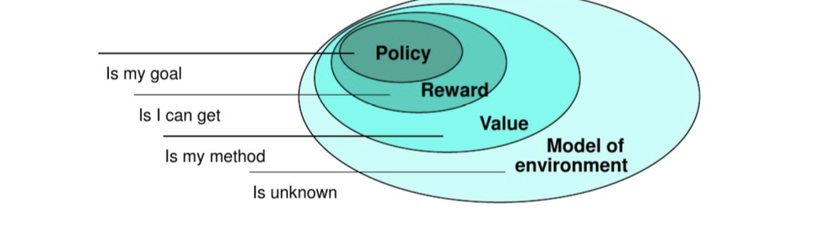
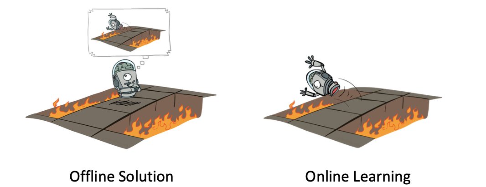
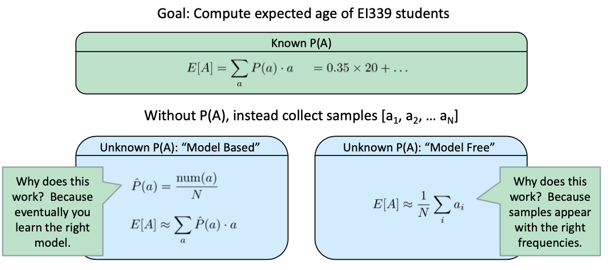
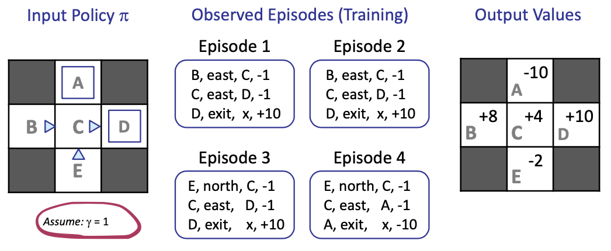
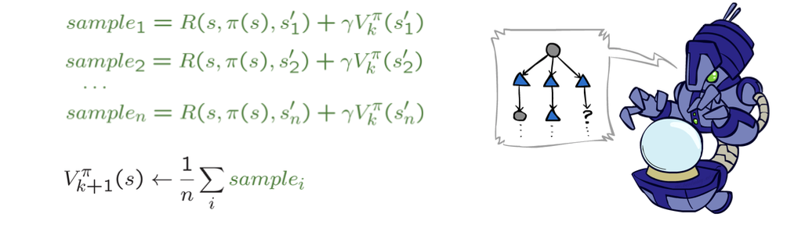
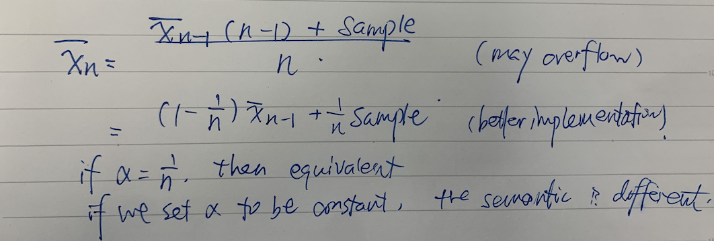
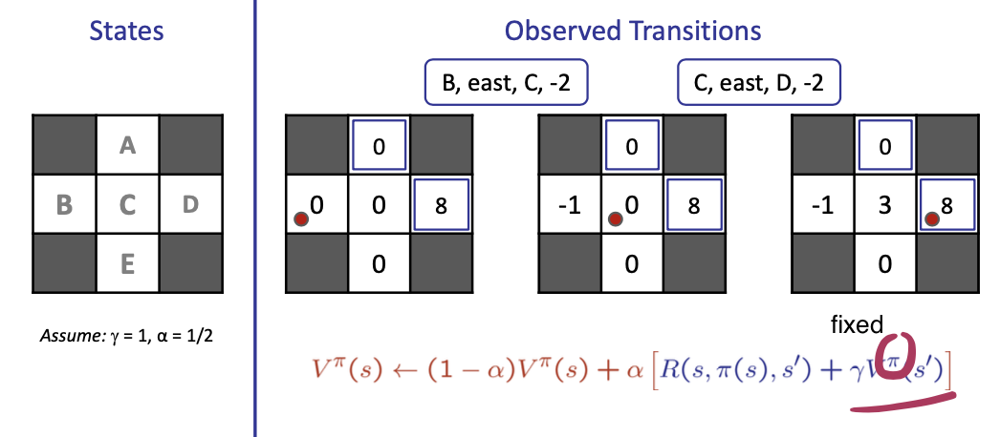
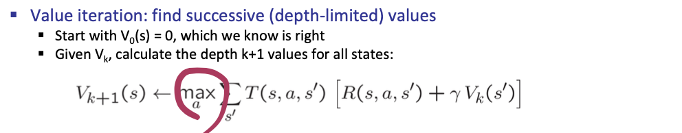
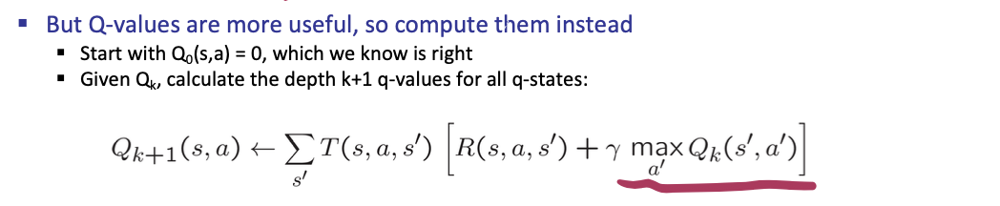
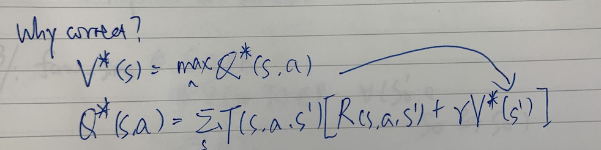

<!-- more -->

> Supervised Learning - Learn from examples provided by a knowledged external supervisor
> Reinforcement Learning - Learn from **interaction**
> - Learn from its experience
> - Object: get as much rewards as possible
> - by discovering which action yield the most reward by trying them

**试错搜索(Trial-and-Error)**和**延期强化(Delayed Reinforcement)**这两个特性是强化学习中两个重要的特性

- Basic idea:
  - Receive feedback in the form of rewards
  - Agent’s utility is defined by the reward function
  > Should have properties like 时效性，一致性.... though we might not dig into it
  - Must (learn to) act so as to maximize expected rewards 
  - All learning is based on observed samples of outcomes!

## Problem

- Still assume a Markov decision process (MDP): 
  - A set of states $s\in S$
  - A set of actions (per state) A
  - A model $T(s,a,s')$
    > Unknown, should be updated
  - A reward function $R(s,a,s')$
    > Only known after we did the action
- Still looking for a policy $\pi(s)$
- New twist: **don’t know T or R**
  - I.e. we don’t know which states are good or what the actions do
  - Must actually try out actions and states to learn

### Elements

- Policy: stochastic rule for selecting actions
- Return/Reward: the function of future rewards agent tries to maximize 
- Value: what is good because it predicts reward
- Model: what follows what

### Offline vs Online

> MDP: learn by simulation
> RL: learn by trial

## Model-Based Learning

> An easier version of RL

- Model-Based Idea:
  - Learn an approximate model based on experiences 
  - Solve for values as if the learned model were correct
- Step 1: Learn empirical MDP model
  - Count outcomes s’ for each s, a
  - Normalize to give an estimate of $\hat{T} (s,a,s')$
  > hat means sampling, we use the statistics to approximate the true probability
  - Discover each $\hat{R} (s,a,s')$ when we experience (s, a, s’)
- Step 2: Solve the learned MDP
  - For example, use value iteration, as before

> Based on model, we need to estimate the transition probability and the reward
> Model-based VS Model-free
> 
> In practice, the two solutions are equivalent, and furthermore, when implementing, model-free equation implies that **we don't necessarily have to evaluate the transition probability**

## Passive Reinforcement Learning

> We don't know how to act initially, but we can **observe** a specific given strategy, and learn based on the observation.
> E.g. we can't let auto-driving to go on the street to learn

- Simplified task: policy evaluation
  - Input: a fixed policy p(s)
  - You don’t know the transitions T(s,a,s’) 
  - You don’t know the rewards R(s,a,s’)
  - Goal: learn the state values
- In this case:
  - Learner is “along for the ride”(搭便车)
  - No choice about what actions to take
  - Just execute the policy and learn from experience
  - This is NOT offline planning! You actually take actions in the world.

> Repeatedly iterate over the given strategy and we can evaluate the policy value $V_{\pi}(s)$

### Initial Try: Direct Evaluation

#### Description

> Take $\gamma = 1$

- Goal: Compute values for each state under $\pi$
- Idea: Average together observed sample values
  - Act according to $\pi$
  - Every time you visit a state, write down what the sum of discounted rewards turned out to be
  - Average those samples
- This is called **direct evaluation**

#### Example

> e.g. For `B`, there are two related episodes, with $\gamma  = 1$, $v_1(b) = 10 -1-1=8$, $v_2(b) = 10 -1 -1 = 8$, $\hat{v}(b) = 8$
>  For `C`, there are 4 related episodes, with $\gamma  = 1$, $v_1(b) = 10 -1= 9$, $v_2(b) = 10 -1 = 9$, $v_3(b) = 10 -1 = 9$, $v_4(b) = -10 -1 = -11$ $\hat{v}(b) = (9+9+9-11)/4=4$

#### Pros and Cons

- What’s good about direct evaluation?
  - It’s easy to understand
  - It doesn’t require any knowledge of T, R
  - It eventually computes the correct average values, using just sample transitions
- What bad about it?
  - It wastes information about state connections 
  > B, E as to C , If B and E both go to C under this policy, how can their values be different?
  - Each state must be learned separately
  > Sample matters a lot
  - So, it takes a long time to learn
  > We should sample a lot

### Improvement: Use Policy Evaluation

> Note, in the implementation above, we are actually finding a $\pi (s)$, then why don't we make use of it?

Recall: Bellman equation and its iterative solution

$$
V_{k+1}^{\pi_{i}}(s) \leftarrow \sum_{s^{\prime}} T\left(s, \pi_{i}(s), s^{\prime}\right)\left[R\left(s, \pi_{i}(s), s^{\prime}\right)+\gamma V_{k}^{\pi_{i}}\left(s^{\prime}\right)\right]
$$

Idea: Take samples of outcomes s’ (by doing the action!) and average

### Advancement: Temporal Difference Learning

> The premise that our sampling makes sense is that we are evaluating _under the same policy_

- Big idea: learn from every experience!
  - Update V(s) **each time we experience** a transition (s, a, s’, r) 
  - Likely outcomes s’ will contribute updates more often

- Temporal difference learning of values
  - Policy still fixed, still doing evaluation!
  - Move values toward value of whatever successor occurs: running average (
  > idea: 线性插值

$$
\begin{aligned}
&\text { Sample of } \mathrm{V}(\mathrm{s}): \quad \text { sample }=R\left(s, \pi(s), s^{\prime}\right)+\gamma V^{\pi}\left(s^{\prime}\right)\\
&\text { Update to } \mathrm{V}(\mathrm{s}): \quad V^{\pi}(s) \leftarrow(1-\alpha) V^{\pi}(s)+(\alpha) \text { sample }\\
&\text { Same update: }\\
&V^{\pi}(s) \leftarrow V^{\pi}(s)+\alpha\left(\text {sample}-V^{\pi}(s)\right)
\end{aligned}
$$

#### How to smooth data

1. Moving average
   Observed signal with noise: $x_{n}=g_{n}+\varepsilon_{n},$ where $\varepsilon_{n} \sim N\left(0, \sigma^{2}\right)$ 
   Using a window with width of $2 m+1,$ MA get:
    $$
    \overline{x_{n}}=\frac{1}{2 m+1} \sum_{i=-m}^{m}\left(g_{n+i}+\varepsilon_{n+i}\right)=\overline{g_{n}}
    $$
2. Weighted Moving Average
   - MA using a rectangular window to do filtering, amplitude "roll off" at approximately 6 dB per octave
   - Different windows for MA, such as: Gaussian, Hamming, ......
   > Both MA Needs memory to save samples
3. Exponential moving average
   The running interpolation update: $\bar{x}_{n}=(1-\alpha) \cdot \bar{x}_{n-1}+\alpha \cdot x_{n}$
   Makes recent samples more important:
   $$
   \bar{x}_{n}=\frac{x_{n}+(1-\alpha) \cdot x_{n-1}+(1-\alpha)^{2} \cdot x_{n-2}+\ldots}{1+(1-\alpha)+(1-\alpha)^{2}+\ldots}
   $$
> idea: Forgets about the past (distant past values were wrong anyway)
> Decreasing learning rate (alpha) can give converging averages

> With the learning rate of $\frac{1}{n}$, we are calculating the average of all samples

### Problem with Temporal Difference Learning

- TD value leaning is a model-free way to do policy evaluation, mimicking Bellman updates with running sample averages
- However, if we want to turn values into **a (new) policy**, we’re sunk:

- Idea: learn Q-values, not values
- Makes action selection model-free too!

## Active Reinforcement Learning

- Full reinforcement learning: optimal policies (like value iteration) 
  - You don’t know the transitions `T(s,a,s’)`
  - You don’t know the rewards `R(s,a,s’)`
  - You choose the actions now
  - Goal: learn the optimal policy / values

> Agents should have the ability to *try*
> *Trade-off*: exploration vs exploitation

- In this case:
  - Learner makes choices!
  - Fundamental tradeoff: exploration vs. exploitation
  - This is **NOT offline planning**! You actually take actions in the world and find out what happens...

### Detour: Q-Value Iteration

> Value iteration puts max action on top level (a non-linear transformation)
> Value iteration: 固定策略，只有V值

> Q-learning: 观测（R）采用独立策略，探索（Q）采用最优策略

### Q-Learning: Implementation

Q-Learning: sample-based Q-value iteration

Learn Q(s,a) values as you go
- Receive a sample (s,a,s’,r)
- Consider your old estimate: $Q(s,a)$
- Consider your new sample estimate: $sample = R(s,a,s')+\gamma \max_{a'}Q(s',a')$
- Incorporate the new estimate into a running average:
$$
Q(s,a)\leftarrow(1-\alpha)Q(s,a) + \alpha [sample]
$$

### Q-Learning Properties

- Amazing result: Q-learning converges to optimal policy -- even if you’re acting suboptimally!
- This is called **off-policy (脱离策略)** learning
  > 观测的行为可能非最优，但最终可以收敛到最终状态
- Caveats:
- You have to explore enough
- You have to eventually **make the learning rate small enough** (noises can be destructive)
- ... but not decrease it too quickly
- Basically, in the limit, it doesn’t matter how you select actions (!)