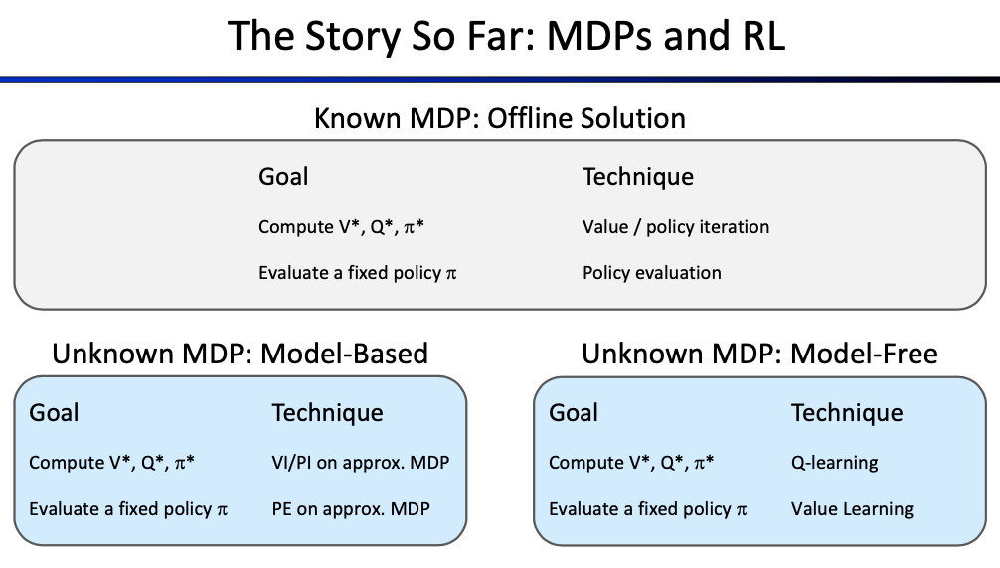
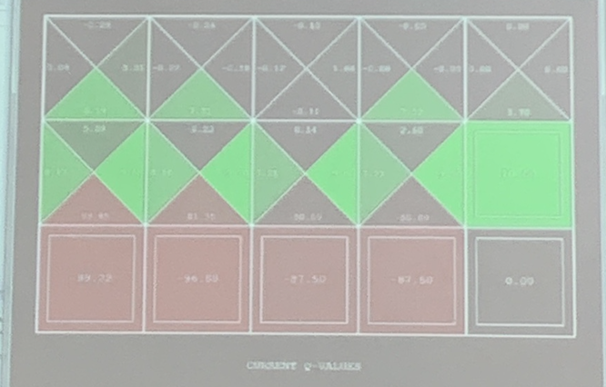
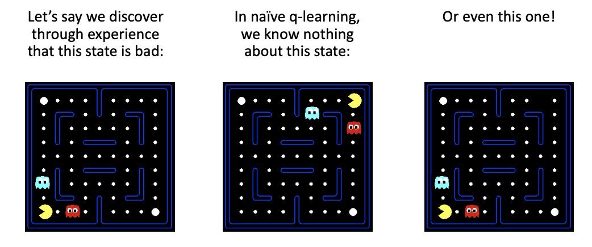
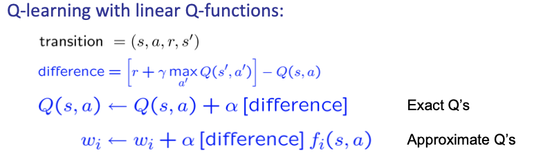
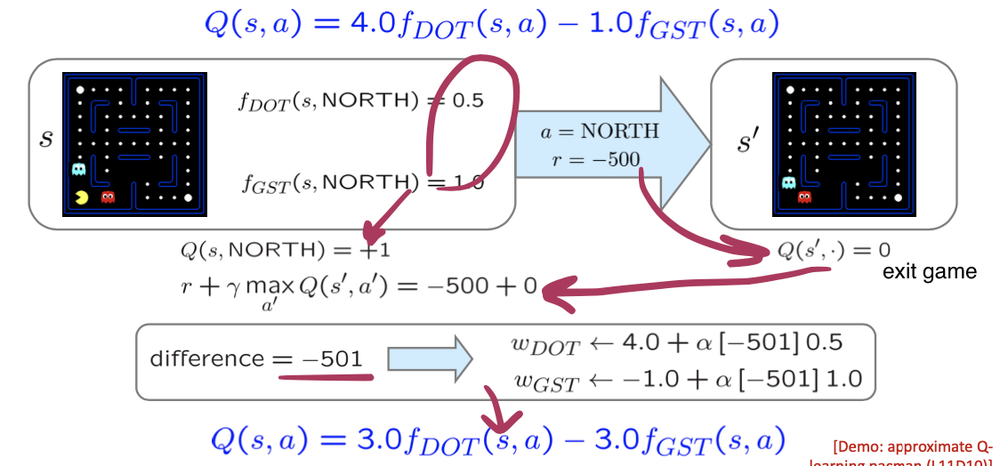
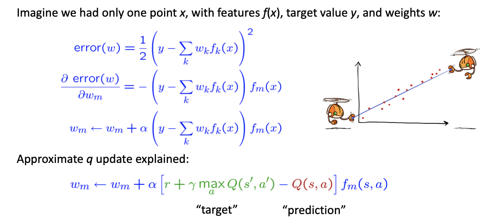

<!--more-->

[toc]

## Recall: Model-Free Learning
- Model-free (temporal difference) learning 
  - Experience world through episodes $(s,a,r,s',a',r',s'',a'',r'',s''',\ldots)$
  - Update estimates each transition $(s,a,r,s')$
  - Over time, updates will mimic Bellman updates
  > Unlike passive learning, Q-learning demands that the `a` to be selected doesn't have to be optimal, thus model-free

- Q-learning
  - We'd like to do Q-value updates to each Q-state
    - but we don't know Transition/ Reward
  - We compute average as we go
    - Keep a running average
      $$
      Q(s, a) \leftarrow(1-\alpha) Q(s, a)+(\alpha)\left[r+\gamma \max _{a^{\prime}} Q\left(s^{\prime}, a^{\prime}\right)\right]
      $$
    > A trick is to let learning rate decreasing during iteration, so that the solution can approach stable
    > **Important** Exploration/sample may not be optimal (according to an extra policy, e.g. $\epsilon$-greedy), but the evaluation/computation is based on the present optimal

## A H-Order View: Exploration vs. Exploitation

- Several schemes for forcing exploration
  - Simplest: random actions (e-greedy) 
    - Every time step, flip a coin
    - With (small) probability e, act randomly
    - With (large) probability 1-e, act on current policy
  - Problems with random actions?
    - You do eventually explore the space, but keep thrashing around once learning is done
    - **One solution: lower e over time**
    - **Another solution: exploration functions**

### Exploration Functions
> Goal: for unexplored states, improve its exploration probability, so that we can cover $A^S$ space AMAP

- When to explore
  - Random actions: explore a fixed amount
  - Better idea: explore areas whose badness is not (yet) established, eventually stop exploring

- Exploration Function
- Takes a value estimate u and a visit count n, and returns an optimistic utility, e.g. $f(u,n) = u + k / (n + 1)$ *decrease as n increases*
  - Regular Q-Update: $Q(s,a)\leftarrow_{\alpha} R(s,a,s') + \gamma \max_{a'} Q(s',a')$
  - Modified Q-Update: $Q(s,a)\leftarrow_{\alpha} R(s,a,s') + \gamma \max_{a'} \mathbf{f} ( Q(s',a'), N(s',a'))$
  - ($\leftarrow_\alpha$ means updating as moving average
  > When $N$ is large enough, $f$ should reduce back to optimal $U$
- Note: this propagates the “bonus” back to states that lead to unknown states as well!

### Analysis: Regret
- Even if you learn the optimal policy, you still make mistakes along the way!
- Regret is a measure of your total mistake cost: the difference between your (expected) rewards, including youthful suboptimality, and optimal (expected) rewards
- Minimizing regret goes beyond learning to be optimal – it requires optimally learning to be optimal
- Example: random exploration and exploration functions both end up optimal, but random exploration has higher regret
  > i.e. random exploratin has a higher probability that it makes regretable explorations

## Approximate Q-Learning

### Generalizing Across States

- Basic Q-Learning keeps a table of all q-values
- In realistic situations, we cannot possibly learn about every single state!
  - Too many states to visit them all in training
  - Too many states to hold the q-tables in memory
  > e.g. for 3*4 Pacman, 2000+ iterations are required
- Instead, we want to generalize:
  - Learn about some small number of training states from experience
  - Generalize that experience to new, similar situations
  - This is a fundamental idea in machine learning, and we’ll see it over and over again

> Idea: extract distinct features so that we can approximate the Q-Table

- Solution: describe a state using a vector of features (properties)
- Features are functions from states to real numbers (often 0/1) that capture important properties of the state
- Example features:
  - Distance to closest ghost
  - Distance to closest dot
  - Number of ghosts
  - $1 / (dist to dot)^2$
  - Is Pacman in a tunnel? (0/1)
  - ...... etc.
  - Is it the exact state on this slide?
- Can also describe a q-state (s, a) with features (e.g. action moves closer to food)

### Linear Value Functions

- Using a feature representation, we can write a q function (or value function) for any state using a few weights:
$$
\begin{aligned}
V(s) &=w_{1} f_{1}(s)+w_{2} f_{2}(s)+\ldots+w_{n} f_{n}(s) \\
Q(s, a) &=w_{1} f_{1}(s, a)+w_{2} f_{2}(s, a)+\ldots+w_{n} f_{n}(s, a)
\end{aligned}
$$
> We are going to "learn" the coefficients
- Advantage: our experience is summed up in a few powerful numbers
- Disadvantage: states may share features but actually be very different in value! 特征选取不好，拟合程度可能差
> Some DL algorihtms are learning which feature to extract

> for given s,a, `f(s,a)` is fixed, so we only need to adjust the weight. (according to the difference of the value observerd and the current Q value)

- Intuitive interpretation:
  - Adjust weights of active features
  - E.g., if something unexpectedly bad happens, blame the features that were on: disprefer all states with that state’s features
- Formal justification: online least squares

#### Example:

> Based on appropriate approx measures, the number of iterations can be reduced greatly

$$
\text { total error }=\sum_{i}\left(y_{i}-\hat{y}_{i}\right)^{2}=\sum_{i}\left(y_{i}-\sum_{k} w_{k} f_{k}\left(x_{i}\right)\right)^{2}
$$

> $\alpha \le 1$ indicates how we adjust the original line to fit the new observation

#### Overfitting?

> We may also choose to fit with higher order functions
> Sometimes, limiting capacity can help
> Occam's Razor principle

