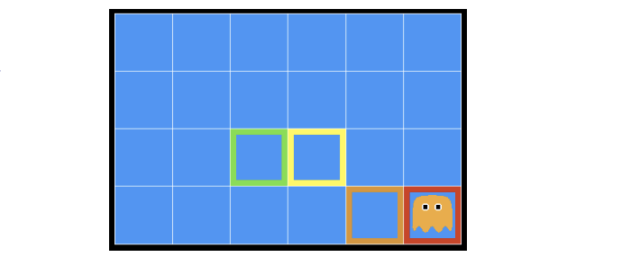
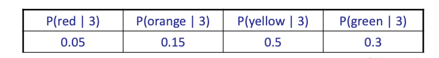
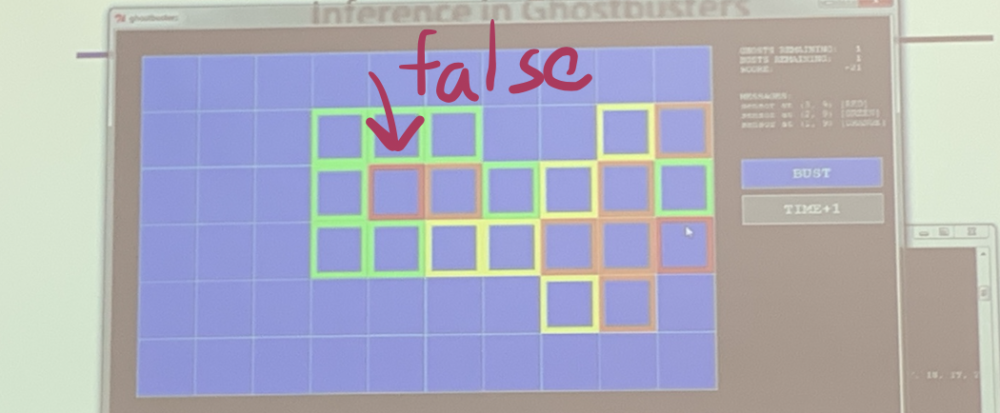
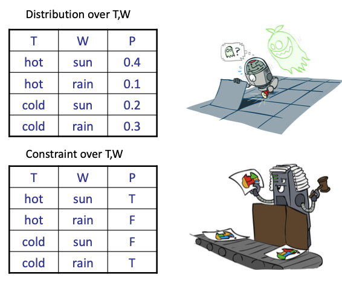
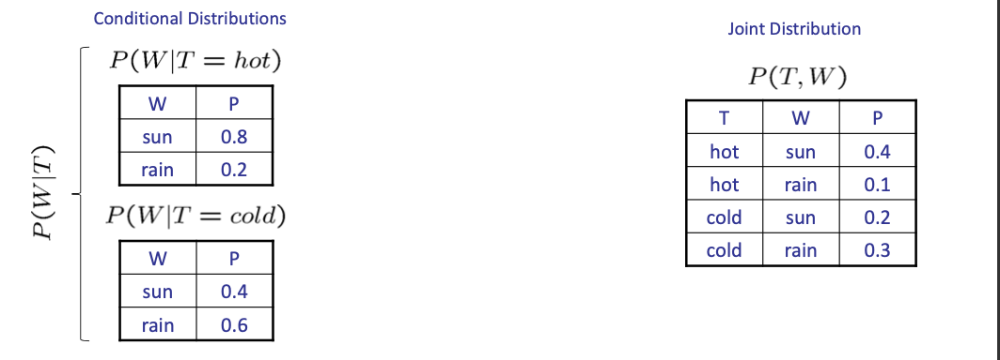
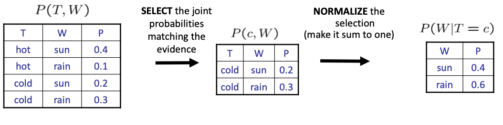
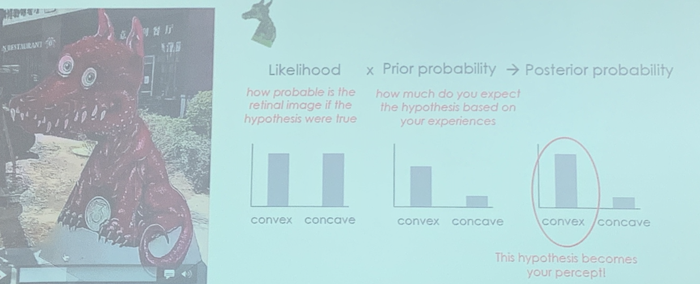
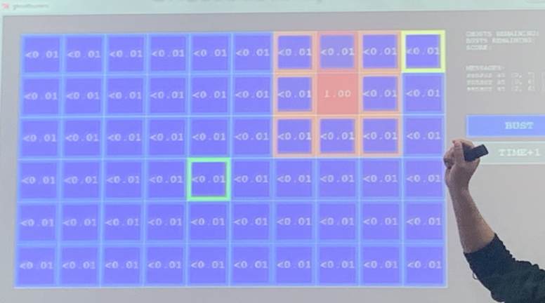

<!--more-->

## Recall: Probability Spaces

- Set$\Omega$ 样本空间: certain subsets of $\Omega$ as being events
- Event Field $U$: collection of subsets of $\Omega$
- **DEFINTION**. A $\sigma$ -algebra is a collection $\mathcal{U}$ of subsets of $\Omega$ with these properties:
    (i) $\emptyset, \Omega \in \mathcal{U}$
    (ii) If $A \in \mathcal{U},$ then $A^{c} \in \mathcal{U}$
    (iii) If $A_{1}, A_{2}, \cdots \in \mathcal{U},$ then
    $$
    \bigcup_{k=1}^{\infty} A_{k}, \bigcap_{k=1}^{\infty} A_{k} \in \mathcal{U}
    $$
    Here $A^{c}:=\Omega-A$ is the complement of $A$
- 概率测度$P$
- 概率空间=$\Omega,U,P$

> The examples in EI339 are discrete RVs

## Inference in Ghostbusters

- A ghost is in the grid somewhere
- Sensor readings tell how close a square is to the ghost
  - On the ghost: red
  - 1 or 2 away: orange 
  - 3 or 4 away: yellow 
  - 5+ away: green
- Sensors are *noisy*, but we know $P(Color | Distance)$

> 先验条件概率+evidence => 推断

## Uncertainty
> A bit like CSP, in that graph model is involved
- General situation:
  - Observed variables (evidence): Agent knows certain things about the state of the world (e.g., sensor readings or symptoms)
  - Unobserved variables: Agent needs to reason about other aspects (e.g. where an object is or what disease is present)
  - Model: Agent knows something about how the known variables relate to the unknown variables
- Probabilistic reasoning gives us a framework for managing our beliefs and knowledge

## Random Variables
- Denoted as capital letters
- have domains

## Probabilistic Models
- A probabilistic model is a joint distribution over a set of random variables
- Probabilistic models:
  - (Random) variables with domains
  - Assignments are called **outcomes**
  - Joint distributions: say whether assignments (outcomes) are likely
  - **Normalized**: sum to 1.0
  - Ideally: only certain variables directly interact
> Resemblance to CSP
- Constraint satisfaction problems:
  - Variables with domains
  - Constraints: state whether assignments are possible
  - Ideally: only certain variables directly interact

## Events

- An event is a set E of outcomes
  $$
  P(E) = \sum_{(x_1\ldots x_n) \in E} P(x_1,\ldots,x_n)
  $$
- From a joint distribution, we can calculate the probability of any event
  - Probability that it’s hot AND sunny? 
  - Probability that it’s hot?
  - Probability that it’s hot OR sunny?
- Typically, the events we care about are partial assignments, like P(T=hot)

## Conditional Distributions
- Conditional distributions are probability distributions over some variables given fixed values of others

> In probabilistic models, evidence matters a lot ($T=hot$ or $T=cold$)

### Normalization Trick
> Although we have different conditional distributions table, the sum is always 1.

Given evidence $T=c$, we know the variable $W$, We can normalize them to conditional distribution.

A simple scaling can avoid the redudant computation

## Probabilistic Inference
- Probabilistic inference: compute a desired probability from other known probabilities (e.g. conditional from joint)
-  We generally compute conditional probabilities 
   -  P(on time | no reported accidents) = 0.90
   - These represent the agent’s beliefs given the evidence
- Probabilities change with new evidence: 
  - P(on time | no accidents, 5 a.m.) = 0.95
  - P(on time | no accidents, 5 a.m., raining) = 0.80
  - Observing new evidence causes beliefs to be updated

### Inference by Enumeration

General case:
- Evidence variables: $E_1 \ldots E_k = e_1 \ldots e_k$
  > Which is no longer random
- Query* variable: $Q$
- Hidden variables $H_1 \ldots H_r$, which are not the variables that we focus

All variables: $X_1,X_2,\ldots,X_n$
We want $P(Q|e_1\ldots e_k)$

- Step 1: Select the entries consistent with the evidence
  > From the joint distribution table
- Step 2: Sum out H to get joint of Query and evidence
  > Eliminate the hidden variables
- Step 3: Normalize

Obvious problems:
- Worst-case time complexity $O(d^n)$
- Space complexity $O(d^n)$ to store the joint distribution
> How to get the joint distribution table?

## The product/chain Rule
> Solution, Beyas method
Sometimes have conditional distributions but want the joint
$$
P(x)P(x|y)=P(x,y)\iff P(x|y) = \frac{P(x,y)}{P(y)}
$$
$$
P\left(x_{1}, x_{2}, \ldots x_{n}\right)=\prod_{i} P\left(x_{i} \mid x_{1} \ldots x_{i-1}\right)
$$

## Bayes Rule

> Divide the global joint distribution into local distribution

Two ways to factor a joint distribution over two variables:
$$
P(x, y)=P(x \mid y) P(y)=P(y \mid x) P(x)
$$
Dividing, we get:
$$
P(x \mid y)=\frac{P(y \mid x)}{P(y)} P(x)
$$
> Idea: use inverse cause-effect relation
> Use effect to infer cause

Why is this at all helpful?
- Lets us build one conditional from its reverse
- Often one conditional is tricky but the other one is simple 
- Foundation of many systems we’ll see later (e.g. ASR, MT)

In the running for most important AI equation!

> 
> The sampling/observation corresponds to  "likelihood", in this problem, the convex and concave can be equal in observation
> However, in our prior knowledge, we identify it as more convex than concave
> The final result will be convex, leading to a false conclusion

## Inference with Baye's Rule

Example: Diagnostic probability from causal probability 根据已观测到的证据（结果），求似然概率,推断给定结果，产生原因的概率:

$P($ cause $\mid$ effect $)=\frac{P(\text { effect } \mid \text { cause }) P(\text { cause })}{P(\text { effect })}$
Example:
M: meningitis（脑膜炎）, S: stiff neck，但S可能由其他病因产生
$$
\left.\begin{array}{c}
P(+m)=0.0001 \\
P(+s \mid+m)=0.8 \\
P(+s \mid-m)=0.01
\end{array}\right\} \begin{array}{c}
\text { Example } \\
\text { givens } \end{array}
$$
在观测到症状情况下，病因的概率：
$$
P(+m \mid+s)=\frac{P(+s \mid+m) P(+m)}{P(+s)}=\frac{P(+s \mid+m) P(+m)}{P(+s \mid+m) P(+m)+P(+s \mid-m) P(-m)}=\frac{0.8 \times 0.0001}{0.8 \times 0.0001+0.01 \times 0.999} \approx 0.0008
$$
> actually, we don't need to calculate the sum $P(+s)$, since we can do this with normalization trick
用于决策网络
- Note: posterior probability of meningitis still very small
- Note: you should still get stiff necks checked out! Why?

### Ghostbusters, Revisited

Let's say we have two distributions:
- Prior distribution over ghost location: P(G)
  - Let's say this is uniform
- Sensor reading model: $\mathrm{P}(\mathrm{R} \mid \mathrm{G})$
  - Given: we know what our sensors do
  - $\mathrm{R}=$ reading color measured at (1,1)
  - E.g. $P(R=$ yellow $\mid G=(1,1))=0.1$
- We can calculate the posterior distribution $\mathrm{P}(\mathrm{G} \mid \mathrm{r})$ over ghost locations given a reading using Bayes' rule:
  $$
  P(g \mid r) \propto P(r \mid g) P(g)
  $$
  > 先验模型+传感器读数=先验知识，更新：后验概率
  > 