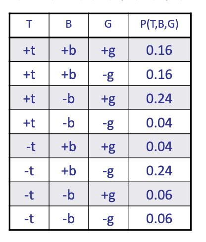

<!--more-->


## Probabilistic Models

- Models describe how (a portion of) the world works
- Models are always simplifications 
  - May not account for every variable
  - May not account for all interactions between variables 
  - “All models are wrong; but some are useful.” – George E. P. Box
- What do we do with probabilistic models?
  - We (or our agents) need to reason about unknown variables, given evidence
  - Example: explanation (diagnostic reasoning 诊断推理)
  - Example: prediction (causal reasoning 因果推断)
  - Example: value of information 信息价值衡量 (Recall, in Ghost game, the value of a pointer information)


## Independence

- Two variables are independent if:
  $\forall x,y: P(x,y)=P(x)P(y)$
- This says that their joint distribution factors into a product two simpler distributions
- Another form:
  $\forall x,y: P(x|y)=P(x)$
- We write: $X \bot Y$
- Independence is a simplifying modeling assumption
  - Empirical joint distributions: at best “close” to independent
  - What could we assume for {Weather, Traffic, Cavity, Toothache}?
> We may check the joint distribution for independence, but more often than not, we are making assumptions while modeling


## Conditional Independence

- P(Toothache, Cavity, Catch)
  - If I have a cavity, the probability that the probe catches in it doesn't depend on whether I have a toothache:
  - P(+catch | +toothache, +cavity) = P(+catch | +cavity)
- The same independence holds if I don’t have a cavity:
  - P(+catch | +toothache, -cavity) = P(+catch| -cavity)
- Catch is conditionally independent of Toothache given Cavity:
  - P(Catch | Toothache, Cavity) = P(Catch | Cavity)
> toothache doesn't help catching the cavity
- Equivalent statements:
  - P(Toothache | Catch , Cavity) = P(Toothache | Cavity)
  - P(Toothache, Catch | Cavity) = P(Toothache | Cavity) P(Catch | Cavity) 
  - One can be derived from the other easily


- Unconditional (absolute) independence very rare (why?)
- Conditional independence is our most basic and robust form of knowledge about uncertain environments.
- $\mathrm{X}$ is conditionally independent of Y given $\mathrm{Z}$
$$
X \Perp Y \mid Z
$$
if and only if:
$$
\forall x, y, z: P(x, y \mid z)=P(x \mid z) P(y \mid z)
$$
or, equivalently, if and only if
$$
\forall x, y, z: P(x \mid z, y)=P(x \mid z)
$$

$$
\begin{aligned}
P(x \mid z, y) &=\frac{P(x, z, y)}{P(z, y)} \\
&=\frac{P(x, y \mid z) P(z)}{P(y \mid z) P(z)} \\
&=\frac{P(x \mid z) P(y \mid z) P(z)}{P(y \mid z) P(z)}
\end{aligned}
$$

Examples:
- Traffic $\bot$ Umbrella $|$ Rain
  > Rain affects umbrella and traffice simultaneously
- Fire $\bot$ Alarm $|$ Smoke
  > Smoke is the imtermediate factor

## Conditional Independence and the Chain Rule
- The authentic chain rule
    $$
    P\left(X_{1}, X_{2}, \ldots X_{n}\right)=P\left(X_{1}\right) P\left(X_{2} \mid X_{1}\right) P\left(X_{3} \mid X_{1}, X_{2}\right) \ldots
    $$
- Trivial decomposition:
  - $P($ Traffic, Rain, Umbrella $)=$ $P($ Rain $) P($ Traffic $\mid$ Rain $) P($ Umbrella $\mid$ Rain, Traffic $)$
- With assumption of conditional independence:
  - $P($ Traffic, Rain, Umbrella ) $=$ $P($ Rain $) P($ Traffic $\mid$ Rain $) P($ Umbrella $\mid$ Rain $)$
- Bayes'nets / graphical models help us **express conditional independence assumptions**


### Ghostbusters Chain Rule
> A simple version of the ghost world, only two grids

- Each sensor depends only on where the ghost is
- That means, the two sensors are conditionally independent, given the ghost position
- T: Top square is red
- B: Bottom square is red 
- G: Ghost is in the top (upper grid)
- Givens:
  ```
  P(+g) = 0.5
  P(-g) = 0.5
  P(+t|+g) = 0.8 P(+t|-g) = 0.4
  P(+b|+g) = 0.4 P(+b|-g) = 0.8 (not normalized)
  ```


> Then P(T,B,G) = P(G)P(T|G)P(B|G)
> Note P(T,B) != P(T)P(B)
> but P(T,B|G) = P(T|G)P(B|G)