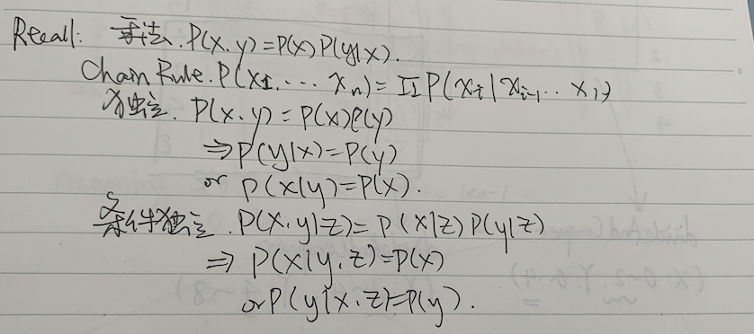
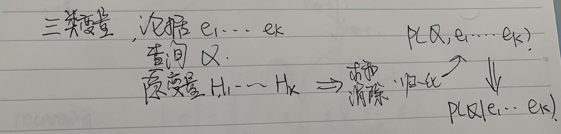
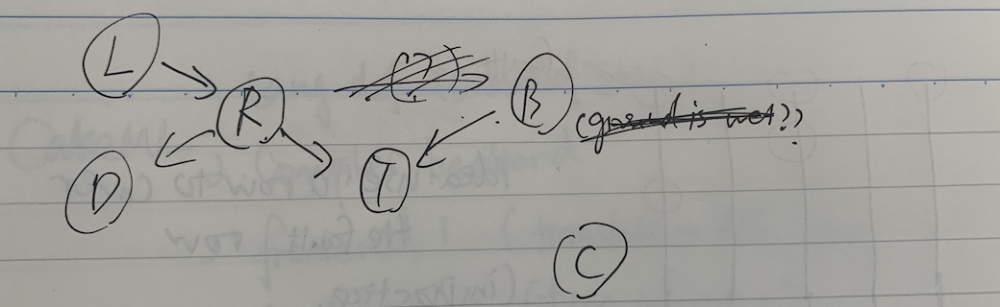
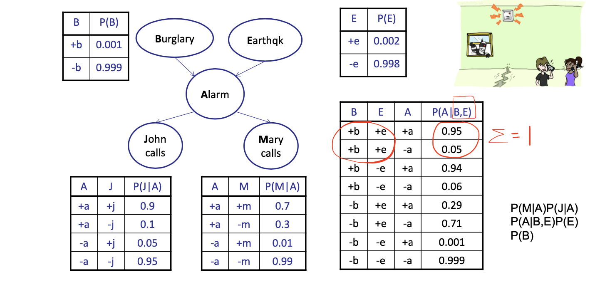
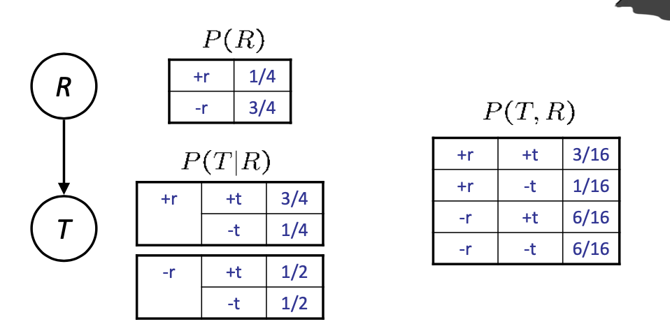
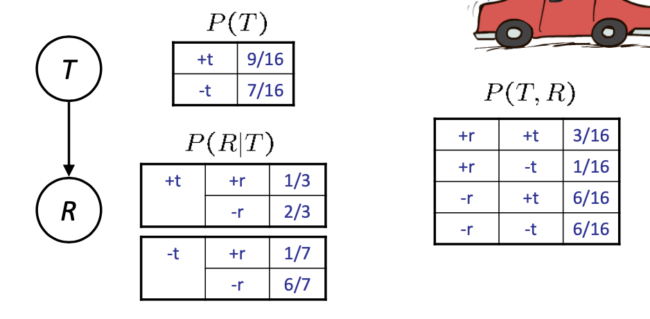

<!--more-->

[[toc]]

## Bayes’ Nets: Big Picture
- Two problems with using full joint distribution tables as our probabilistic models:
  - Unless there are only a few variables, the joint is WAY too big to represent explicitly
  - Hard to learn (estimate) anything empirically about more than a few variables at a time
- Bayes’ nets: a technique for describing complex joint distributions (models) using simple, local distributions (conditional probabilities)
  - More properly called graphical models
  - We describe how variables locally interact
  - Local interactions chain together to give global, indirect interactions
  - For about 10 min, we’ll be vague about how these interactions are specified

## Graphical Model Notation
- Nodes: variables (with domains)
  - Can be assigned (observed) or unassigned
- Arcs: interactions
  - Similar to CSP constraints
  - Indicate “direct influence” between variables 
  - Formally: encode conditional independence
- For now: imagine that arrows mean direct causation (in general, they don’t!)

### Example: Traffic

## Bayes’ Net Semantics

- A set of nodes, one per variable X
- A directed, acyclic graph
  > Otherwise, cyclic logic can happen
- A conditional distribution for each node
  - _A collection of distributions(分布族)_ over $X,$ one for each combination of parents' values
    $$
    P\left(X \mid a_{1} \ldots a_{n}\right)
    $$
  - CPT: conditional probability table
  - Description of a noisy "causal" process
  > Noisy: we may assume some nodes are (conditionally) independent, or we don't model them in the graph, however, the truth may not be ideal as we modeled.

**A Bayes net = Topology (graph) + Local Conditional Probabilities**

## Probabilities in BNs

Bayes' nets implicitly encode joint distributions
- As a product of local conditional distributions
- To see what probability a BN gives to a full assignment, multiply all the relevant conditionals together:
$$
P\left(x_{1}, x_{2}, \ldots x_{n}\right)=\prod_{i=1}^{n} P\left(x_{i} \mid \text { parents }\left(X_{i}\right)\right)
$$
- Example:
$P(+$ cavity, $+$ catch, - toothache $) =\mathrm{P}($ -toothache $\mid+$ cavity $) \mathrm{P}(+$ catch $\mid+$ cavity $) \mathrm{P}(+$ cavity $)$

- Why are we guaranteed that setting
    $$
    P\left(x_{1}, x_{2}, \ldots x_{n}\right)=\prod_{i=1}^{n} P\left(x_{i} \mid \text {parents}\left(X_{i}\right)\right)
    $$
    results in a proper joint distribution?
- Chain rule (valid for all distributions): $\quad P\left(x_{1}, x_{2}, \ldots x_{n}\right)=\prod_{i=1}^{n} P\left(x_{i} \mid x_{1} \ldots x_{i-1}\right)$
- Assume conditional independences: $\quad P\left(x_{i} \mid x_{1}, \ldots x_{i-1}\right)=P\left(x_{i} \mid\right.$ parents $\left.\left(X_{i}\right)\right)$
    $$
    \rightarrow \text { consequence: } \quad P\left(x_{1}, x_{2}, \ldots x_{n}\right)=\prod_{i=1}^{n} P\left(x_{i} \mid \text { parents }\left(X_{i}\right)\right)
    $$
- Not every BN can represent every joint distribution
  - The topology enforces certain conditional independencies

### Example: Alarm Network

$$
P(M,J,A,B,E) = P(M|A)P(J|A)P(A|B,E)P(E)P(B)
$$

## Casuality VS Reverse Causality

| Casual Direction | Reverse Casuality |
| ---------------- | ----------------- |
|  |  |

Causality?
- When Bayes’ nets reflect the true causal patterns:
  - Often simpler (nodes have fewer parents) 
  - Often easier to think about
  - Often easier to elicit from experts
- BNs need not actually be causal
  - Sometimes no causal net exists over the domain (especially if variables are missing)
  - E.g. consider the variables Traffic and Drips
  - End up with arrows that reflect correlation, not causation
- What do the arrows really mean?
  - Topology may happen to encode causal structure 
  - Topology really encodes conditional independence
 