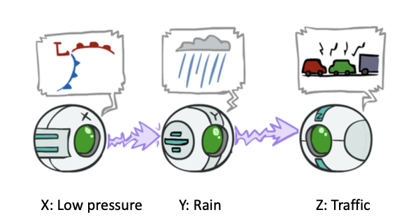
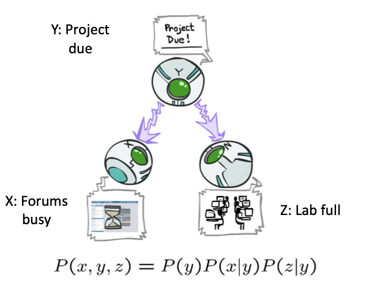
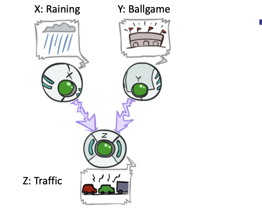
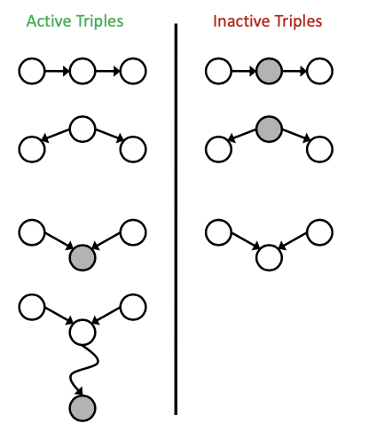
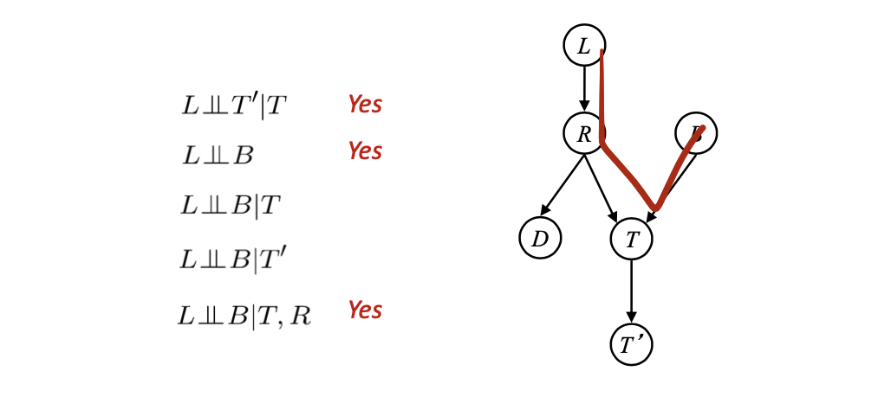
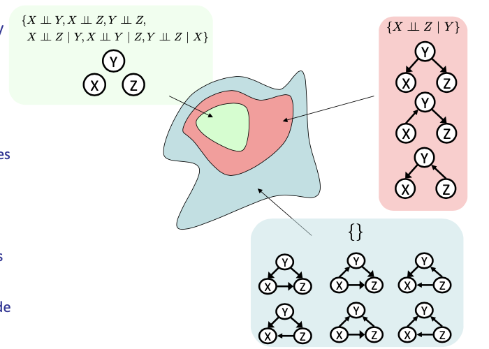

# Bayes Net (III)

<!-----
title: 【Artificial Intellignece】Bayes Net (III)
url: ai-bn3
date: 2020-11-13 11:23:01
tags: 
- Artificial Intelligence

categories: 
- Courses

----->

<!--more-->

[[toc]]

## Bayes Nets Representation

- A Bayes net is an efficient encoding of a probabilistic model of a domain
- Questions we can ask:
  - Inference: given a fixed BN, what is $P(X | e)$?
  - Representation: given a BN graph, what kinds of distributions can it encode? 
  - Modeling: what BN is most appropriate for a given domain?
  - *Learning: Given Data, what is the best BN Encoding*

### Size of a Bayes Net
- How big is a joint distribution over N Boolean variables? $2^N$
- How big is an N-node net if nodes have up to k parents? $O(N \times 2^{k+1})$
- Both give you the power to calculate
  - BNs: Huge space savings!
  - Also easier to elicit local CPTs
  - Also faster to answer queries (last lecture!)


## Conditional Independence

- $X$ and Y are independent if
    $$
    \forall x, y \quad P(x, y)=P(x) P(y) \text { - - - } \rightarrow \quad X \perp Y
    $$
- X and Y are conditionally independent given Z
    $$
    \forall x, y, z P(x, y \mid z)=P(x \mid z) P(y \mid z)---\rightarrow X \perp Y \mid Z
    $$
- (Conditional) independence is a property of a distribution


### Bayes Nets: Assumptions

- Assumptions we are required to make to define the Bayes net when given the graph:
    $$
    P\left(x_{i} \mid x_{1} \cdots x_{i-1}\right)=P\left(x_{i} \mid p a r e n t s\left(X_{i}\right)\right)
    $$
- Beyond above "chain rule $\rightarrow$ Bayes net" conditional independence assumptions
  - Often additional conditional independences
  - They can be read off the graph
- Important for modeling: understand assumptions made when choosing a Bayes net graph


> $$X_i \perp NoDescendent(X_i)| Parent(X_i)$$

#### Example

```
BN:X -> Y -> Z -> W
```

```
         |---------|
         |         V
General: X -> Y -> Z -> W
         |    |         A
         |     | --------- |
         | --- |
```


- Chain Rules give: $P(x,y,z,w)=P(x)P(y|x)P(z|x,y)P(w|x,y,z)$
- BN give: $P(x,y,z,w)=P(x)P(y|x)P(z|y)P(w|z)$
- We can derive: $X \perp Z|Y$ , $W \perp {X,Y} | Z$
> In many usecases, we are observing the effects instead of the chain, i.e. we may observe $W$ and want to derive $X$
- Additional implied conditional independence assumptions
  $W \perp X | Y$, which can be further proved


### Independence in a BN

- Important question about a BN:
  - Are two nodes independent given certain evidence? § If yes, can prove using algebra (tedious in general)
  - If no, can prove with a counter example
  - Example:
    X -> Y -> Z
  - Question: are X and Z necessarily independent?
  - Answer: no. Example: low pressure causes rain, which causes traffic. § X can influence Z, Z can influence X (via Y)
  - Addendum: they could be independent: how?

> Given evidence, how to determine the independence of some nodes?


### D-separation

- Study independence properties for triples 
  - Why triples?
  > Since the conditional probability formula must involve 3 components
  > To describe conditional independence relation, at least 3 components
- Analyze complex cases in terms of member triples
- D-separation: a condition / algorithm for answering such queries

#### Casual Chains
- This configuration is a casual chain
  
  > Note other minor factors may be modeled as noise in the casual chain
  $P(x,y,z)=P(x)P(y|z)P(z|Y$
- Guaranteed X independent of Z ?
- No!
  - One example set of CPTs for which X is not independent of Z is sufficient to show this independence is not guaranteed.
- Example:
- Low pressure causes rain causes traffic, high pressure causes no rain causes no traffic
- In numbers:
  - $P( +y | +x ) = 1, P( -y | - x ) = 1, P( +z | +y ) = 1, P( -z | -y ) = 1$ 
  - serves as a counterexample


- Guaranteed X independent of Z given Y?
- Yes!
  $$
  \begin{aligned}
  P(z \mid x, y) &=\frac{P(x, y, z)}{P(x, y)} \\
  &=\frac{P(x) P(y \mid x) P(z \mid y)}{P(x) P(y \mid x)} \\
  &=P(z \mid y)
  \end{aligned}
  $$
> Evidence along the chain “blocks” the influence

#### Common Causes
- This configuration is a “common cause”
  

- Guaranteed X independent of Z ? 
- No!
  - One example set of CPTs for which X is not independent of Z is sufficient to show this independence is not guaranteed.
- Example:
  - Project due causes both forums busy and lab full 
  - In numbers: $P( +x | +y ) = 1, P( -x | -y ) = 1, P( +z | +y ) = 1, P( -z | -y ) = 1$

- Guaranteed X and Z independent given Y?
  $$
  \begin{aligned}
  P(z \mid x, y) &=\frac{P(x, y, z)}{P(x, y)} \\
  &=\frac{P(y) P(x \mid y) P(z \mid y)}{P(y) P(x \mid y)} \\
  &=P(z \mid y)
  \end{aligned}
  $$

> Observing the cause blocks influence between effects.

#### Common Effect

- Last Configuration: two causes of one effect (v-structure)
  
- Are X and Y independent?
  - Yes: the ballgame and the rain cause traffic, but they are not correlated
- Proof.
  $$
  \begin{aligned}
  P(x, y) &=\sum_{z} P(x, y, z) \\
  &=\sum_{z} P(x) P(y) P(z \mid x, y) \\
  &=P(x) P(y) \sum_{z} P(z \mid x, y) \\
  &=P(x) P(y)
  \end{aligned}
  $$
  > Bayes Formula + *Variable Eliminaition*
- Are X and Y independent given Z?
  - No: seeing traffic puts the rain and the ballgame in competition as explanation.
- **This is backwards from the other cases**
  
> Observing an effect **activates** influence between possible causes.

#### The General Case

- General question: in a given BN, are two variables independent (given evidence)?
- Solution: analyze the graph
- Any complex example can be broken into repetitions of the three canonical cases
 
#### Reachability, Active and Inactive Paths


- Recipe: shade evidence nodes, look for paths in the resulting graph
- Attempt 1: if two nodes are not connected by any _**undirected**_ path not blocked by a shaded node, they are conditionally independent
- Almost works, but not quite
  - Where does it break?
  - Answer: the v-structure at T doesn’t count as a link in a path unless “active”


> Recall: casual chain and common cause gives conditional independence, while **common effect (v-structure)** gives conditional not independence.
 
- Question: Are X and Y conditionally independent given evidence variables {Z}?
  - Yes, if X and Y “d-separated” by Z
  - Consider all (undirected) paths from X to Y § No active paths = independence!
- A **path** is active if **each triple is active**:
  - Causal chain A -> B -> C where B is unobserved (either direction)
  - Common cause A <- B -> C where B is unobserved
  - Common effect (aka v-structure)
  - A -> B <- C **where B or one of its descendants is observed**
  > Correspond to Case 3/4!!!!
- All it takes to block a path is a single inactive segment




#### D-Separation

**Query**: $\quad X_{i} \perp X_{j} \mid\left\{X_{k_{1}}, \ldots, X_{k_{n}}\right\}$ ?
**Check _all_ (undirected!) paths between $X_{i}$ and $X_{j}$**
- If one or more active, then independence not guaranteed
  $$
  X_{i} \perp X_{j} \mid\left\{X_{k_{1}}, \ldots, X_{k_{n}}\right\}
  $$
- Otherwise (i.e. if all paths are inactive), then independence is guaranteed
  $$
  X_{i} \perp X_{j} \mid\left\{X_{k_{1}}, \ldots, X_{k_{n}}\right\}
  $$





### Structure Implications

- Given a Bayes net structure, can run d- separation algorithm to build a complete list of conditional independences that are necessarily true of the form
$X_i \perp X_j | \aleph{X_{k_1},\ldots,X_{k_n}\}$
- This list determines the set of probability distributions that can be represented
> D-separation algorithm can derive the implicit information (conditional independence) in the Bayes Nets

### Topology Limits Distributions
- Given some graph topology G, only certain joint distributions can be encoded
- The graph structure guarantees certain (conditional) independences
- (There might be more independence)
- Adding arcs increases the set of distributions, but has several costs
- Full conditioning can encode any distribution


> Note the case where `x -> Y <- Z`, $\neg (X \perp Z | Y)$
> For any nodes that can form a "triangle" no independence relation can be derived

