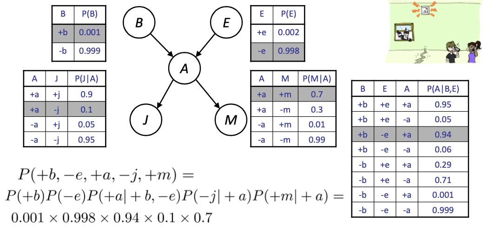
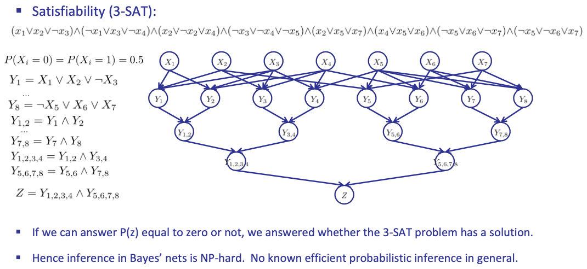

<!-- more -->

Idea: Make use of conditional independence

## Enumeration (exact, exponential complexity)

- Inference: calculating some useful quantity from a joint probability distribution
- Examples:
  - Posterior Probability (e.g. Image classifying, pixels/characteristics can be evidence, and query variable can be a distribution) $P=(Q|E_1=e_1,...,E_k=e_k$
  - Most likely explanation $\argmax_q P(Q=q|E_1=e_1,\ldots)$
  > - max-likelihood function $L(\theta|X)=\max_{\theta}P(X|\theta)$
  > - MAP(Maximum a posteriori estimation) $P(\theta|X)=\max_{\theta}P(X|\theta)P(\theta)/P(X)$, given distribution $X$

### Inference by Enumeration in Joint Distribution
1. Step 1: Select the entries consistent with the evidence
2. Step 2: Sum out H to get joint of Query and evidence
3. Step 3: Normalize

### Inference by Enumeration in Bayes Net
- Given unlimited time, inference in BNs is easy
- Reminder of inference by enumeration by example:

> Note $\sum_{a}$ actually means $\sum_{+a,-a}$

### Drawbacks
- Why is inference by enumeration so slow?
  - You join up the whole joint distribution before you sum out the hidden variables
- Idea: interleave joining and marginalizing!
  - Called Variable Elimination
  - Still NP-hard, but usually much faster than inference by enumeration

## Variable elimination (exact, worst-case exponential complexity, often better)

### Factor Zoo (分布族)

- In general, when we write $P(Y_1 ... Y_N | X_1 ... X_M)$
  - It is a “factor,” a multi-dimensional array
  - Its values are $P(y_1 ... y_N |x_1 ...x_M)$
  - Any assigned (=lower-case) X or Y is a dimension missing (selected) from the array

### Inference by Enumeration: Procedural Outline

- Track objects called **factors**
- Initial factors are local CPTs (one per node)
- Any known values are selected
  - e.g. if we know $L=+l$
  - 
- Join all factors, eliminate all hidden variables, normalize

#### Operation 1: Multiple Joins

- First basic operation: **joining factors**
- Combining factors:
  - **Just like a database join**
  - Get all factors over the joining variable
  - Build a new factor over the union of the variables involved

Computation for each entry: pointwise products: $\forall r,t P(r,t)=P(r)\cdot P(t|r)$

> BN-network feature: localize the variable relations. we should make use of that

#### Operation 2: Elimination

> The dimension will grow as join operation proceed
> The elimination then degrade the dimension
> Up so far, nothing new/more efficient other than before (enumeration!)

#### Marginalizing Early! (aka Variable Elimination)
> Locality!
> 

> Eliminate while connecting

### General Variable Elimination

> Eliminate all vars other than query + evidence

- Query: $P(Q|E_1=e_1,...E_k=e_k)$
- Start with initial factors:
  - Local CPTs (but instantiated by evidence) 实例化的CPT表
  > (*--- This is new ---*)
- While there are still hidden variables (not Q or evidence):
  - Pick a hidden variable H
  - Join all factors mentioning H 
  - Eliminate (sum out) H
  > i.e. 在BN图中找到和H相关的因子，消除
- Join all remaining factors and normalize

#### Example

- Choose A
- Related: $P(A|B,E),P(j|A),P(m|A)$
1. eliminate HV- A
   
2. eliminate HV- E
   
3. 

> All we are doing is exploiting uwy + uwz + uxy + uxz + vwy + vwz + vxy +vxz = (u+v)(w+x)(y+z) to improve computational efficiency!

#### Ordering Matters

- For the query $P(X_n|y_1,...,y_n)$ work through the following two different orderings as done in previous slide: $Z, X_1, ..., X_{n-1}$ and $X_1, ..., X_{n-1}, Z$. What is the size of the maximum factor generated for each of the orderings?

- Answer
  - $2^{n+1}$ eliminate $Z$, all $X_i$ are related, $2^n$ dimension
  - $2^2$ with n times if eliminate $X_i$ every time (HMM)

#### Complexity Analysis

- The computational and space complexity of variable elimination is determined by the largest factor
- The elimination ordering can greatly affect the size of the largest factor. 
  - E.g., previous slide’s example $2^n vs. 2$
- Does there always exist an ordering that only results in small factors? 
  - No!

## Inference is NP-complete

we can reduce 3-SAT to inference in Bayes' nets.

## Polytrees

> Fast variable elimination
> if **no undirected cycles**

- A polytree is a directed graph with no undirected cycles
- For poly-trees you can always find an ordering that is efficient
  - Try it!!
- Cut-set conditioning for Bayes’ net inference
  - Choose set of variables such that if removed only a polytree remains 
  - Exercise: Think about how the specifics would work out!