<!-- more -->

## Recall

### Variable Elimination

- Interleave joining and marginalizing
- $d^k$ entries computed for a factor over k variables with domain sizes d
- **Ordering** of elimination of hidden variables can affect size of factors generated
- Worst case: running time exponential in the size of the Bayes’ net

> Ordering matters a lot
> Which kind of order achieve the best performance? - NP-hard problem

## Approximate Inference: Sampling

> Foundamental Problem, Given joint distribution, find $P(Q|e_1,e_2,...)$

- Sampling is a lot like repeated simulation 
  - Predicting the weather, basketball games, ...
- Basic idea
  - Draw N samples from a sampling distribution S 
  - Compute an _approximate posterior probability_
  - Show this converges to the true probability P

- Why sample?
  - Learning: get samples from a distribution you don’t know
  - Inference: getting a sample is faster than computing the right answer (e.g. with variable elimination)
  > Especially when n -> $\infty$

- Sampling from given distribution
  - Step 1: Get sample u from uniform distribution over [0, 1)
    - E.g. random() in python
  - Step 2: Convert this sample u into an outcome for the given distribution by having each target outcome associated with a sub-interval of [0,1) with sub-interval size equal to probability of the outcome

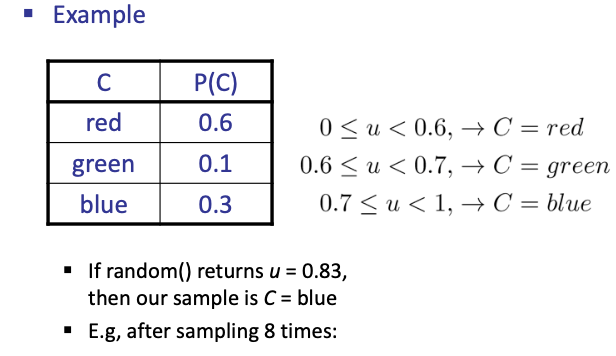

## Generation of Random Numbers

Pseudorandom Numbers
- 平方取中法 Midsquare Method
- Linear Congruential Generator (线性同余法)
- 混合同余法
- 乘同余法

We should check the (1/2-order) relativity, the uniformity of the final distribution of the random numbers, ...

- 组合同余法
- Mersenne Twister (梅森旋转算法)

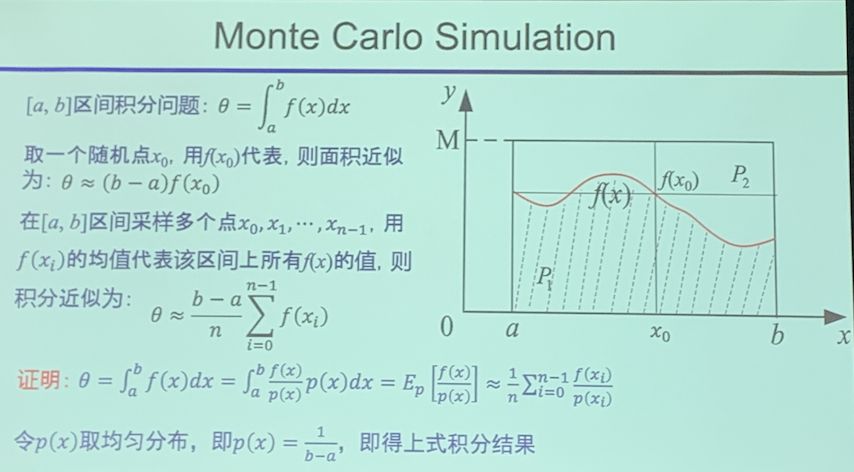

## Prior Sampling 先验采样

根据网络直接抽样，但如果样本不够，有些概率低的样根本采不到

### Solution

simple counting

> Track the BN graph top down, sample every node 
> Search Algorithm

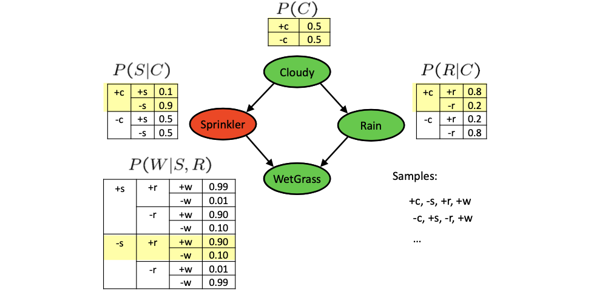

### Analysis

- This process generates samples with probability: (sample probability distribution)
    $$
    S_{P S}\left(x_{1} \ldots x_{n}\right)=\prod_{i=1}^{n} P\left(x_{i} \mid \text { Parents }\left(X_{i}\right)\right)=P\left(x_{1} \ldots x_{n}\right)
    $$
- ...i.e. the BN's joint probability
- Let the number of samples of an event be $N_{P S}\left(x_{1} \ldots x_{n}\right)$
- Then (中心极限定理)
    $$
    \begin{array}{rl}
    \lim _{N \rightarrow \infty} \hat{P}\left(x_{1}, \ldots, x_{n}\right)=&\lim _{N \rightarrow \infty} N_{P S}\left(x_{1}, \ldots, x_{n}\right) / N \\
    =&S_{P S}\left(x_{1}, \ldots, x_{n}\right) \\
    =&P\left(x_{1} \ldots x_{n}\right)
    \end{array}
    $$
> $\hat{P}(x_1,...,x_n) = N(P(x_1,...,x_n, \sigma_{N}^2)$, where $\sigma_{N}$ decreases as N grows
- I.e., the sampling procedure is **consistent**

### Example

> Note the following given is not a forest (exist undirected path), which will take a lot of effort to do variable elimination
> 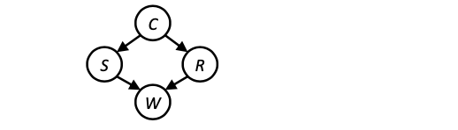

- We’ll get a bunch of samples from the BN: 
  - +c, -s, +r, +w
  - +c, +s, +r, +w 
  - -c, +s, +r, -w 
  - +c, -s, +r, +w 
  - -c, -s, -r, +w
- If we want to know P(W)
  - We have counts <+w:4, -w:1>
  - Normalize to get P(W) = <+w:0.8, -w:0.2>
  - This will get closer to the true distribution with more samples
  - Can estimate anything else, too
  - What about P(C | +w)? P(C | +r, +w)? P(C | -r, -w)?
  - Fast: can use fewer samples if less time (what’s the drawback?)

## Rejection Sampling

由于问题往往自带evidence，且，evidence发生本身可能就是一个小概率事件。
先验采样将不符合的样本采集到了，又丢掉了，导致计算时样本不够，方差较大。改进：

- Let’s say we want P(C)
  - No point keeping all samples around
  - Just tally counts of C as we go 
- Let’s say we want P(C | +s)
  - Same thing: tally C outcomes, but ignore (reject) samples which don’t have S=+s
  - This is called rejection sampling
  - It is also consistent for conditional probabilities (i.e., correct in the limit)

> Problem: when $P(e_1,...,e_n)$ is small, we will throw away $(1-P)N$ samples on the fly, more efficiency?

## Likelihood Weighting 

- Problem with rejection sampling: 虽然可以保证采到要求，但效率还是较低
  - If evidence is unlikely, rejects lots of samples 
  - Evidence not exploited as you sample
  - Consider P( Shape | blue )
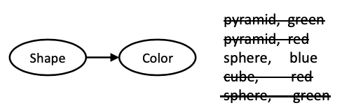

Idea: fix evidence variables and sample the rest 似然加权方法
- Problem: sample distribution not consistent! 
- Solution: weight by probability of evidence
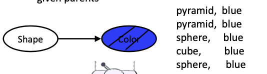
如何修正真实分布？

Assume we are sampling $P(C|+s,+w)$, we should calculate the weight(cost) of our fixed evidence

样本 = 样本内容 + 权值（evidence采样时的条件概率）

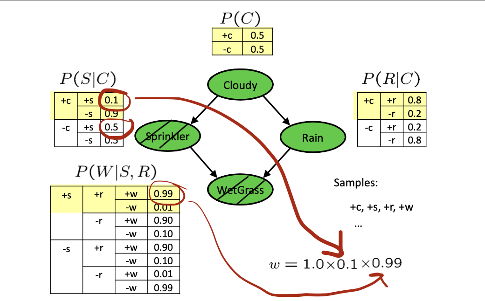

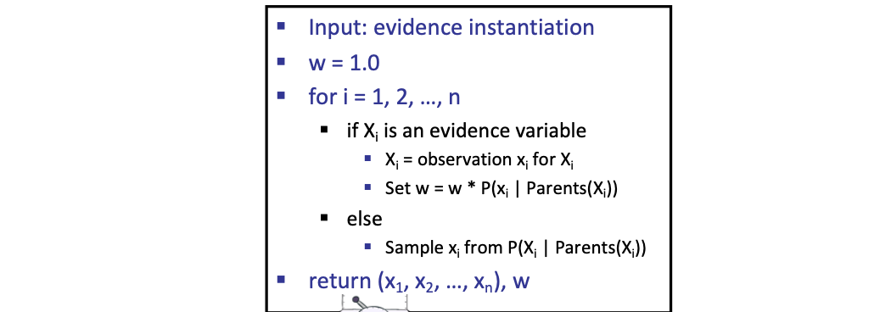

### Analysis

- Sampling distribution if $z$ sampled and e fixed evidence
$$
S_{W S}(\mathbf{z}, \mathbf{e})=\prod_{i=1}^{l} P\left(z_{i} \mid \mathrm{Parents}\left(Z_{i}\right)\right)
$$
- Now, samples have weights
$$
w(\mathbf{z}, \mathbf{e})=\prod_{i=1}^{m} P\left(e_{i} \mid \text { Parents }\left(E_{i}\right)\right)
$$
- Together, weighted sampling distribution is consistent
$$
\begin{aligned}
S_{\mathrm{WS}}(z, e) \cdot w(z, e) &=\prod_{i=1}^{l} P\left(z_{i} \mid \mathrm{Parents}\left(z_{i}\right)\right) \prod_{i=1}^{m} P\left(e_{i} \mid \mathrm{Parents}\left(e_{i}\right)\right) \\
&=P(\mathrm{z}, \mathrm{e})
\end{aligned}
$$
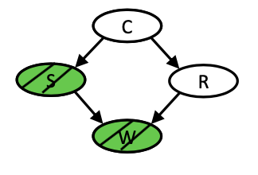

### Remarks
- Likelihood weighting is good
  - We have taken evidence into account as we generate the sample
  - E.g. here, W’s value will get picked based on the evidence values of S, R
  - More of our samples will reflect the state of the world suggested by the evidence
- Likelihood weighting doesn’t solve all our problems
  - Evidence influences the choice of downstream variables, but not upstream ones (C isn’t more likely to get a value matching the evidence)
- We would like to consider evidence when we sample every variable (leads to Gibbs sampling)

## Gibbs Sampling

### Problem with Sampling

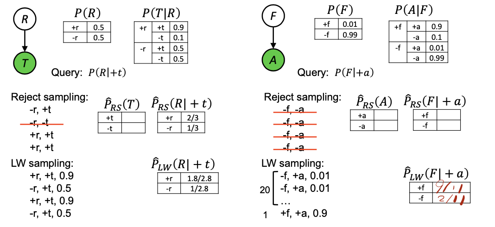

> 本应该是 0.009 VS 0.0099
> 小概率的事件很难被抽样到，需要大量样本才能足够表示

### Solution
> Idea: 网络：有向无环图，存在搜索方向
> 类似CSP的迭代求解，我们需要跟踪一个完整的样本实例，并且对特定变量重新采样

- **Procedure**: keep track of a full instantiation x1, x2, ..., xn. Start with an arbitrary instantiation consistent with the evidence. Sample one variable at a time, conditioned on all the rest, but keep evidence fixed. Keep repeating this for a long time.
- **Property**: in the limit of repeating this infinitely many times the resulting samples come from the correct distribution (i.e. conditioned on evidence).
- **Rationale**: both upstream and downstream variables condition on evidence.
- In contrast: likelihood weighting only conditions on upstream evidence, and hence weights obtained in likelihood weighting can sometimes be very small. Sum of weights over all samples is indicative of how many “effective” samples were obtained, so we want high weight.

每一步，对非证据变量，采样。

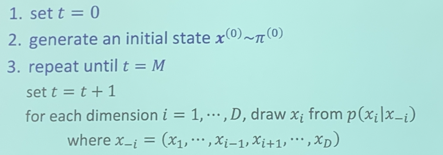

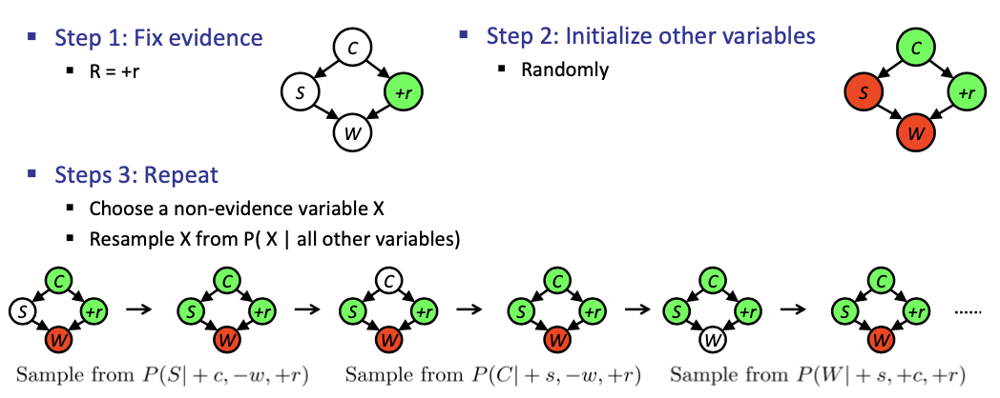

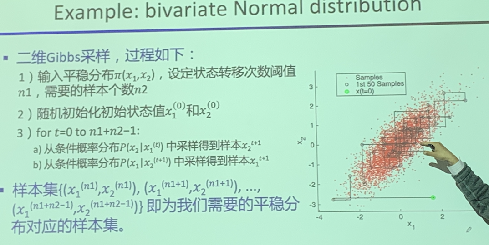

### The resampling is efficient

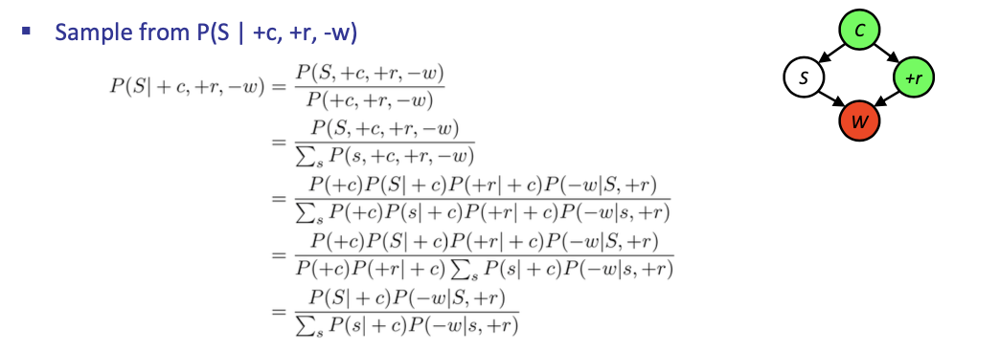

- Many things cancel out - only CPTs with S remain!
- More generally: only CPTs that have resampled variable need to be considered, and joined together

### Example: Bivariate Normal Distribution
> 对连续性变量，求条件概率更复杂，example：

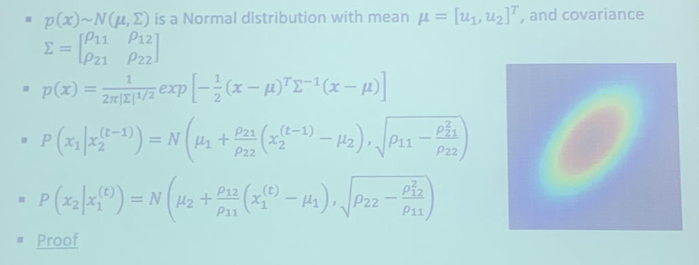

## Summary

- Prior Sampling
  - 根据P（Q）直接采样
- Rejection Sampling
  - P(Q|e)
  - 丢弃样本的概率（1-P(e)）
- Likelihood Weighting
  - P(Q|e)
  - 加权，提高效率
  - 证据在网络下层时，效率不高
- Gibbs Sampling
  - P(Q|e)，把n-1个变量实例化
  - Foundation: 任意组合都看作一个状态，只关心一个单一变量