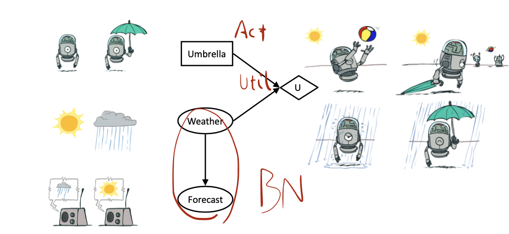
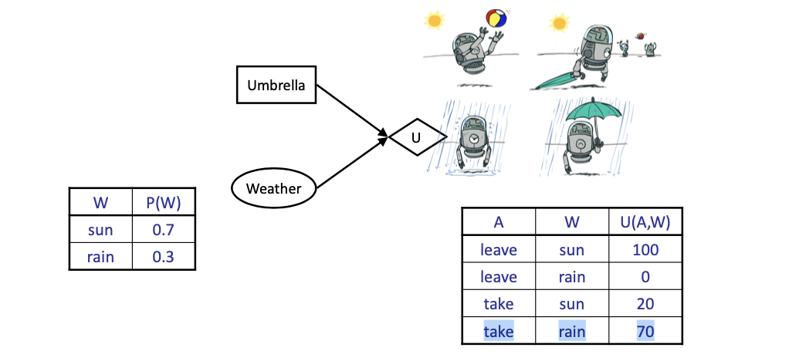
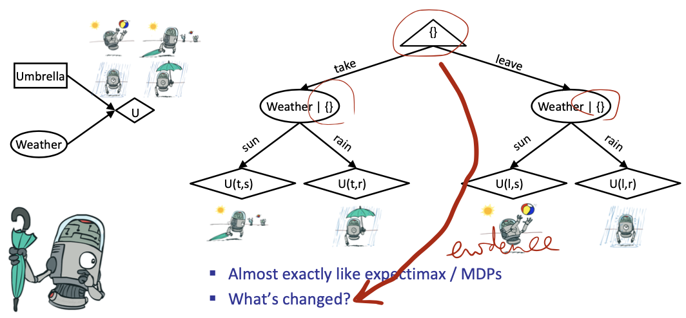
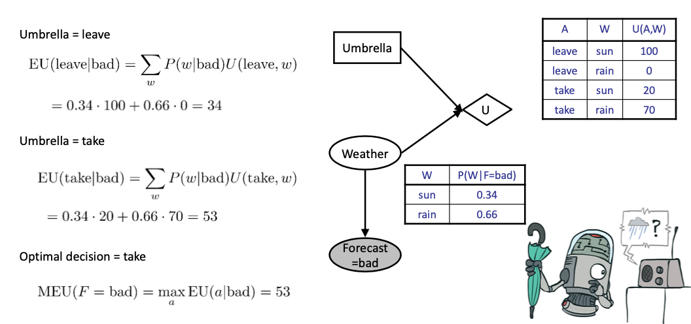
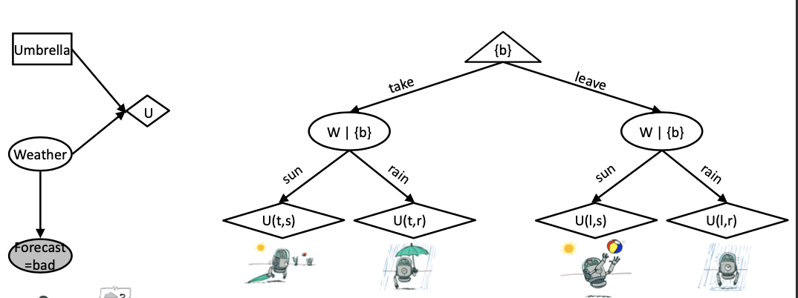
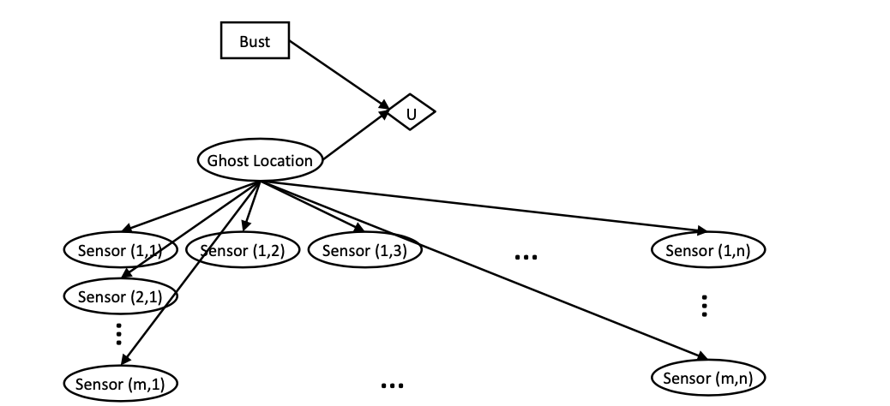
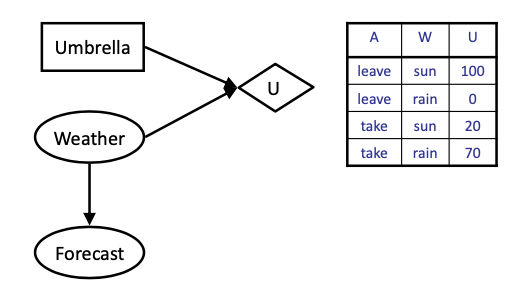
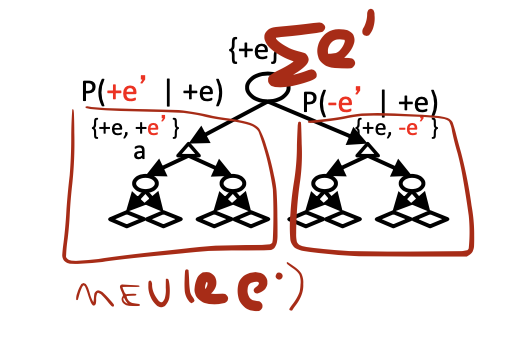

<!-- more -->

## Decision Networks

> Recall: **MEU**: choose the action which Maximizes the Expected Utility **given the evidence(*this is new*)**

> How to make decision in a randomized environment with evidence given?

- Can directly operationalize this with decision networks
  - Bayes nets with nodes for utility and actions
  - Lets us calculate the expected utility for each action
- New node types:
  - Chance nodes (just like BNs)
    > Recall in gambling tree
    > - circled nodes are chance nodes
  - Actions (rectangles, cannot have parents, act as observed evidence)
  - Utility node (diamond, depends on action and chance nodes)
  
> In the example above, query variable: weather, with the queryed distribution, we can then calculate the utility for every action

> How to use the network?
> Strategy: instancilize the nodes
> What to instantiate? chance nodes & action nodes

- Action selection
  - Instantiate all evidence
  - Set action node(s) each possible way
  - Calculate posterior for all parents of utility node, given the evidence
  - Calculate expected utility for each action
  - Choose maximizing action

### Example

- Umbrella = leave
    $$
    \mathrm{EU}(\text { leave })=\sum_{w} P(w) U(\text { leave }, w)  =0.7 \cdot 100+0.3 \cdot 0=70
    $$
- Umbrella = take
    $$
    \mathrm{EU}(\text { take })=\sum_{w} P(w) U(\text { take }, w) =0.7 \cdot 20+0.3 \cdot 70=35
    $$
- Optimal decision = leave
    $$
    \mathrm{MEU}(\varnothing)=\max _{a} \mathrm{EU}(a)=70
    $$

## Decisions as Outcome Trees

### Example: With Evidence

> The inference result, i.e. poserior distribution will be applied to the decision

### Example Ghostbusters

> Bust: where to bust ghost
> Ghost Location is depdent on Sensors...

## Value of Information
> Where to drill the oil?

- Idea: compute value of acquiring evidence 
  - Can be done directly from decision network
- Example: buying oil drilling rights
  - Two blocks A and B, exactly one has oil, worth k
  - You can drill in one location
  - Prior probabilities 0.5 each, & mutually exclusive
  - Drilling in either A or B has $EU(\emptyset) = k/2, MEU(\emptyset) = k/2$
- Question: what’s the value of information of O?
  - Value of knowing which of A or B has oil
  - Value is expected gain in MEU from new info
  - Survey may say “oil in a” or “oil in b”, prob 0.5 each 
  - If we know OilLoc, `MEU(OilLoc)` is k (either way)
  - Gain in MEU from knowing OilLoc?
  - $VPI(OilLoc) = MEU(OilLoc) - MEU(\emptyset) = k/2$
  - Fair price of information: k/2
> 信息价值体现在增益上，即无信息相比有信息，MEU的增加

### Example： Weather

- MEU with no evidence
  $\mathrm{MEU}(\emptyset)=\max _{a} \mathrm{EU}(a)=70$
- MEU if forecast is bad
  $\mathrm{MEU}(F=\mathrm{bad})=\max _{a} \mathrm{EU}(a \mid \mathrm{bad})=53$
- MEU if forecast is good
  $\mathrm{MEU}(F=\mathrm{good})=\max _{a} \mathrm{EU}(a \mid \mathrm{good})=95$
> Note: forecast is also a randomized, we need to find the MEU expectation
- Forecast Distribution: good 0.59, bad 0.41
  $VPI = 0.59 \times 95 + 0.41 \times 53 - 70 = 77.8 - 70 = 7.8$

$$
\mathrm{VPI}\left(E^{\prime} \mid e\right)=\left(\sum_{e^{\prime}} P\left(e^{\prime} \mid e\right) \mathrm{MEU}\left(e, e^{\prime}\right)\right)-\mathrm{MEU}(e)
$$

**Formulation.**

- Assume we have evidence E=e. Value if we act now:$\mathrm{MEU}(e)=\max _{a} \sum_{s} P(s \mid e) U(s, a)$
- Assume we see that $E^{\prime}=e^{\prime} .$ Value if we act then:$\mathrm{MEU}\left(e, e^{\prime}\right)=\max _{a} \sum_{s} P\left(s \mid e, e^{\prime}\right) U(s, a)$
- BUT _$E^{\prime}$ is a random variable whose value is unknown_, so we don't know what e' will be 
- Expected value if $E^{\prime}$ is revealed and then we act:$\mathrm{MEU}\left(e, E^{\prime}\right)=\sum_{e^{\prime}} P\left(e^{\prime} \mid e\right) \mathrm{MEU}\left(e, e^{\prime}\right)$
- Value of information: how much MEU goes up by revealing $E^{\prime}$ first then acting, over acting now: $\mathrm{VPI}\left(E^{\prime} \mid e\right)=\mathrm{MEU}\left(e, E^{\prime}\right)-\mathrm{MEU}(e)$

> The main complexity in calculation lies in $\mathrm{MEU}\left(e, E^{\prime}\right)=\sum_{e^{\prime}} P\left(e^{\prime} \mid e\right) \mathrm{MEU}\left(e, e^{\prime}\right)$, since we will take the expectation of the new evidence

### VPI Properties

**Nonnegative**
$$
\forall E^{\prime}, e: \mathrm{VPI}\left(E^{\prime} \mid e\right) \geq 0
$$

**Nonadditive** (think of observing $\mathrm{E}_{\mathrm{j}}$ twice)
$$
\mathrm{VPI}\left(E_{j}, E_{k} \mid e\right) \neq \mathrm{VPI}\left(E_{j} \mid e\right)+\mathrm{VPI}\left(E_{k} \mid e\right)
$$

**Order-independent**
$$
\begin{aligned}
\mathrm{VPI}\left(E_{j}, E_{k} \mid e\right) &=\mathrm{VPI}\left(E_{j} \mid e\right)+\mathrm{VPI}\left(E_{k} \mid e, E_{j}\right) \\
&=\mathrm{VPI}\left(E_{k} \mid e\right)+\mathrm{VPI}\left(E_{j} \mid e, E_{k}\right)
\end{aligned}
$$

### Quick VPI Questions
- The soup of the day is either clam chowder or split pea, but you wouldn’t order either one. What’s the value of knowing which it is?
> 0, since we won't change our decision

- There are two kinds of plastic forks at a picnic. One kind is slightly sturdier. What’s the value of knowing which?
> A small utility

- You’re playing the lottery. The prize will be $0 or $100. You can play any number between 1 and 100 (chance of winning is 1%). What is the value of knowing the winning number?
> a great VPI should be obtained

### Value of Imperfect Information?

- No such thing (as we formulate it)
- Information corresponds to the observation of a node in the decision network
- If data is “noisy” that just means we don’t observe the original variable, but another variable which is a noisy version of the original one

> Noisy doesn't imply no value, it's just that our Decision Network is not a perfect model

### A complex VPI Question

based on the original k/2 determinate drill report, what if OilLoc is given by a report (may be erroneous)

- $VPI(OilLoc) > VPI(ScountingReport)$
- Based on D-separation (independent)
  $VPI(Scout) = 0$, because without scounting report, the scounting technique doesn't matter
- $VPI(Scout|ScoutReporting) > 0$, because a dependency is built by the report between scout and oilloc

> Generally 
> If $Parents(U)\perp Z | CurrentEvidence$ Then $VPI( Z | CurrentEvidence) = 0$

## POMDPs

