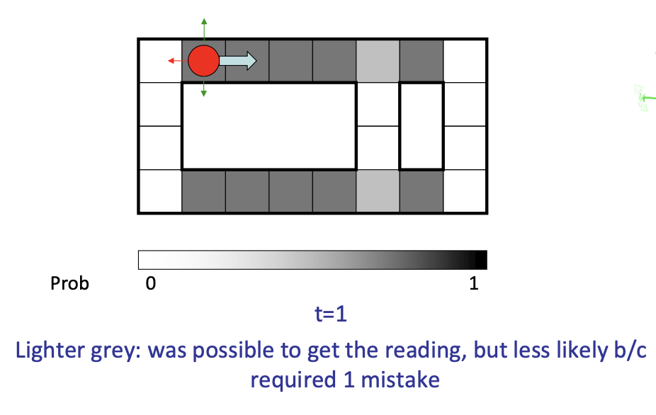
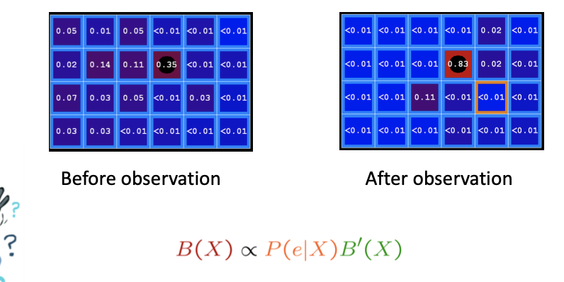

<!--more-->

## Introduction

### Reasoning over Time or Space

- Often, we want to reason about a sequence of observations
  - Speech recognition 
  - Robot localization
  - User attention
  - Medical monitoring
- Need to introduce time (or space) into our models

### Markov Models

- Value of X at a given time is called the state
  > Just a random variable

- Parameters: called **transition probabilities** or dynamics, specify how the state evolves over time (also, initial state probabilities)
- **Stationarity assumption**: transition probabilities the same at all times 
  - Means $P(X_5 | X_4) = P(X_{12} | X_{11})$ etc.
- Same as MDP transition model, but no choice of action

> Recall joint distribution (*Factorization*) $P(X_1,...X_T) = P(X_1)\prod_{t=2}^{T} P(X_t|X_t-1)$
> Do we really need a joint distribution?

### Conditional Independence

- Basic conditional independence:
  - Past and future independent given the present 
  - Each time step only depends on the previous
  - This is called the (first order) Markov property
- Note that the chain is just a (growable) BN
  - We can always use generic BN reasoning on it if we truncate the chain at a fixed length

## Markov Chain

### Example Weather

- States: X = {rain, sun}
- Initial distribution: 1.0 sun
- CPT: $P(X_t|X_{t-1})$
  > In addition to the table, we have other two ways (as figured) to represent the problem (finite automata)
  
  > Another representation: as a path in fig2 (sun -> rain -> sun ...)

### Mini-Forward Algorithm
$$
\begin{array}{c}
P\left(X_{2}=\mathrm{sun}\right)=P\left(X_{2}=\operatorname{sun} \mid X_{1}=\operatorname{sun}\right) P\left(X_{1}=\operatorname{sun}\right)+ \\
P\left(X_{2}=\operatorname{sun} \mid X_{1}=\operatorname{rain}\right) P\left(X_{1}=\mathrm{rain}\right) = 0.9 \cdot 1.0+0.3 \cdot 0.0=0.9
\end{array}
$$

**Question**: What's $\mathrm{P}(\mathrm{X})$ on some day t?
$$
\begin{array}{l}
\left(X_{1}\right) \rightarrow\left(X_{2}\right) \rightarrow\left(X_{3}\right) \rightarrow\left(X_{4}\right)-\cdots \\
P\left(x_{1}\right)=\text { known } \\
P\left(x_{t}\right)=\sum_{x_{t-1}} P\left(x_{t-1}, x_{t}\right) \\
\quad=\sum_{x_{t-1}}\underbrace{ P(x_{t} \mid \left.x_{t-1}\right) P\left(x_{t-1}\right)}_{\text {Forward simulation }}
\end{array}
$$

### Example Run of Mini-Forward Algorithm

### Stationary Distributions

For most chains:
- Influence of the initial distribution gets less and less over time.
- The distribution we end up in is independent of the initial distribution
Stationary distribution:
- The distribution we end up with is called the stationary distribution $P_{\infty}$ of the chain
- It satisfies
$$
P_{\infty}(X)=P_{\infty+1}(X)=\sum_{x} P(X \mid x) P_{\infty}(x)
$$

### Application of Stationary Distributions: PageRank

- PageRank over a web graph 
  - Each web page is a state
  - Initial distribution: uniform over pages 
  - Transitions:
    - With prob. c, uniform jump to a random page (dotted lines, not all shown)
    - With prob. 1-c, follow a random outlink (solid lines)
- Stationary distribution
  - Will spend more time on highly reachable pages
  - E.g. many ways to get to the Acrobat Reader download page
  - Somewhat robust to link spam
  - Google 1.0 returned the set of pages containing all your keywords in decreasing rank, now all search engines use link analysis along with many other factors (rank actually getting less important over time)

### Application of Stationary Distributions: Gibbs Sampling
- Each joint instantiation over all hidden and query variables is a state: $\{X_1, ..., X_n\} = H \cup Q$
- Transitions:
- With probability 1/n resample variable $X_j$ according to $P(X_j | x_1, x_2, ..., x_{j-1}, x_{j+1}, ..., x_n, e_1, ..., e_m)$
- Stationary distribution:
  - Conditional distribution $P(X_1, X_2 , ... , X_n|e_1, ..., e_m)$
  - Means that _when running Gibbs sampling long enough we get a sample from the desired distribution_
  - Requires some proof to show this is true!

> The gibbs algorithm is running actually in a form of markov chain

## Hidden Markov Models

> However, in most cases, we can't expect that every Markov Chain will lead to a steady distribution that leads to a solid conclusion
> 守株待兔不常有

In the cathcing-ghost game above, we assume the movement of 4 ghosts are independent, but are considered as a state (4-d array $X_T$), we can only observe $E_T$ and make decision.

We want to know $P(X_4|e_1,e_2,e_3,e_4)$, i.e. after 4 observations, where are the ghosts at time 4?

### Example Weather HMM
> A sad student is in the basement, can only decide whether it is rainy by observing whether the professor is taking an umbrella?

- Initial Distribution $P(X_1)$
- Transisions: $P(X_t|X_{t-1})$
- Emissions: $P(E_t|X_t)$ (may have some noise, e.g. forget to take umbrella)

### Example: Ghostbusters HMM

- $P(X_1)$ = uniform
- $P(X|X’)$ = usually move clockwise, but sometimes move in a random direction or stay in place
- $P(R_{ij}|X)$ = same sensor model as before: red means close, green means far away.

## Joint Distribution 
> Note, no v-structure in the graph. We only need to dicide the (undirected) connectivity between two nodes

- Joint distribution
    $$
    P\left(X_{1}, E_{1}, X_{2}, E_{2}, X_{3}, E_{3}\right)=P\left(X_{1}\right) P\left(E_{1} \mid X_{1}\right) P\left(X_{2} \mid X_{1}\right) P\left(E_{2} \mid X_{2}\right) P\left(X_{3} \mid X_{2}\right) P\left(E_{3} \mid X_{3}\right)
    $$
- More generally
    $$
    P\left(X_{1}, E_{1}, \cdots, X_{T}, E_{T}\right)=P\left(X_{1}\right) P\left(E_{1} \mid X_{1}\right) \prod_{t=2}^{T} P\left(X_{t} \mid X_{t-1}\right) P\left(E_{t} \mid X_{t}\right)
    $$
- Questions to be resolved
  - Does this indeed define a joint distribution?
  - Can every joint distribution be factored this way, or are we making some assumptions about the joint distribution by using this factorization?
  > We are only deriving (one feasible) factorization using the BN approach. More factorizations are possible

### Chain Rule and HMMs

From the chain rule, every joint distribution over $X_{1}, E_{1}, X_{2}, E_{2}, X_{3}, E_{3}$ can be written as:
    $$
    \begin{aligned}
    P\left(X_{1}, E_{1}, X_{2}, E_{2}, X_{3}, E_{3}\right)=& P\left(X_{1}\right) P\left(E_{1} \mid X_{1}\right) P\left(X_{2} \mid X_{1}, E_{1}\right) P\left(E_{2} \mid X_{1}, E_{1}, X_{2}\right) \\
    & P\left(X_{3} \mid X_{1}, E_{1}, X_{2}, E_{2}\right) P\left(E_{3} \mid X_{1}, E_{1}, X_{2}, E_{2}, X_{3}\right)
    \end{aligned}
    $$
Assuming that $X_{2} \perp E_{1}\left|X_{1}, E_{2} \perp X_{1}, E_{1}\right| X_{2}, X_{3} \perp X_{1}, E_{1}, E_{2}\left|X_{2}, E_{3} \perp X_{1}, E_{1}, X_{2}, E_{2}\right| X_{3}$

### Conditional Independence

- HMMs have two important independence properties:
  - Markov hidden process: future depends on past via the present
  - Current observation independent of all else given current state X1 
- Quiz: does this mean that evidence variables are guaranteed to be independent? 
  - [No, they tend to correlated by the hidden state]

## Filtering / Monitoring

- Filtering, or monitoring, is the task of tracking the distribution $B_t(X) = P_t(X_t | e_1, ..., e_t)$ (the belief state) over time
- We start with $B_1(X)$ in an initial setting, usually uniform
- As time passes, or we get observations, we update $B(X)$
- The Kalman filter was invented in the 60’s and first implemented as a method of trajectory estimation for the Apollo program

### Example: Robot Localization
> Given a map, let the robot decide where it is on the map. Where the locations are determined by the probability based on action/observations

| P1 | P2 | P3 | P4 | P5 | P6
| -- | -- | -- | -- | -- | -- 
|  |  |  |  |  | 

### Inference: Passage of Time
> 信念传播 $B \longrightarrow B'$
- Assume we have current belief $\mathrm{P}(\mathrm{X} \mid$ evidence to date)
    $$
    B\left(X_{t}\right)=P\left(X_{t} \mid e_{1: t}\right)
    $$
- Then, after one time step passes:
    $$
    \begin{aligned}
    P\left(X_{t+1} \mid e_{1: t}\right) &=\sum_{x_{t}} P\left(X_{t+1}, x_{t} \mid e_{1: t}\right) \\
    &=\sum_{x_{t}} P\left(X_{t+1} \mid x_{t}, e_{1: t}\right) P\left(x_{t} \mid e_{1: t}\right) \\
    &=\sum_{x_{t}} P\left(X_{t+1} \mid x_{t}\right) P\left(x_{t} \mid e_{1: t}\right)
    \end{aligned}
    $$
    > Note, in probabilistics,
    > Construct an item by making its sum (introduce $x_t$ here) is a common technique
    > The last equality **makes use of D-Separation**, because we know $x_t$, the precedent evidences can be eliminated!
- Or compactly,
    $$
    B^{\prime}\left(X_{t+1}\right)=\sum_{x_{t}} P\left(X^{\prime} \mid x_{t}\right) B\left(x_{t}\right)
    $$
- Basic idea: beliefs get “pushed” through the transitions
  - With the “B” notation, we have to be careful about what time step t the belief is about, and what evidence it includes

- Example: As time passes, uncertainty “accumulates”
  - 

### Inference: Obtainence of Observation
> 信念更新 $B' \longrightarrow B_{T+1}$

- Assume we have current belief $\mathrm{P}(\mathrm{X} \mid$ previous evidence):
    $$
    B^{\prime}\left(X_{t+1}\right)=P\left(X_{t+1} \mid e_{1: t}\right)
    $$
- Then, after evidence comes in:
    $$
    \begin{aligned}
    P\left(X_{t+1} \mid e_{1: t+1}\right) &=P\left(X_{t+1}, e_{t+1} \mid e_{1: t}\right) / P\left(e_{t+1} \mid e_{1: t}\right) \\
    & \propto_{X_{t+1}} P\left(X_{t+1}, e_{t+1} \mid e_{1: t}\right)  \quad \text { since not related to} X_{t+1}\\
    &=P\left(e_{t+1} \mid e_{1: t}, X_{t+1}\right) P\left(X_{t+1} \mid e_{1: t}\right) \\
    &=P\left(e_{t+1} \mid X_{t+1}\right) P\left(X_{t+1} \mid e_{1: t}\right)
    \end{aligned}
    $$
- Example: As we get observations, beliefs get reweighted, uncertainty “decreases”
  - 

## The Forward Algorithm

We are given evidence at each time and want to know
$$
B_{t}(X)=P\left(X_{t} \mid e_{1: t}\right)
$$
We can derive the following updates
$$
\begin{aligned}
P\left(x_{t} \mid e_{1: t}\right) & \propto_{X} P\left(x_{t}, e_{1: t}\right) \\
&=\sum_{x_{t-1}} P\left(x_{t-1}, x_{t}, e_{1: t}\right) \\
&=\sum_{x_{t-1}} P\left(x_{t-1}, e_{1: t-1}\right) P\left(x_{t} \mid x_{t-1}\right) P\left(e_{t} \mid x_{t}\right) \\
&=P\left(e_{t} \mid x_{t}\right) \sum_{x_{t-1}} P\left(x_{t} \mid x_{t-1}\right) P\left(x_{t-1}, e_{1: t-1}\right)
\end{aligned}
$$

> We can normalize as we go if we want to have P(x|e) at each time step, or just once at the end...

