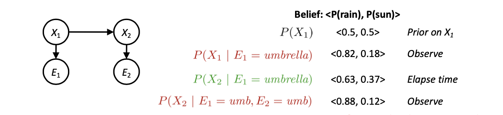
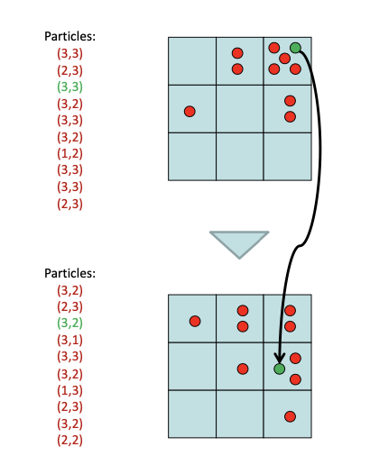
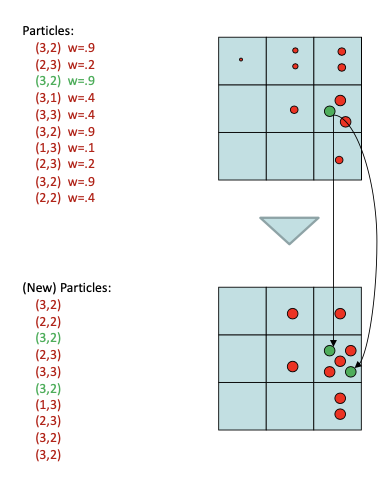
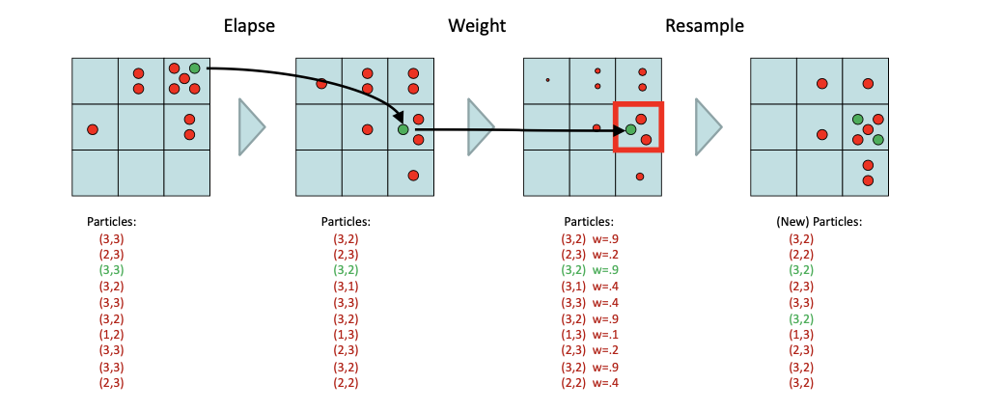
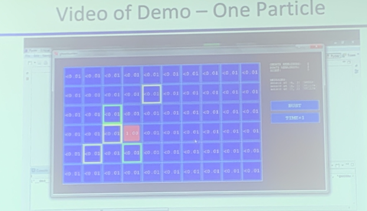
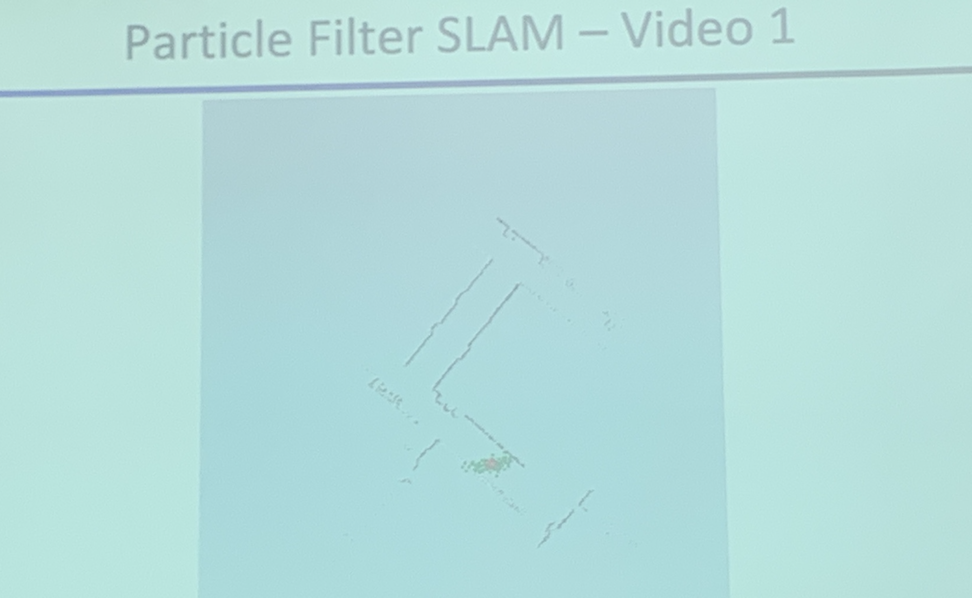
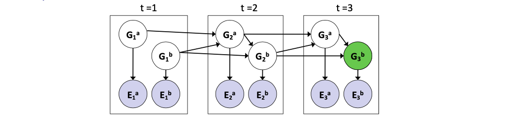

<!--more-->

[toc]

## Recap: Reasoning over time

### Markov Models
> - 平稳性假设
> - Multiple Representations: Bayes Net, Automata, Transition Probability Table

### Passage of Time
> - B is the shorthand for belief
> - $B(X_t)=P(X_t|e_{1:t})$
> $$
> \begin{aligned}
> P\left(X_{t+1} \mid e_{1: t}\right) &=\sum_{x_{t}} P\left(X_{t+1}, x_{t} \mid e_{1: t}\right) \\
> &=\sum_{x_{t}} P\left(X_{t+1} \mid x_{t}, e_{1: t}\right) P\left(x_{t} \mid e_{1: t}\right) \\
> &=\sum_{x_{t}} P\left(X_{t+1} \mid x_{t}\right) P\left(x_{t} \mid e_{1: t}\right)
> \end{aligned}
> $$
> $$
> B^{\prime}\left(X_{t+1}\right)=\sum_{x_{t}} P\left(X_{t+1} \mid x_{t}\right) B\left(x_{t}\right)
> $$
> - Basic idea: beliefs get “pushed” through the transitions
> - With the “B” notation, we have to be careful about what time step t the belief is about, and what evidence it includes

### Observation
Assume we have current belief $\mathrm{P}(\mathrm{X} \mid$ previous evidence):
$$
B^{\prime}\left(X_{t+1}\right)=P\left(X_{t+1} \mid e_{1: t}\right)
$$
Then, after evidence comes in:
$$
\begin{aligned}
P\left(X_{t+1} \mid e_{1: t+1}\right) &=P\left(X_{t+1}, e_{t+1} \mid e_{1: t}\right) / P\left(e_{t+1} \mid e_{1: t}\right) \\
& \propto_{X_{t+1}} P\left(X_{t+1}, e_{t+1} \mid e_{1: t}\right) \\
&=P\left(e_{t+1} \mid e_{1: t}, X_{t+1}\right) P\left(X_{t+1} \mid e_{1: t}\right) \\
&=P\left(e_{t+1} \mid X_{t+1}\right) P\left(X_{t+1} \mid e_{1: t}\right)
\end{aligned}
$$
Or, compactly:
$$
B\left(X_{t+1}\right) \propto_{X_{t+1}} P\left(e_{t+1} \mid X_{t+1}\right) B^{\prime}\left(X_{t+1}\right)
$$
> Note: the normalization operation will widen the gap between different possibilities

- Basic idea: beliefs “reweighted” by **likelihood of evidence**$P(e|x)$
- Unlike passage of time, we have to renormalize

> 初始概率、转移概率$P(x_{t+1}|x_t)$、发射概率$P(e|x)$

## Filtering

Elapse time: compute $\mathrm{P}\left(\mathrm{X}_{\mathrm{t}} \mid \mathrm{e}_{1: \mathrm{t}-1}\right)$
$$
P\left(x_{t} \mid e_{1: t-1}\right)=\sum_{x_{t-1}} P\left(x_{t-1} \mid e_{1: t-1}\right) \cdot P\left(x_{t} \mid x_{t-1}\right)
$$
Observe: compute $\mathrm{P}\left(\mathrm{X}_{\mathrm{t}} \mid \mathrm{e}_{1: \mathrm{t}}\right)$
$$
P\left(x_{t} \mid e_{1: t}\right) \propto P\left(x_{t} \mid e_{1: t-1}\right) \cdot P\left(e_{t} \mid x_{t}\right)
$$

### Particle Filtering
> Give many particles, watch the result of every particle, and summarize to a conclusion
> 近似求解，采样

- Filtering: **approximate** solution
- Sometimes $|X|$ is too big to use exact inference 
  - $|X|$ may be too big to even store $B(X)$
  - E.g. $X$ is continuous
- Solution: approximate inference
  - Track **samples of X**, not all values
  - Samples are called particles
  - Time per step is linear in the number of samples 
  - But: number needed may be large
  - In memory: list of particles, not states
- This is how robot localization works in practice 
- Particle is just new name for sample
> particle number will keep the same through time, won't disappear or merge

### Representation: Particles

- Our representation of P(X) is now a list of N particles (samples) 
  - Generally, N << |X|
  - Storing map from X to counts would defeat the point
- P(x) approximated by number of particles with value x 
  - So, many x may have P(x) = 0!
  - More particles, more accuracy
- For now, all particles have a weight of 1

### Elapse Time
- Each particle is moved by sampling its next position from the transition model
  $$x'=sample(P(X'|x))$$
  > Works like Gibbs Sampling, take one and calculate the transition probability
  - This is like prior sampling – samples’ frequencies reflect the transition probabilities
  - Here, most samples move clockwise, but some move in another direction or stay in place
- This captures the passage of time
  - If enough samples, close to exact values before and after (consistent)

### Observe

- Slightly trickier:
- Don’t sample observation, **fix** it
- Similar to likelihood weighting, downweight samples based on the evidence
$$
\begin{array}{l}
w(x)=P(e \mid x) \\
B(X) \propto P(e \mid X) B^{\prime}(X)
\end{array}
$$
- As before, the probabilities don’t sum to one, since all have been downweighted (in fact they now sum to (N times) an approximation of P(e))
  > 证据一致性越高，权值越大
  > 加权后，如何信念更新？：重采样

### Resample

> namely, a normalization process on $\propto$

- Rather than tracking weighted samples, we resample
- N times, we choose from our weighted sample distribution (i.e. draw with replacement)
- This is equivalent to renormalizing the distribution
- Now the update is complete for this time step, continue with the next one

### Summary

> An exterme example, one particle
> 
> despite the evidence collected, since no particles lie in the observed node, no effect will take place

## Applications

### Robot Localization

- In robot localization:
  - We know the map, but not the robot’s position
  - Observations may be vectors of range finder readings
  - State space and readings are typically continuous (works basically like a very fine grid) and so we cannot store B(X)
  - Particle filtering is a main technique

### Robot Mapping

> By integrating the border every particle detected (if the particles are dense enough, the accumulating borders will be clear)
> 

- SLAM: Simultaneous Localization And Mapping
  - We do not know the map or our location
  - State consists of position AND map!
  - Main techniques: Kalman filtering (Gaussian HMMs) and particle methods

## Dynamic Bayes Nets (DBNs)

- We want to track multiple variables over time, using multiple sources of evidence
- Idea: Repeat a fixed Bayes net structure at each time
- Variables from time t can condition on those from t-1
- Dynamic Bayes nets are a generalization of HMMs

> e.g. The ghosts may communicate with each other, we need to catch multiple ghosts. 

### Exact Inference in DBNs
- Variable elimination applies to dynamic Bayes nets
- Procedure: “unroll” the network for T time steps, then eliminate variables until $P(XT|e1:T)$
  > $P(XT|e1:T)$ can be complicated

- Online belief updates: Eliminate all variables from the previous time step; store factors for current time only

### DBN Particle Filters

A particle is a complete sample for a time step
- **Initialize**: Generate prior samples for the $\mathrm{t}=1$ Bayes net
  - Example particle: $G_{1}{ }^{a}=(3,3) G_{1}{ }^{b}=(5,3)$
- **Elapse time**: Sample a successor for each particle
  - Example successor: $\mathrm{G}_{2}{ }^{\mathrm{a}}=(2,3) \mathrm{G}_{2}{ }^{\mathrm{b}}=(6,3)$
- **Observe**: Weight each **entire** sample by the **likelihood of the evidence conditioned on the sample**
  - Likelihood: $\mathrm{P}\left(\mathrm{E}_{1}{ }^{\mathrm{a}} \mid{\mathrm{G}}_{1}{ }^{\mathrm{a}}\right)^{*} \mathrm{P}\left(\mathrm{E}_{1}{ }^{\mathrm{b}} \mid{\mathrm{G}}_{1}{ }^{\mathrm{b}}\right)$
- **Resample**: Select prior samples (tuples of values) in proportion to their likelihood

## Viterbi Algorithm

### Forward Algorithm (Sum)

> Note, when particle filtering, we are resampling to get $P(e_t|x_t)$

$$
f_t[x_t] = P(x_t,e_{1:t}) = P(e_t|x_t) \sum_{x_{t-1}} P(x_t|x_{t-1})f_{t-1}(x_{t-1})
$$

### Backward (Viterbi) Algorithm (Max)

The probability of the most probable path ending with ...

$$
m_t[x_t] = P(x_t,e_{1:t}) = P(e_t|x_t) \max_{x_{t-1}} P(x_t|x_{t-1})m_{t-1}(x_{t-1})
$$

We can use $\log$ to simplify the multiplication (pre-cal the log of probability)
- Application: through back-tracking, we can find the path which corresponds to the highest probability