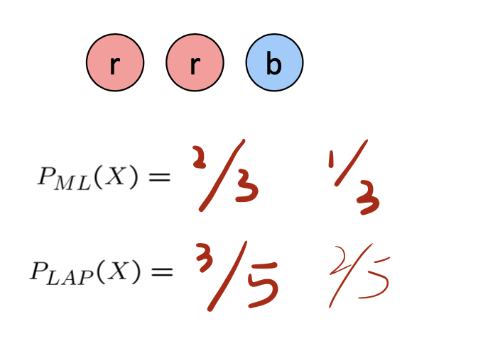

<!--more-->

## Machine Learning

- Up until now: how use a model to make optimal decisions
- Machine learning: how to acquire a model from data / experience 
  - Learning parameters (e.g. probabilities)
  - Learning structure (e.g. BN graphs)
  - Learning hidden concepts (e.g. clustering, neural nets)
- Today: model-based classification with Naive Bayes
  > With assumptions, simplifications

### Example: Span Filter

- Input: an email
- Output: spam/ham
- Setup:
  - Get a large collection of example emails, each labeled “spam” or “ham”
  - Note: someone has to hand label all this data!
  - Method: Crowdsourcing -- Amazon Mechanical Turk
  - Want to learn to predict labels of new, future emails
- Features: The attributes used to make the ham / spam decision
  - Words: FREE!
  - Text Patterns: $dd, CAPS
  - Non-text: SenderInContacts, WidelyBroadcast 
  - ...

### Example: Digit Recognition
- Input: images / pixel grids 
- Output: a digit 0-9
- Setup:
  - Get a large collection of example images, each labeled with a digit
  - Note: someone has to hand label all this data! 
  - Want to learn to predict labels of new, future digit images
- Features: The attributes used to make the digit decision 
  - Pixels: (6,8)=ON
  - Shape Patterns: NumComponents, AspectRatio, NumLoops 
  - ...
  - Features are increasingly induced rather than crafted

### Other Classification Tasks
- Classification: given inputs x, predict labels (classes) y
- Examples:
  - Medical diagnosis (input: symptoms, classes: diseases)
  - Fraud detection (input: account activity, classes: fraud / no fraud)
  - Automatic essay grading (input: document, classes: grades)
  - Customer service email routing
  - Review sentiment
  - Language ID
  - ... many more
- Classification is an important commercial technology!

## Model-Based Classification

- Model-based approach
  - Build a model (e.g. Bayes’ net) where both the output label and input features are random variables
  - Instantiate any observed features
  - Query for the distribution of the label conditioned on the features
- Challenges
  - What structure should the BN have? 
  - How should we learn its parameters?

### Naive Bayes for Digits

- Naïve Bayes: Assume **all features are independent effects** of the label
  > I.e. according to d-separation
  > 
  > a very strong assumption
  > but such assumption will in practice complete the classification task as well
- Simple digit recognition version:
  - One feature (variable) $F_{ij}$ for each grid position $<i,j>$
  - Feature values are on / off, based on whether intensity is more or less than 0.5 in underlying image
  - Each input maps to a feature vector, e.g.
    
  - Here: lots of features, each is binary valued 
- Naïve Bayes model:
    $$
    P\left(Y \mid F_{0,0} \ldots F_{15,15}\right) \propto P(Y) \prod_{i, j} P\left(F_{i, j} \mid Y\right)
    $$
- What do we need to learn?

### General Naïve Bayes

- A general Naive Bayes model:

> Although the table is very large ($|F|^n$), we can simplify it using the assumption of naive bayes

- We only have to specify how each feature depends on the class 
- Total number of parameters is **linear** in n
- Model is very simplistic, but often works anyway

### Inference for Naive Bayes

- Goal: compute posterior distribution over label variable Y 
- Step 1: get joint probability of label and evidence for each label
$$
P\left(Y, f_{1} \ldots f_{n}\right)=\left[\begin{array}{c}
P\left(y_{1}, f_{1} \ldots f_{n}\right) \\
P\left(y_{2}, f_{1} \ldots f_{n}\right) \\
\vdots \\
P\left(y_{k}, f_{1} \ldots f_{n}\right)
\end{array}\right] \quad \Rightarrow \left[\begin{array}{c}
P\left(y_{1}\right) \prod_{i} P\left(f_{i} \mid y_{1}\right) \\
P\left(y_{2}\right) \prod_{i} P\left(f_{i} \mid y_{2}\right) \\
\vdots \\
P\left(y_{k}\right) \prod_{i} P\left(f_{i} \mid y_{k}\right)
\end{array}\right]
$$
- Step 2: sum to get probability of evidence $P\left(f_{1} \ldots f_{n}\right)$
- Step 3: normalize by dividing Step 1 by Step 2 $P\left(Y \mid f_{1} \ldots f_{n}\right)$
> 后验概率估计

- What do we need in order to use Naïve Bayes?
- Inference method (we just saw this part)
  - Start with a bunch of probabilities: P(Y) and the P(Fi|Y) tables 
  - Use standard inference to compute P(Y|F1...Fn)
  - Nothing new here
- Estimates of local conditional probability tables § P(Y), the prior over labels
  - P(Fi|Y) for each feature (evidence variable)
  - These probabilities are collectively called the parameters of the model and denoted by q
  - Up until now, we assumed these appeared by magic, but...
  - ...they typically come from training data counts: we’ll look at this soon

### Example: Naive Bayes on Digit

> Note: we are taking the probability on the condition, so it is not normalized
> It is reasonable to take a uniform distribution initially

### Example: Naive Bayes for Text

Bag-of-words Naive Bayes:
- Features: $\mathrm{W}_{\mathrm{i}}$ is the word at position i
- As before: predict label conditioned on feature variables (spam vs. ham)
- As before: assume features are conditionally independent given label
- New: each $W_{i}$ is **identically distributed 独立同分布**
  > An even stronger assumption, reasonable

- Generative model:
$$
P\left(Y, W_{1} \ldots W_{n}\right)=P(Y) \prod_{i} P\left(W_{i} \mid Y\right)
$$
> Word at position $i,$ not $i^{t h}$ word in the dictionary!
  
- "Tied" distributions and bag-of-words
  - Usually, each variable gets its own **conditional probability distribution** $\mathrm{P}(\mathrm{F} \mid \mathrm{Y})$
  - In a bag-of-words model
    - Each position is identically distributed
    - All positions share the same conditional probs $\mathrm{P}(\mathrm{W} \mid \mathrm{Y})$
    - Why make this assumption?
- Called "bag-of-words" because model is insensitive to word order or reordering

> $P(W|spam)$ should be normalized

> Note: tot spam/ham is log vaule
> 
> The spam/ham is compared according to the **ratio** of two kinds of probability $Spam > Ham$
> $P(spam|W)=98.9\%$

### Empirical Risk Minimization

- Empirical risk minimization
  - Basic principle of machine learning
  - We want the model (classifier, etc) that does best on the true test distribution
  - Don’t know the true distribution so pick the best model on our actual training set 
  - Finding “the best” model on the training set is phrased as an optimization problem
- Main worry: **overfitting** to the training set
  - Better with more training data (less sampling variance, training more like test)
  - Better if we limit the complexity of our hypotheses (regularization and/or small hypothesis spaces)

### Important Concepts

- Data: labeled instances (e.g. emails marked spam/ham) 
  - Training set
  - Held out set  *(or validation set)*
  - Test set
- Features: attribute-value pairs which characterize each x
- Experimentation cycle
  - Learn parameters (e.g. model probabilities) on training set 
  - (Tune hyperparameters on held-out set)
  - Compute accuracy of test set
  - Very important: never “peek” at the test set!
- Evaluation (many metrics possible, e.g. accuracy) 
  - Accuracy: fraction of instances predicted correctly
- **Overfitting** and **generalization**
  - Want a classifier which does well on test data
  - Overfitting: fitting the training data very closely, but not generalizing well
  - We’ll investigate overfitting and generalization formally in a few lectures

### Example: Overfitting

> Assume in all samples of 3, no bottom-right dot is found, but with a little noise, the bottom-right dot completely reverse all the evidence before

### Smooth and Regularize

- Relative frequency parameters will overfit the training data!
  - Just because we never saw a 3 with pixel (15,15) on during training doesn’t mean we won’t see it at test time 
  - Unlikely that every occurrence of “minute” is 100% spam
  - Unlikely that every occurrence of “seriously” is 100% ham
  - What about all the words that don’t occur in the training set at all?
  - In general, we can’t go around giving unseen events zero probability
- As an extreme case, imagine using the entire email as the only feature (e.g. document ID) 
  - Would get the training data perfect (if deterministic labeling)
  - Wouldn’t generalize at all
  - Just making the bag-of-words assumption gives us some generalization, but isn’t enough
- To generalize better: we need to smooth or regularize the estimates

### Parameter Estimation

> $\hat{P} \neq \lim_{n\rightarrow \infty} \frac{|S|}{N} = P$

- Estimating the distribution of a random variable 
- Elicitation: ask a human (why is this hard?)
- Empirically: use training data (learning!)
  - E.g.: for each outcome x, look at the empirical rate of that value:
    
  - This is the estimate that maximizes the likelihood of the data $L(x, \theta)=\prod_{i} P_{\theta}\left(x_{i}\right)$
> Because such estimation is the maximal likelihood estimation of all distributions.
> Also an implementation of the naive bayes net

### Why Maimum Likelihood

Relative frequencies are the maximum likelihood estimates 最大似然估计
$$
\begin{aligned}
\theta_{M L} &=\underset{\theta}{\arg \max P(\mathbf{X} \mid \theta)} \\
&=\underset{\theta}{\arg \max } \prod_{i} P_{\theta}\left(X_{i}\right)
\end{aligned} \quad \longrightarrow \quad P_{\mathrm{ML}}(x)=\frac{\mathrm{count}(x)}{\text { total samples }}
$$
Another option is to consider the most likely parameter value given the data 最大后验估计
$$
\begin{aligned}
\theta_{M A P} &=\underset{\theta}{\arg \max } P(\theta \mid \mathbf{X}) \\
&=\underset{\theta}{\arg \max } P(\mathbf{X} \mid \theta) P(\theta) / P(\mathbf{X}) \quad \Rightarrow \quad \text { ???? } \\
&=\underset{\theta}{\arg \max } P(\mathbf{X} \mid \theta) P(\theta)
\end{aligned}
$$
> 在$\theta$是均匀分布时，最大后验估计和最大似然估计相同

#### Extension: Regression

$$
f_{w}\left(\boldsymbol{x}_{i}\right)=\sum_{i=1}^{d} x_{i j} w_{j}+\epsilon_{i}=\boldsymbol{x}_{i} \boldsymbol{w}^{T}+\underline{\epsilon}_{i}
$$

- Linear Regression:
$$
\begin{aligned}
\arg \min _{w} f_{w}(\boldsymbol{X}) &=\sum_{i=1}^{n}\left(\frac{y_{i}-\boldsymbol{x}_{i} \boldsymbol{w}^{T}}{\boldsymbol{x}}\right)^{2}=\left\|\boldsymbol{y}-\boldsymbol{X} \boldsymbol{w}^{T}\right\| \\
\boldsymbol{w} &=\left(\boldsymbol{X}^{T} \boldsymbol{X}\right)^{-1} \boldsymbol{X}^{T} \boldsymbol{y}
\end{aligned}
$$

- Gaussian MLE: 对上述回归问题作出改写，考虑随机噪声因子，$y = \omega^T x + \epsilon \sim \epsilon \sim N(w^T x, \delta^2)$ 考虑对$y$做最大似然估计（使用log简化运算）结果是一致的

$$
\begin{array}{rl}
\arg \min _{\boldsymbol{w}} L(\boldsymbol{X}, \boldsymbol{w}) & =\ln \prod_{i=1}^{n} \frac{1}{\sigma \sqrt{2 \pi}} \exp \left(-\frac{1}{2}\left(\frac{y_{i}-\boldsymbol{x}_{i}^{T} \boldsymbol{w}}{\sigma}\right)^{2}\right) \\
& =-\frac{1}{2 \sigma^{2}} \sum_{i=1}^{n}\left(y_{i}-\boldsymbol{x}_{i}^{T} \boldsymbol{w}\right)^{2}-n \ln \sigma \sqrt{2 \pi} \\
w=\left(\boldsymbol{X}^{T} \boldsymbol{X}\right)^{-1} & \boldsymbol{X}^{T} y
\end{array}
$$

## Unseen Events

### Laplace Smoothing

Laplace’s estimate:
- Pretend you saw every outcome once more than you actually did

$$
\begin{aligned}
P_{L A P}(x) &=\frac{c(x)+1}{\sum_{x}[c(x)+1]} \\
&=\frac{c(x)+1}{N+|X|}
\end{aligned}
$$

> Can derive this estimate with Dirichlet priors (see cs281a) 分布的分布

Laplace's estimate (extended):
- Pretend you saw every outcome $\mathrm{k}$ extra times
    $$
    P_{L A P, k}(x)=\frac{c(x)+k}{N+k|X|}
    $$
- What's Laplace with $\mathrm{k}=0$ ?
- $\mathrm{k}$ is the strength of the prior

Laplace for conditionals:
  - Smooth each condition independently:
    $$
    P_{L A P, k}(x \mid y)=\frac{c(x, y)+k}{c(y)+k|X|}
    $$
> k and c become (hyper/learned) parameters to be trained

## Tuning
> When to terminate training? to avoid over-fitting

- Now we’ve got two kinds of unknowns
  - Parameters: the probabilities P(X|Y), P(Y)
  - Hyperparameters: e.g. the amount / type of smoothing to do, k, a
- What should we learn where?
  - Learn parameters from training data
  - Tune hyperparameters on different data § Why?
  - For each value of the hyperparameters, train and test on the held-out data
  - Choose the best value and do a final test on the test data

## What to Do About Errors?

- Need more features- words aren’t enough! 
  - Have you emailed the sender before?
  - Have 1K other people just gotten the same email? 
  - Is the sending information consistent?
  - Is the email in ALL CAPS?
  - Do inline URLs point where they say they point? 
  - Does the email address you by (your) name?
- Can add these information sources as new variables in the NB model
- Next class we’ll talk about classifiers which let you easily add arbitrary features more easily, and, later, how to induce new features

## Baselines
- First step: get a baseline
  - Baselines are very simple “straw man” procedures 
  - Help determine how hard the task is
  - Help know what a “good” accuracy is
- Weak baseline: most frequent label classifier
  - Gives all test instances whatever label was most common in the training set
  - E.g. for spam filtering, might label everything as ham
  - Accuracy might be very high if the problem is skewed
  - E.g. calling everything “ham” gets 66%, so a classifier that gets 70% isn’t very good...
- For real research, usually use previous work as a (strong) baseline

## Condidences from a classifier
置信度

- The confidence of a probabilistic classifier: 
  - Posterior probability of the top label (最大后验概率)
  - Represents how sure the classifier is of the classification 
  - Any probabilistic model will have confidences
  - No guarantee confidence is correct
  - 差值越大越好
- Calibration修正问题
  - Weak calibration: higher confidences mean higher accuracy
  - Strong calibration: confidence predicts accuracy rate 
  - What’s the value of calibration?

