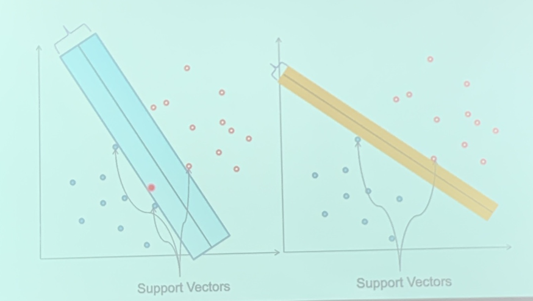
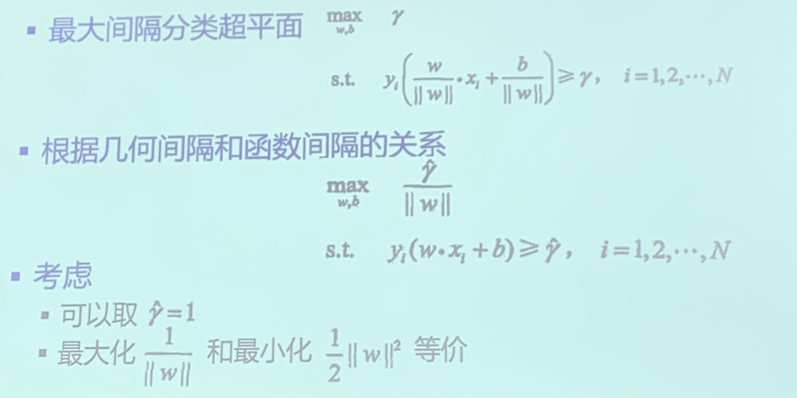
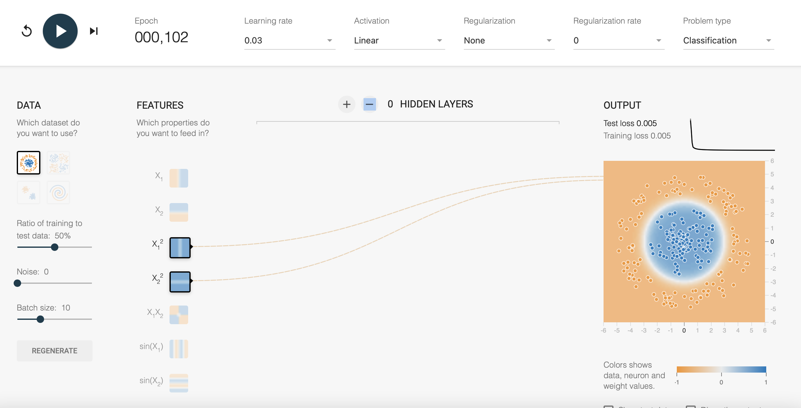
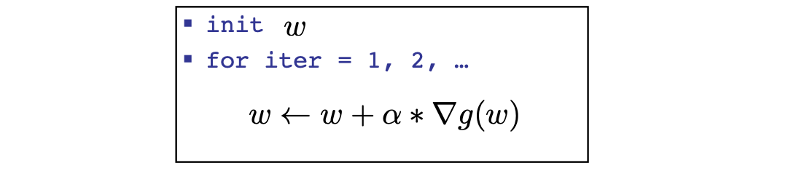
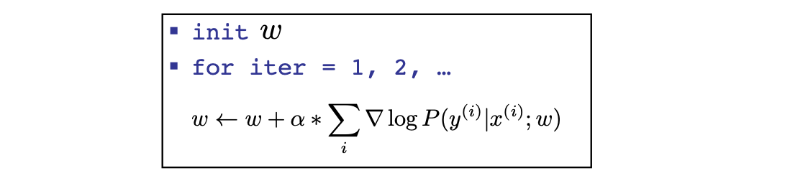
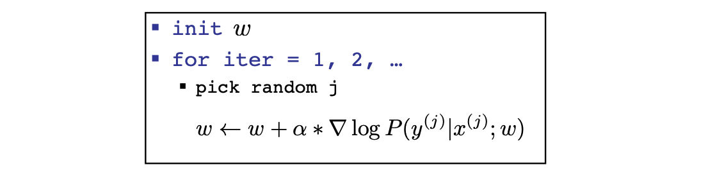
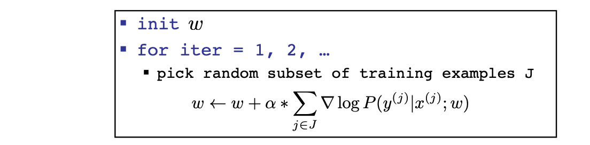
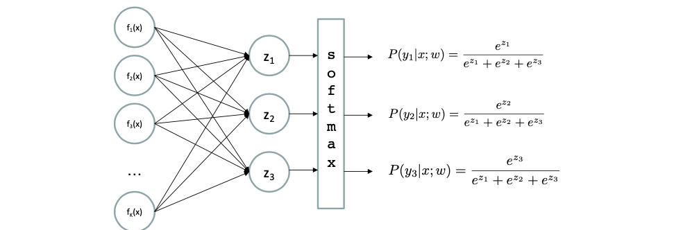
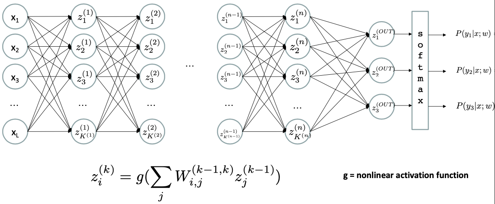
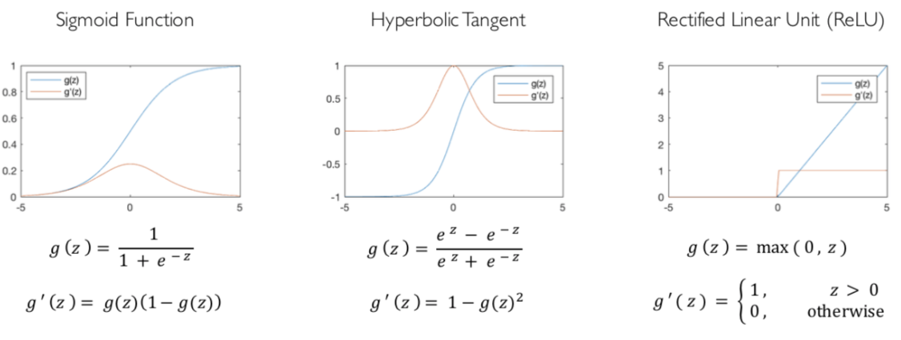

How do we solve

$$
\max _{w} l l(w)=\max _{w} \sum_{i} \log P\left(y^{(i)} \mid x^{(i)} ; w\right)
$$

<!--more-->
[toc]

## Reminder: Linear Classifiers

- Inputs are feature values 
- Each feature has a weight 
- Sum is the activation
> Usually with a bias
$$
\text { activation }_{w}(x)=\sum_{i} w_{i} \cdot f_{i}(x)=w \cdot f(x)
$$

- If the activation is: 
  - Positive, output +1 
  - Negative, output -1

> But we can't determine which "classifier" is the best

### Get Probabilistic Decisions

- Activation: $\quad z=w \cdot f(x)$
  - If $z=w \cdot f(x) \quad$ very positive $\rightarrow$ want probability going to 1
  - If $z=w \cdot f(x) \quad$ very negative $\rightarrow$ want probability going to 0

- Sigmoid function
$$
\begin{aligned}
\phi(z) &=\frac{1}{1+e^{-z}} \\
\phi^{\prime}(z) &=\frac{1}{1+e^{-z}}-\frac{1}{\left(1+e^{-z}\right)^{2}} \\
&=\phi(z)(1-\phi(z))
\end{aligned}
$$

### Best w

- Maximum likelihood estimation:
$$
\max _{w} l l(w)=\max _{w} \sum_{i} \log P\left(y^{(i)} \mid x^{(i)} ; w\right)
$$
$$
P\left(y^{(i)}=+1 \mid x^{(i)} ; w\right)=\frac{1}{1+e^{-w \cdot f\left(x^{(i)}\right)}}
$$
$$
P\left(y^{(i)}=-1 \mid x^{(i)} ; w\right)=1-\frac{1}{1+e^{-w \cdot f\left(x^{(i)}\right)}}
$$

### Multiclass Logistic Regression

Recall Perceptron:
- A weight vector for each class: $\quad w y$
- Score (activation) of a class y: $\quad w y \cdot f(x)$
- Prediction highest score wins $y=\arg \max _{y} w_{y} \cdot f(x)$

How to make the scores into probabilities?

$$
\underbrace{z_{1}, z_{2}, z_{3}}_{\text {original activations }} \rightarrow \underbrace{\frac{e^{z_{1}}}{e^{z_{1}}+e^{z_{2}}+e^{z_{3}}}, \frac{e^{z_{2}}}{e^{z_{1}}+e^{z_{2}}+e^{z_{3}}}, \frac{e^{z_{3}}}{e^{z_{1}}+e^{z_{2}}+e^{z_{3}}}}_{\text {softmax activations }}
$$

> 引入指数形式的优缺点
> - Pro:曲线斜率逐渐增大，能够将输出值拉开距离（用作损失函数，符合one-hot类型）
> - Con:当$z_i$值非常大，计算得到的数值可能会溢出
>   - Solution: 将每一个输出值减去输出值中的最大值，再激活

### Best w?

$$
\begin{array}{c}
\max _{w}  l l(w)=\max _{w} \sum_{i} \log P\left(y^{(i)} \mid x^{(i)} ; w\right) \\
\text { with: } P\left(y^{(i)} \mid x^{(i)} ; w\right)=\frac{e^{w_{y}(i) \cdot f\left(x^{(i)}\right)}}{\sum_{y} e^{w_{y} \cdot f\left(x^{(i)}\right)}}
\end{array}
$$

> = Multi-Class Logistic Regression

> Logistic solve the "best plane" problem with the notion of probabilistic

> 对多分类，每个类都有一个权值，参数规模增加

## Support Vector Machines (SVM)
> Recall in perceptrons, optimal hyperplane (w.r.t the problem instead of the dataset) can not be found.
> Add a new constraint: 间隔最大化
> Kernel Techniques: make it a non-linear classifier
> Solution: Convex Quandratic Programming

- 线性可分支持向量机：硬间隔最大化
- 线性不可分：软间隔最大化
- 非线性：kernel method

- 决策函数: $sgn(wx+b)$
- 间隔: 

> Kernel Method Example
> 

## Hill Climbing

- Recall from CSPs lecture: simple, general idea 
  - Start wherever
  - Repeat: move to the best neighboring state 
  - If no neighbors better than current, quit
- What’s particularly tricky when hill-climbing for multiclass logistic regression?
  - Optimization over a continuous space 
    - Infinitely many neighbors!
    - How to do this efficiently?

## Gradient Ascent

- Perform update in uphill direction for each coordinate
- The steeper the slope (i.e. the higher the derivative) the bigger the step for that coordinate
- E.g., consider: $g(w_1,w_2)$

Updates:
- $w_{1} \leftarrow w_{1}+\alpha * \frac{\partial g}{\partial w_{1}}\left(w_{1}, w_{2}\right)$
- $w_{2} \leftarrow w_{2}+\alpha * \frac{\partial g}{\partial w_{2}}\left(w_{1}, w_{2}\right)$

Updates in vector notation:
$$
\begin{array}{l}
\qquad w \leftarrow w+\alpha * \nabla_{w} g(w) \\
\text { with: } \nabla_{w} g(w)=\left[\begin{array}{l}
\frac{\partial g}{\partial w_{1}}(w) \\
\frac{\partial g}{\partial w_{2}}(w)
\end{array}\right]
\end{array}
$$

### What is the steepest Direction
$$
\max _{\Delta: \Delta_{1}^{2}+\Delta_{2}^{2} \leq \varepsilon} g(w+\Delta)
$$

- First-Order Taylor Expansion: $\quad g(w+\Delta) \approx g(w)+\frac{\partial g}{\partial w_{1}} \Delta_{1}+\frac{\partial g}{\partial w_{2}} \Delta_{2}$
- Steepest Ascent Direction: $\max _{\Delta: \Delta_{1}^{2}+\Delta_{2}^{2} \leq \varepsilon} g(w)+\frac{\partial g}{\partial w_{1}} \Delta_{1}+\frac{\partial g}{\partial w_{2}} \Delta_{2}$
- Recall: $\max _{\Delta:\|\Delta\| \leq \varepsilon} \Delta^{\top} a \rightarrow \quad \Delta=\varepsilon \frac{a}{\|a\|}$
- Hence, solution: $\quad \Delta=\varepsilon \frac{\nabla g}{\|\nabla g\|}$ Gradient direction = steepest direction!

- Gradient in n dimensions$\nabla g=\left[\begin{array}{c}\frac{\partial g}{\partial w_{1}} \\ \frac{\partial g}{\partial w_{2}} \\ \cdots \\ \frac{\partial g}{\partial w_{n}}\end{array}\right]$

### Optimization Procedure: Gradient Ascent

- $\alpha$ : learning rate --- tweaking parameter that needs to be chosen carefully
- How? Try multiple choices
  - Crude rule of thumb: update changes w about 0.1 – 1 %

> Extreme Example: why normalization is necessary: $g_2(w)=10^6g_1(w) \rightarrow \frac{\partial g_2(w)}{\partial w} = 10^6 \frac{\partial g_1(w)}{\partial w}$

> On the log likelihood Objective:

$\max _{w} l l(w)=\max _{w} \underbrace{\sum_{i} \log P\left(y^{(i)} \mid x^{(i)} ; w\right)}_{g(w)}$

> However the "Batch" gradient ascent is very costly in computation
> **Stochastic Gradient Ascent** on the Log Likelihood Objective

Observation: once gradient on one training example has been computed, might as well incorporate before computing next one

> Make modification w.r.t a single sample
> But the fluctuation may be a problem
> **Mini-Batch Gradient Ascent** on the Log Likelihood Objective

Observation: gradient over small set of training examples (=mini-batch) can be computed in parallel, might as well do that instead of a single one

> J can be selected to fit the HW resources (parallel computation)

## Neural Networks

> Recall: in Multi-class Logistic Regression (or other classfiers), the classification is based on **features**. We need to extract better features to improve performance
> = special case of neural network
> 

### Deep Neural Network = Also learn the features!

> For every $z$ node, it functions like a perceptron, but the transformation is a **nonlinear** function (otherwise, combinations of linear are still linear)

### Common Activation Functions

- Training the deep neural network is just like logistic regression: 
  $\max _{w} \quad l l(w)=\max _{w} \sum_{i} \log P\left(y^{(i)} \mid x^{(i)} ; w\right)$
  > Cross Entropy
- just w tends to be a much, much larger vector :)
  - **just run gradient ascent**
- stop when log likelihood of **hold-out data** starts to decrease
  > Use the hold-out set to avoid overfitting!

## Neural Networks Properties

**Theorem (Universal Function Approximators).** A two-layer neural network with a sufficient number of neurons can approximate any continuous function to any desired accuracy.
- Practical considerations
  - Can be seen as learning the features
  - Large number of neurons 
    - Danger for overfitting
    - (hence early stopping!)
> What activation to choose? (for different problems)
> 
In words: Given any continuous function f(x), if a 2-layer neural network has enough hidden units, then there is a choice of weights that allow it to closely approximate f(x).

https://playground.tensorflow.org