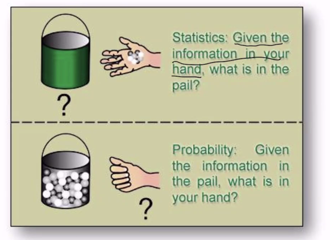

# 1 Introduction

<!-----
title: 【Big Data】1 Introduction
url: bd-intro
date: 2020-03-05 18:03:41
tags: 
- Big Data Analysis

categories: 
- Courses

----->

Week 1 of 2020 Spring. Intro to Big Data Analysis.

**KeyWords**: Big Data

<!--more-->

[[toc]]

## 关于统计

统计读物
- 女士品茶
- 数理统计学简史

统计与概率

- 概率论刻画随机的模式,帮助生成数据
- 统计则反过来,由数据推理规律,产生机制
- 统计学是研究如何有效地收集和分析带有随机性影响数据的一门学科
    - 科学收集数据:设计有效的收集数据的方式
    - 科学分析数据
    - 随机性数据

## 绪论

### 数据集

| | 样本1 | 样本2 | ... | 样本m |
|--|--|--|--|--|
|特征1|$x_{11}$|$x_{12}$|...|$x_{1m}$|
|...|...|...|...|...|
|特征d|$x_{d1}$|$x_{d2}$|...|$x_{dm}$|

特征/属性,样本/示例,属性值

> $x_{ij}$是随机的还是确定的?
> 取决于抽样前后,抽样前是随机变量,抽样后是确定的. 我们研究的角度是基于随机的.

### 数据分析的目标

1. 非监督学习(unsupervised learning): 希望对数据进行聚类或特征整合
2. 监督学习(supervised learning): 目标是希望通过建模找到关系$y_i \approx f(x_i)$
  x一般被称为解释变量; y一般被称为响应变量/标签/被解释变量
    - 回归问题: $y_i$连续
    - 分类问题: $y_i$离散

其他:数据缺失问题, 非数值属性的处理
