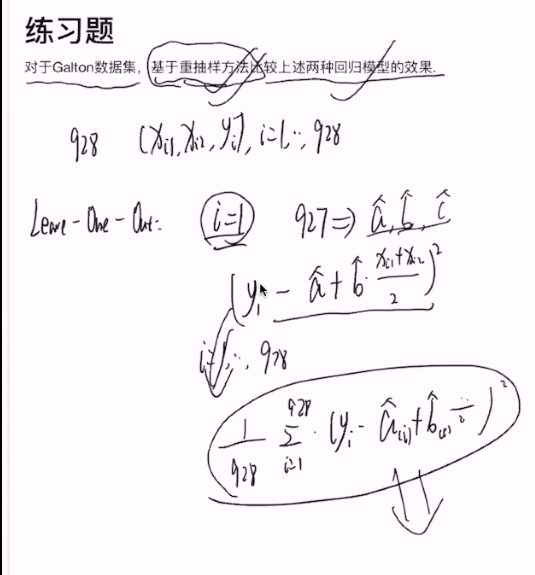

# 线性模型：Part I

<!-----
title: 【大数据分析】线性模型：Part I
url: bd-linear1
date: 2020-03-19 18:02:03
tags: 
- Big Data Analysis

categories: 
- Courses

----->

Week 3 of 2020 Spring

<!--more-->

[toc]

(乱涂公式警告)

对于自变量X,应变量Y,一元回归模型为:

$$Y=\beta_{0}+\beta X+\epsilon$$

其中, $\epsilon$为误差项/噪音. 即$X$之外的因素. 逻辑上我们都考虑到了, 不过我们会主要考虑$X$, 我们要求平均而言$\epsilon$在0附近, 因为我们已经考虑了$\beta_{0}$

拟合的好可能是一个很模糊的概念, 在不同的概念下可能会不一样

$$f_1(a,b) = \frac{1}{n}\left( \sum_{i=1}^{n} y_{i}-a-b x_{i}\right)^{2}$$

$$f_2(a,b) = \frac{1}{n}\left( \sum_{i=1}^{n} \frac{y_{i}-a-b x_{i}}{a^2+b^2}\right)^{2}$$

在统计中, 我们选择了上面的均方值作为拟合目标. 一方面, 好算. 另一方面, 我们希望是预测, 所以是对预测值考虑, 而不是简单的点到线的距离准则. 数学上还可以考虑很多其他不一样的准则.

对任意回归系数$\beta_0,\beta_1$考虑残差平方和,
$$\sum_{j=1}^{n}\left(y_{i}-\beta_{0}-\beta_{1} x_{i}\right)^{2}$$

把可导等性质放在一边, 只要有一个关于回归系数的函数, 我们就可以比较任何两个模型的好坏.

$$x=\arg \min _{x} f(x)$$

$$f(x)=\min _{x}(x)$$

$$\left(\hat{\beta}_{0}, \hat{\beta}_{1}\right)=\arg \min _{\beta_{0}, \beta_{1}} \sum_{j=1}^{n}\left(y_{i}-\beta_{0}-\beta_{1} x_{i}\right)^{2}$$

$$f(a, b)=\sum_{i=1}^{n}\left(y_{i}-a-b x_{i}\right)^2$$

## Solution

$$(\hat{a}, \hat{b})=\underset{a, b}{\arg \min } f(a, b)$$

$$\frac{\partial(a, b)}{\partial a}=\sum_{i=1}^{n} 2\left(y_{i}-a-b x_{i}\right)\cdot(-1) = 0$$

$$\sum_{i=1}^{n} y_{i}=n \cdot a+b \cdot \sum_{i=1}^{n} x_{i}$$
$$\bar{y}=a+b \cdot \bar{x}$$

$$\frac{\partial f(a, b)}{\partial b}=\sum_{i=1}^{n} 2\left(y_{i}-a-b x_{i}\right) \cdot\left(-x_{i}\right)=0$$

$$\sum_{i=1}^{n} y_{i} x_{i}=\dot{a} \cdot \frac{n}{2} x_{i}+b \sum_{i=1}^{n} x_{i}^{2}$$

$$
\frac{1}{n_{i-1}} x_{i} y_{i}=a \cdot \bar{x}+b \cdot \frac{1}{n} \sum_{i=1}^{n} x_{i}^{2}$$

两式相加

$$\frac{1}{n} \sum_{i=1}^{n} x_{i} y_{i}=\bar{x} \cdot(\bar{y}-\underline{b} \bar{x})+b \cdot \frac{1}{n} \sum_{i=1}^{n} x_{i}^{2}$$

$$b \cdot\left(\frac{1}{a} \sum_{i=1}^{n} x_{i}^{2}-\bar{x}^{2}\right)=\frac{1}{n} \sum_{i=1}^{n} x \times y-\bar{x} \bar{y}$$

解得
$$\left\{\begin{array}{l}
a=\bar{y}-\bar{x} \cdot b \\
b=\frac{\frac{1}{n} \sum_{i=1}^{n} x_{i} y_{i}-\bar{x} \bar{y}}{\frac{i}{n} \sum_{i} x_{i}^{2}-\bar{x}^{2}}
\end{array}\right.$$

整理一下

$$\left\{\begin{array}{l}
a=\bar{y}-\bar{x} \cdot b \\
b=\frac{\frac{1}{n} \sum_{i=1}^{n}\left(x_{i} - \bar{x}\right) \cdot\left(y_{i}-\bar{y}\right)}{\frac{1}{n} \sum_{i=1}^{n} \cdot\left(x_{i}-\bar{x}\right)^{2}}
\end{array}\right.$$

## 另解

考虑这样一个问题
$$\operatorname{arg min}_a \sum_{i=1}^{n}\left(y_{i}-a\right)^{2}=\bar{y}$$

现在我们对
$$\arg _{a, b} \sum_{i=1}^{n}\left(y_{i}-a-b x_{i}\right)^{2}$$
这一问题,我们先固定b,斜率固定, 那么对常数项有
$$\log _{a} \min \sum_{i=1}^{n}\left(y_{i}-a-b x_{i}\right)^{2}=\bar{y-bx}=\bar{y}-b \cdot \bar{x}$$

将这个常数项代入, 

$$\begin{aligned}
\operatorname{argmin}_a \sum_{i=1}^{n}\left(y_{i}-\bar{y}+b \bar{x}-b_{n}\right) &=\operatorname{argmin}_{b} \sum_{i=1}^{n}\left(\left(y_{i}-\bar{y}\right)-b\left(x_{i}-\bar{x}_{i}\right)\right)^{2} \\
&=\frac{\frac{1}{n} \sum_{i=1}^{n}(y_i-\bar{y}) (x_{i} -\bar{x})}{\frac{1}{n} \sum_{i=1}^{n}\left(x_{i} - \bar{x}\right)^{2}}
\end{aligned}$$

先挑常数项, 再挑斜率.

## 多元回归模型
用均方损失的形式评估面的好坏
$$f(\beta) = \underset{\beta \in \mathbb{R}^{p}}{\arg \min } \sum_{i=1}^{n}\left(Y_{i}-X_{i}^{\prime} \beta\right)^{2}$$

用矩阵的将问题形式化可以表示成

$$\mathbb{X}=\left(\begin{array}{c}
\mathrm{X}_{1}^{\top} \\
\vdots \\
\mathrm{X}_{n}^{\top}
\end{array}\right)_{n \times p}=\left(\begin{array}{ccc}
X_{11} & \ldots & X_{1 p} \\
\vdots & \vdots & \vdots \\
X_{n 1} & \ldots & X_{n p}
\end{array}\right), \mathbb{Y}=\left(\begin{array}{c}
Y_{1} \\
\vdots \\
Y_{n}
\end{array}\right)$$

$$\underset{\beta \in \mathbb{R}^{p}}{\arg \min }(\mathbb{Y}-\mathbb{X} \beta)^{\top}(\mathbb{Y}-\mathbb{X} \beta)$$

矩阵中每一行都是一个样本的p个特征

实际问题中, 我们会认为设定第一列$X_{11}, \ldots, X_{n 1}$为1, 自动考虑常数项.

$$\begin{array}{l}
\frac{\partial(\mathbb{Y}-\mathbb{X} \beta)^{\top}(\mathbb{Y}-\mathbb{X} \beta)}{\partial \beta}=2 \mathbb{X}^{\top}(\mathbb{X} \beta-\mathbb{Y}) \\
\frac{\partial^{2}(\mathbb{Y}-\mathbb{X} \beta)^{\top}(\mathbb{Y}-\mathbb{X} \beta)}{\partial \beta \partial \beta^{\prime}}=2 \mathbb{X}^{\top} \mathbb{X} \geq 0
\end{array}$$

如果不严格正定, 那么就有无穷多个$\beta$是这个线性方程组的解. (例:有效样本的个数小于系数的维数)

对一元回归,
$$x^{T} \cdot x=\left(\begin{array}{cc}
n & \Sigma x_{i} \\
\Sigma x_{i} & \Sigma x_{i}^{2}
\end{array}\right)$$

$$\left(X^{\top} X\right)^{-1}=\frac{1}{n \sum x_i^2 -(\sum x_i)^2}\left(\begin{array}{cc}
\Sigma x_{i}^{2} & \Sigma x_{i} \\
\Sigma x_{i} & n  
\end{array}\right)$$

## 回归模型的延伸

- 多项式回归模型
  $$Y=\alpha+\beta_{1} X+\cdots+\beta_{k} X^{k}+\epsilon$$
  构造数据矩阵时: 一元回归转到多元回归
  $$X=\left(\begin{array}{ll}
  x_{1} & \ldots & x_{1} & x_{1}^{2} \\
  x_{2} & \ldots & x_{2} & x_{2}^{2} \\
  x_{3} & \ldots & x_{3} & x_{3}^{2}
  \end{array}\right)$$
- 变量变换: 如股票数据
    - 用变换后的数据拟合线性模型 (kernel)
    - $Y=\alpha+\beta \log X+\epsilon \text { or } \log Y=\alpha+\beta X+\epsilon$
- 局部线性回归, 局部多项式回归(加权)
  $$\arg \min \sum_{j=1}^{n} w_{i}\left(y_{i}-\beta_{0}-\beta_{1} x_{i}\right)^{2}$$

