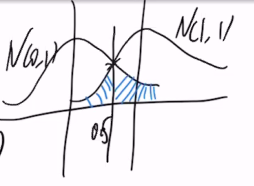
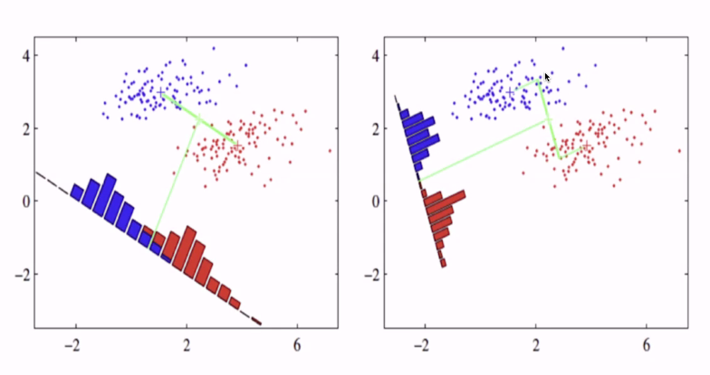

# 线性分类器

<!-----
title: 【大数据分析】线性分类器
url: bd-classify
date: 2020-04-09 18:03:26
tags: 
- Big Data Analysis

categories: 
- Courses

----->

Week 6 of 2020 Spring

<!--more-->

[toc]

## 理论分类器

分类问题
已知两个总体分布$F(x)$,$G(x)$，对一个新的观察值$X=x$如何分类？
- 例如$N(0,1), Exp(1)$;
- 例如$N(0,1), U[-1,1]$
可以理解为，我们已经通过足够多的观察了解了总体的分布，我们希望对新观测值进行判定。

1. 对于两个正态总体$N(0,1),N(1,1)$，直观上，应该以0.5为新观测值的分类标准。逻辑上的解释：概率密度分布函数
   
2. 如果给了先验信息（比如经验上的知识告诉我们）$x_1,\ldots,x_{11}$中，10个来自$N(0,1)$，1个来自$N(1,1)$. 此时面积的倍数发生了变化，原判别准则受影响，因此样本集的标签分布对结果有影响。

3. 对于两个正态总体$N(0,1),N(1,2)$，应该如何分类？求概率相等的点

### 分类器

每一个分类准则是把整个样本空间分成两部分$\mathcal{A}$,$\mathcal{A}^c$，我们认为，当$x\in \mathcal{A}$，新的观察值来自于$F(x)$. 当$x\in \mathcal{A}$，认为新的观察值来自于$G(x)$. 好的分类器即找出好的区域$\mathcal{A}$.

### 错分率
给定区域$\mathcal{A}$，

$$\begin{array}{rl}
 &P(X被错分) \\
=&P(X被错分,x\in \mathcal{A}^c) + &P(X被错分,x\in \mathcal{A}) \\
=&P\left(X \in \mathcal{A}^{c} | X \sim F\right) P(X \sim F)+P(X \in \mathcal{A} | X \sim G) P(X \sim G) \\
=&\pi_{1} \int_{\mathcal{A}^{c}} d F(x)+\pi_{2} \int_{\mathcal{A}} d G(x)
\end{array}$$
其中$\pi_1 =  P(X \sim F)$, $\pi_2 =  P(X \sim G)$ 为先验概率。

回到例1，
$$
\begin{aligned}
  P(X错分)&= \frac{1}{2} \int_{0.5}^{\infty} \frac{1}{\sqrt{2\pi}} e^{-\frac{x^2}{2}} dx + \frac{1}{2}\int_{-\infty}^{0.5} \frac{1}{\sqrt{2\pi}} e^{-\frac{(x+1)^2}{2}} dx \\
  &= \frac{1}{2} (1- \Phi (0.5)) + \frac{1}{2} (1- \Phi (0.5)) \approx 0.3
\end{aligned}
$$

我们发现，先验概率对分类产生了很大的影响。

### 错分损失

more generally，延伸为带有错分成本的损失函数。

$$\begin{array}{rl}
 &L(\mathcal{A}) \\
=&P\left(X \in \mathcal{A}^{c} | X \sim F\right) P(X \sim F)+P(X \in \mathcal{A} | X \sim G) P(X \sim G) \\
=&\pi_{1} \int_{\mathcal{A}^{c}} d F(x)+\pi_{2} \int_{\mathcal{A}} d G(x)
\end{array}$$

其中$\pi_1$,$\pi_2$为先验概率乘以对应损失（如错分垃圾邮件的成本）。

由此，最优的分类方法（Bayes分类器）为：
$$\begin{aligned}
\mathcal{A}^{*} &=\arg \min _{\mathcal{A}} \pi_{1} \int_{\mathcal{A}^{c}} d F(x)+\pi_{2} \int_{\mathcal{A}} d G(x) \\
&=\arg \min _{\mathcal{A}} \pi_{1} P\left(\mathcal{A}^{c}\right)+\pi_{2} Q(\mathcal{A})
\end{aligned}$$

优化逻辑：
若对$x: \pi_1 f(x_ > \pi_2 g(x)$，那么我们希望$x \notin \mathcal{A}^{*}, x \in \mathcal{A}^{*}$.
即，我们希望$A^{*} = \{x: \pi_1 f(x) > \pi_2 g(x) \}$， 这要求我们知道先验概率、两个整体分布

对离散情况，$X \sim F$, $Y \sim G$，若$\pi_1 P(X=x) > \pi_x P(Y = x)$, 类似的我们有$\mathcal{A}^{*} = \{x: \pi_1 P(X = x) > \pi_2 P(Y = x) \}$

如果一个离散一个连续？$\mathcal{A}^{*} = \text{dom} F$.

Example1. $N\left(\mu_{1}, \sigma_{1}^{2}\right)   VS. N\left(\mu_{2}, \sigma_{2}^{2}\right)$

$$A^{*}=\left\{x: \frac{\left(x-\mu_{2}\right)^{2}}{2 \sigma_{2}^{2}}-\frac{\left(x-\mu_{1}\right)^{2}}{2 \sigma_{1}^{2}}>\ln \frac{\sigma_{1}}{\sigma_{2}}\right\}$$

in particular, if \(\sigma_{1}=\sigma_{2}\) \(\begin{aligned} A^{*} &=\left\{x:\left(x-\mu_{2}\right)^{2}-\left(x-\mu_{1}\right)^{2}>0\right\} \\ &=\left\{x:\left(x-\frac{\mu_{1}+\mu_{2}}{2}\right)\left(\mu_{2}-\mu_{1}\right)<0\right\} \\ &=\left(\frac{\mu_{1}+\mu_{2}}{2},+\infty\right) \end{aligned}\)

$$\begin{aligned}
&\text { in particular } \mu_{1}=\mu_{2}=0\\
&\left(\frac{1}{2\sigma_{2}^{2}}-\frac{1}{2\sigma_{1}^{2}}\right) x^{2}>\ln \frac{\sigma_{1}}{\sigma_{2}}
\end{aligned}$$

Example2. 抛硬币与扔骰子
$$\begin{array}{l}
P(X=1)=P(X=2)=1 / 2 \\
Q(X=1)=Q(X=2)=\cdots=Q(X=6)=1 / 6
\end{array}$$

$\mathcal{A}^{*} = \{1,2\}$

Example3. $N(0,1) \text{VS. Exp} (1)$

\(\frac{1}{\sqrt{2 \pi}} e^{-\frac{x^{2}}{2}}>e^{-x} I(x>0)\)
\(\Leftrightarrow x<0,\) or \(\left\{\begin{array}{l}x \geq 0 \\ \frac{1}{\sqrt{2 \pi}} e^{-\frac{x^{2}}{2}}>e^{-x}\end{array}\right.\)
\(\Leftrightarrow \quad x<0\) or \(\quad(x-1)^{2}<1-\ln (2 \pi)\)
\(\Leftrightarrow \quad x<0\)
$A* = \{x:x<0\}$

问题： 如何通过样本来估计$F$，（核估计）

## 多元正态下的分布问题。
$\mathbf{X}=\left(X_{\mathbf{1}}, \cdots, X_{p}\right)^{\top}$ 对应的正态分布

$$f(x)=(2 \pi)^{-\frac{p}{2}}|\Sigma|^{-\frac{1}{2}} \exp \left\{-\frac{1}{2}(x-\mu)^{\top} \Sigma^{-1}(x-\mu)\right\}$$

一般正态分布是对标准正态分布的位移加尺度变化。
$$X = \mu + \Sigma^{1/2} \mathbf{U}$$

引入多元正态分布， 我们就有了解决对多元变量回归问题的手段。
$$\begin{aligned}
& \pi_{1} f(X)>\pi_{2} g(X) \\
\Leftrightarrow & \pi_{1}(2 \pi)^{-\frac{p}{2}}\left|\Sigma_{1}\right|^{-\frac{1}{2}} \exp \left\{-\frac{1}{2}\left(X-\mu_{1}\right)^{\prime} \Sigma_{1}^{-1}\left(X-\mu_{1}\right)\right\} \\
& \geq \pi_{2}(2 \pi)^{-\frac{p}{2}}\left|\Sigma_{2}\right|^{-\frac{1}{2}} \exp \left\{-\frac{1}{2}\left(X-\mu_{2}\right)^{\prime} \Sigma_{2}^{-1}\left(X-\mu_{2}\right)\right\} \\
\Leftrightarrow & \log \left(\pi_{1}\right)-\frac{1}{2} \log \left|\Sigma_{1}\right|-\frac{1}{2}\left(X-\mu_{1}\right)^{\prime} \Sigma_{1}^{-1}\left(X-\mu_{1}\right) \\
& \geq \log \left(\pi_{2}\right)-\frac{1}{2} \log \left|\Sigma_{2}\right|-\frac{1}{2}\left(X-\mu_{2}\right)^{\prime} \Sigma_{2}^{-1}\left(X-\mu_{2}\right)
\end{aligned}$$

整理得到QDA（二次型）
$$\begin{array}{l}
X^{\top}\left(\Sigma_{1}^{-1}-\Sigma_{2}^{-1}\right) X-2 X^{\top}\left(\Sigma_{1}^{-1} \mu_{1}-\Sigma_{2}^{-1} \mu_{2}\right)^{*} \\
+\mu_{1}^{\top} \Sigma_{1}^{-1} \mu_{1}-\mu_{2}^{\top} \Sigma_{2}^{-1} \mu_{2}+2 \log \frac{\pi_{1}}{\pi_{2}}+\log \frac{\left|\Sigma_{1}\right|}{\left|\Sigma_{2}\right|} \leq 0
\end{array}$$

我们发现分类器具有二次型的形式（椭球）
特别的，如果协方差结构相同（数据之间是平移关系）。就可以得到线性LDA分类器。
$$2 X^{\prime}\left(\Sigma^{-1} \mu_{1}-\Sigma^{-1} \mu_{2}\right)-\mu_{1}^{\prime} \Sigma^{-1} \mu_{1}+\mu_{2}^{\prime} \Sigma^{-1} \mu_{2}+2 \log \frac{\pi_{1}}{\pi_{2}} \geq 0$$

$$\left(X-\frac{\mu_{1}+\mu_{2}}{2}\right)^{\prime} \Sigma^{-1}\left(\mu_{1}-\mu_{2}\right)+\log \frac{\pi_{2}}{\pi_{1}} \geq 0$$

### 样本估计

实际中，我们要用样本估计均值和方差。

给定训练样本 
$$X_{1}, \cdots, X_{m}, Y_{1}, \cdots, Y_{n}$$

对应的参数估计为
$$\begin{aligned}
\hat{\mu}_{1} &=\bar{X}=\frac{1}{m} \sum_{i=1}^{m} X_{i}, \hat{\Sigma}_{1}=\frac{1}{m-1} \sum_{i=1}^{m}\left(X_{i}-\bar{X}\right)\left(X_{i}-\bar{X}\right)^{\prime} \\
\hat{\mu}_{2} &=\bar{Y}=\frac{1}{n} \sum_{j=1}^{n} Y_{j}, \hat{\Sigma}_{2}=\frac{1}{n-1} \sum_{j=1}^{n}\left(Y_{j}-\bar{Y}\right)\left(Y_{j}-\bar{Y}\right)^{\prime} \\
\hat{\Sigma} &=\frac{m-1}{m+n-2} \hat{\Sigma}_{1}+\frac{n-1}{m+n-2} \hat{\Sigma}_{2} \\
&=\frac{1}{m+n-2}\left\{\sum_{i=1}^{m}\left(X_{i}-\bar{X}\right)\left(X_{i}-\bar{X}\right)^{\prime}+\sum_{i=1}^{n}\left(Y_{j}-\bar{Y}\right)\left(Y_{j}-\bar{Y}\right)^{\prime}\right\}
\end{aligned}$$

将估计结果代入LDA和QDA，我们得到样本IDA

$$\left(X-\frac{\hat{\mu}_{1}+\hat{\mu}_{2}}{2}\right)^{\prime} \hat{\Sigma}^{-1}\left(\hat{\mu}_{1}-\hat{\mu}_{2}\right)+\log \frac{n}{m} \geq 0$$

和样本QDA

$$\begin{aligned}
&X^{\prime}\left(\hat{\Sigma}_{1}^{-1}-\hat{\Sigma}_{2}^{-1}\right) X+2 X^{\prime}\left(\hat{\Sigma}_{2}^{-1} \hat{\mu}_{2}-\hat{\Sigma}_{1}^{-1} \hat{\mu}_{1}\right)\\
&+\hat{\mu}_{1}^{\prime} \hat{\Sigma}_{1}^{-1} \hat{\mu}_{1}-\hat{\mu}_{2}^{\prime} \hat{\Sigma}_{2}^{-1} \hat{\mu}_{2}+2 \log \frac{m}{n}+\log \frac{\left|\hat{\Sigma}_{1}\right|}{\left|\hat{\Sigma}_{2}\right|} \leq 0
\end{aligned}$$

## Fisher’s LDA
以平面上的二元数据集为例。
第一类 $\left(\begin{array}{c} x_{11} \\ x_{12} \end{array}\right), \ldots, \left(\begin{array}{c} x_{n1} \\ x_{n2} \end{array}\right)$
第二类 $\left(\begin{array}{c} y_{11} \\ y_{12} \end{array}\right), \ldots, \left(\begin{array}{c} y_{n1} \\ y_{n2} \end{array}\right)$

我们在寻找一个线性组合（投影方式），将两类数据以最大程度分开

图1中，如果我们以垂直两组集合均值连线的方向投影，发现取得了较好的效果。
图2中，进一步用到了协方差结构的信息，把数据分得更开。

### 什么是尽可能的分开

1. 不同类数据之间的距离越大越好：
$$\arg \max \left(\beta^{\prime}(\bar{X}-\bar{Y})\right)^{2}$$
2. 同类数据越集中越好（方差小）：
   $$\arg \min \beta^{\top}\left(c_{1} \hat{\Sigma}_{1}+c_{2} \hat{\Sigma}_{2}\right) \beta=\arg \min \beta^{\top} \hat{\Sigma} \beta$$

合在一起就是Fisher LDA的思想，考虑到$\beta$可大可小，同时参与最大化和最小化，我们用商的形式作为优化目标，可通过求导得到$\beta$的解。
$$\hat{\beta}=\arg \max \frac{\left(\beta^{\prime}(\bar{X}-\bar{Y})\right)^{2}}{\beta^{\prime} \hat{\Sigma} \beta} \propto \hat{\Sigma}^{-1}(\bar{X}-\bar{Y})$$
分子一般称作组间方差， 分母称为组内方差。

## 多分类学习

标签有多个，可以用两两比较（缺点时可能出现循环）

## 类别不平衡问题

在理论准则中，我们已经讨论了要将$\pi_1,\pi_2$考虑，在多元QDA中也有考虑。

总体而言LDA和QDA错分率都很小，QDA会稍好一些。

