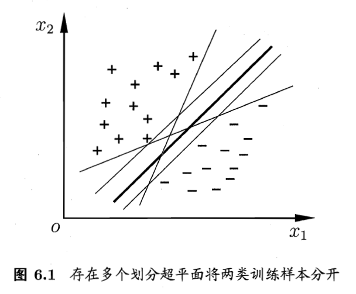
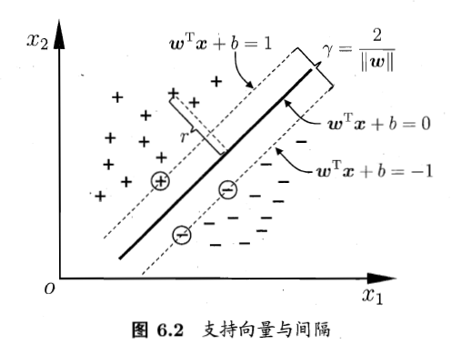
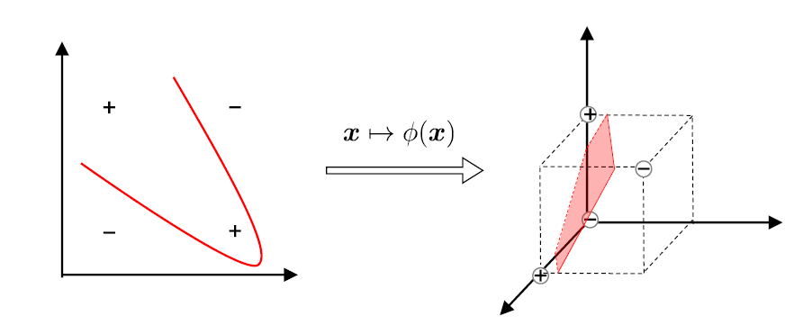
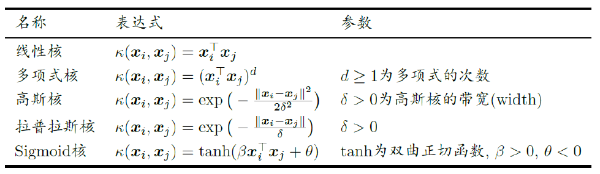

# 支持向量机

<!-----
title: 【Big Data Analysis】支持向量机
url: bd-svm
date: 2020-04-16 18:07:57
tags: 
- Big Data Analysis

categories: 
- Courses

----->

Week 7 of 2020 Spring.

<!--more-->

[[toc]]

## 引子

线性模型：在样本空间中寻找一个超平面, 将不同类别的样本分开.

超平面方程 $\omega^{T} x + b =0$. 我们希望用最中间的一条线(从数学对称性的角度,从鲁棒性的角度, 从泛化能力角度...)

进一步,我们还能找到两条线, $\omega^{T}x+b = 1$ 和 $\omega^{T}x+b = -1$. 因为我们总能维持$\omega, b$尺度不变性. 两个超平面之间的距离$\gamma = \frac{2}{||\omega||}$.

## SVM的基本型

最大间隔: 寻找参数$\omega$和$b$,使得$\gamma$最大.

$$\begin{array}{l}
\max _{\boldsymbol{w}, b} \frac{2}{\|\boldsymbol{w}\|} \\
\text { s.t. } y_{i}\left(\boldsymbol{w}^{\mathrm{T}} \boldsymbol{x}_{i}+b\right) \geqslant 1, \quad i=1,2, \ldots, m
\end{array}$$

从数学上讲, 约束中的1可以调整成任何正数, 因为不影响尺度不变性. 问题等价于

$$\begin{aligned}
\arg \min _{\boldsymbol{w}, b} & \frac{1}{2}\|\boldsymbol{w}\|^{2} \\
\text { s.t. } & y_{i}\left(\boldsymbol{w}^{\top} \boldsymbol{x}_{i}+b\right) \geq 1, i=1,2, \ldots, m
\end{aligned}$$

这里我们没有像之前一样定义损失函数, 因为我们的限制条件已经明确了无错分.

线性规划,二次规划(看图法, 画线/画圆)

## KKT 条件

略

## 解的稀疏性

支持向量机解的稀疏性: 训练完成后, 大部分的训练样本都不需保留, 最终模型仅与支持向量有关.

更多求解上的技巧

## 线性不可分

-Q:若不存在一个能正确划分两类样本的超平面, 怎么办?
-A:将样本从原始空间映射到一个更高维的特征空间, 使得样本在这个特征空间内线性可分.

## 核支持向量机

将样本转化为更高维的特征空间. 2维空间,3个点可分. 3维空间,4个点可分(3个点定义一个平面).

设$x$被映射到了$\phi(x)$, 比如 $(x_1,x_2)\mapsto (x_1,x_2,x_1 x_2)$ 后者维数可能远大于前者. 当然, 实际我们不需要写出显示的转换. 因为在我们的优化问题中:

$$\begin{array}{ll}
\min _{\boldsymbol{w}, b} & \frac{1}{2}\|\boldsymbol{w}\|^{2} \\
\text { s.t. } & y_{i}\left(\boldsymbol{w}^{\top} \phi\left(\boldsymbol{x}_{i}\right)+b\right) \geq 1, i=1,2, \ldots, m
\end{array}$$

$$\begin{array}{l}
\min _{\alpha} \frac{1}{2} \sum_{i=1}^{m} \sum_{j=1}^{m} \alpha_{i} \alpha_{j} y_{i} y_{j} \phi\left(\boldsymbol{x}_{i}\right)^{\top} \phi\left(\boldsymbol{x}_{j}\right)-\sum_{i=1}^{m} \alpha_{i} \\
\text { s.t. } \sum_{i=1}^{m} \alpha_{i} y_{i}=0, \alpha_{i} \geq 0, i=1,2, \ldots, m
\end{array}$$

$$f(\boldsymbol{x})=\boldsymbol{w}^{\top} \phi(\boldsymbol{x})+b=\sum_{i=1}^{m} \alpha_{i} y_{i} \phi\left(\boldsymbol{x}_{i}\right)^{\top} \phi(\boldsymbol{x}) + b$$

核函数只以内积$\phi\left(\boldsymbol{x}_{i}\right)^{\top} \phi\left(\boldsymbol{x}_{j}\right)$的形式出现.

$$f(\boldsymbol{x})=\boldsymbol{w}^{\top} \phi(\boldsymbol{x})+b$$

我们不需要显示地设计核映射, 只需设计一个核函数(核矩阵)$\kappa\left(\boldsymbol{x}_{i}, \boldsymbol{x}_{j}\right)=\phi\left(\boldsymbol{x}_{i}\right)^{\top} \phi\left(\boldsymbol{x}_{j}\right)$

$$\kappa=\left[\begin{array}{ccccc}\kappa\left(x_{1}, x_{1}\right) & \kappa\left(x_{1}, x_{2}\right) & \kappa\left(x_{1}, x_{3}\right) & \cdots & \kappa\left(x_{1}, x_{m}\right) \\ \kappa\left(x_{2}, x_{1}\right) & K\left(x_{2}, x_{2}\right) & K\left(x_{2}, x_{3}\right) & \cdots & K\left(x_{2}, x_{m}\right) \\ K\left(x_{3}, x_{1}\right) & K\left(x_{3}, x_{2}\right) & K\left(x_{3}, x_{3}\right) & \cdots & \kappa\left(x_{3}, x_{m}\right) \\ \vdots & \vdots & \vdots & \ddots & \vdots \\ K\left(x_{m}, x_{1}\right) & K\left(x_{m}, x_{2}\right) & K\left(x_{m}, x_{3}\right) & \cdots & \kappa\left(x_{m}, x_{m}\right)\end{array}\right]$$

解释: $x_1,x_j$的相似度

如果我们要找到映射, 那我们需要找到一个q维($>>m$)函数, 构造出一个$m\times q$的矩阵.

常用核函数:

> 经验: 文本数据使用线性核，情况不明使用高斯核

## 软间隔
-Q:现实中, 很难确定合适的核函数使得训练样本在特征空间中线性可分; 同时一个线性可分的结果也很难断定是否是有过拟合造成的.
-A:引入”软间隔”的概念, 允许支持向量机在一些样本上不满足约束.

### 0-1损失函数

基本想法：最大化间隔的同时, 让不满足约束的样本应尽可能少.
$$\min _{\mathbf{w}, b} \frac{1}{2}\|w\|^{2}+C \sum_{i=1}^{m} l_{0 / 1}\left(y_{i}\left(w \cdot x_{i}+b\right)-1\right)$$

$$l_{0 / 1}=\left\{\begin{array}{ll}
1 & z<0 \\
0 & \text { otherwise }
\end{array}\right.$$

