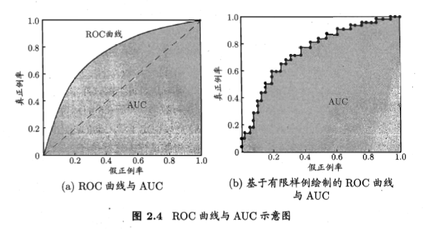

# Chapter 2 Notes

<!-----
title: 【机器学习(西瓜书)】Chapter 2 Notes
url: ml-ch2
date: 2020-03-11 23:40:42
tags: 
- Machine Learning
- Big Data Analysis

categories: 
- Courses

----->

2020 Spring. MS328 Extended Reading. 西瓜书读书笔记, 模型评估与选择 

**KeyWords**: 机器学习, 模型评估与选择

<!--more-->

[toc]

## 经验误差与过拟合

错误率(error rate),精度(accuracy),误差(期望)(error)
- 训练误差(training error)/经验误差(empircial error)
- 泛化误差(generalization error)

学习器学习训练样本
- 过拟合: 只能缓解, 不可避免(PF: 否则我们在多项式时间内找到了NP算法)
- 欠拟合: 如在决策树学习中扩展分支,在神经网络中增加轮数

使用哪一种参数? 使用哪一种模型? 算法? 误差显然不是合适的讨论标准

## 评估方法

使用测试集(testing set)判别, 将测试误差作为泛化误差的近似, 对数据集$D$的处理, 有以下几种常见做法.

### 留出法

直接将$D$划分为两个互斥的集合$S$,$T$.
- 要保持数据分布的一致性, 如分层采样(e.g.正例/反例)
- 单次划分可能不够稳定可靠(顺序差别), 实验中一般若干次随机划分, 取平均值作为评估结果
- $S$与$T$的比例: trade off between评估效果(fidelity)和训练效果, 一般留$1/3~1/4$用于测试

### 交叉验证法

分为$k$个大小相似的互斥子集, 保证分布一致性. "$k$折交叉验证".
同样, 重复多次划分方式. 实际上是$k$次训练/测试

特例: 留一法, 即$k=$数据集的大小. 与期望评估的$D$训练出的模型评估结果相似, 但算量一般难以承受.

### 自助法
减少训练样本规模不同造成的影响(类似留一),且较高效地进行实验估计?
bootstrapping: 以自主采样为基础. 每次随机从$D$中挑选一个样本, 拷贝放入$D'$, 再将改一昂本放回$D$中, 使它还有可能被采到. 重复执行$n$次后, 样本始终不被采到的概率
$$\lim _{m \rightarrow \infty}\left(1-\frac{1}{m}\right)^{m} \mapsto \frac{1}{e} \approx 0.368$$
令$D'$作训练集,$D \backslash  D'$作测试集. 这样的测试结果称为包外估计(out-of-bag estimate)
自助法有利于难以划分的数据集测试,有利于集成学习(从初始数据中产生多个不同的训练集)等方法. 但自助法产生的数据集改变了初始数据集的分布, 引入估计偏差. 因此, 在数据量足够时不常见.

### 调参与最终模型
parameter tuning, 常用的做法是对每个参数选定一个范围和变化步长, 从候选值中选出最佳值.
我们最终提交的模型应该是原数据集训练的模型.
测试集也称验证集, 要与实际使用遇到的数据"测试数据"加以区分.

## 性能度量

选择合适的性能度量.

回归任务中常用的度量是均方误差.
$$E(f ; D)=\frac{1}{m} \sum_{i=1}^{m}\left(f\left(\boldsymbol{x}_{i}\right)-y_{i}\right)^{2}$$
对于数据分布$\mathcal{D}$和概率密度函数$p(\cdot )$
$$E(f ; \mathcal{D})=\int_{\boldsymbol{x} \sim \mathcal{D}}(f(\boldsymbol{x})-y)^{2} p(\boldsymbol{x}) \mathrm{d} \boldsymbol{x}$$

分类任务中, 常有的性能度量如下所示.

### 错误率和精度

错误率
$$E(f ; D)=\frac{1}{m} \sum_{i=1}^{m} \mathbb{I}\left(f\left(\boldsymbol{x}_{i}\right) \neq y_{i}\right)$$
$$E(f ; \mathcal{D})=\int_{x \sim \mathcal{D}} \mathbb{I}(f(\boldsymbol{x}) \neq y) p(\boldsymbol{x}) \mathrm{d} \boldsymbol{x}$$
精度
$$\begin{aligned}
\operatorname{acc}(f ; D) &=\frac{1}{m} \sum_{i=1}^{m} \mathrm{I}\left(f\left(\boldsymbol{x}_{i}\right)=y_{i}\right) \\
&=1-E(f ; D)
\end{aligned}$$
$$\begin{aligned}
\operatorname{acc}(f ; \mathcal{D}) &=\int_{\boldsymbol{x} \sim \mathcal{D}} \mathbb{I}(f(\boldsymbol{x})=y) p(\boldsymbol{x}) \mathrm{d} \boldsymbol{x} \\
&=1-E(f ; \mathcal{D})
\end{aligned}$$

### 查准率/查全率与F1
我们不关心有多少瓜被判错了, 而是关心挑出的西瓜中有多少比例是好瓜,或者有多少好瓜被挑了出来
- True Positive 真正例
- False Positive 假正例
- False Negative 假反例
- True Negative 真返例
查准率(precision)(挑出中多少好瓜):
$$P = \frac{TP}{TP+FP}$$
查全率(recall)(多少好瓜被挑出):
$$R = \frac{TP}{TP+FN}$$

查准率与查全率是一对矛盾的度量. 我们可以根据学习器的预测结果对不同样例, 排在前面的是最可能的样本, 最后的是最不可能为正例的样本. ([也可以用概率度作为阈值进行遍历检验](https://blog.csdn.net/teminusign/article/details/51982877)) 以此顺序把样本作为正例进行预测, 每次可以计算出当前的查全率/查准率.作出如下曲线.

我们可以用P-R图比较两个学习器的性能, 比较合理的判据是曲线下面积的大小, 但由于实际曲线的非单调,不光滑,其很难估算.

考虑平衡点(Break-Event Point, BEP), 它是查准率和查全率相等时的取值.

另一种度量是$F1$度量
$$
F1 = \frac{2\times P \times R}{P+R} = \frac{2\times TP}{\text{样例总数}+TP-TN}
$$

也可以引入一般形式$F_{\beta}$, 是加权调和平均(表达偏好,相比算数平均和几何平均更重视小值)
$$\frac{1}{F_{\beta}}=\frac{1}{1+\beta^{2}} \cdot\left(\frac{1}{P}+\frac{\beta^{2}}{R}\right)$$
$$F_{\beta}=\frac{\left(1+\beta^{2}\right) \times P \times R}{\left(\beta^{2} \times P\right)+R}$$

进一步, 有时我们希望在$n$个二分类矩阵的基础上综合考察全局的查准率和查全率. 一方面, 我们可以先算PR再算平均, 得到宏查准率、宏查全率、宏F1
$$\begin{array}{c}
\operatorname{macro-}P=\frac{1}{n} \sum_{i=1}^{n} P_{i} \\
\operatorname{macro-}R=\frac{1}{n} \sum_{i=1}^{n} R_{i} \\
\operatorname{macro-}F 1=\frac{2 \times \operatorname{macro}-P \times \operatorname{macro-} R}{\operatorname{macro-} P+\operatorname{macro-} R}
\end{array}$$
另一方面, 我们可以再算各项平均再算PR, 得到微查准率、微查全率、微F1
$$\begin{array}{c}
\text { micro- } P=\frac{\overline{T P}}{\overline{T P}+\overline{F P}} \\
\text { micro- } R=\frac{\overline{T P}}{\overline{T P}+\overline{F N}} \\
\text { micro-} F1=\frac{2 \times \text { micro- } P \times \text { micro- } R}{\text { micro- } P+\text { micro- } R}
\end{array}$$

### ROC与AUC

不同任务中, 我们会根据任务需求采用不同的截断点(cut point). (查准率/查全率), 因此我们需要衡量排序本身的质量好坏, 由此衡量分类器泛化性能的好坏.
ROC (Receiver Operating Characteristic), 方法与P-R类似, 不同于纵轴为(FP Rate), 横轴为(TP Rate)

$$
\begin{array}{c}
  TPR = \frac{TP}{TP+FN} \\
  FPR = \frac{FP}{FP+FN} 
\end{array}
$$

绘图方式:
- $(x_1,y_1) = 0$
- 对下一个样例, 若为TP, $(x_{i+1},y_{i+1}) = (x_i,y_i+\frac{1}{m^{+}})$
- 若为FP $(x_{i+1},y_{i+1}) = (x_i+\frac{1}{m^{-}},y_i)$
- 重复第2,3步, 直至$(x_m,y_m) = 1$

可以计算AUC(Area Under ROC Curve)比较两个模型
$$\mathrm{AUC}=\frac{1}{2} \sum_{i=1}^{m-1}\left(x_{i+1}-x_{i}\right) \cdot\left(y_{i}+y_{i+1}\right)$$

