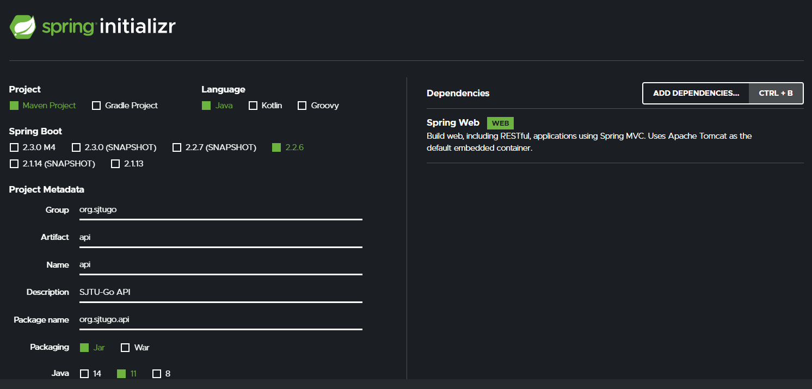
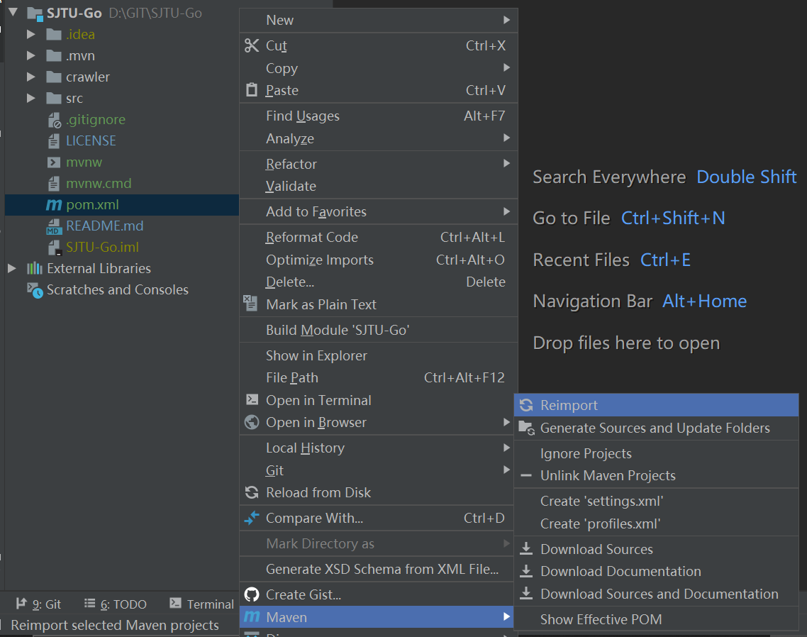

EI333软件工程的大作业定为做一个校园内的共享出行导航系统，经过讨论，决定使用微信小程序作为前端，在阿里云服务器配置Java+SpringBoot提供API接口供前端调用。后端采用MySQL存储数据，通过Python爬虫等各类手段为数据库提供信息。小组6人都有一定的Python编程基础和MySQL使用经验，无Java经验。本文将记录SJTU-Go
项目的初始配置日志。

<!--more-->

[toc]

## 安装Java和IDE

1. 从学校的授权中心可以一键下载安装获得IntelliJ IDEA **Ultimate**版的IDE。
   如果安装不成功也可以直接到IDEA官网手动下载Ultimate的exe安装包，安装后要求输入license账号密码，输入交大邮箱和在JetBrains注册时的密码即可通过认证。
2. 从[AdoptOpenJDK](https://adoptopenjdk.net/?variant=openjdk11&jvmVariant=hotspot)下载Java 11的JDK，采用HotSpot版本。
3. 安装时一路默认，注意添加JAVA到PATH选项的勾选。
4. 打开IDEA后，可能会要求选择SDK版本，记得选择下载安装的正确版本。

## 生成SpringBoot初始配置

SpringBoot是一个基于Java的项目框架，我们可以用SpringBoot Initializer一键生成一套后端项目的配置。我们可以在 https://start.spring.io/ 上按照如下配置生成初始项目。



将下载的zip文件解压到我们小组的Git仓库中。IDEA新建项目也支持SpringBoot的初始配置。这一步已经做好了，配置文件都已存放在目前Git仓库的master分支中。

## 在IDEA中打开项目

`git clone`,或者`git pull`后，用IDEA打开`SJTU-Go`的项目目录。IDEA的界面和PyCharm十分类似，上手不会太困难。



右键左侧的pom.xml文件，按上图所示安装相关依赖。等待依赖包安装完成。连接学校VPN可能速度会得到提升。

## 在IDEA中运行或编译项目

目前在`src/main/java/org.sjtugo.api/`中已经创建了一个`HelloController`类，代码如下。

```java
package org.sjtugo.api;

import org.springframework.web.bind.annotation.GetMapping;
import org.springframework.web.bind.annotation.RestController;

@RestController
public class HelloController {

    @GetMapping("/hello")
    public String hello(){
        return "hello world.";
    }
}
```

要在本地运行这段代码，直接单击右上角的绿色箭头即可。看到下方Console中提示了端口号。在浏览器中访问`localhost:8080/hello`即可看到`hello world`的字样。

如果希望部署到服务器上，右侧Maven标签中，在`LifeCycle`中双击`Package`，IDEA会开始将当前项目打包成一个jar包，存放在target目录下。我们在服务器上的java虚拟机运行该jar包即可实现api的访问。

> 如果在package的过程中，提示connect timeout，可能是因为Maven中心库连接失败，可以尝试挂上学校VPN。