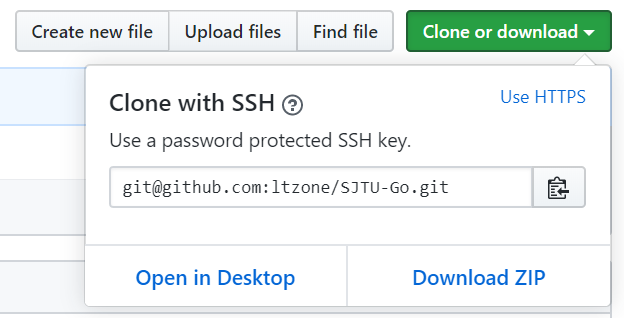
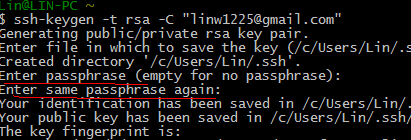
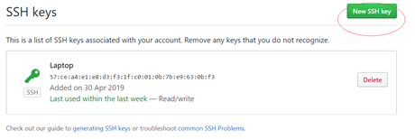
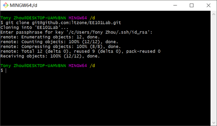
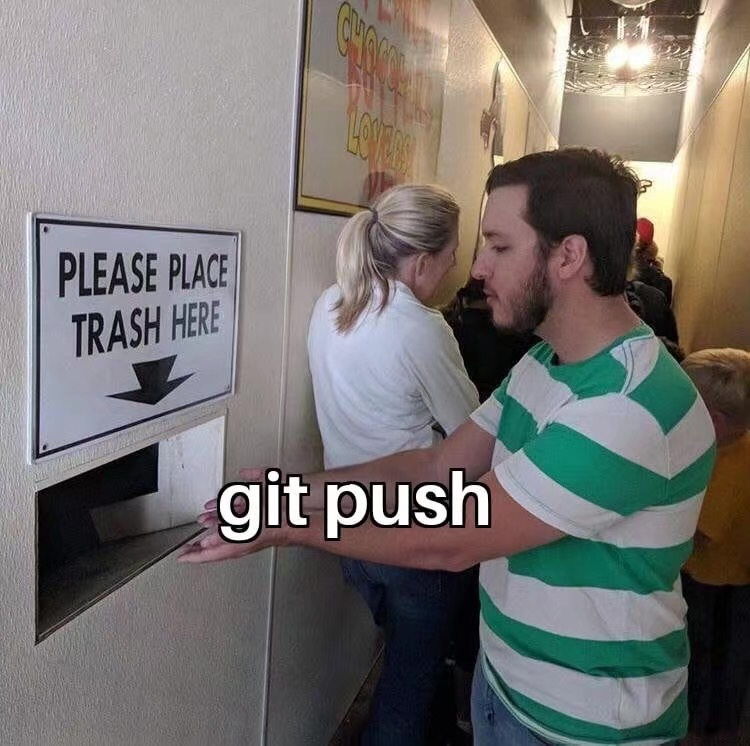

Git是一个分布式版本控制系统, Git可以用于管理代码版本、协同合作。本文介绍如何安装和配置Git，Git的基本操作和利用Github托管和同步代码。


<!--more-->

[toc]

## Terminologies

- **Git**，一个分布式版本控制系统，相当于一个可以管理文件的应用程序，用户通过命令行输入指令的形式使用Git完成版本控制等工作
  - Windows上可以下载[Git for windows](https://gitforwindows.org/) 管理自己在本地的Git文件系统。Git for windows实际上是一个命令行工具，安装完成后在资源管理器目录下右键，选择Git Bash Here，即可在跳出的命令行中输入git指令
  - Linux可以直接在命令行中使用git命令
  - 似乎Windows的Powershell也预装了git，可以尝试在文件资源管理器的地址栏中输入powershell，在PS命令行中输入git命令，看是否能工作
  - Windows上的Linux虚拟机，如CygWin，WSL等，也可以直接使用git
  - 许多代码编辑器（Sublime Text、VS Code）、IDE（如PyCharm）都对Git有支持图形界面的插件，基本原理都是将用户的操作转化成相应的git指令
- **GitHub**，一个在线用于托管git系统的地方，其他托管网站还有GitLab、Bitbucket等
- **版本库/仓库/repository**，可以理解为是包含了所有文件的根目录，这个目录下所有的文件都可以被Git系统管理、追踪
- **工作区/working directory**，在文件资源管理器能够直接看到的目录，用户的一切操作都是作用于工作区中的文件，工作区展现的具体内容可能会因为branch的切换有所不同
- Branch，分支，默认情况下一个Git仓库只有一个master分支。我们可以基于当前分支创建新的分支，管理不同版本的代码。
  - 分支之间可以通过merge操作进行同步、合并
  - 一般情况下，当两个分支之间的变化没有冲突（如修改两个不同的两个文件，或者修改同一文件的不同位置）时，Git可以直接进行合并
  - 当分支之间存在冲突时，git会提示用户冲突位置，需要执行merge的用户手动修改，再进行合并。
- Commit，提交，每一次修改的过程都可以作为一次提交，一次提交会记录你对一个或一堆文件的修改（insert/delete/…）。Commit是git管理版本的基本单位。
- Origin，远程的代称，在本文中指的就是托管在Github上的Git仓库

## 本地创建SSH Key

注册完GitHub后，你可以在GitHub上创建自己的仓库，也可以通过fork别人已有的仓库在自己的账号下创建副本，也可以接受别人的合作请求，成为某一个项目的合作者。

一般Github上的仓库只作查看用，我们对仓库的修改都在本地的Git软件上进行。要将GitHub上的仓库和本地的仓库连接起来，最简单的方式是通过`git clone`的方式，它会将仓库中所有的历史commit、分支及远程仓库的位置信息全部下载到本地，即下即用。


在仓库首页的右上角，我们可以找到当前git仓库的地址，复制地址，在支持git的命令行中输入`git clone https://github.com/ltzone/SJTU-Go.git`即可将当前仓库克隆到本地。



GitHub提供了两种clone到本地的方式，通过右上角的`Use SSH`切换。
- 使用HTTPS clone，可以直接下载仓库，但此后每次push都需要输入你的GitHub密码，比较麻烦。
- 使用SSH clone，本地仓库和GitHub仓库通过一串SSH密钥认证，clone时需要提前配置SSH密钥的密码
- 由于SSH key可以选择不设密码，在常用电脑上推荐使用SSH同步本地和远程仓库。下面介绍使用SSH clone的准备工作。

我们首先在Git中配置好自己的id，输入如下命令，以后这台机器上所有的git仓库都会使用这个账号和邮箱地址。这个config只是一个声明，说明在当前PC上的git环境下这是你的用户名和邮箱，当你以后提交修改的时候作为你的标志。该声明和GitHub实际注册的邮箱无关，但建议最好和自己github上注册的账号对应起来。

```
git config --global user.name "yourusername"
git config --global user.email "youremail@sjtu.edu.cn"
```

下面我们配置SSH地址，官方流程可以查看 https://help.github.com/en/github/authenticating-to-github/connecting-to-github-with-ssh 也可以按照下面的提示操作。

(1)打开命令行查看电脑上是否已经存在SSH密钥：
```
cd ~/.ssh
```

若如上图显示无法找到该文件则要创建新的ssh key;
(2)创建新的ssh key:
```
ssh-keygen -t rsa -C "your_email@youremail.com" 
```



执行这条命令会如上图提示文件保存路径，可以直接按Enter，（注：默认的ssh文件保存地址在C/用户(Users)/你的用户名/.ssh中）
然后提示输入 passphrase（密码），输入两次（可以不输直接两次Enter）（注：在这里的密码是SSH密钥对应的密码，用途是建立你的机器和你的远程github账号的连接，可以不和github本身的密码一致，不输也可以；输入的过程不会明文显示，输完回车即可）

然后会在 .ssh 目录生产两个文件：id_rsa和id_rsa.pub
用记事本打开.ssh目录下的id_rsa.pub文件，复制里面的内容；

（3）复制ssh key到github： 
打开github网站，点击右上角头像图标，进入settings，然后点击左边菜单的 ssh key， 然后右边页面的 add ssh key，将复制的内容粘贴到github的key中，title任填，直接保存即可。



（4）测试 ssh 链接 github：
```
ssh -T git@github.com
```
出现Successfully就OK；


（5） 随后就可以克隆远程仓库，输入下图命令，图中会要求输入密码，这个密码是你在创建SSH密钥过程中在命令行设置的密码，不是github账号的密码。以下是克隆成功后的命令
 


（6）	可以看到根目录下有了一个新的以仓库名为名称的文件夹，里面有仓库的所有信息，本地的仓库也已经和远程仓库（名为origin）连接起来了，配置完成。

（7） cd到仓库根目录下，就可以执行git指令了。


## Git Cheatsheet

### 开始写代码之前
1. `cd` 命令切换到需要的目录。
2. `git status` 查看当前分支状态。
   - `git checkout anotherbranch` 如果当前分支不是你想要的分支，执行该命令可以切换到你需要的分支，此时需要保证working tree clean，即status中没有待提交变更的文件
   - `git checkout -f` status中存在待提交变更的文件，若这些变更是可以丢弃的，你可以选择使用这条命令清空working tree
   - 如果分支状态正常，即位于自己需要的branch中，working tree clean，进行下一步。
3. `git pull origin yourbranchname` 从远程仓库同步你的分支，由于你上一次上传的代码可能会经过他人的修改，在远程产生新的commit。为了避免本地与远程的不一致，在开始本地的工作前将远程仓库自己分支的内容pull一次进行同步，是一个良好的操作习惯。
同步完成后，可以开始代码的编辑。


### 提交本地的代码
完成一定量的代码编辑后，可以把当前进度作为一个commit提交。
1. `git status` 查看当前分支状态，一般存在未跟踪的文件、修改过的文件，这时你修改过的文件都会展示出来。
2. `git add yourfilename` 以相对路径的方式将status中显示的修改文件一一添加
   `git add --a` 如果status中显示的所有的文件都是要被添加的，可以批量添加
3. `git commit -m 'your message'` 添加完成后，将当前添加的所有文件更改记录作为一个commit提交。为方便维护，提交的消息中需要说明当前更改的具体信息，信息中无需记录时间和提交人，git会自动记录。
4. `git push origin yourbranchname` 本地代码执行完commit后，本地的仓库记下了这一次修改，但还要通过push指令远程同步。最后一段填写远程分支名，一般和本地的分支名一样。
一般在自己的分支上，如果确保远程的分支没有被人修改过，我们可以选择不push，仅commit。commit是将修改记录存在本地，一次push可以将多次commit同步到远程。多多commit是好习惯，这样如果写了bug，可以回退到之前的版本。

### 写出bug了，想回退版本
1. `git status` 查看当前分支状态，确保working tree clean
2. `git log` 查看git日志，可以通过vim的方式看到此前这条分支上的提交情况，包括一长串commit号、提交时间、提交注释
3. `git reset xxxxx --hard` 将xxxxx替换成log中你想要回退版本的commit号前若干位，git会回退到该版本
4. 开始写代码，回到正常状态下`add,commit,push`的流程中

### 有些文件不想让git跟踪
我们在自己写代码时有些自己的辅助文件不想被git记录版本，原则上编译生成文件也不应被git跟踪。我们当然可以选择在`add`时不作添加，但这会使我们无法使用add的批量添加功能。git根目录下，有一个.gitignore文件，我们可以在这里强制规定一些文件不被git跟踪。
1. 打开`.gitignore`，用相对路径的方式输入我们希望git忽略的文件名，也可以用正则表达式的方式声明一类文件，如
```
*.exe 忽略仓库中所有编译产生的可执行文件
temp/*.png 忽略temp文件夹下所有的png图片
```
2. 保存，将我们修改的gitignore文件作为一个commit提交
3. 检查`git status`，不需要的文件已经不再被跟踪了
注意, gitignore只作用于自己的分支下未跟踪的文件, 也就是说在修改gitignore之前被跟踪的文件不受影响. 你可以选择使用`git rm filename`删除. 当然, 作为文件, 不同分支之间merge时, gitignore会自动合并.


### 看别人的分支
在保证自己的working tree clean的情况下， 
1. `git checkout otherbranch` 切换到其它分支
2. `git pull origin otherbranch` 同步远程和本地在该分支上的内容。
3. 在保证working tree clean的情况下，`git checkout yourbranchname` 回到自己分支。

### 将别人分支的代码和自己分支的代码同步
有时我们可能需要用到别人分支上写好的代码，但它不存在我们自己分支上。
1. 切换到其它分支，用`git pull origin otherbranch`更新所需分支的最新代码，再回到自己分支。
2. 在自己分支下，确保working tree clean，执行`git merge otherbranch`。
   这句话的意思是把别人的分支和自己的分支同步。这时可能会发生几类情况
   - 成功（fast-forward/recursive) git自动识别了两个分支上代码的不同，同步成功
   - 报CONFLICT，我们需要手动查看报conflict的文件
     - 文件中，存在冲突的地方会用以下形式标出，我们定位用`>>>>`符号标出的片段，手动修改选取需要的代码
     - 此时我们位于git为我们准备的一个虚拟分支上，可以用`git status`查看目前的状态
     - 将我们处理后的冲突文件用`git add`添加，再`git commit -m '...'`，git就完成了冲突的处理工作，回到原本自己的分支上，此时两个分支的代码都同步了
       ```
       some code
       >>>>> head
       conflicting code 1
       ------
       conflicting code 2
       >>>>> otherbranch
       some code
       ```
  - CONFLICT会带来很多麻烦，我们需要尽量通过拆分文件、明确的分工的方式避免多人同时操作一段代码
  - conflict也可能出现在`pull`的过程中，因为`pull`操作的实质是把一个`origin/yourbranchname`的分支和`yourbranchname`的分支进行合并，我们要保持经常`pull`的习惯保持本地和远程代码的同步
3. `git push origin yourbranchname` 将刚刚发生在你的branch上的merge操作与远程仓库同步。
  - 因为`merge`操作是作用于两条分支的，而之前你的`push`操作仅把自己分支的merge记录同步了。作为一个负责任的merger，你还需要切换到被merge的分支，也将它与远程仓库`push`同步。同时告知被merge分支的负责人，让他`git pull`一下他的分支, 同步你的merge操作。

### 创建自己的分支
当我们需要开发新功能时，为了避免多人操作统一分支的情况，建议自己开一个新的分支。或者, 当你自己想在本地写一个小功能，但不想被大家从远程仓库看到的时候，也可以在本地创建自己的小分支，只要不做`push`操作, 远程仓库就不会得知这个branch的存在。
1. `git branch newbranchname` 创建一个新分支
2. `git branch` 查看本地所有分支和当前分支
3. `git branch -d deletebranchname` 删除一个分支
可以使用上面所述的`git checkout`方式切换分支.
在第一次将新分支`push`到远程时，git会有相应提示。


更多的git操作可以查阅
1. https://www.liaoxuefeng.com/wiki/896043488029600
2. https://www.runoob.com/git/git-tutorial.html

> Git的操作是不是很简单，你学会了吗？
> 