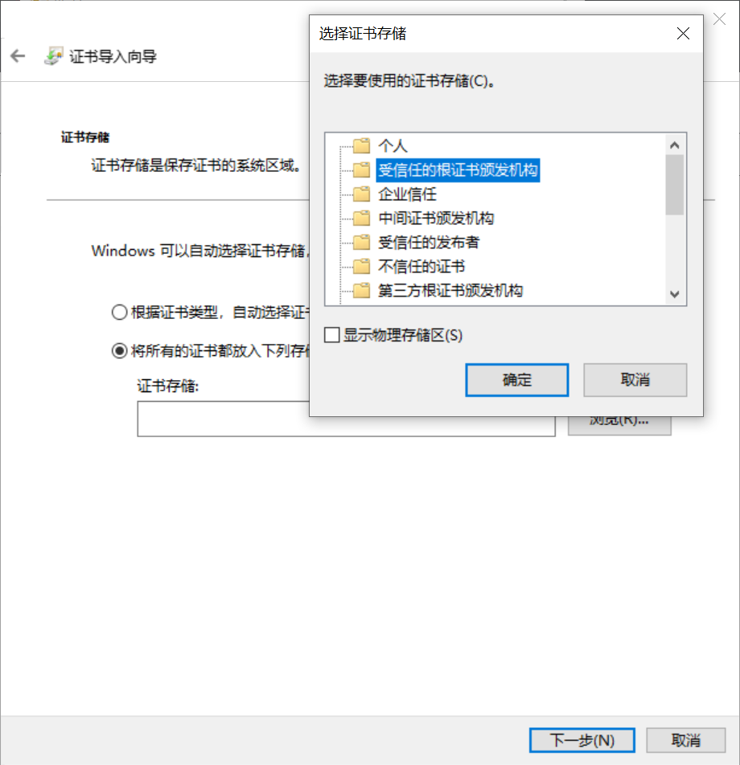
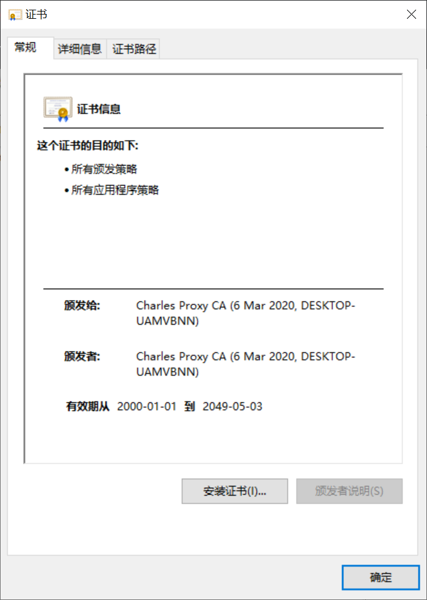
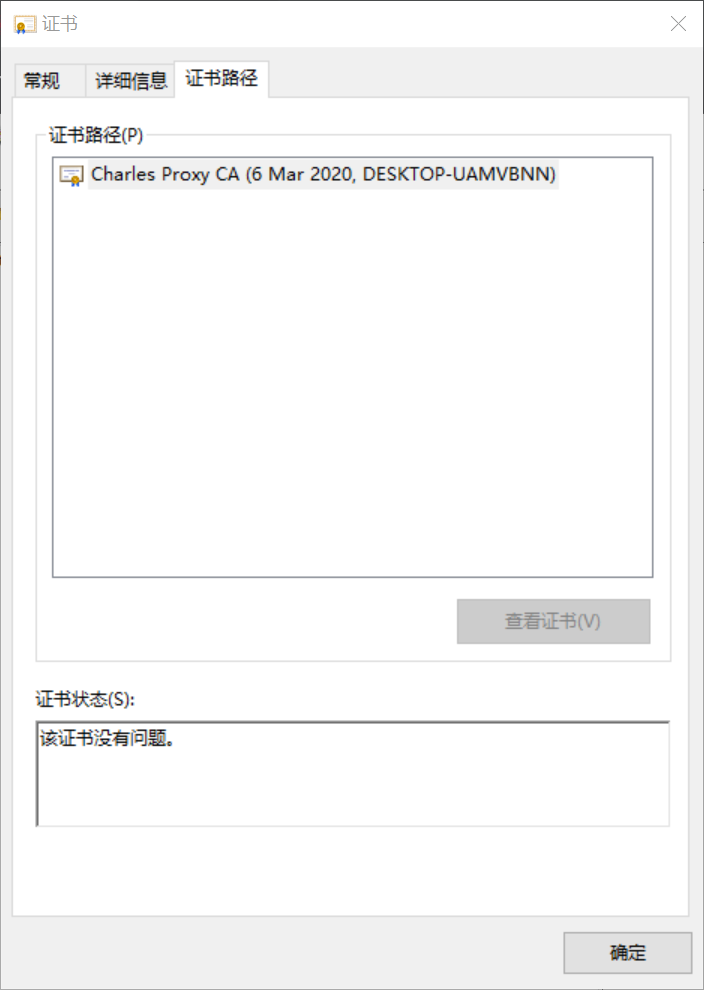
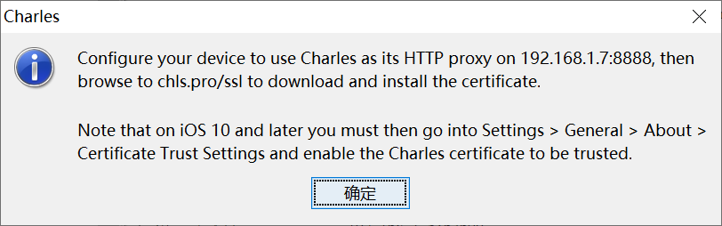
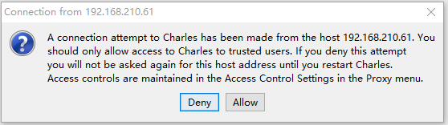
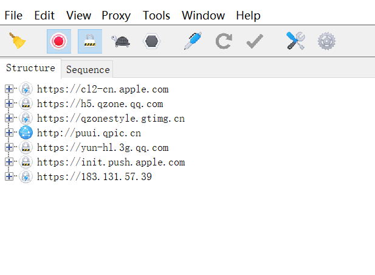
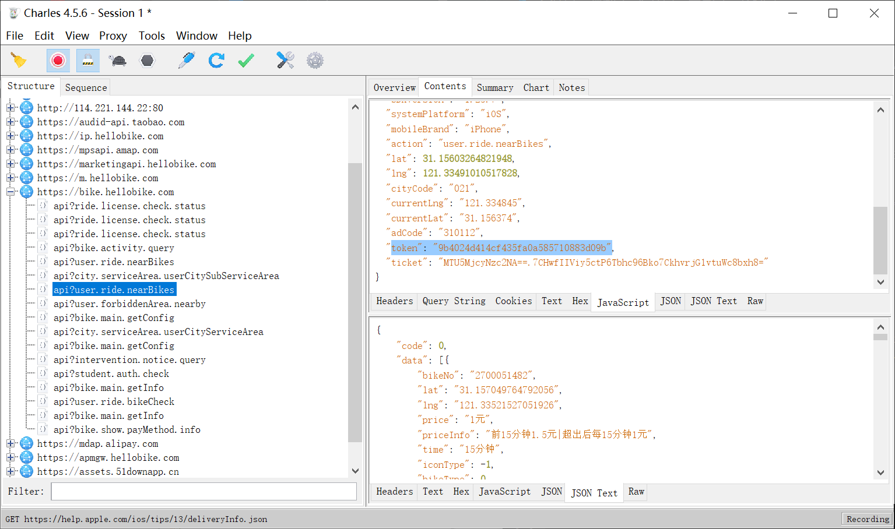

Charles类似手机版的浏览器F12开发者工具, 可以监听手机应用发出的请求, 帮助我们获取手机应用的API. 本文主要介绍Charles的安装、配置和简单使用方法

<!--more-->

[toc]

## 安装和破解Charles

从官网下载[Charles最新发布版](https://www.charlesproxy.com/latest-release/download.do)
我们用到了这里的[破解资源](https://www.zzzmode.com/mytools/charles/)

## 安装证书

Help -> SSL Proxying -> Install Charles Root Certificate, 点击安装证书, 在证书导入向导中选择当前用户

选择受信任的根证书颁发机构存储证书. 下一步, 提示导入成功.

重新进入Help -> SSL Proxying -> Install Charles Root Certificate, 可以看到如下界面

在证书路径中可以看到该证书没有问题的提示

## 移动端安装证书

电脑与手机接入同一WiFi.

Help -> SSL Proxying -> Install Charles Root Certificate on a Mobile Device

可以看到如下提示

在手机连接wifi的界面, 编辑wifi连接详情, 在配置HTTP代理的地方改为手动, 设置成Charles提示的地址和端口, 选择存储.

根据提示在手机上用浏览器访问 chls.pro/ssl 下载安装证书. 安装描述文件.

在手机中安装描述文件, 以iOS为例, 需要在设置->通用->描述文件将Charles Proxy CA确认安装, 再在通用-> 关于本机-> 证书信任设置打开信任开关才可以完成安装.

手机连接后, 可以看到Charles弹窗如下. 表明配置成功

## Charles端配置

此时屏幕左侧应该可以看到来自手机的网络请求状况了, 如果没有请检查手机证书是否安装成功, 具有权限.

但大部分数据都没有处于unknown状态. 我们还需要在Charles中开启ssl代理设置.

在Proxy->SSL Proxying Settings中, 新增"\*:\*"条目, 使Charles通过SSL访问所有地址.

## Charles使用方法

Charles上方的工具栏中, 可以选择清空或停止监听.

以获取哈罗单车API为例, 打开支付宝的哈啰出行小程序, 开始监听. 在手机上刷新地理位置. 即可在左侧地址栏中定位到hellobike相关的请求.

根据字面意思我们可以确定需要的请求地址, 右侧Contents标签中, 上半部分是POST请求发出的内容, 下半部分是POST请求返回的内容. Charles支持以不同格式解析. 我们需要记录本机的token用于爬虫程序.