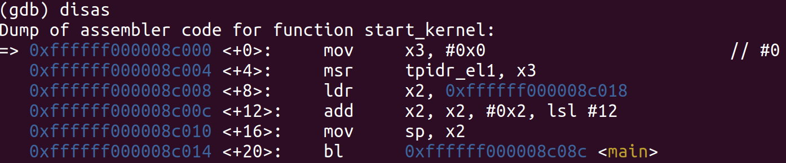
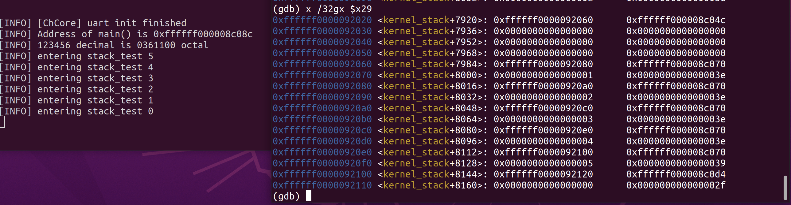
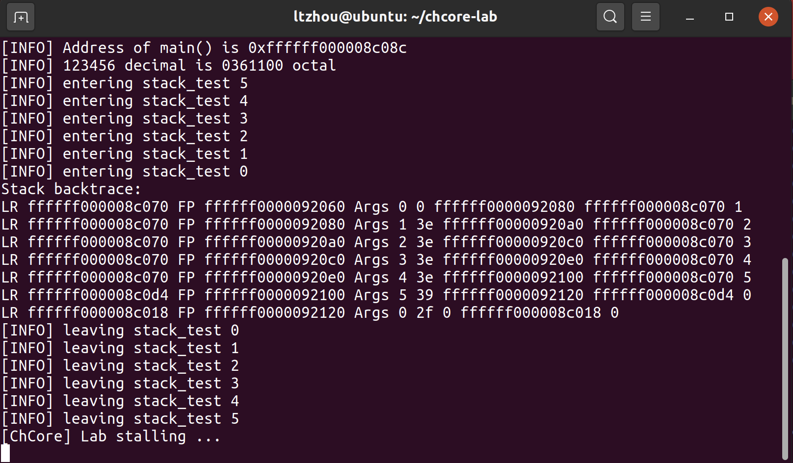
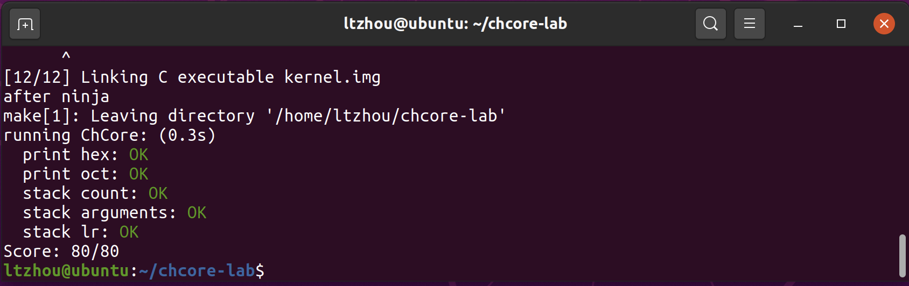

<!-- more -->

## Exercise 1: ARM Instructions

1. Armv8 is the next major architectural update after Armv7. It introduces a 64-bit architecture, but maintains compatibility with existing 32-bit architectures. It uses two execution states: **AArch32** (**A32/T32** Instruction Sets) & **AArch64** (**A64** Instruction sets)
2. `mov dst, src`


## Exercise 2: Bootloader and Entry

- `make gdb`
- `(gdb) where`


## Exercise 3: Entry of kernel

- `(gdb) break main` the main function is defined in `kernel/main.c`
- `(gdb) continue`

For other cores, they will hang themselves up. The instruction is found in `boot/start.S`
```
  /* hang all secondary processors before we intorduce multi-processors */
secondary_hang:
	bl secondary_hang
```

## Exercise 4: LMA & VMA

VMA and LMA are the same in every segment.

## Exercise 5: Kernel Function: printk

Solution: make use of the buffer and let it grow in a backward direction. `s` will be passed to the `prints()` function, indicating the real beginning of the string to be printed.

```C
// kernel/common/printk.c:100:printk_write_num()
//
// store the digitals in the buffer `print_buf`:
// 1. the last postion of this buffer must be '\0'
// 2. the format is only decided by `base` and `letbase` here
int buf_idx = PRINT_BUF_LEN - 1;
print_buf[buf_idx] = '\0';
while (buf_idx >= 0 && u != 0){
    int rem = u % base;
    if (rem < 10){
        print_buf[--buf_idx] = '0' + rem;
    } else {
        print_buf[--buf_idx] = letbase + rem - 10;
    }
    u = u / base;
    width--;
}
s = print_buf + buf_idx;
```

## Exercise 6: Initialize SP and FP

- `$sp,$fp` are initialized at the beginning of function `start_kernel`




## Exercise 7, 8: Stack Structure and Parameter Passing

In a stack frame, from higher address (pointed by current frame pointer `%x29`) to lower address: stored-fp, arguments, return address(LR).



## Exercise 9: Implement stack_backtrace


```C
// In kernel/monitor.c
static inline __attribute__ ((always_inline))
u64 get_mem_val(u64 fp, u64 ofs)
{
	u64 goal;
	__asm __volatile("ldr %[goal], [%[fp], %[ofs]]"
						:[goal]"=r"(goal)               /* output */
						:[fp] "r"(fp), [ofs] "r" (ofs)  /* input */);
	return goal;
}

__attribute__ ((optimize("O1")))
int stack_backtrace()
{
	printk("Stack backtrace:\n");

	u64 cur_fp = read_fp();
	cur_fp = get_mem_val(cur_fp, 0x0);
	u64 lr, arg1, arg2, arg3, arg4, arg5;
	do {
		lr = get_mem_val(cur_fp, 0x8);
		arg1 = get_mem_val(cur_fp, -0x10);
		arg2 = get_mem_val(cur_fp, -0x8);
		arg3 = get_mem_val(cur_fp, 0x0);
		arg4 = get_mem_val(cur_fp, 0x8);
		arg5 = get_mem_val(cur_fp, 0x10);
		printk("LR %llx FP %llx Args %llx %llx %llx %llx %llx\n", lr, cur_fp, arg1, arg2, arg3, arg4, arg5);
		cur_fp = get_mem_val(cur_fp, 0x0);
	} while (cur_fp != 0);

	return 0;
}
```








## 一些感受

1. 实验本身需要写代码实现的地方不多，只有两块，代码的难度也不大。主要的目的是通过对代码进行调试观察现有的ChCore加载流程，熟悉整个框架。所以观察类的Exercise最好不要跳过（当然，回过头做也是可以的）
2. 要有GDB调试的经验（推荐先做CSAPP的BombLab和AttackLab）
3. ARM的指令，看到/用到再查即可。最靠谱的是Lab Handout最后链接里的手册，网上不少博客在讲的时候会把x86指令绕在一起，非常confusing。
4. `stack_backtrace`的实验内容本身描述我觉得有些不太直观，实际上只是要做出一个对现在代码中`stack_test`能正确回溯的可以work的例子就可以了，参考书上的例子实现即可，不需要过于纠结多余的参数。