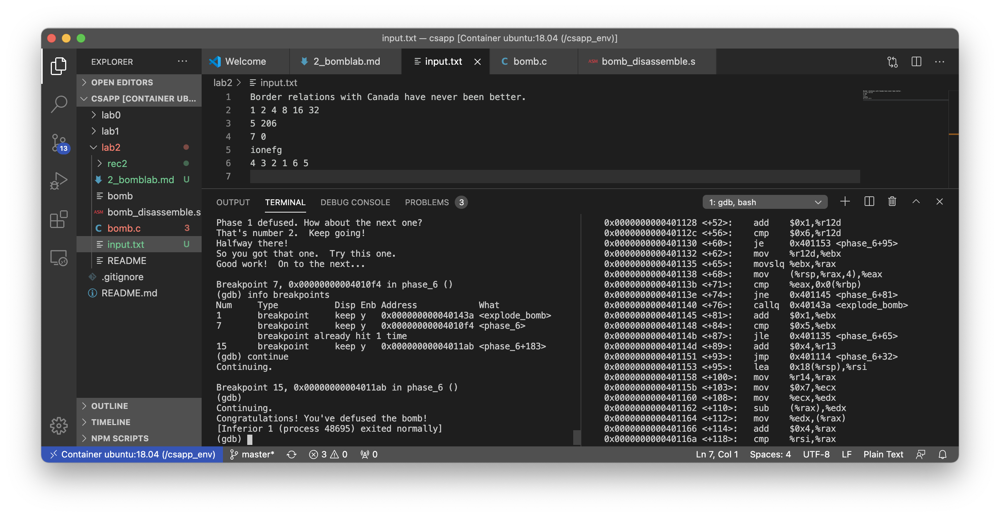

<!-- more -->


## GDB Cheatnotes

- break points
  - `break main` pause before entering main
  - `break 0x00...` break before executing instruction on the address
  - `clear main` removes breakpoint
  - `delete n`, n is the index of the breakpoint
- control excution
  - `run args` start execution
  - `continue` continue untils another breakpoint
  - `nexti` step through a single x86 instr, will display the next instr
- utils
  - `info breakpoints`, `info registers`
  - `disassemble`, show the current assembly, the pointer points to the next instruction to be executed
  - `disassemble main` show the assembly instructions in main
  - `print [type] [var]`, where \[type\] can be `/x`(hex), or `(char*)`(string), and \[var\] can be `0x...`(const) or `$rsi`(register)
  - `x /[format] addr`, show the memory content on the given address. use `/format` to change format, e.g. `/x` for hex, `/d` for integer, `/w` for word, `/c` for char


## Assembly Cheatnotes
- `$rdi`, `$rsi`, `$rdx`, `$rcx` 1~4th argument
- `$rsp`, stack pointer, `(%rsp)` the data in memory of the address `$rsp`
- semantic of `cmp b a; j[op]`: first compare `b` and `a`, jump if `a [op] b` (reverse order)

## Defusing Bombs

### Bomb 1

Make breakpoints at phase_1, `disassemble`:

Dump of assembler code for function phase_1:

```
=> 0x0000000000400ee0 <+0>:     sub    $0x8,%rsp
   0x0000000000400ee4 <+4>:     mov    $0x402400,%esi
   0x0000000000400ee9 <+9>:     callq  0x401338 <strings_not_equal>
   0x0000000000400eee <+14>:    test   %eax,%eax
   0x0000000000400ef0 <+16>:    je     0x400ef7 <phase_1+23>
   0x0000000000400ef2 <+18>:    callq  0x40143a <explode_bomb>
   0x0000000000400ef7 <+23>:    add    $0x8,%rsp
   0x0000000000400efb <+27>:    retq   
```

The key not to explode the bomb is to make the two string equal, so that `$eax` will then be 0, and `je` will be triggered, skipping the bomb.

The first argument in `string_not_equal` is the line we've input, and the second argument seems to be related to address `0x402400` in `$esi`. Through `(gdb) print (char*) 0x402400`, we can find that line.

That's the solution to the first bomb.

### Bomb 2

Dump of assembler code for function phase_2:
```
=> 0x0000000000400efc <+0>:     push   %rbp
   0x0000000000400efd <+1>:     push   %rbx
   0x0000000000400efe <+2>:     sub    $0x28,%rsp
   0x0000000000400f02 <+6>:     mov    %rsp,%rsi
   0x0000000000400f05 <+9>:     callq  0x40145c <read_six_numbers>
   0x0000000000400f0a <+14>:    cmpl   $0x1,(%rsp)
   0x0000000000400f0e <+18>:    je     0x400f30 <phase_2+52>
   ...
```

Phase 2 calls `read_six_numbers` function

```
Dump of assembler code for function read_six_numbers:
   0x000000000040145c <+0>:     sub    $0x18,%rsp
   0x0000000000401460 <+4>:     mov    %rsi,%rdx
   0x0000000000401463 <+7>:     lea    0x4(%rsi),%rcx
   0x0000000000401467 <+11>:    lea    0x14(%rsi),%rax
   0x000000000040146b <+15>:    mov    %rax,0x8(%rsp)
   0x0000000000401470 <+20>:    lea    0x10(%rsi),%rax
   0x0000000000401474 <+24>:    mov    %rax,(%rsp)
   0x0000000000401478 <+28>:    lea    0xc(%rsi),%r9
   0x000000000040147c <+32>:    lea    0x8(%rsi),%r8
   0x0000000000401480 <+36>:    mov    $0x4025c3,%esi
   0x0000000000401485 <+41>:    mov    $0x0,%eax
   0x000000000040148a <+46>:    callq  0x400bf0 <__isoc99_sscanf@plt>
   0x000000000040148f <+51>:    cmp    $0x5,%eax
   0x0000000000401492 <+54>:    jg     0x401499 <read_six_numbers+61>
   0x0000000000401494 <+56>:    callq  0x40143a <explode_bomb>
   0x0000000000401499 <+61>:    add    $0x18,%rsp
=> 0x000000000040149d <+65>:    retq  
```

Note that `read_six_numbers` may also trigger a bomb, and it calls a `sscanf` function. By printing out the formatter string, `print (char*) 0x4025c3`, we can know that the input should be in the format of `%d %d %d %d %d %d`. And inadequate number of args will trigger the bomb.

There goes the rest of the code. The numbers read by `read_six_numbers` are accessed by `phase_2` from the stack frame. So `(%rbx)` will refer to the first number, and `0x4(%rbx)` refers to the second number. The remaining of the codes are actually a loop on the six numbers. 

`<+14>:    cmpl   $0x1,(%rsp)` indicates that the first number should be 1, which can be checked by `(gdb) x /d $rsp`. Then every next number will be the double of the previous number, indicated by `mov    -0x4(%rbx),%eax; add    %eax,%eax; cmp    %eax,(%rbx)`. 


```
   ...
   0x0000000000400f10 <+20>:    callq  0x40143a <explode_bomb>
   0x0000000000400f15 <+25>:    jmp    0x400f30 <phase_2+52>
   0x0000000000400f17 <+27>:    mov    -0x4(%rbx),%eax
   0x0000000000400f1a <+30>:    add    %eax,%eax
   0x0000000000400f1c <+32>:    cmp    %eax,(%rbx)
   0x0000000000400f1e <+34>:    je     0x400f25 <phase_2+41>
   0x0000000000400f20 <+36>:    callq  0x40143a <explode_bomb>
   0x0000000000400f25 <+41>:    add    $0x4,%rbx
   0x0000000000400f29 <+45>:    cmp    %rbp,%rbx
   0x0000000000400f2c <+48>:    jne    0x400f17 <phase_2+27>
   0x0000000000400f2e <+50>:    jmp    0x400f3c <phase_2+64>
   0x0000000000400f30 <+52>:    lea    0x4(%rsp),%rbx
   0x0000000000400f35 <+57>:    lea    0x18(%rsp),%rbp
   0x0000000000400f3a <+62>:    jmp    0x400f17 <phase_2+27>
   0x0000000000400f3c <+64>:    add    $0x28,%rsp
   0x0000000000400f40 <+68>:    pop    %rbx
   0x0000000000400f41 <+69>:    pop    %rbp
   0x0000000000400f42 <+70>:    retq   
End of assembler dump.
```

### Bomb 3

1. As usual, identify the input format from the scanf function `%d $d`.
2. The first integer is in `0x8(%rsp)`, it should be less than 7 according to `<+39>:    cmpl   $0x7,0x8(%rsp)`
3. The remaining of the instructions form a `switch` structure, from `jmpq   *0x402470(,%rax,8)`, we can simply choose an arbitrary branch to pass the test.
4. Here we choose `5`, then we should let the second input integer be equal to `0xce` assigned in the switched instruction `0x400f98 <+85>:    mov    $0xce,%eax`.

```
=> 0x0000000000400f43 <+0>:     sub    $0x18,%rsp
   0x0000000000400f47 <+4>:     lea    0xc(%rsp),%rcx
   0x0000000000400f4c <+9>:     lea    0x8(%rsp),%rdx
   0x0000000000400f51 <+14>:    mov    $0x4025cf,%esi
   0x0000000000400f56 <+19>:    mov    $0x0,%eax
   0x0000000000400f5b <+24>:    callq  0x400bf0 <__isoc99_sscanf@plt>
   0x0000000000400f60 <+29>:    cmp    $0x1,%eax
   0x0000000000400f63 <+32>:    jg     0x400f6a <phase_3+39>
   0x0000000000400f65 <+34>:    callq  0x40143a <explode_bomb>
   0x0000000000400f6a <+39>:    cmpl   $0x7,0x8(%rsp)
   0x0000000000400f6f <+44>:    ja     0x400fad <phase_3+106>
   0x0000000000400f71 <+46>:    mov    0x8(%rsp),%eax
   0x0000000000400f75 <+50>:    jmpq   *0x402470(,%rax,8)
   0x0000000000400f7c <+57>:    mov    $0xcf,%eax
   0x0000000000400f81 <+62>:    jmp    0x400fbe <phase_3+123>
   0x0000000000400f83 <+64>:    mov    $0x2c3,%eax
   0x0000000000400f88 <+69>:    jmp    0x400fbe <phase_3+123>
   0x0000000000400f8a <+71>:    mov    $0x100,%eax
   0x0000000000400f8f <+76>:    jmp    0x400fbe <phase_3+123>
   0x0000000000400f91 <+78>:    mov    $0x185,%eax
   0x0000000000400f96 <+83>:    jmp    0x400fbe <phase_3+123>
   0x0000000000400f98 <+85>:    mov    $0xce,%eax
   0x0000000000400f9d <+90>:    jmp    0x400fbe <phase_3+123>
   0x0000000000400f9f <+92>:    mov    $0x2aa,%eax
   0x0000000000400fa4 <+97>:    jmp    0x400fbe <phase_3+123>
   0x0000000000400fa6 <+99>:    mov    $0x147,%eax
   0x0000000000400fab <+104>:   jmp    0x400fbe <phase_3+123>
   0x0000000000400fad <+106>:   callq  0x40143a <explode_bomb>
   0x0000000000400fb2 <+111>:   mov    $0x0,%eax
   0x0000000000400fb7 <+116>:   jmp    0x400fbe <phase_3+123>
   0x0000000000400fb9 <+118>:   mov    $0x137,%eax
   0x0000000000400fbe <+123>:   cmp    0xc(%rsp),%eax
   0x0000000000400fc2 <+127>:   je     0x400fc9 <phase_3+134>
   0x0000000000400fc4 <+129>:   callq  0x40143a <explode_bomb>
   0x0000000000400fc9 <+134>:   add    $0x18,%rsp
   0x0000000000400fcd <+138>:   retq 
```

### Bomb 4

```
=> 0x000000000040100c <+0>:     sub    $0x18,%rsp
   0x0000000000401010 <+4>:     lea    0xc(%rsp),%rcx
   0x0000000000401015 <+9>:     lea    0x8(%rsp),%rdx
   0x000000000040101a <+14>:    mov    $0x4025cf,%esi
   0x000000000040101f <+19>:    mov    $0x0,%eax
   0x0000000000401024 <+24>:    callq  0x400bf0 <__isoc99_sscanf@plt>
   0x0000000000401029 <+29>:    cmp    $0x2,%eax
   0x000000000040102c <+32>:    jne    0x401035 <phase_4+41>
   0x000000000040102e <+34>:    cmpl   $0xe,0x8(%rsp)
   0x0000000000401033 <+39>:    jbe    0x40103a <phase_4+46>
   0x0000000000401035 <+41>:    callq  0x40143a <explode_bomb>
   0x000000000040103a <+46>:    mov    $0xe,%edx
   0x000000000040103f <+51>:    mov    $0x0,%esi
   0x0000000000401044 <+56>:    mov    0x8(%rsp),%edi
   0x0000000000401048 <+60>:    callq  0x400fce <func4>
   0x000000000040104d <+65>:    test   %eax,%eax
   0x000000000040104f <+67>:    jne    0x401058 <phase_4+76>
   0x0000000000401051 <+69>:    cmpl   $0x0,0xc(%rsp)
   0x0000000000401056 <+74>:    je     0x40105d <phase_4+81>
   0x0000000000401058 <+76>:    callq  0x40143a <explode_bomb>
   0x000000000040105d <+81>:    add    $0x18,%rsp
   0x0000000000401061 <+85>:    retq 
```

1. From `sscanf`, the input format should be `%d %d`
2. To skip the bomb at `0x401035<+41>`, the first argument should be below or equal to `0xe`, according to instruction `0x401029 <+29>`
3. Now we need to study the behavior of `func4`, it can be noted that the argument passed to it is `(input1, 0, 14)`


Note that `func4` will call itself, so it helps if we can translate the assembly to a readable format, in order to better understand the recursion.
```
   0x0000000000400fce <+0>:     sub    $0x8,%rsp
   0x0000000000400fd2 <+4>:     mov    %edx,%eax
   0x0000000000400fd4 <+6>:     sub    %esi,%eax
   0x0000000000400fd6 <+8>:     mov    %eax,%ecx
   0x0000000000400fd8 <+10>:    shr    $0x1f,%ecx
   0x0000000000400fdb <+13>:    add    %ecx,%eax
   0x0000000000400fdd <+15>:    sar    %eax
   0x0000000000400fdf <+17>:    lea    (%rax,%rsi,1),%ecx
   0x0000000000400fe2 <+20>:    cmp    %edi,%ecx
   0x0000000000400fe4 <+22>:    jle    0x400ff2 <func4+36>
   0x0000000000400fe6 <+24>:    lea    -0x1(%rcx),%edx
   0x0000000000400fe9 <+27>:    callq  0x400fce <func4>
   0x0000000000400fee <+32>:    add    %eax,%eax
   0x0000000000400ff0 <+34>:    jmp    0x401007 <func4+57>
   0x0000000000400ff2 <+36>:    mov    $0x0,%eax
   0x0000000000400ff7 <+41>:    cmp    %edi,%ecx
   0x0000000000400ff9 <+43>:    jge    0x401007 <func4+57>
   0x0000000000400ffb <+45>:    lea    0x1(%rcx),%esi
   0x0000000000400ffe <+48>:    callq  0x400fce <func4>
   0x0000000000401003 <+53>:    lea    0x1(%rax,%rax,1),%eax
   0x0000000000401007 <+57>:    add    $0x8,%rsp
   0x000000000040100b <+61>:    retq
```

The instruction of `shr $0x1f,%ecx;add %ecx,%eax; sar  %eax; add %ecx,%eax` may seems confusing, it just let `$ecx` become the half of the `$eax`. The assembly can be translated as follow:

```python
def func4 (a, b, c):
   eax = c - b
   ecx = (b + c) / 2
   if ecx <= a:
      eax = 0
      if ecx >= a:
         return eax
      else:
         return 2 * func4(a, ecx+1, c)
   else:
      return 2 * func4(a, b, ecx-1)
```

The function works like a binary search, its return value will be matched with the second user input. All we need is to find a pair `(a,b)` so that `b` is the return value of `func4(a,0,14)`. To defuse the bomb, we can simply take `(7,0)` as a valid input, it will not cause a recursion.

### Bomb 5

As for the input part, it can be noted that our input should be a 6-letter word.

```
=> 0x0000000000401062 <+0>:     push   %rbx
   0x0000000000401063 <+1>:     sub    $0x20,%rsp
   0x0000000000401067 <+5>:     mov    %rdi,%rbx
   0x000000000040106a <+8>:     mov    %fs:0x28,%rax
   0x0000000000401073 <+17>:    mov    %rax,0x18(%rsp)
   0x0000000000401078 <+22>:    xor    %eax,%eax
   0x000000000040107a <+24>:    callq  0x40131b <string_length>
   0x000000000040107f <+29>:    cmp    $0x6,%eax
   0x0000000000401082 <+32>:    je     0x4010d2 <phase_5+112>
   0x0000000000401084 <+34>:    callq  0x40143a <explode_bomb>
   0x0000000000401089 <+39>:    jmp    0x4010d2 <phase_5+112>
   ...
```

The next phase forms a loop, where `$rax` is the loop counter, it will loop through the 6-letter string. After the loop a new string will be created on `0x10($rsp):0x15($rsp)`. The new string is formed according to the following operation.
- `and    $0xf,%edx` take out the last 4 digit of the input char 
- `movzbl 0x4024b0(%rdx),%edx` looks up another character from an array on address `0x4024b0`, the loop-up index is the 4-digit we have found previously.

```
   ...
   0x000000000040108b <+41>:    movzbl (%rbx,%rax,1),%ecx
   0x000000000040108f <+45>:    mov    %cl,(%rsp)
   0x0000000000401092 <+48>:    mov    (%rsp),%rdx
   0x0000000000401096 <+52>:    and    $0xf,%edx
   0x0000000000401099 <+55>:    movzbl 0x4024b0(%rdx),%edx
   0x00000000004010a0 <+62>:    mov    %dl,0x10(%rsp,%rax,1)
   0x00000000004010a4 <+66>:    add    $0x1,%rax
   0x00000000004010a8 <+70>:    cmp    $0x6,%rax
   0x00000000004010ac <+74>:    jne    0x40108b <phase_5+41>
   0x00000000004010ae <+76>:    movb   $0x0,0x16(%rsp)
   ...
```

From `(gdb) print (char*) 0x4024b0` we can know the look-up table is `maduiersnfotvbyl`.
```
$170 = 0x4024b0 <array> "maduiersnfotvbylSo you think you can stop the bomb with ctrl-c, do you?"
```

In the last phase, we check whether the new array is equal to an array at `$0x40245e`, in my exercise, the desired array is `flyers`.

```
   ...
   0x00000000004010b3 <+81>:    mov    $0x40245e,%esi
   0x00000000004010b8 <+86>:    lea    0x10(%rsp),%rdi
   0x00000000004010bd <+91>:    callq  0x401338 <strings_not_equal>
   0x00000000004010c2 <+96>:    test   %eax,%eax
   0x00000000004010c4 <+98>:    je     0x4010d9 <phase_5+119>
   0x00000000004010c6 <+100>:   callq  0x40143a <explode_bomb>
   0x00000000004010cb <+105>:   nopl   0x0(%rax,%rax,1)
   0x00000000004010d0 <+110>:   jmp    0x4010d9 <phase_5+119>
   0x00000000004010d2 <+112>:   mov    $0x0,%eax
   0x00000000004010d7 <+117>:   jmp    0x40108b <phase_5+41>
   0x00000000004010d9 <+119>:   mov    0x18(%rsp),%rax
   0x00000000004010de <+124>:   xor    %fs:0x28,%rax
   0x00000000004010e7 <+133>:   je     0x4010ee <phase_5+140>
   0x00000000004010e9 <+135>:   callq  0x400b30 <__stack_chk_fail@plt>
   0x00000000004010ee <+140>:   add    $0x20,%rsp
   0x00000000004010f2 <+144>:   pop    %rbx
   0x00000000004010f3 <+145>:   retq  
   ...
```

The characters to find `flyers` can be found from index `9,15,14,5,6,7`, by adding a `0110` prefix, my input string can be decoded as `ionefg`, which defuses the bomb.

### Bomb 6

The assembly of the sixth bomb is quite long. It helps if we can draw a diagram of control flow (by identifying the jump instructions) to know the structure of the program. After some work of analysis, the program can be divied into the following phases.

The program still calls the `read_six_numbers` function as before. It then make a loop to check whether the six numbers are not equal to each other, and fall in the range of 0~6.

This is a nested loop. The outer loop counts `i` from 0 to 5, and the inner group counts `j` from `i` to `5`, if any equal pair is found, the bomb will be exploded
```
   ...
   0x0000000000401128 <+52>:    add    $0x1,%r12d
   0x000000000040112c <+56>:    cmp    $0x6,%r12d
   0x0000000000401130 <+60>:    je     0x401153 <phase_6+95>
   0x0000000000401132 <+62>:    mov    %r12d,%ebx
   0x0000000000401135 <+65>:    movslq %ebx,%rax
   0x0000000000401138 <+68>:    mov    (%rsp,%rax,4),%eax
   0x000000000040113b <+71>:    cmp    %eax,0x0(%rbp)
   0x000000000040113e <+74>:    jne    0x401145 <phase_6+81>
   0x0000000000401140 <+76>:    callq  0x40143a <explode_bomb>
   0x0000000000401145 <+81>:    add    $0x1,%ebx
   0x0000000000401148 <+84>:    cmp    $0x5,%ebx
   0x000000000040114b <+87>:    jle    0x401135 <phase_6+65>
   0x000000000040114d <+89>:    add    $0x4,%r13
   0x0000000000401151 <+93>:    jmp    0x401114 <phase_6+32>
   0x0000000000401153 <+95>:    lea    0x18(%rsp),%rsi
   ...
```

The next phase is a loop which will use 7 to subtract every number in the array. Here `$rsi` is the terminal pointer, `$r14` is the head pointer, `$rax` is the loop counter, `$ecx` is kept to be a constant 7.

```
   0x000000000040115b <+103>:   mov    $0x7,%ecx
   0x0000000000401160 <+108>:   mov    %ecx,%edx
   0x0000000000401162 <+110>:   sub    (%rax),%edx
   0x0000000000401164 <+112>:   mov    %edx,(%rax)
   0x0000000000401166 <+114>:   add    $0x4,%rax
   0x000000000040116a <+118>:   cmp    %rsi,%rax
   0x000000000040116d <+121>:   jne    0x401160 <phase_6+108>
   0x000000000040116f <+123>:   mov    $0x0,%esi
   0x0000000000401174 <+128>:   jmp    0x401197 <phase_6+163>
```
Here comes the most complicated part of this bomb. `$ecx` is the number we load from the storage.


```
   0x0000000000401174 <+128>:   jmp    0x401197 <phase_6+163>
   0x0000000000401176 <+130>:   mov    0x8(%rdx),%rdx
   0x000000000040117a <+134>:   add    $0x1,%eax
   0x000000000040117d <+137>:   cmp    %ecx,%eax
   0x000000000040117f <+139>:   jne    0x401176 <phase_6+130>
   0x0000000000401181 <+141>:   jmp    0x401188 <phase_6+148>
   0x0000000000401183 <+143>:   mov    $0x6032d0,%edx
   0x0000000000401188 <+148>:   mov    %rdx,0x20(%rsp,%rsi,2)
   0x000000000040118d <+153>:   add    $0x4,%rsi
   0x0000000000401191 <+157>:   cmp    $0x18,%rsi
   0x0000000000401195 <+161>:   je     0x4011ab <phase_6+183>
   0x0000000000401197 <+163>:   mov    (%rsp,%rsi,1),%ecx
   0x000000000040119a <+166>:   cmp    $0x1,%ecx
   0x000000000040119d <+169>:   jle    0x401183 <phase_6+143>
   0x000000000040119f <+171>:   mov    $0x1,%eax
   0x00000000004011a4 <+176>:   mov    $0x6032d0,%edx
   0x00000000004011a9 <+181>:   jmp    0x401176 <phase_6+130>
   0x00000000004011ab <+183>:   mov    0x20(%rsp),%rbx
```

It is critically important that we should identify instruction `mov    0x8(%rdx),%rdx` as **accessing the next element of a linked-list**. It reminds us that address `0x6032d0` should be considered as a linked list.

```
(gdb)  x/24w 0x6032d0
0x6032d0 <node1>:       0x0000014c      0x00000001      0x006032e0      0x00000000
0x6032e0 <node2>:       0x000000a8      0x00000002      0x006032f0      0x00000000
0x6032f0 <node3>:       0x0000039c      0x00000003      0x00603300      0x00000000
0x603300 <node4>:       0x000002b3      0x00000004      0x00603310      0x00000000
0x603310 <node5>:       0x000001dd      0x00000005      0x00603320      0x00000000
0x603320 <node6>:       0x000001bb      0x00000006      0x00000000      0x00000000
```

In this phase, the program will access the list according to the number of the current item in the array. Then the content of the linked list node will be copied to `0x20(%rsp,%rsi,2)`.

In the last phase, the program will check whether the contents starting from `0x20($rsp)` is in a decreasing order, so we have to give the correct order as the input of the six numbers.

The contents of the nodes are: `332,168,924,691,477,443`, the access order should be `3,4,5,6,1,2`. Recall the `7-x` operation, the correct input should be `4,3,2,1,6,5`.


## Remark

The last bomb suddenly got defused before I realize. :)




::: tip
Tips:
1. Don't confuse `0x28` with `28`
2. Distinguish between memory pointer and memory contents
3. Control flow diagrams, simulations, and triage makes the defusion work a lot easier.
:::