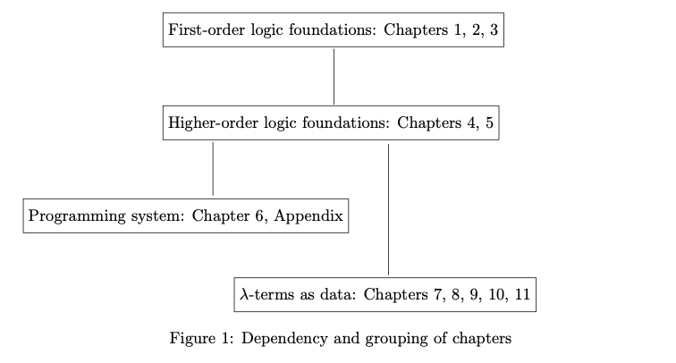

## Preface

- Variable binding is integral to most syntactic expressions
- Though logically well-understood, treatment at a programming level is surprisingly difficult

::: tip
Goal of this book

  **A programming language based on a simply typed version of higher-order logic can provide an elegant approach to performing computations over structures embodying binding.**
:::

- Prerequisite: make sense of a higher-order logic as a programming language
- Classic Logic Programming Models:
  - formulas in clausal form with resolution as the sole inference rule
  - a semantics-based presentation -> minimal (Herbrand) models
  - However, in higher-order settings, substitutions for predicate variables can take formulas in a restricted form into new formulas no longer adhere to this form
- We use **Sequent calculus of Gentzen**
  - allows us to naturally extend Horn clause logic to richer first-order logics that offer support at programming level to scoping mechanisms
  - idea: understanding **proof search** through the perspective of the sequent calculus

::: tip
  **Topics of this Book**
  1. a proof search based view of computation, 
  2. a higher-order logic based approach to programming, 
  3. a particular language that realizes these ideas.
:::

## 1. Connections between logic and computation

> We categorize the different approaches that have been employed in connecting logic with computation and we use this context to explain the particular focus we will adopt. 

### Approaches in connecting logic with computation

- **Computation-as-model** approach
  - computation understood via mathematical notions like nodes, transisitons and states
  - Intensional operators, *e.g. Hoare Logic, dynamic logics*
  - the oldest and most broadly successful interactions between two areas
- **Computation-as-deduction** approach
  - logical expressions such as formulas, terms, types and proofs directly as elements of computation
  1. *Proof-normalization* approach
     - Functional Programming Paradigm
     - views the state of a computation as a proof term
     - views the computation as reducing to the normal form
     - theory basis: at most one normalized value and will always be produced 
  2. *Proof-search* approach
     - Logic Programming Paradigm
     - views the state of a computation as **a sequent**:
       - a formula that is to be proved
       - a collection of assumptions
     - views the computation as the search for a derivation of a sequent

### Computation-aimed Proofs VS. Unrestricted Proofs

- In general reasoning, lemmas are routinely discovered and used
  - In the *sequent calculi*, the *cut rule* provides the mechanism for introducing lemmas in the course of proof search
- Choosing lemmas involves creativity
  - but Gentzen’s famous **cut-elimination theorem** (for classical and intuitionistic logic) says that if a formula can be proved using the cut rule, then it can also be proved without the cut rule.
  - because lemmas can always be in-lined or re-proved each time they are needed
    ::: tip
    in-lining of proofs (via cut-elimination/related operation of $\beta$-reduction) is the process that underlies computation in the functional programming paradigm
    :::

- In logic programming paradigm here,
  - cut rule is **excluded** from execution computation is based on the search for **cut-free** proofs
  - but cut rule can be used to reason about logic programs

## 2 Logical primitives and programming expressivity
> we discuss a notion of expressivity that supports our later claims that some of the logic programming languages that we present are more expressive than others.

### Proof Search Primitives

We shall often idealize the state of the search for a proof by a collection of sequents.

$$
\Sigma ; \mathcal{P} \longrightarrow G
$$
- **a signature** $\Sigma$: a set of typed, non-logical constants
- **a logic program** $\mathcal{P}$
- **a goal** $G$ to be proved from the given logic program

Typical Search Strategy of logic programming:
1. If the goal formula is not an atom (top-level symbol is a logical constant or quantifier)
   - search for a proof is completely committed to dealing with that top-level logical constant
   - search semantics is fixed and independent of $\mathcal{P}$
2. If the goal formula is atomic, $\mathcal{P}$ is consulted to discover how that atom can be proved
   - usually involves *backchaining*: finding in the logic program an implicational formula whose consequent matches the atom and then trying to prove its antecedent

::: tip
Logic programming can be seen abstractly as a logical framework in which a strategy that alternates between _goal-reduction and backchaining_ is *complete*, i.e., is capable of finding a proof whenever one exists.
:::

### Computational Dynamics in Logic Programming

::: warning QUESTION
Assume that during an attempt to prove the sequent $\Sigma ; \mathcal{P} \longrightarrow A,$ the search yields the attempt to prove the sequent $\Sigma^{\prime} ; \mathcal{P}^{\prime} \longrightarrow A^{\prime} .$ What differences can occur when moving from the first to the second sequent?
:::

1. **Horn Clauses**
   
   If $\mathcal{P}$ is a Horn Clause program, then $\Sigma'$ and $\mathcal{P}'$ must be identical to $\Sigma$ and $\mathcal{P}$

   - logic program are global and immutable and have a flat structure during computation
   - The differences between the atoms are, on the other hand, determined by the logic program P and these can be rich enough to capture arbitrary computations
   - however, the dynamics of such computations have a largely *non-logical* character: that is, they are dependent on the meaning associated with predicate symbols through the assumptions in the logic program

2. **Hereditary Harrop formulas**

   both the signature and the program can be larger than original, respectively.

   - it is possible for a program to grow by the addition of clauses that can be only be used in a local proof search attempt
   - it is possible to introduce data constructors that are available only for part of the computation
   - the logical framework is capable of supporting the use of modular programming and data abstraction techniques.

In the following chapters, we will limit out attention to classical and intuitionistic logic as they are applied to Horn clauses and to hereditary Harrop formulas. More general settings of logic (e.g. linear logic) will require another complete proof and discussion.

## 3 The meaning of “higher-order logic”
> The adjective “higher-order” has been applied to logic in the past in a few different ways, one of which might even raise concern about our plan to use such a logic to perform computations. we sort these uses out and make clear the kind of higher-order logic that will interest us in subsequent chapters.

### Views from various fields

- **Philosophers of mathematics**: consider second-order logic as a formal basis for all mathematics, which involves *quantification over the domain of all possible functions.*
  -  Kurt Godel’s first incompleteness theorem: this logic cannot be recursively axiomatized.
  -  a.k.a *standard model of arithmetic*
- **Proof-theoreticians** takes logic as a formal system of enumeration of theoremhood.
  - higher-order logic is understood with the presence of predicate quantification and of comprehension
  - consequence: the simpler induction arguments of cut-elimination that are used for first-order logic do not carry over to the higher-order setting
  - despite that semantical methods may be useful, it must *include non-standard models that use restricted function space* in addition to the standard models used for second-order logic
- **Implementers of deduction** computational logic that employ $\lambda$-terms and _quantification at higher-order types_, although not necessarily at predicate types. 
  - Note: if only quantification at non-predicate function variables, then similar to first-order one because cut-elimination works with little modification
  - Such logic may incorporate a notion of equality based on the rules of $\lambda$-conversion
  - and theorem proving in it must use (some form of) higher-order unification.

### Justification

Our notion is similar to 2 or 3, but not exactly. -- a simplified form of an intuitionistic version of the Simple Theory of Types that was developed by Alonzo Church.

- _leaves out axioms_ concerning extensionality, infinity, and choice which are needed for formalizing mathematics but that do not play a role in and, indeed, interfere with the use of the logic in describing computations.
- extends first-order logic by permitting quantification at all types 
- replaces both first-order terms and first-order formulas by simply typed $\lambda$-terms 
- a notion of equality based on $\beta$- and $\eta$-conversion.
- does _permit predicate quantification_, which makes theorem proving in it particularly challenging
  > During substitution, instantiations can introduce new occurrences of logical connectives and quantifiers in formulas and, as a result, unification is not rich enough to find all substitutions needed for proofs
- We shall, however, _restrict the uses of predicate variables_ in the logic programming languages we consider in such a way that unification becomes sufficient once again for finding all the necessary instantiations.

## 4 Presentation style

This book will
- introduce the programming language $\lambda$Prolog
- present translation from goal directed search for higher-order hereditary Harrop formulas to operational semantics (and implementation of $\lambda$Prolog)
- solve the issue of equations between $\lambda$-terms modulo $\beta-$ and $\eta-$ conversion rules and in the presence of mixed quantifier prefixes

## 5 Organization of the book

The first part introduces a proof-theoretic foundation for logic programming in the setting of first-order logic

- Chapter 1 describes how symbolic objects might be represented using simply typed, first-order terms and manipulated using first-order unification. 
- Chapter 2 presents an abstract framework for logic programming and elaborates this framework using first-order Horn clauses. 
- The resulting language is then extended in Chapter 3 by using a richer class of formulas known as first-order hereditary Harrop formulas.

The second part of this book generalizes the structure of logic programming languages discussed in the first part to the higher-order setting. 
- Chapter 4 introduces simply typed $\lambda$-terms and exposes some of the properties of the reduction computation and the process of solving equations relative to these terms. Formulas are identified as the specific collection of simply typed $\lambda$-terms that have a certain type and Church’s Simple Theory of Types defines a logic over these formulas. 
- Chapter 5 identifies higher-order versions of Horn clauses and hereditary Harrop formulas within this logic. These classes of formulas provide the basis for higher-order logic programming, some characteristics of which we also expose in this chapter.

The third part of this book deals with pragmatic issues related to programming.

The fourth part of this book is devoted to showing the benefits of the ability to compute directly on $\lambda$-terms.