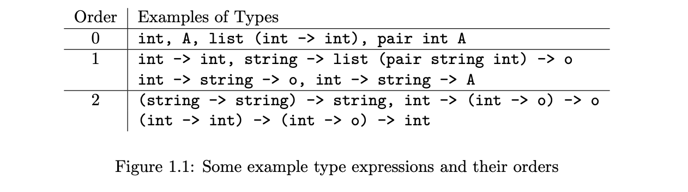

<!-- more -->

## 1 Sorts and type constructors

The starting point for a type system is a set of atomic or unanalyzable types, which we call **sorts**

- `int` - an implementation dependent range of integers,
- `real` - an implementation dependent set of real numbers,
- `string` - sequences of characters,
- `in_stream` - character streams that can be read from,
- `out_stream` - character streams that can be written to,
- `o` - formulas, both program clauses and goals.

$\lambda$Prolog also possesses built-in **type constructors** that are mechanisms for constructing new types from other types. such as `list` for `(list int)`

Sorts and type constructors can themselves be *thought of as typed objects in a language for constructing types*.
- sort `int` can be viewed as an object of the category `type`, with arity 0 (if considered as constructor)
- constructor `list` can be viewed as an object of the category `type -> type`, with arity 1
- constructor `pair` .... `type -> type -> type` with arity 2

We view this language for constructing types as **kinds**, which is given by the following grammar:
$$
\langle \mathrm{kindExp} \rangle ::= \mathtt{type} | \mathtt{type \rightarrow} \langle \mathrm{kindExp} \rangle
$$


  > An interesting possibility is that of giving up on a strict hierarchy between kind, type and term expressions, thus allowing the types of some data to be parameterized by other data. However, we do not explore such a direction in this book.

::: tip
**Kind Declaration in $\lambda$Prolog**

`kind c1, ... , cn <kind exp>.`, where symbols `c1, ... ,cn` are new type constructors that have `<kind exp>` as their kind

e.g. `kind pair type -> type -> type` will have `(pair string int)` as a valid type
:::

## 2 Type Expressions

This polymorphism arises initially from including variables in type expressions, where 
  - $\mathrm{tyc}$ represents a type constructor, we assume it is provided with as many arguments to produce an expression of kind `type`.
  - each (well-formed) type expression to have the kind `type`
  - $\rightarrow$ is the function type constructor (Note, this is different from $\rightarrow$ used in kind notations, and no restriction on nested relations)

$$
\begin{aligned}
\langle \mathrm{typeExp} \rangle ::= \quad & \langle \mathrm{typeVariable} \rangle | \\
& (\langle \mathrm{typeExp} \rangle \rightarrow \langle \mathrm{typeExp} \rangle ) | \\
& (\langle \mathrm{tyc} \rangle \langle \mathrm{typeExp} \rangle \ldots \langle \mathrm{typeExp} \rangle)
\end{aligned}
$$

### Order of types

The right associative reading of the function type constructor can be exploited to depict any type $\tau$ in the form

$$
\tau_1 \rightarrow \ldots \rightarrow \tau_n \rightarrow \tau_0 \quad (n \ge 0)
$$

where $\tau_0$, called **target type** is a type expression that does not have a function type constructor at its top level, and $\tau_1 \rightarrow \ldots \rightarrow \tau_n$ are **argument types** of $\tau$.

- A type expression is a **functional type** if it has structure $\tau \rightarrow \sigma$
- otherwise it is a **non-funcitonal type**
- i.p., a non-functional type that is not a variable is called a **primitive type**

The **order of a type expression** $\tau$ is given as

- $\mathrm{ord}(\tau)=0 \quad$ provided $\tau$ is non-functional 
- $\mathrm{ord}\left(\tau_{1} \rightarrow \tau_{2}\right)=\max \left(\mathrm{ord}\left(\tau_{1}\right)+1, \mathrm{ord}\left(\tau_{2}\right)\right)$



::: tip
the first-order fragment that we are considering currently requires two conditions to be satisfied:
1. the type expressions must be of order at most 1 and
2. the sort o must not be used in them.
:::

## 3 Typed first-order terms

::: tip
**Type Declaration in $\lambda$Prolog**

`type c1, ... , cn <type exp>.`, where symbols `c1, ... ,cn` are constants to have the type `<type exp>` of their type.

e.g. `type pr A -> B -> pair A B` will have `((pr "three") 3)` as a valid term of type `(pair string int)`
:::

::: tip
**Operator Declaration in $\lambda$Prolog**

`<fixity> c1, ... , cn <precedence>.`, where `<fixity>` may be one of the keywords `prefix`, `prefixr`, `postfix`, `postfixl`, `infix`, `infixl`, and `infixr`, and `<precedence>` ranges over positive integers and indicates the precedence level of the defined operator.

e.g. after the declaration `infixl pr 5`, we may write `(3 pr 4 pr "three")` for the term `((pr ((pr 3) 4)) "three")`

Note. the type should match, otherwise compiler will report error/result in ill-formedness of expressions
:::


### Application and Well-formedness

- In the discussions above, we have informally assumed the ability to construct terms using application, i.e. application of `t1` to `t2` is represented by the expression `(t1 t2)`.
- To determine well-formedness where occurrences of constants and variables are permitted: we have **rules for defining typed first-order terms**
  $$
  \Sigma;\Gamma \Vdash_f t:\tau
  $$
  - *signature* $\Sigma$ assigns types (of at most 1 order, not `o`) to constants
  - *context* $\Gamma$ assigns types (of at most 0 order, not `o`)  to variables
  - $\tau \lhd_f \sigma$ holds if two first-order types $\tau$ results from $\sigma$ through the substitution of type expressions of order 0, this relation is reflexivie, transitive and antisymmetric
- t is a typed first-order $\Sigma-term$ if the judgment $\Sigma;\Gamma \Vdash_f t:\tau$ is derivable for some type $\tau$ that is of order 0 and distinct from `o`;


1. $\dfrac{c: \sigma \in\Sigma \quad \tau \lhd_f \sigma}{\Sigma;\Delta \Vdash_f c:\tau}$
2. $\dfrac{x:\tau\in\Sigma}{\Sigma;\Delta \Vdash_f x:\tau}$
3. $\dfrac{\Sigma;\Delta \Vdash_f g:\tau_1 \rightarrow \tau_2 \quad \Sigma;\Delta \Vdash_f t:\tau_1}{\Sigma;\Delta \Vdash_f (g\; t):\tau_2}$

> Subscripts $_f$ is used to denote first-order setting


> Type inferring under the renaming and ordering relation $\lhd_f$ will be discussed in Chapter 2
> 
> e.g. inference for  `(X :: nil) :: nil` with the type `list A`

## 4 Representing Symbolic Objects

### Representing Binary Trees
```
kind  btree   type -> type.

type  empty   btree A.
type  node    A -> btree A -> btree A -> btree A.
```

Such encoding enforces the elements in any given tree are identical in types.

**Practical benefits**: it allows more properties of data to be encoded in their types and to be checked in a compilation phase.

```
kind  btree   type.

type  empty   btree.
type  node    A -> btree -> btree -> btree A.
```

Such encoding allows mixed types.

- Procedural language enforces programmer to explicitly create objects corresponding to tree nodes rather than treating trees as values, and they don't support polymorphism in the controlled way like above
- The difference between our language and functional languages is that the set of constructors of data objects can be extended in $\lambda$Prolog, and type variables apperaing in the argument types of a value constructor are not forced to appear also in the target type.
- Also, terms in a logic programming language can contain variables. This feature allows a term to describe a class of data objects that satisfy certain structural constraints.

::: tip

Polymorphism can be non-parametric in $\lambda$Prolog. 

Terms in a logic programming language can contain variables

:::

### Representing Logical Formulas

There are two categories of expressions that are of interest in such a logic: terms and formulas.

```
kind  term, form    type.
```

Suppose that the logic has the two constant symbols `a` and `b` and a binary function symbol `f`.

```
type  a, b    term.
type  f       term -> term -> term.
type  var     string -> term.
```

To represent formulas, we will first need to encode the vocabulary of predicate symbols of the logic. Assume this vocabulary consists of the unary predicate symbol `q` and the binary predicate symbol `p`

```
type  p   term -> term -> form.
type  q   term -> form.
```

To describe a representation for propositional connectives, we define ...
```
type    ff,                         % encoding the false proposition
        tt   form.                  % encoding the true proposition
type    &&,                         % encoding conjunction
        !!,                         % encoding disjunction
        ==>  form -> form -> form.  % encoding implication
infixl  &&  5.
infixl  !!  4.
infixr  ==> 3.
```

A quantifier-free formula example: we use `(p a b) && (q a) !! (q (f a b)) ==> (p b (f b a))` to encode $((p(a, b) \wedge q(a)) \vee q(f(a, b))) \supset p(b, f(b, a))$

One possible approach to realize quantifiers:
```
type    all   term -> form -> form.
```
So that we can write `(all (var "x") ((p a (var "x")) && (q (var "x")))).` to represent $\forall x(p(a, x) \wedge q(x))$

> However, it does not adequately capture the binding force of the quantifier. This is **a fundamental limitation of first-order approaches** to the treatment of syntax. We will revisit HOAS at Chapter 7.

> To declare value constructors in an incremental fashion, rather than being required to present them all in one datatype declaration as in ML, a modular approach will be discussed in Chapter 6.


### Representing Imp Programs

::: details Discussion: How object language types should be treated.
not a good idea to build these types into the metalanguage encoding
  - i.e. to use terms of different types in $\lambda$Prolog to represent integer and boolean valued program expressions.

though convenient for syntactic processing, but requires representations of identifiers not to be distinguished based on their object language types

the preferred representation for programming language expressions is often type neutral; only when necessary will type distinctions be made explicit
:::

```
kind    stmt, expr    type.
type    id            string -> expr.
type    c             int -> expr.
type    t,f           expr.
type    &&, !!,
        plus, minus,
        mult, <       expr -> expr -> expr.
type    :=            expr -> expr -> stmt.   % for assignment
type    cond          expr -> stmt -> stmt -> stmt.   
                                              % for conditionals
type    while         expr -> stmt -> stmt.   % for while loops
type    seq           stmt -> stmt -> stmt.   % for composition
infixl  &&, mult      5
infixl  !!.
        plus, minus   4.
infix   <             3.
infix   :=            2.
```

> **Remark:** Representations of ‘good’ programs must satisfy syntactic constraints beyond those arising from types in the object language that we discussed earlier. For example, the left-hand side of an assignment in such a representation must be the encoding of a variable. We will see in the next chapter that such properties can be checked through logic programs that compute over first-order term based representations.


## 5 Unification of typed first-order terms

### Problem Definition

**A unification problem** is a finite multiset (set but with duplicates) of equations between first-order terms such that the two terms in each equation are of the same type. Such a multiset asks whether there is a type-preserving substitution of terms for variables that, when applied to the terms in the multiset, would make the two terms in each equation identical.

A substitution that has this characteristic is said to be a **unifier** for the unification problem

> Example
>
> A unifier for the problem `{(X :: L)=(1 :: 2 :: nil)}` is `{<X,1>,<L,2::nil>}.`


::: tip
Unification can be used to decompose data structures
:::

Observing now that variables can occur in terms on either side of an equation

> Example
> 
> `{(X :: L1)=(1 :: nil), L2=(2 :: nil), (X :: L2)=L3}`
> 
> Solving the first two equations produces an 'output' `L3 = X :: L2`

::: tip
Unification can be used to construct new structures

A unification problem can have more than one unifier.
> is it necessary to consider the entire set of unifiers for a given unification problem or can all of these be circumscribed in a finite, possibly unitary, way?
:::

### General Unifiers

We say that one **substitution** **is more general than** than another if the latter is obtained from the former by making further substitutions for variables.

::: tip
An important characteristic of (typed) first-order unification problems is that they have most general unifiers whenever they have unifiers.
:::

> Example
>
> Problem `{(X :: L) = (Y :: Z :: nil)}` has subst `{⟨Y, X⟩, ⟨L, Z :: nil⟩}` or `{⟨X, Y⟩, ⟨L, Z :: nil⟩}` as its most general unifier

### Find the most general unifier

Idea:
1. apply transformations to the equations constituting a unification problem
2. until the collection of unifiers is preserved but the problem itself is successively simplified to a point where it is easy to tell that it does not have a unifier or a most general unifier can be read off immediately from it **i.p. canonical form for first order terms in Section 3**

Define following transformations

1. **Term Reduction** $(f\;t_1\; \ldots \; t_n) = (g\;s_1\; \ldots \; s_m)$, transform to $t_1=s_1,\ldots,t_n=s_m$ if $s = m$ and $f = g$ otherwise replace with $\bot$ ("constant crash")
2. **Reorientation**, for $t = x$, if $x$ is a variable but $t$ is not, replace it by $x = t$
3. **Variable Elimination**, for $x = t$, if $x$ is a variable and occur in $t$, remove if $t = x$ otherwise add $\bot$ ("occurs check"). If $x$ occurs in other equation instead of $t$, replace $x$ by $t$
   > correctness: terms must be of finite size
   > proof: well-formedness rules for finite times

A multiset $\mathcal{E}$ of first-order term equations is in solved form if the left-hand side of each equation in it is a variable and, in addition, a variable occurring on the left of any equation does not occur elsewhere in $\mathcal{E}$.
- read it as a substitution, it is our solution
- it is the most general unifier
- it terminates if we don't use variable elimination on the same equation more than once

### Unification with type variables

the satisfaction of identical types at the beginning is not necessary and of no use.
> Example: `{(c 1 Y) = (c X a)}` where `c` and `a` are declared types `A -> A -> i` and `i`, where `i` is a user-defined sort.
> 
> Identical type at the beginning, but solution is $\bot$
> 
> At dynamic time, if we don't consider type, we will discover `{1 = X, Y = a}` making the unifier ill-typed

Thus, the algorithm that we have just described can be used to match up the types of head symbols encountered in term reduction in a most general way. 

Notice that including such a computation could result in the instantiation of type variables in the course of solving (term) unification problems.

### Remark

1. The observations about types in the first order setting don't affect the shapes of the unifiers that exist if typing constraints are respected. i.e. if "preservation" can be proved, types can safely be eliminated from the unification computation
   > use: term constructors can be defined so that all the type variables in their argument types appear also in their target type.

2. We have imposed no limitations on the appearance of constants in the instantiations for variables in the discussions in this section. We will examine the relationship between finding unifiers for unification problems and proving such formulas in more detail in Section 4 of Chapter 4

3. Finiteness of terms, enforced through the "occurs-check" test, will be important to encoding quantifier dependencies in the representations of logics and to capturing similar properties in many other applications that we will consider for our languages.